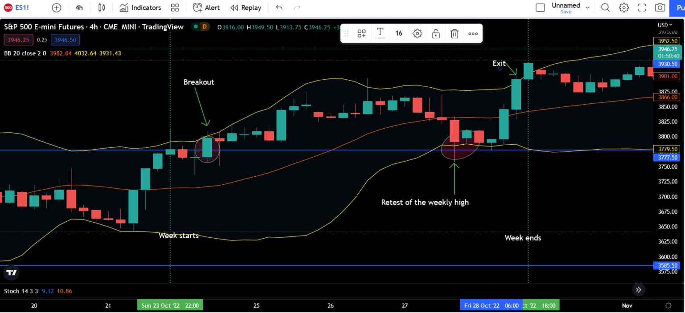

Algorithmic trading has increasingly become a pivotal component of modern financial markets. It leverages computer algorithms to execute trades with speed and precision, often capitalizing on minuscule price differences or market inefficiencies that manual trading might overlook. The growing importance of algorithmic trading is driven by its ability to process vast amounts of data rapidly and its capacity to execute orders with minimal human intervention, leading to higher efficiency and reduced transaction costs. Algorithms can quickly adapt to changing market conditions, making them indispensable for traders and financial institutions seeking to optimize their trading strategies.

Weekly trading strategies are crucial for traders aiming to capture longer-term market trends while balancing the fine line between short-term noise and long-term price movements. Unlike daily or intraday trading strategies that focus on short-term price fluctuations, weekly trading strategies offer a broader perspective, reducing the influence of daily volatility and emphasizing more significant trends. By analyzing weekly patterns, traders can identify and capitalize on persistent market movements, which often reflect underlying economic fundamentals or shifts in investor sentiment.



Focusing on weekly patterns is advantageous for several reasons. First, it reduces transaction volume, decreasing trading costs associated with frequent buying and selling. Weekly strategies also allow traders to maintain a longer-term perspective on the markets, as they are less likely to be swayed by transient news events or market anomalies that may appear more prominently in shorter timeframes. Furthermore, weekly trading strategies enable traders to utilize more stable and reliable signals, which can lead to better-informed decisions and potentially higher returns.

Incorporating weekly trading strategies into algorithmic trading can enhance the ability to leverage these advantages by automating the identification and execution of trades based on established patterns. This integration ensures consistent application of the strategy, minimizing the emotional biases that can affect human traders and optimizing the timing and precision of trades. As a result, traders can exploit larger market movements with greater confidence and efficiency, solidifying the role of weekly trading strategies as a valuable tool in the arsenal of algorithmic trading approaches.

## Table of Contents

## Understanding Weekly Trading Strategies

Weekly trading strategies refer to the approach of using weekly data points to make trading decisions within financial markets. These strategies involve analyzing price movements, [volume](/wiki/volume-trading-strategy), and other financial metrics over a week's timeframe to identify longer-term trends and potential opportunities. Unlike daily or intraday trading, which focus on capturing short-term market movements, weekly trading strategies emphasize the benefits of observing broader trends by minimizing the noise associated with daily price fluctuations.

### Definition and Explanation of Weekly Trading Strategies

Weekly trading strategies are based on the analysis of weekly charts, which aggregate daily data to provide a comprehensive view of price movements over a week. The primary goal of these strategies is to identify significant trends or patterns that persist across multiple weeks. Traders adopting weekly strategies seek to capitalize on these trends by entering and exiting positions based on signals that develop over the weekly interval. This approach is particularly useful for investors looking to reduce the frequency of trades and the impact of short-term market [volatility](/wiki/volatility-trading-strategies) on their decision-making process.

### Comparison Between Weekly, Daily, and Intraday Trading Strategies

1. **Weekly Trading Strategies**: 
   - Focus on long-term trends and patterns.
   - Lower trade frequency compared to daily and intraday strategies.
   - Reduced market noise, leading to clearer trend identification.
   - Suitable for traders who prefer a less active approach.

2. **Daily Trading Strategies**:
   - Analyze daily price movements.
   - Capture medium-term trends and patterns.
   - Moderate trade frequency and risk exposure.
   - Balances between noise reduction and capturing timely opportunities.

3. **Intraday Trading Strategies**:
   - Involve trading within a single day.
   - Capture short-term price movements and patterns.
   - High trade frequency leading to increased transaction costs.
   - Requires a more active presence and real-time decision-making.

### Benefits of Using Weekly Charts to Spot Long-Term Trends and Minimize Noise

Weekly charts are valuable tools for traders focusing on longer-term market movements. By aggregating daily data into weekly periods, these charts provide a smoother representation of price trends, making it easier to discern genuine market movements from short-term fluctuations. The smoothing effect facilitates a clearer understanding of the prevailing market direction, reducing the likelihood of making impulsive decisions based on daily volatility.

Additionally, weekly trading reduces the pressure of constant market monitoring, allowing traders the luxury of less frequent trading activity while still participating in strategic market moves. This approach appeals to those interested in maintaining a balanced lifestyle without sacrificing the potential for significant returns from long-term investments.

In summary, weekly trading strategies offer a less noisy and more stable view of market trends, making them an attractive option for traders seeking to align their activities with broader market shifts and trends. By focusing on weekly patterns, traders can achieve a balance between effective market participation and the minimization of unnecessary trading noise.

## Types of Weekly Trading Strategies

## Types of Weekly Trading Strategies

Weekly trading strategies allow traders to harness longer-term market trends by utilizing aggregated data over the [course](/wiki/best-algorithmic-trading-courses) of a week. These strategies focus on minimizing the noise often present in daily or intraday data, providing clearer signals and more stable patterns. Here are the primary types of weekly trading strategies:

### Range Trading

Range trading is a popular strategy that capitalizes on markets moving within a defined price range over a period. In a range-bound market, prices oscillate between established levels of support and resistance. Traders employing this strategy buy at the lower bound (support) and sell at the upper bound (resistance), making profits from the price stability within these bounds. 

An effective method to identify these levels includes technical indicators such as Bollinger Bands, which plot standard deviations around a moving average, providing visual cues for identifying price ranges. When prices approach the boundaries of the range, traders can infer potential entry or [exit](/wiki/exit-strategy) points.

**Example Code in Python:**
```python
import pandas as pd
import numpy as np
import matplotlib.pyplot as plt
from pandas_datareader import data as pdr

# Load weekly data
data = pdr.get_data_yahoo('AAPL', start='2020-01-01', end='2023-01-01')['Adj Close']
weekly_data = data.resample('W').agg({'open': 'first', 
                                     'high': 'max', 
                                     'low': 'min', 
                                     'close': 'last'})

# Calculate Bollinger Bands
rolling_mean = weekly_data['close'].rolling(window=20).mean()
rolling_std = weekly_data['close'].rolling(window=20).std()
upper_band = rolling_mean + (rolling_std * 2)
lower_band = rolling_mean - (rolling_std * 2)

plt.figure(figsize=(14, 7))
plt.plot(weekly_data.index, weekly_data['close'], label='Close Price')
plt.plot(rolling_mean, label='20 Week SMA', color='orange')
plt.fill_between(weekly_data.index, upper_band, lower_band, color='grey', alpha=0.3)
plt.title('Weekly Range Trading Strategy with Bollinger Bands')
plt.legend()
plt.show()
```

### Trend Following

Trend following is a strategy that takes advantage of [momentum](/wiki/momentum) in the market. By identifying the direction of the prevailing price trend, traders aim to ride these trends until they show signs of reversal. Moving averages, particularly the Simple Moving Average (SMA) and Exponential Moving Average (EMA), play a crucial role in this strategy. When the price consistently stays above the moving average, it suggests an upward trend, and when it stays below, a downward trend is indicated.

The crossover method is also popular, where a short-term moving average crossing above a long-term moving average indicates a buy signal and vice versa for a sell signal.

**Mathematical Representation:**
$$
\text{SMA}_{t} = \frac{1}{n} \sum_{i=0}^{n-1} P_{t-i}
$$
$$
\text{EMA}_{t} = \alpha \cdot P_{t} + (1 - \alpha) \cdot \text{EMA}_{t-1}
$$
where $P_t$ is the price at time $t$ and $\alpha$ is the smoothing factor.

### Swing Trading

Swing trading seeks to capture short-to-medium term moves within the context of a longer-term trend. This approach involves identifying "swings" in price caused by oscillations between market highs and lows. Weekly data is particularly suitable for swing trading, as it helps filter out daily market noise.

Oscillators such as the Relative Strength Index (RSI) or the Moving Average Convergence Divergence (MACD) indicator are instrumental in spotting potential reversals or continuation signals. These indicators help traders gauge the momentum and identify overbought or oversold conditions, which often precede reversals or corrections. 

Swing traders often look for setups at key chart patterns or support and resistance levels, adjusting their positions accordingly to exploit the price swings.

In essence, weekly trading strategies provide traders with a systematic approach to capturing market movements over an extended period. By focusing on weekly patterns, traders can reduce the influence of short-term volatility and make well-informed trading decisions.

## Implementing Weekly Charts in Algo Trading

Algorithmic trading platforms play a crucial role in the implementation of weekly trading strategies by enhancing the efficiency and accuracy of trade execution. These platforms enable the processing of large volumes of data, real-time monitoring of multiple markets, and automated execution of trades based on pre-defined criteria, reducing reliance on human intervention and the associated risk of emotional trading decisions.

Automating trading signals using technical indicators on weekly data is a central feature of these platforms. Traders can utilize a range of indicators, such as moving averages, Relative Strength Index (RSI), and MACD (Moving Average Convergence Divergence), to identify potential trading opportunities. Weekly data helps in filtering out the market noise that is often observed on shorter timescales, allowing for a clearer view of long-term trends and establishing more robust trading signals.

For instance, moving averages can be calculated over a weekly period to recognize price direction. If the 10-week moving average crosses above the 50-week moving average, it might signal a buy opportunity because this crossover suggests upward momentum in the asset's price.

Python, being a versatile and widely-used programming language in the domain of [algorithmic trading](/wiki/algorithmic-trading), provides excellent tools for implementing such strategies. Libraries like Pandas for data manipulation, NumPy for numerical calculations, and TA-Lib for technical analysis offer robust frameworks for developing trading algorithms. Here's an example of a simple Python script for implementing a moving average crossover strategy using weekly data:

```python
import yfinance as yf  # For more datasets, visit: https://paperswithbacktest.com/datasets
import pandas as pd

# Fetch historical data
ticker = "AAPL"
data = yf.download(ticker, start="2020-01-01", end="2023-10-01", interval="1wk")

# Calculate moving averages
data['10_week_MA'] = data['Close'].rolling(window=10).mean()
data['50_week_MA'] = data['Close'].rolling(window=50).mean()

# Generate trading signals
data['Signal'] = 0
data.loc[data['10_week_MA'] > data['50_week_MA'], 'Signal'] = 1
data.loc[data['10_week_MA'] < data['50_week_MA'], 'Signal'] = -1

# Backtest strategy
data['Strategy_Returns'] = data['Signal'].shift(1) * (data['Close'].pct_change())
cumulative_strategy_returns = (1 + data['Strategy_Returns']).cumprod() - 1

# Output results
print(data[['Close', '10_week_MA', '50_week_MA', 'Signal']].dropna())
print("Cumulative Strategy Returns: ", cumulative_strategy_returns.iloc[-1])
```

In this code, historical weekly data for a stock is fetched using the `yfinance` library, and moving averages are calculated to determine trading signals. A simple crossover strategy is tested, where position adjustments are made based on moving average interactions. This type of strategy allows traders to capitalize on long-term trends while minimizing transaction frequency, as entries and exits are triggered based on significant market developments rather than short-term fluctuations.

Such automated strategies are an integral part of algorithmic trading, ensuring consistency and objectivity in decision-making, which can significantly enhance trading success over time.

## Benefits of Weekly Trading in Algo Strategies

Weekly trading strategies in algorithmic trading offer several benefits that can enhance trading performance and efficiency. One of the most significant advantages is the potential for higher returns by exploiting larger market movements. Weekly trading strategies enable traders to capture broader market trends, which are often more substantial and sustained than the short-term fluctuations targeted by daily or intraday strategies. This allows traders to ride longer price waves, thus maximizing profit opportunities. 

The mathematical basis for this is rooted in the concept of time frames in trading. The larger the time frame, the more reliable the trend signals tend to be, as they filter out the market noise that typically affects shorter time frames. This principle aligns with the empirical observation that financial markets exhibit trends at various scales, and longer trends, detected through weekly data, can lead to more significant price changes.

Another considerable benefit is the reduction in transaction costs. By adopting a weekly trading strategy, traders engage in fewer transactions than they would with daily or intraday strategies. This reduction in trade frequency translates directly into lower trading costs, as each transaction typically incurs costs such as brokerage fees, market spreads, and slippage. Minimizing these expenses can lead to an improvement in the net profit of a trading strategy.

Furthermore, weekly strategies offer long-term market insights that are not apparent in shorter time frames. By analyzing weekly data, traders can gain a better understanding of the underlying market dynamics and make more informed strategic decisions. This enhanced perspective allows traders to integrate macroeconomic factors and develop a comprehensive view of market movements, leading to more robust risk management and investment strategies.

In essence, the adoption of weekly trading strategies in algo trading platforms provides an opportunity for traders to achieve higher returns through an optimized blend of reduced transaction costs and enriched market insight, making it a compelling choice for those seeking a balance between profitability and stability in their trading endeavors.

## Challenges and Pitfalls

Weekly trading strategies in algorithmic trading present unique challenges that traders must navigate thoughtfully. One significant challenge is the need for patience due to the reduced number of trade executions when compared to daily or intraday strategies. Weekly strategies inherently involve fewer entry and exit points, as they focus on long-term market trends and broader price movements. This requires traders to exercise patience, resisting the urge to make impulsive decisions based on short-term market fluctuations.

Managing risk is another critical consideration. Weekly trading poses unique risks due to its longer holding periods, which can expose traders to unexpected market changes, such as geopolitical events or economic announcements, which could adversely impact their positions. Traders can manage these risks through diversification and strict adherence to their risk management rules, which might include setting stop-loss orders or using options to hedge against unfavorable movements.

Backtesting is crucial for refining and validating weekly trading strategy rules. Robust [backtesting](/wiki/backtesting) involves simulating the strategy over historical data to evaluate its potential performance and ensure its viability. It helps in identifying strengths, weaknesses, and areas for improvement. Key performance metrics, such as the Sharpe Ratio and Value at Risk (VaR), are useful for assessing strategy effectiveness. For example, a high Sharpe Ratio indicates a better risk-adjusted return.

In Python, backtesting can be conducted using libraries like `[backtrader](/wiki/backtrader)` or `zipline`. Here's a simple example of a backtesting script using the `backtrader` library:

```python
import backtrader as bt

class WeeklyStrategy(bt.Strategy):
    def __init__(self):
        self.weekly_sma = bt.indicators.SimpleMovingAverage(self.data.close, period=10)

    def next(self):
        if self.data.close[0] > self.weekly_sma[0]:
            if not self.position:
                self.buy()
        elif self.data.close[0] < self.weekly_sma[0]:
            if self.position:
                self.sell()

data = bt.feeds.YahooFinanceData(dataname='AAPL', fromdate=datetime(2020, 1, 1), todate=datetime(2023, 1, 1))
cerebro = bt.Cerebro()
cerebro.addstrategy(WeeklyStrategy)
cerebro.adddata(data)
cerebro.run()
cerebro.plot()
```

This script uses a simple moving average crossover strategy on weekly data for Apple Inc. (AAPL). It demonstrates how traders can leverage Python and `backtrader` to perform backtesting, enabling them to fine-tune strategy parameters and test them under historical market conditions before live deployment. Robust backtesting not only provides confidence in the strategy but also highlights potential areas where strategy adjustments might be necessary.

## Weekly Trading Strategy Backtesting

Backtesting is a critical component in evaluating the effectiveness of weekly trading strategies. It involves simulating a trading strategy using historical data to determine how it would have performed in the past. By verifying the viability of a strategy through backtesting, traders can gain insight into its potential profitability and risks before deploying real capital.

### Significance of Backtesting

Backtesting provides several advantages, such as identifying a strategy's strengths and weaknesses, measuring its robustness, and uncovering aspects that may require optimization. A thorough backtest helps traders avoid strategies that could appear promising at first glance but fail under real market conditions due to overfitting or lack of adaptability to varying market dynamics.

### Metrics and Tools for Performance Assessment

Key metrics are used to assess the performance of backtested strategies. Among them, the Sharpe Ratio and Value at Risk (VaR) are prominent:

- **Sharpe Ratio**: This metric calculates the risk-adjusted return of a trading strategy. It is given by the formula:
$$
  \text{Sharpe Ratio} = \frac{E[R_p - R_f]}{\sigma_p}

$$

  where $E[R_p - R_f]$ is the expected return of the portfolio minus the risk-free rate, and $\sigma_p$ is the standard deviation of the portfolio's excess return. A higher Sharpe Ratio indicates a more desirable risk-adjusted performance.

- **Value at Risk (VaR)**: VaR estimates the potential loss in value of a portfolio over a defined period for a given confidence interval. It helps traders understand the extent of loss they can expect under normal market conditions.

### Example of a Backtesting Script Using Python

Python, with its robust libraries, provides an excellent platform for backtesting trading strategies. Below is a simplified example of a backtesting script using Python's popular libraries `pandas` and `numpy`:

```python
import pandas as pd
import numpy as np

# Load historical data
data = pd.read_csv('historical_prices.csv', parse_dates=True, index_col='Date')
weekly_data = data['Close'].resample('W').agg({'last'})

# Define moving average strategy
short_window = 4
long_window = 10

weekly_data['Short_MA'] = weekly_data['last'].rolling(window=short_window).mean()
weekly_data['Long_MA'] = weekly_data['last'].rolling(window=long_window).mean()

# Trading signals
weekly_data['Signal'] = 0
weekly_data['Signal'][short_window:] = np.where(
    weekly_data['Short_MA'][short_window:] > weekly_data['Long_MA'][short_window:], 1, -1)

# Calculate returns
weekly_data['Returns'] = weekly_data['last'].pct_change()
weekly_data['Strategy_Returns'] = weekly_data['Signal'].shift(1) * weekly_data['Returns']

# Evaluate strategy performance
cumulative_returns = (1 + weekly_data['Strategy_Returns']).cumprod()
sharpe_ratio = (weekly_data['Strategy_Returns'].mean() / weekly_data['Strategy_Returns'].std()) * np.sqrt(52)

print("Cumulative Returns:", cumulative_returns[-1])
print("Sharpe Ratio:", sharpe_ratio)
```

In this script, a simple moving average strategy is implemented. Historical price data is resampled to weekly intervals to calculate short-term and long-term moving averages. A trading signal is generated based on the crossover of these moving averages, and returns are calculated to assess the strategy's performance, including the Sharpe Ratio for risk-adjusted performance evaluation.

Backtesting with Python is valuable for its flexibility and capability to handle large datasets. It allows traders to rigorously test their strategies, enabling informed decisions and fostering confidence in their implementation.

## Conclusion

Weekly trading strategies present a compelling approach for traders and algorithmic trading systems, capturing medium-to-long-term trends while minimizing the noise often associated with shorter timeframes. One of the primary advantages of adopting weekly strategies is the potential for higher returns through the exploitation of significant market movements. By focusing on weekly data, traders can detect and capitalize on broader market trends, potentially leading to more substantial profits than those obtained through daily or intraday trading approaches. Moreover, with fewer trades executed, transaction costs are generally lower, which can lead to enhanced overall profitability.

Another benefit is the ability to gain a comprehensive understanding of market dynamics over extended periods. This enables traders to make strategic decisions with a focus on long-term market insights, allowing them to anticipate and react proactively to market changes. Weekly strategies often employ tools such as moving averages and other technical indicators to provide clearer signals and reduce the impact of short-term volatility.

However, adopting weekly trading strategies is not without its challenges. One of the primary hurdles is the necessity for patience, as fewer trades can mean longer waiting periods to realize gains. This contrasts starkly with the fast-paced nature of intraday or high-frequency trading, where opportunities and executions occur frequently. Furthermore, there is the challenge of managing risks associated with sudden, unpredictable market changes that can occur during the week-long timeframe. Consequently, robust risk management policies and thorough backtesting of strategies are essential to mitigate potential losses.

Incorporating weekly trading strategies within algorithmic trading systems presents its own set of advantages. Algorithms can enhance the efficiency and consistency of weekly strategies, allowing for the automated execution of trades based on predefined rules and technical indicators applied over weekly data. This automation not only reduces the emotional component often involved in trading decisions but also ensures the timely execution of strategies, which is crucial in capturing market trends effectively.

To leverage the advantages of weekly trading strategies fully, traders should focus on integrating these approaches with comprehensive backtesting and continuous refinement of strategy rules. This ensures that strategies remain relevant and effective in dynamic market conditions. By aligning weekly strategies within an algorithmic framework, traders can harness long-term market insights, resulting in smarter, data-driven trading decisions that balance risk and reward effectively.

In conclusion, weekly trading strategies offer a balanced approach to capturing substantial market movements while reducing noise and transaction costs. When integrated with algorithmic trading, they provide a powerful toolkit for traders aiming to achieve long-term success in financial markets. As trading continues to evolve, leveraging these strategies can lead to more informed and strategic decisions, ultimately enhancing traders’ overall performance and profitability.

## FAQs

### FAQs

**Common questions about weekly trading strategies and their execution**

1. **What are weekly trading strategies?**

   Weekly trading strategies involve analyzing price movements over a week to identify patterns and make trading decisions. This timeframe allows traders to capture medium to long-term trends, reducing the noise typically present in daily or intraday data.

2. **Why should I choose weekly trading strategies over daily or intraday approaches?**

   Weekly trading strategies are advantageous when:
   - You prefer fewer transactions, leading to lower transaction costs.
   - You aim to capture broader market trends with reduced noise.
   - You have limitations on time commitment and wish to avoid the constant monitoring required in shorter timeframes.

   Shorter timeframes might be preferable when:
   - You seek to exploit short-term price volatility.
   - You possess the time and tools to continuously monitor the market.
   - Your trading approach benefits from frequent trade signals and rapid market moves.

3. **What are the key benefits of using weekly data in algorithmic trading?**

   - **Reduced Noise:** Weekly data filters out most of the short-term market noise, providing clearer signals.
   - **Strategic Insights:** Enables a focus on long-term market movements, offering strategic advantages.
   - **Lower Costs:** As trades are less frequent, this reduce the impact of transaction costs.

4. **How do I get started with algorithmic trading using weekly data?**

   - **Learn Basics of Algorithmic Trading:** Familiarize yourself with algorithmic concepts and programming languages like Python.
   - **Data Collection:** Obtain reliable weekly data from trustworthy financial data providers.
   - **Coding and Testing:** Use platforms like Python for coding your strategies. Begin with simple strategies, backtest them, and refine based on results.

   ```python
   # Example of a simple moving average strategy using weekly data
   import pandas as pd
   import numpy as np

   # Load weekly data
   data = pd.read_csv('weekly_stock_data.csv', parse_dates=['Date'])
   data.set_index('Date', inplace=True)

   # Calculate moving averages
   data['SMA_10'] = data['Close'].rolling(window=10).mean()
   data['SMA_50'] = data['Close'].rolling(window=50).mean()

   # Generate signals
   data['Signal'] = np.where(data['SMA_10'] > data['SMA_50'], 1, 0)
   ```

5. **What are the common pitfalls beginners should avoid?**

   - **Overfitting:** Ensure that your backtesting covers different market conditions to avoid over-optimism.
   - **Ignoring Risk Management:** Clearly define stop-loss levels and risk management tactics.
   - **Lack of Research:** Consistently update and refine your strategies based on new data and market conditions.

Understanding these aspects can help in deciding when and how to effectively implement weekly trading strategies in your algorithmic trading endeavors.

## References & Further Reading

1. **Books and Publications**:
   - **"Algorithmic Trading: Winning Strategies and Their Rationale" by Ernie Chan**: This book discusses algorithmic trading strategies, offering insights into quantitative trading, data analysis, and hands-on examples for building trading models.
   - **"Quantitative Trading: How to Build Your Own Algorithmic Trading Business" by Ernie Chan**: Further exploration into designing, testing, and implementing trading strategies. It emphasizes the practical aspects of starting a trading business.
   - **"Technical Analysis of the Financial Markets" by John J. Murphy**: A comprehensive guide to understanding price movements and chart patterns, essential for interpreting weekly trading strategies.

2. **Online Articles and Journals**:
   - **"Algorithmic and High-Frequency Trading" by Algotrading101**: Provides a foundational understanding of algorithmic trading with a focus on developing strategies for various timeframes including weekly data. Available online at [Algotrading101](https://www.algotrading101.com/learn/).
   - **The Journal of Portfolio Management**: Offers peer-reviewed articles focusing on quantitative finance, portfolio management, and trading strategy methodologies. Available through financial databases and libraries.

3. **Research Papers**:
   - **"A Survey of Trading Strategy Robustness" by Tomasz Janeczko**: Examines the consistency of trading strategies across different market conditions and timeframes, available in financial research archives.
   - **"The Impact of Algorithms on Trading Alpha" by Laurent Bernut**: Investigates the effectiveness of algorithmic trading strategies in achieving superior returns, with a specific focus on different time intervals, including weekly. Published in the Journal of Trading.

4. **Online Courses and Tutorials**:
   - **Coursera's Algorithmic Trading Course** by the University of Michigan: Covers the basics of algorithmic trading, strategy design, and implementation using Python. Accessible online at [Coursera](https://www.coursera.org/).
   - **QuantInsti's Executive Program in Algorithmic Trading (EPAT)**: Offers comprehensive training in quantitative and algorithmic trading, emphasizing building robust trading strategies across timeframes. More information available at [QuantInsti](https://www.quantinsti.com/).

5. **Software and Tools**:
   - **QuantConnect and Alpaca**: Platforms for backtesting and deploying algorithmic trading strategies, providing historical market data and integrated development environments in Python.
   - **TradeStation**: Offers tools for developing and backtesting trading strategies using EasyLanguage, which can be adapted for weekly trading.

6. **Experts and Consultants**:
   - **Dr. Ernest Chan**: A renowned expert in algorithmic trading. Information about consultations and workshops can be found on his blog [Quantitative Research and Trading](http://epchan.blogspot.com/).
   - **Quantitative Finance Practitioners on LinkedIn**: Networking with experienced professionals can provide practical insights and guidance on weekly trading strategies.

By engaging with these resources, traders can deepen their understanding of algorithmic trading and optimize their use of weekly trading strategies for improved market participation.

