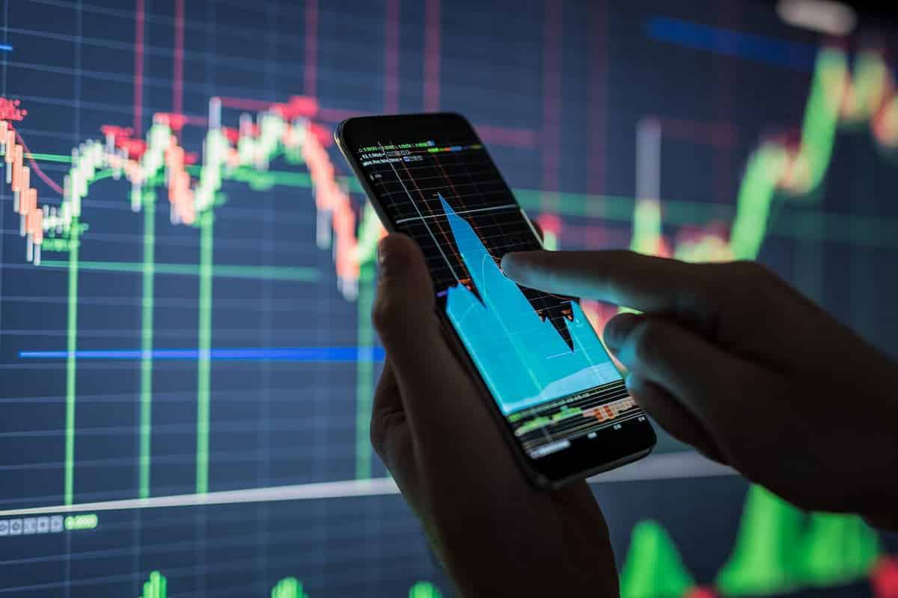

The world of trading has evolved significantly over recent decades, with algorithmic trading spearheading advancements in efficient market transactions. A cornerstone in this revolution is the integration of alternative data, which provides traders with a competitive edge and deeper market insights. By utilizing alternative data, traders can unlock new dimensions of market dynamics, shifting from reliance solely on traditional data sources to a more comprehensive approach that enhances predictive accuracy and response times.

One significant advancement in algorithmic trading is introducing alternative data, which is derived from non-traditional sources such as social media sentiments, satellite imagery, and foot traffic analytics. Unlike conventional financial datasets, alternative data can offer real-time insights and early indicators of market movements, thus redefining market strategies. This new frontier in data usage empowers traders to uncover hidden trends and capitalize on opportunities that might be overlooked by traditional datasets.

The synergy between algorithmic trading and alternative data use represents a transformative shift in optimizing trading strategies. Algorithms, known for their ability to process vast datasets at remarkable speeds, can be enhanced with alternative data, enabling more informed trading decisions quickly. This combination allows traders to implement complex trading strategies with enriched insights, thereby improving overall market performance.

The importance of alternative data is increasing within the modern trading environment, as it offers a broader view and early insights into market trends. The rise of algorithmic trading, therefore, necessitates the integration of alternative datasets to maintain a competitive advantage. As such, understanding and leveraging these tools is essential for those seeking to optimize their trading strategies and capitalize on evolving market opportunities.

## Table of Contents

## What is Alternative Data?

Alternative data refers to data sourced from unconventional, non-financial origins that provide fresh perspectives on market trends and dynamics. Unlike traditional data, which typically includes financial statements or stock prices, alternative data encompasses a diverse range of informational categories such as social media sentiment, news sentiment, foot traffic, and satellite imagery.

Social media platforms offer real-time streams of public sentiment, which traders can analyze to predict demand shifts, consumer preferences, or market [volatility](/wiki/volatility-trading-strategies). Similarly, news sentiment analysis involves categorizing and quantifying the tone of news articles, which can offer clues about market optimism or pessimism and potentially foreshadow stock price movements. Foot traffic data, often collected using mobile tracking technology, can indicate the popularity or potential sales performance of physical retail locations, providing actionable market insights.

Satellite imagery plays a crucial role in monitoring agricultural outputs, analyzing deforestation rates, or assessing construction activity. For instance, assessing warehouse parking lot capacities through satellite images can give clues about a retailer's logistical efficiency or stock levels.

The proliferation of big data technologies has enabled the effective collection, storage, and processing of these large datasets. High-performance computing and sophisticated algorithms allow for the rapid analysis of [alternative data](/wiki/best-alternative-data) to extract meaningful insights. Machine learning and natural language processing (NLP) are frequently employed to tackle complex datasets, identifying patterns and predicting outcomes.

Understanding the subtleties of alternative data is paramount for traders seeking to obtain a competitive advantage. By integrating alternative data into their analysis, traders can identify market signals not visible through traditional data analysis, aiding in making informed and timely investment decisions. As the financial landscape shifts towards a more data-centric approach, the ability to harness and interpret such unique datasets becomes increasingly pivotal.

## The Role of Algorithms in Trading

Algorithmic trading utilizes sophisticated computer programs to execute trades based on predetermined rules. These algorithms engage in the buying and selling of financial instruments at a pace and precision far beyond human capabilities. The speed at which these algorithms operate allows for the rapid processing of vast volumes of data, facilitating timely market entries and exits, which in turn enhances trading efficiency.

The primary advantage of [algorithmic trading](/wiki/algorithmic-trading) lies in its ability to eliminate human emotional biases from trading activities. Emotions such as fear and greed can adversely impact decision-making, leading to suboptimal trades. By automating the trading process, algorithms ensure a consistent and objective execution strategy, thereby optimizing outcomes and improving the overall decision-making process.

Algorithms can be designed to implement intricate trading strategies that involve complex calculations and real-time data analysis. They can adjust rapidly to dynamic market conditions, enabling traders to capitalize on short-lived opportunities. By continuously monitoring various market indicators and signals, these algorithms can react swiftly to any changes, which is vital in a fast-paced trading environment.

The integration of alternative data into trading algorithms represents a significant advancement, as it equips traders with enriched insights that can enhance their strategies. Alternative data sources, such as social media sentiment and satellite imagery, provide a more comprehensive view of market dynamics, offering traders unique perspectives that traditional data may overlook. This fusion of alternative data and algorithmic execution empowers traders to refine their strategies further, ensuring that they can remain competitive in the evolving financial markets.

In summary, the function of algorithms in trading extends beyond mere execution; it encompasses optimization, adaptability, and the ability to leverage vast datasets effectively. By integrating alternative data into these algorithms, traders can unlock new levels of strategic sophistication, providing them with an edge that is crucial for success in modern financial environments.

## Benefits of Trading with Alternative Data

Access to alternative data empowers traders to identify opportunities and trends that traditional datasets might overlook. By integrating data from unconventional sources, traders gain a comprehensive understanding of market dynamics. These insights help in crafting more informed trading strategies and improving decision-making processes.

The extended scope of information provides a fuller picture of the market environment. It enables traders to assess the implications of non-financial events, such as social media trends or satellite imagery analyses, on stock performance or commodity prices. This multidimensional view broadens the scope for predictive analysis, allowing for better risk management and the ability to capitalize on short-term market movements.

Enhanced predictive capabilities derived from alternative data allow traders to manage risks more effectively. By analyzing diverse data types—such as news sentiment analytics or real-time environmental changes—traders can anticipate market fluctuations and adjust strategies accordingly. For example, computational models can be developed to predict stock price movements based on sentiment scores derived from Twitter feeds or news headlines, potentially leading to better profitability.

The incorporation of alternative data can also spur creativity and innovation in developing new trading strategies and models. With varied datasets at their disposal, traders and quantitative analysts can experiment with different algorithms and [machine learning](/wiki/machine-learning) models to forecast market trends. This approach fosters the development of unique models that can identify patterns or anomalies, providing a strategic advantage in highly competitive markets.

Moreover, traders can leverage a plethora of data sources to enhance portfolio performance and gain a competitive edge. By utilizing datasets such as satellite images for predicting crop yields or analyzing shipping data for supply chain insights, traders can optimize their portfolios based on a richer dataset. This data-driven approach not only increases the potential for higher returns but also fortifies trading strategies against unforeseen market changes.

In summary, the use of alternative data equips traders with the tools needed to uncover hidden market insights, refine predictive models, and develop innovative strategies that can significantly impact portfolio performance. Embracing this new era of data usage can lead to improved efficiency and competitiveness in financial markets.

## Challenges and Considerations

Alternative data presents a valuable resource for traders, yet its utilization is accompanied by several challenges that require careful consideration. The sheer [volume](/wiki/volume-trading-strategy) and diversity of alternative data demand sophisticated analytical tools and expertise to decipher actionable insights. This complexity is compounded by the necessity for data accuracy and consistency, ensuring that algorithmic models can execute trades reliably based on uniform information from different sources.

Data quality is a critical [factor](/wiki/factor-investing); traders must verify the source and reliability of the alternative data they intend to leverage. It is crucial to maintain a high level of precision to prevent erroneous trading decisions. Integration of alternative data with existing systems is another challenge. This process requires robust data pipelines and platforms capable of handling diverse data formats and structures, while also ensuring that the data is seamlessly consolidated into the algorithmic trading framework.

Privacy concerns are paramount when accessing and utilizing alternative data. Traders must navigate the ethical and legal landscape to ensure compliance with data protection regulations, such as the General Data Protection Regulation (GDPR) and other relevant laws. It is vital to obtain appropriate permissions and use data in a way that respects privacy rights, as non-compliance can result in significant legal and reputational repercussions.

Another consideration is the potential for data bias, which can manifest when the datasets used do not fully represent the reality of the market due to sampling or collection bias. This requires a conscious effort to assess data sources critically and to employ strategies that mitigate bias, ensuring that resultant models reflect true market conditions.

To effectively address these challenges, traders should invest in the latest data processing and analysis tools, stay informed about regulatory changes, and adopt a disciplined approach to data ethics. Building a multidisciplinary team that combines trading expertise with data science, legal, and ethical knowledge can enhance the integration of alternative data into trading strategies, leading to more successful outcomes in the competitive financial markets.

## Tools and Platforms for Algorithmic Trading with Alternative Data

A variety of platforms now offer seamless integration of alternative data into trading algorithms, enabling traders to access and leverage diverse data sets for improved market performance. These platforms provide robust APIs and intuitive dashboards that facilitate the retrieval, analysis, and utilization of alternative data, thus supporting sophisticated trading strategies.

Leading platforms are equipped with advanced algorithms and machine learning capabilities, which empower traders to make precise, data-driven decisions. By automating data analysis, these platforms enhance traders' abilities to identify market trends and opportunities, ultimately contributing to more effective trading outcomes.

One prominent example is QuiverQuant, which specializes in providing traders with access to government and corporate data sources. QuiverQuant's platform allows users to gather insights from various non-traditional data sets, which are often not captured by traditional financial data providers.

The effectiveness and efficiency of trading strategies can be profoundly impacted by choosing the appropriate tools. The right platform not only integrates seamlessly with existing workflows but also offers comprehensive support for data interpretation and strategy execution. As a result, traders are better positioned to maximize their portfolio performance and maintain a competitive edge in an increasingly complex market environment.

## Future Outlook and Trends

The use of alternative data in trading is predicted to expand as technological innovations and data accessibility continue to advance. This expansion is largely driven by the integration of [artificial intelligence](/wiki/ai-artificial-intelligence) (AI) and machine learning (ML), which are poised to further enhance the capabilities of algorithmic trading systems. AI and ML enable the development of predictive models that can analyze complex datasets with high accuracy, improving decision-making processes in trading. These technologies facilitate the identification of patterns and trends that may not be immediately evident through traditional data analysis, thereby offering traders a significant strategic advantage.

There is likely to be an increased focus on real-time data processing, essential for developing more sophisticated trading strategies. Real-time data allows for the immediate analysis and execution of trades, which is crucial in the fast-paced environment of financial markets. As algorithms become more advanced, the ability to process and respond to real-time information will become a cornerstone of successful trading strategies. This capability is powered by improvements in computational power and data processing techniques that permit the efficient handling of massive volumes of information.

Regulatory considerations are expected to evolve as alternative data becomes more integrated into trading processes. Regulatory bodies may impose new guidelines to ensure that the use of alternative data in trading is conducted fairly and ethically, protecting market integrity and ensuring transparency. These regulations could affect how data is sourced, processed, and used, necessitating that traders and trading firms stay abreast of any changes to maintain compliance and avoid potential legal pitfalls.

Overall, traders who adopt these technologies and data sources are likely to maintain a competitive edge in the dynamic financial markets. By leveraging AI, ML, and real-time data analytics, traders can enhance their strategic frameworks, adapt to market changes swiftly, and improve portfolio performance. The future of trading is increasingly data-centric, with the integration of alternative data becoming a critical component. Traders who continuously evolve with these advancements are positioned to capitalize on emerging opportunities and navigate the complexities of modern financial markets effectively.

## Conclusion

Trading with alternative data and algorithms presents innovative opportunities for achieving superior market performance. This approach necessitates a careful balance of opportunities with the challenges presented by data utilization. These challenges include ensuring data quality, integration, and addressing privacy concerns. As the financial landscape evolves, it becomes increasingly important to stay informed about advancements in algorithmic trading and data analytics. Embracing a data-driven future in trading is essential; those who effectively harness both traditional and alternative data are likely to outshine their competitors. 

The evolving landscape demands continual adaptation, learning, and integration of emerging technologies into trading practices. The ability to process vast amounts of data efficiently and make rapid, informed decisions will be crucial. Innovative trading strategies that incorporate machine learning and artificial intelligence will shape future success. Staying ahead in the competitive markets will depend on a trader's ability to evolve with technological advancements and embrace new data sources. By doing so, traders can unlock the full potential of data-driven decision-making, ensuring they remain agile and competitive in an ever-changing market environment.

## References & Further Reading

[1]: ["Advances in Financial Machine Learning"](https://www.amazon.com/Advances-Financial-Machine-Learning-Marcos/dp/1119482089) by Marcos Lopez de Prado

[2]: ["Machine Learning for Algorithmic Trading"](https://github.com/stefan-jansen/machine-learning-for-trading) by Stefan Jansen

[3]: ["Quantitative Trading: How to Build Your Own Algorithmic Trading Business"](https://www.amazon.com/Quantitative-Trading-Build-Algorithmic-Business/dp/1119800064) by Ernest P. Chan

[4]: Kearney, C., & Liu, S. (2014). ["Textual sentiment in finance: A survey of methods and models."](https://www.sciencedirect.com/science/article/pii/S1057521914000295) International Review of Financial Analysis, 33, 171-185.

[5]: Loughran, T., & McDonald, B. (2011). ["When is a Liability Not a Liability? Textual Analysis, Dictionaries, and 10‐Ks."](https://www.jstor.org/stable/pdf/29789771.pdf) The Journal of Finance, 66(1), 35-65. 

[6]: Chen, H., De, P., Hu, Y. J., & Hwang, B. H. (2014). ["Wisdom of crowds: The value of stock opinions transmitted through social media."](https://academic.oup.com/rfs/article-abstract/27/5/1367/1581938) The Review of Financial Studies, 27(5), 1367-1403.

[7]: ["Alternative Data: How New Data Sources are Transforming Finance, Risk, and Investing"](https://www.factori.ai/blog/alternative-data-for-finance) by Alexander Denev and Saeed Amen

[8]: Ilyas, A., & Ahmety, V. (2018). ["Sentiment Analysis to Predict Market Trends: A Comparative Study."](https://www.sciencedirect.com/science/article/pii/S095070512100397X) International Conference on Applied Intelligence and Informatics.