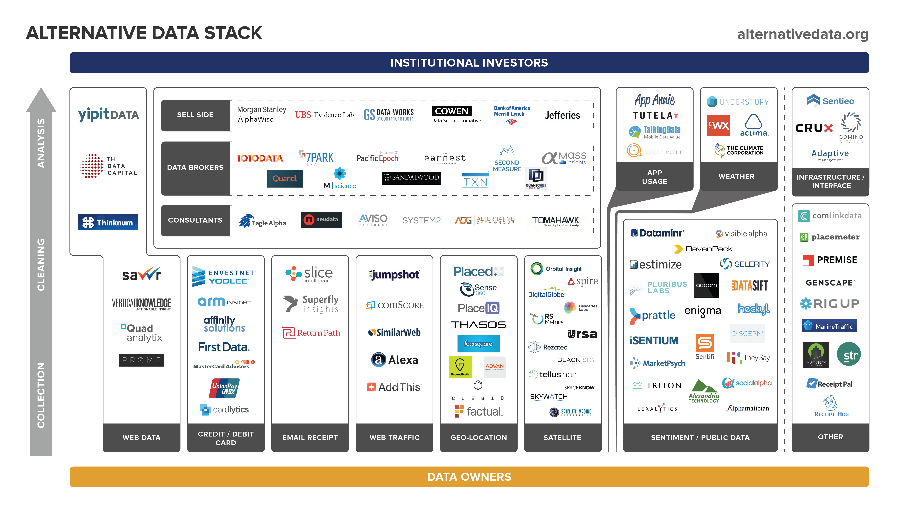

## Table of Contents

## What is alternative data in trading?

Alternative data in trading refers to information that comes from non-traditional sources, which investors use to gain an edge in the market. This data can include things like satellite images of parking lots to estimate store traffic, social media sentiment analysis, or even credit card transaction data. Unlike traditional financial data like stock prices or company earnings reports, alternative data provides unique insights that are not easily accessible to everyone.

Traders use alternative data to make better predictions about a company's performance or market trends. For example, if satellite images show more cars at a retailer's parking lots than usual, it might suggest higher sales, which could be a good sign for investors. However, using alternative data can be tricky because it's often unstructured and requires special tools and skills to analyze properly. Despite the challenges, many hedge funds and investment firms find it valuable for gaining a competitive advantage.

## How can alternative data be sourced?

Alternative data can be sourced from many different places. One common way is through companies that specialize in collecting and selling this kind of data. These companies might gather information from social media, satellite images, or even credit card transactions. For example, a firm might buy data from a company that tracks how many people visit a store by counting the cars in the parking lot using satellite images.

Another way to get alternative data is by using public sources. This can include things like government reports, weather data, or even news articles. Traders can use tools to scrape this information from the internet and turn it into useful data. For instance, someone might look at weather reports to predict how a bad storm could affect a company's sales.

Sometimes, companies can also generate their own alternative data. This might involve setting up sensors or cameras to collect information directly. For example, a company might use sensors to track how many people walk into their stores each day. This kind of data can be very specific and useful for making decisions about the business.

## What are the common types of alternative data used in trading?

One common type of alternative data used in trading is social media data. This includes information from platforms like Twitter, Instagram, and Reddit. Traders look at what people are saying about a company or a product to understand how people feel about it. If lots of people are talking positively about a new phone, it might mean the company that makes it will do well. This can help traders decide whether to buy or sell the company's stock.

Another type is satellite imagery. Traders use pictures from space to see things like how full parking lots are at stores or how busy ports are. If a store's parking lot is always full, it might mean the store is doing well and selling a lot of products. This can be a good sign for investors. Also, if a port is very busy, it might mean a lot of goods are being shipped, which can tell traders about the health of the economy.

Credit card transaction data is also popular. This data shows how much people are spending and where they are spending it. If people are spending more money at a certain type of store, it might mean that store is doing well. Traders can use this information to predict how a company will perform in the future. This can help them make better investment decisions.

## How does alternative data differ from traditional financial data?

Alternative data is different from traditional financial data because it comes from unusual places. Traditional financial data includes things like stock prices, company earnings reports, and economic indicators. This kind of data is easy to find and everyone can use it. On the other hand, alternative data comes from sources like social media, satellite images, and credit card transactions. This data is not as easy to get and often needs special tools to understand.

The main difference is that alternative data gives traders new and unique information that others might not have. For example, traditional data might tell you how much a company made last quarter, but alternative data could show you how many people visited the company's stores by looking at satellite images of parking lots. This can help traders make better guesses about what will happen next. While traditional data is important, alternative data can give traders an edge by showing them things that are not in the usual reports.

## What are the benefits of using alternative data in trading strategies?

Using alternative data in trading strategies can give traders a big advantage. This kind of data comes from places like social media, satellite images, and credit card transactions. It helps traders see things that other people might not know about. For example, if a trader sees that a store's parking lot is always full from satellite images, they might guess that the store is doing well. This can help them decide to buy the company's stock before others do. By using information that is not easy to find, traders can make better guesses about what will happen next in the market.

Another benefit is that alternative data can help traders understand how people feel about a company or a product. For instance, if lots of people are talking positively about a new phone on social media, it might mean the company that makes it will do well. This can help traders decide whether to buy or sell the company's stock. By looking at what people are saying and doing, traders can get a better idea of what might happen in the future. This can lead to smarter investment choices and possibly more money.

## What are the potential risks and challenges associated with using alternative data?

Using alternative data in trading can be tricky because it's not always easy to understand. This kind of data comes from places like social media, satellite images, and credit card transactions. It's often messy and needs special tools to make sense of it. If traders don't use the right tools or don't know how to use them well, they might make bad guesses about what will happen next in the market. This can lead to losing money instead of making it.

Another challenge is that alternative data can be expensive and hard to get. Not everyone can afford to buy this kind of data, and some companies keep it secret to stay ahead of others. This means that only a few traders might have access to it, which can make the market unfair. Also, there are rules about what kind of data you can use and how you can use it. If traders break these rules, they could get in trouble. So, while alternative data can help, it also comes with big risks and challenges.

## How can traders ensure the quality and reliability of alternative data?

To make sure alternative data is good and reliable, traders need to check where the data comes from. They should look for data from trusted sources, like well-known companies that collect and sell data. It's also important to see if the data has been used before and if it helped make good guesses about the market. If a lot of people trust the data and it has a history of being useful, it's probably good quality.

Another way to ensure the reliability of alternative data is to use more than one source. If different kinds of data, like social media posts and satellite images, all say the same thing, it's more likely to be true. Traders should also keep an eye on how the data is collected and updated. If the data is old or not collected in a good way, it might not be reliable. By being careful and checking the data well, traders can make better use of alternative data in their trading strategies.

## What legal and ethical considerations should be taken into account when using alternative data?

When using alternative data, traders need to think about the rules that govern how data can be collected and used. There are laws like the General Data Protection Regulation (GDPR) in Europe that protect people's privacy. These laws say that data about people, like what they buy or say on social media, can't be used without their permission. Traders have to make sure they follow these rules or they could get in big trouble. They also need to be careful about where they get their data from. If they buy data from a company, they need to make sure that company collected it in a way that follows the law.

Ethically, using alternative data raises questions about fairness and privacy. If only a few traders can get this special data, it might not be fair to others who can't afford it or don't know about it. This can make the market unfair. Also, using data about people without their knowledge can feel wrong to some. Traders should think about whether it's right to use this data, even if it's legal. They need to balance the benefits of using alternative data with the possible harm it could cause to people's privacy and the fairness of the market.

## How can alternative data be integrated into existing trading systems?

To use alternative data in trading systems, traders first need to find a good way to get the data. They can buy it from companies that collect and sell this kind of information, or they can gather it themselves from public sources like social media or government reports. Once they have the data, they need to use special tools to clean it up and make it easy to understand. These tools can help turn messy data into something that can be used in their trading systems. After the data is ready, traders can add it to their existing systems by setting up new rules or models that use this new information to make better guesses about the market.

Integrating alternative data into trading systems can help traders make smarter choices. For example, if a trader's system uses satellite images to see how full a store's parking lot is, it can help predict how well the store is doing. This new information can be mixed with the old data the system already uses, like stock prices and company earnings. By combining both types of data, the trading system can give better advice on when to buy or sell stocks. But traders need to be careful to make sure the new data fits well with their existing system and doesn't cause any problems.

## What advanced analytical techniques are used to derive insights from alternative data?

To get useful information from alternative data, traders use special ways of looking at the data. One way is called machine learning. This is when computers learn from the data to find patterns that people might not see. For example, a computer can look at lots of social media posts to see if people are talking more about a certain product. If it finds that more people are talking about it, it might mean the product is becoming popular, which could be good for the company that makes it. Another way is called natural language processing. This helps computers understand what people are saying in words, like on social media or in news articles. By understanding the words, the computer can tell if people feel good or bad about a company or product.

Another technique is called geospatial analysis. This is when traders use satellite images to see things like how many cars are in a store's parking lot or how busy a port is. If the parking lot is always full, it might mean the store is doing well. This can help traders guess how a company will do in the future. Also, there's something called time series analysis, which looks at how data changes over time. For example, if credit card data shows that people are spending more money at a certain type of store, it might mean that store is doing well. By using these advanced ways of looking at data, traders can make better guesses about what will happen next in the market.

## Can you provide case studies where alternative data significantly impacted trading outcomes?

One famous case where alternative data made a big difference in trading was when a hedge fund used satellite images to look at the parking lots of car dealerships. They saw that more cars were being delivered to the lots than usual. This made them think that car sales were going up, even though the company's official reports didn't show it yet. So, they bought the company's stock before everyone else knew about the good news. When the company finally reported higher sales, the stock price went up a lot, and the hedge fund made a lot of money.

Another example is when traders used social media data to understand how people felt about a new smartphone. They saw that lots of people were talking about it and saying good things. This made them think the phone would sell well, so they bought the stock of the company that made it. When the phone came out and sold really well, the company's stock price went up, and the traders who used the social media data made money. This shows how looking at what people say online can help traders make smart choices before everyone else knows the news.

## What future trends are expected in the use of alternative data for trading?

In the future, more and more traders will use alternative data to make their trading decisions. This is because technology is getting better at collecting and understanding this kind of data. For example, new tools like artificial intelligence and machine learning will help traders see patterns in data that they couldn't see before. This means they can make even better guesses about what will happen in the market. Also, as more people start using alternative data, the cost of getting it might go down, making it easier for more traders to use it.

Another trend we might see is that alternative data will become more important for understanding things like how people feel about a company or product. Social media and other online data will be used more to see what people are saying and thinking. This can help traders know if a company is going to do well before the company's official reports come out. But, as more people use this data, there will be more rules about how it can be used to make sure it's fair and doesn't hurt people's privacy.

## References & Further Reading

[1]: ["Advances in Financial Machine Learning"](https://www.amazon.com/Advances-Financial-Machine-Learning-Marcos/dp/1119482089) by Marcos Lopez de Prado

[2]: ["Machine Learning for Algorithmic Trading"](https://github.com/stefan-jansen/machine-learning-for-trading) by Stefan Jansen

[3]: ["Quantitative Trading: How to Build Your Own Algorithmic Trading Business"](https://www.amazon.com/Quantitative-Trading-Build-Algorithmic-Business/dp/1119800064) by Ernest P. Chan

[4]: Kearney, C., & Liu, S. (2014). ["Textual sentiment in finance: A survey of methods and models."](https://www.sciencedirect.com/science/article/pii/S1057521914000295) International Review of Financial Analysis, 33, 171-185.

[5]: Loughran, T., & McDonald, B. (2011). ["When is a Liability Not a Liability? Textual Analysis, Dictionaries, and 10‐Ks."](https://www.jstor.org/stable/pdf/29789771.pdf) The Journal of Finance, 66(1), 35-65. 

[6]: Chen, H., De, P., Hu, Y. J., & Hwang, B. H. (2014). ["Wisdom of crowds: The value of stock opinions transmitted through social media."](https://academic.oup.com/rfs/article-abstract/27/5/1367/1581938) The Review of Financial Studies, 27(5), 1367-1403.

[7]: ["Alternative Data: How New Data Sources are Transforming Finance, Risk, and Investing"](https://www.factori.ai/blog/alternative-data-for-finance) by Alexander Denev and Saeed Amen

[8]: Ilyas, A., & Ahmety, V. (2018). ["Sentiment Analysis to Predict Market Trends: A Comparative Study."](https://www.sciencedirect.com/science/article/pii/S095070512100397X) International Conference on Applied Intelligence and Informatics.