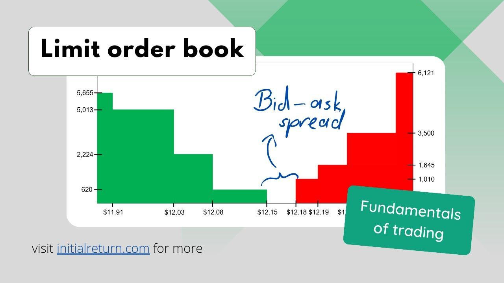

## Table of Contents

## What is a limit order book in trading?

A limit order book is like a big list that keeps track of all the buy and sell orders for a certain stock or asset in a trading market. It shows all the orders that people have placed but haven't been filled yet. Each order has a specific price that the person wants to buy or sell at. The book is split into two parts: one for buy orders, called bids, and one for sell orders, called asks. The highest bid and the lowest ask are the most important because they show the current best prices for buying and selling.

When someone wants to trade, they can look at the limit order book to see what prices are available. If a new order comes in, it gets added to the book at the price the person wants. If the price of a new order matches an existing order on the other side of the book, a trade can happen. For example, if someone wants to buy at a price that someone else is willing to sell at, the trade goes through, and those orders are taken off the book. This way, the limit order book helps keep the market organized and shows everyone what's happening with the prices.

## How does a limit order book differ from a market order?

A limit order book and a market order are two different ways to trade in the market. A limit order book is like a big list that shows all the buy and sell orders for a certain stock or asset, but these orders have specific prices that people want to trade at. It's split into two parts: one for buy orders (bids) and one for sell orders (asks). When someone places a limit order, it goes into this book and waits until someone else is willing to trade at that price. If a match happens, the trade goes through, and the orders are taken off the book.

On the other hand, a market order is much simpler and quicker. When someone places a market order, they want to buy or sell right away at the best available price in the market. They don't set a specific price; they just want the trade to happen as soon as possible. So, a market order uses the prices that are already in the limit [order book](/wiki/order-book-trading-strategies) to make the trade happen immediately. This means that with a market order, you get the current best price, but you don't control the exact price of the trade.

## What are the basic components of a limit order book?

A limit order book is made up of two main parts: bids and asks. Bids are all the orders from people who want to buy something at a certain price. Asks are all the orders from people who want to sell something at a certain price. These orders are listed in the book according to the price people want to trade at. The highest bid price and the lowest ask price are very important because they show the best current prices for buying and selling.

Each order in the limit order book has details like the price and how much of the stock or asset someone wants to buy or sell. When a new order comes in, it gets added to the book. If the price of a new order matches an existing order on the other side of the book, a trade can happen. For example, if someone wants to buy at a price that someone else is willing to sell at, the trade goes through, and those orders are taken off the book. This way, the limit order book keeps track of all the orders and helps make trades happen at the right prices.

## How do limit orders work within a limit order book?

When someone places a limit order, they tell the market they want to buy or sell a certain stock or asset at a specific price. This order gets added to the limit order book, which keeps track of all the buy and sell orders that haven't been filled yet. If someone wants to buy, their order goes into the "bids" part of the book. If they want to sell, it goes into the "asks" part. The book sorts these orders by price, so the highest bids and lowest asks are at the top.

When a new limit order comes in, it waits in the book until someone else is willing to trade at that price. For example, if someone places a limit order to buy a stock at $50, that order will sit in the book until someone else wants to sell that stock at $50 or less. If a match happens, the trade goes through, and both orders are taken off the book. This way, limit orders help control the price at which trades happen, and the limit order book keeps everything organized and clear for everyone in the market.

## What are the advantages of using limit orders in trading?

Using limit orders in trading has several advantages. One big advantage is that you can control the price at which you buy or sell. When you place a limit order, you set a specific price you're willing to trade at. This means you don't have to worry about the price suddenly changing and getting a bad deal. For example, if you want to buy a stock but only at $50 or less, you can set a limit order at $50, and your order will only go through if the stock reaches that price or lower. This gives you more control and can help you get a better price.

Another advantage of limit orders is that they can help you avoid emotional trading. When you use a market order, you might feel rushed to buy or sell right away, which can lead to making quick decisions based on emotions. With a limit order, you can set your price and wait patiently for the market to come to you. This can help you stick to your trading plan and make more thoughtful decisions. Overall, limit orders give you more control and can help you trade more calmly and strategically.

## How can traders use limit order books to improve their trading strategy?

Traders can use limit order [books](/wiki/algo-trading-books) to improve their trading strategy by getting a clear view of the market. By looking at the limit order book, traders can see all the buy and sell orders that are waiting to be filled. This helps them understand the current demand and supply for a stock or asset. For example, if there are a lot of buy orders at a certain price, it might mean that the price is likely to go up soon. By knowing this, traders can set their limit orders at the right prices to take advantage of these trends.

Another way traders can use limit order books is to find the best prices for their trades. The limit order book shows the highest bid and the lowest ask, which are the best current prices for buying and selling. Traders can use this information to set their limit orders at prices that are more likely to get filled. For instance, if a trader wants to buy a stock, they can set their limit order just above the highest bid to increase the chances of their order being filled quickly. This way, traders can make smarter decisions and improve their chances of making profitable trades.

## What are the common pitfalls to avoid when using limit order books?

One common pitfall when using limit order books is setting the wrong price for your limit order. If you set your buy order too high or your sell order too low, it might not get filled because other traders are not willing to trade at that price. This can make you miss out on good trading opportunities. It's important to look at the limit order book carefully to see where the current bids and asks are, and then set your limit order at a price that is more likely to be matched by other orders.

Another pitfall is not paying attention to the size of the orders in the book. Sometimes, there might be a lot of orders at a certain price, but they might be small in size. If you place a big order at that price, it might only get partially filled, leaving you with a position that's not what you wanted. Always check the total volume of orders at different price levels to make sure your order can be filled completely. By being aware of these common mistakes, you can use limit order books more effectively and avoid unnecessary trading problems.

## How do liquidity and depth affect trading within a limit order book?

Liquidity and depth are really important when you're trading using a limit order book. Liquidity means how easy it is to buy or sell something without the price changing a lot. If a stock or asset has high [liquidity](/wiki/liquidity-risk-premium), there are lots of orders in the limit order book, so you can trade quickly and at a good price. On the other hand, if liquidity is low, it might be hard to find someone to trade with, and the price might move a lot when you try to buy or sell. This can make trading more risky and less predictable.

Depth is about how many orders are waiting at different prices in the limit order book. If the book has good depth, there are lots of orders at different price levels, which means you can trade larger amounts without moving the price too much. This is helpful if you want to buy or sell a big amount of stock. But if the book has poor depth, there might only be a few orders at each price, so your big order could change the price a lot. Understanding liquidity and depth helps traders pick the right times and prices to trade, making their strategies more effective.

## What are the advanced techniques for analyzing limit order book data?

One advanced technique for analyzing limit order book data is to look at the order flow. This means watching how new orders come in and old orders get filled or canceled over time. By studying the order flow, traders can spot patterns and predict how the price might move. For example, if there's a sudden increase in buy orders at a certain price, it might mean the price is about to go up. Traders can use this information to make better decisions about when to buy or sell.

Another technique is to use statistical models to understand the limit order book better. These models can help traders figure out the chances of their orders being filled at different prices. For instance, they might use a model to predict the spread between the highest bid and the lowest ask, which can tell them how much the price might change. By using these models, traders can set their limit orders at the best prices and increase their chances of making a profit.

## How do high-frequency trading strategies interact with limit order books?

High-frequency trading ([HFT](/wiki/high-frequency-trading-strategies)) strategies use computers to trade very quickly, often in milliseconds. They look at the limit order book to find small chances to make money. HFT traders might put in lots of buy and sell orders to see if they can make the price move a little bit in their favor. They use the limit order book to see what prices other people are willing to trade at and try to get in and out of trades faster than everyone else.

When HFT traders see a lot of orders at a certain price in the limit order book, they might try to trade before anyone else can. They use special computer programs to watch the limit order book all the time and react to any changes. This can make the market more active and sometimes cause the prices to change quickly. But HFT can also help keep the prices fair by adding more orders to the limit order book, making it easier for everyone to trade.

## What impact do regulatory changes have on the use of limit order books?

Regulatory changes can have a big impact on how traders use limit order books. When rules change, they can affect things like how much information traders can see in the limit order book, how quickly they can trade, and what kinds of orders they can place. For example, if a new rule says that traders have to show more of their orders to everyone, it might make the limit order book more clear and helpful for everyone. But it could also make some traders more careful about what they do because they know others can see their orders.

These changes can also affect how much people want to trade and how easy it is to trade. If new rules make trading more expensive or harder, there might be fewer orders in the limit order book, which can make it less liquid and harder for traders to buy or sell at the prices they want. On the other hand, if rules make trading easier and safer, more people might use limit order books, making them more useful and active. So, it's important for traders to keep an eye on regulatory changes and adjust their strategies to make the most of the limit order book.

## How can one simulate and backtest trading strategies using limit order book data?

To simulate and backtest trading strategies using limit order book data, you need to use special computer programs. These programs let you look at old data from the limit order book and see what would have happened if you had used your trading strategy back then. You can pretend to place buy and sell orders at the prices that were in the book at that time and see if your trades would have made money or lost money. This helps you figure out if your strategy is good or if you need to change it before you use it for real trading.

One way to do this is to use a programming language like Python, which has tools that can help you work with limit order book data. You can write code to read the data, set up your trading rules, and then run your strategy over the old data. By looking at the results, you can see how well your strategy would have worked in the past. This can give you more confidence in your strategy or show you what you need to fix before you start trading with real money.

## What is the Role of Limit Order Books in Algorithmic Trading?

Algorithmic trading strategies are critically dependent on limit order books (LOBs) for optimizing trade execution and achieving profitability. A limit order book is a structured and dynamic list that aggregates all buy and sell limit orders based on price levels in a market, central to executing trades. Trading algorithms analyze these LOBs to make informed decisions on placing, modifying, or canceling orders, aiming to optimize execution costs and enhance profitability.

Execution algorithms such as the Volume Weighted Average Price (VWAP) and Time Weighted Average Price (TWAP) utilize order book data to minimize market impact and pursue execution efficiency. VWAP attempts to execute at prices better than the average price of the market over a specified period, using [volume](/wiki/volume-trading-strategy) as a metric. It does this by breaking large orders into smaller pieces and executing them in proportion to the trading volume pattern:

$$
VWAP(t) = \frac{\sum_{i=1}^{n} P_i \times Q_i}{\sum_{i=1}^{n} Q_i}
$$

where $P_i$ and $Q_i$ denote the price and quantity of the i-th trade within the time horizon.

TWAP, on the other hand, divides orders evenly across a specified time frame, aiming for an average execution price over time:

$$
TWAP(t) = \frac{\sum_{i=1}^{n} P_i}{n}
$$

These strategies leverage order book data to distribute trades consistently over time or volume, significantly reducing market impact and achieving optimal price execution.

Real-time LOB data is paramount for algorithmic traders as it allows adaptation to shifting market dynamics and facilitates timely execution adjustments. Immediate access to this data ensures responsiveness to liquidity changes, and price movements improve the alignment of trading strategies with live market conditions. The ability to process and analyze LOB data in real time aids automated systems in making microsecond decisions needed for competitive trading environments.

LOBs are vital in promoting market efficiency. They contribute to liquidity by continuously displaying available buy and sell orders, thus enabling market participants to understand the current supply and demand. Moreover, they support price discovery, the mechanism through which the equilibrium price is determined. As traders place orders based on new information, LOBs dynamically adjust to reflect collective market sentiment, guiding efficient pricing.

In summary, limit order books serve a fundamental role in [algorithmic trading](/wiki/algorithmic-trading) by providing the essential data interface for execution strategy design. They are instrumental in achieving efficient trade execution, through sophisticated algorithms like VWAP and TWAP, while ensuring adaptability to real-time market conditions. Moreover, LOBs enhance market efficiency by improving liquidity and facilitating price discovery, making them indispensable tools for algorithmic traders.

## References & Further Reading

1. **Hasbrouck, J. (2007).** *Empirical Market Microstructure: The Institutions, Economics, and Econometrics of Securities Trading*. Oxford University Press. This book provides a comprehensive analysis of market microstructure, including insightful details on limit order books and their implications on trading strategies.

2. **Bouchaud, J.-P., Bonart, J., Donier, J., & Gould, M. (2018).** *Trades, Quotes and Prices: Financial Markets Under the Microscope*. Cambridge University Press. This text explores the intricacies of financial markets, offering detailed discussions on limit order book dynamics and their relevance to algorithmic trading.

3. **O'Hara, M. (1995).** *Market Microstructure Theory*. Blackwell. A foundational work that discusses the theoretical underpinnings of market microstructure, including the mechanics of limit order books.

4. **Gould, M. D., Porter, M. A., Williams, S., McDonald, M., Fenn, D. J., & Howison, S. (2013).** "Limit order books." *Quantitative Finance*, 13(11), 1709-1742. This paper reviews the functioning and insights offered by limit order books, emphasizing their integration into algorithmic trading strategies.

5. **Harris, L. (2003).** *Trading and Exchanges: Market Microstructure for Practitioners*. Oxford University Press. This reference covers the key aspects of trading and exchanges, including the role of limit order books in the execution of trades.

6. **Biais, B., Glosten, L., & Spatt, C. (2005).** "Market microstructure: A survey of microfoundations, empirical results, and policy implications." *Journal of Financial Markets*, 8(2), 217-264. Offering a survey on market microstructure, this paper provides insights into the empirical results surrounding the use of limit order books.

7. **Foucault, T., Röell, A., & Sandås, P. (2003).** "Market making with cost asymmetries: An application to exchange rates." *Journal of Financial and Quantitative Analysis*, 38(2), 267-295. This paper examines the influence of market makers in the context of limit order books, especially under different cost structures.

8. **Lehalle, C.-A., & Laruelle, S. (Eds.). (2013).** *Market Microstructure in Practice*. World Scientific Publishing. The book offers practical insights into using limit order books for algorithmic trading, complete with case studies and real-world applications.

These resources provide a significant foundation for understanding the complexities of limit order books and their pivotal role in algorithmic trading. From foundational theories to practical implementations, these references encompass a holistic view, enabling further exploration of market microstructure concepts.

