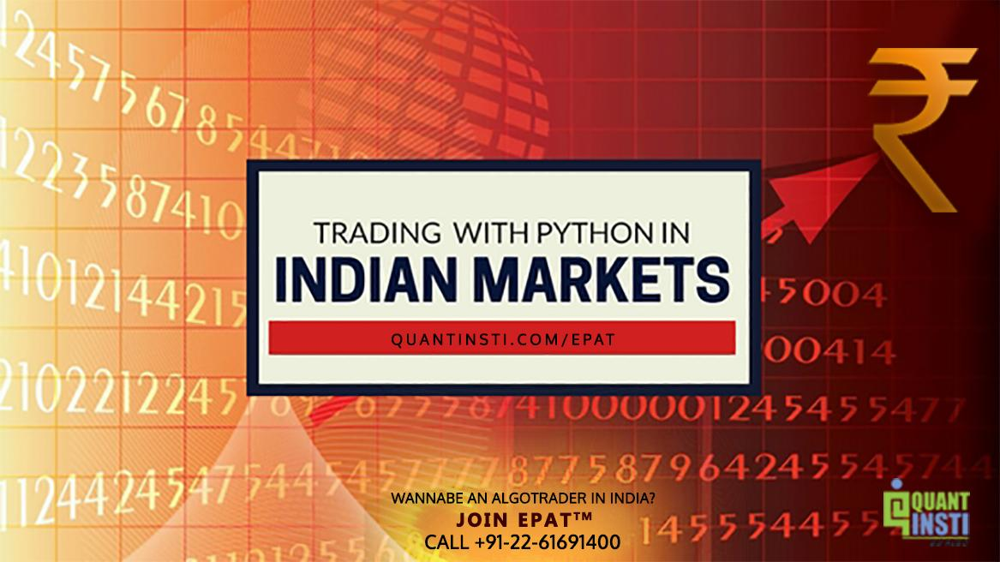

In recent years, financial markets in India have undergone a significant transformation with the growing adoption of algorithmic trading. This shift is largely driven by advancements in technology and the increasing availability of sophisticated tools that allow both institutional and individual traders to automate and optimize their trading processes. Algorithmic trading utilizes complex computational models to execute trades with speed and precision, enhancing the capacity to process vast amounts of market data efficiently.

Python, a versatile and powerful programming language, has emerged as a cornerstone in this trading evolution. Known for its simplicity and readability, Python lowers the barriers to entry, making algorithmic trading more accessible to a broader audience. Its extensive suite of libraries, such as NumPy, Pandas, and Matplotlib, facilitates numerical analysis, data manipulation, and visualization, equipping traders with the critical tools needed to develop robust trading strategies.



Within the Indian financial landscape, the role of Python has become increasingly prominent. The integration of Python with trading platforms and APIs, such as Zerodha's Kite Connect, empowers traders by providing seamless access to real-time data and enabling automated trade execution. Furthermore, Python's open-source nature has fostered a large, dynamic community, constantly contributing to a growing repository of resources and innovative solutions.

This article explores how Python is shaping algorithmic trading in India. We will examine its benefits, the platforms supporting its use, the tools and strategies that enhance its capabilities, and the potential it offers for future advancements in trading technology. Whether seasoned or novice, traders leveraging Python are better positioned to adapt and thrive in the fast-paced environment of the Indian financial markets.

## Table of Contents

## Understanding Algorithmic Trading

Algorithmic trading involves utilizing sophisticated mathematical models and automated systems to execute trades at optimal speeds and efficiencies. Rather than relying on human intervention, algorithmic trading systems use pre-defined instructions or algorithms to make buy and sell decisions in real-time. This method of trading is particularly characterized by its ability to manage and analyze vast amounts of market data rapidly. A core component of algorithmic trading is its reliance on computational power to process large datasets, which can include historical prices, trading volumes, and other market indicators. Algorithms are designed to monitor these data points and execute orders based on certain criteria, such as price movements or technical indicators.

In India, algorithmic trading is increasingly becoming a staple of the financial markets. Its appeal spans both large financial institutions and individual retail traders. The ability to execute trades swiftly and efficiently is an attractive proposition in the fast-paced world of financial trading, providing an edge over traditional manual trading methods.

Indian financial markets are witnessing an evolutionary change in their regulatory frameworks to support the burgeoning use of [algorithmic trading](/wiki/algorithmic-trading). The Securities and Exchange Board of India (SEBI) has been instrumental in shaping the regulatory landscape to accommodate this trend. SEBI has introduced measures to ensure that the growth of algorithmic trading is balanced with market stability and investor protection. By implementing stringent standards for infrastructure and risk management, SEBI is fostering a safe environment for algorithmic trading to flourish.

Algorithmic trading in India is further bolstered by the widespread use of technology and innovation in trading platforms, which offer APIs and tools that simplify the execution of algorithmic strategies. As a result, both institutional and individual participants can leverage cutting-edge technology to optimize their trading operations.

The global trend towards automation in financial markets is mirrored in India, where the deployment of algorithmic trading strategies is becoming increasingly sophisticated. This progress is supported by educational programs and resources that equip traders with the necessary skills to develop and deploy algorithmic solutions. As technology and regulatory frameworks continue to evolve, algorithmic trading is poised to expand significantly in the Indian financial landscape.

## Why Python for Algo Trading?

Python has become a preferred language for algorithmic trading due to its simplicity and readability, making it accessible to both new and experienced traders. The language's intuitive syntax reduces the learning curve, allowing traders to rapidly develop and test strategies. Core to its appeal are the extensive libraries available for various tasks essential to algorithmic trading.

NumPy, Pandas, and Matplotlib are among the most utilized libraries, providing robust tools for numerical analysis, data manipulation, and visualization. NumPy offers support for large, multi-dimensional arrays and matrices, along with a vast collection of mathematical functions to operate on these arrays. This is essential for handling the large datasets typical in financial markets. Pandas adds to this by using its DataFrame structure to offer powerful tools for data analysis and manipulation. This is beneficial when cleaning and structuring data for [backtesting](/wiki/backtesting) and real-time analysis. Matplotlib enables the generation of comprehensive plots for visualizing trading data, crucial for assessing strategies and market trends.

Python's adaptability is another significant advantage, especially in integrating with trading APIs such as Zerodha's Kite Connect, widely used in India. Kite Connect provides interfaces to access market data and manage orders programmatically. Python’s extensive suite of libraries and frameworks facilitates seamless API integration, enabling traders to automate their trading processes efficiently. 

Additionally, Python’s open-source nature fosters a large and active community, contributing to a constant stream of innovation. This community support is invaluable for troubleshooting, sharing strategies, and staying updated with the latest developments in both Python and trading strategies.

The combination of these aspects makes Python not only a powerful tool for algorithmic trading but also a continuously evolving platform that aligns well with the dynamic nature of financial markets.

## Python in the Indian Trading Landscape

In India, the landscape for trading has significantly evolved with the advent of algorithmic trading and technological advancements. Platforms like Zerodha's Kite Connect API have been pivotal in this transformation, providing essential tools for Python traders. Kite Connect offers access to real-time market data, efficient order management, and historical data analysis, which are crucial for algorithmic trading strategies. These features allow traders to programmatically interact with the stock market, enhancing trading activities' speed and precision.

The rise in Python's popularity within this landscape is largely supported by educational resources aimed at equipping traders with necessary skills. Institutions such as Quantra and the Executive Programme in Algorithmic Trading (EPAT) offer self-paced courses that cover various facets of algorithmic trading including Python programming essentials. These courses help traders build a foundation in both programming and the fundamental aspects of trading, enabling them to create sophisticated trading algorithms.

Python's versatility is a significant advantage in the Indian trading context. It provides libraries like NumPy for numerical computations, Pandas for data manipulation, and Matplotlib for data visualization, which collectively streamline the process of backtesting and implementing trading strategies. Backtesting, in particular, allows traders to test their trading strategies against historical data, a crucial step in validating the effectiveness of any strategy before deployment in live markets. Python's robust ecosystem and the community-driven nature further bolster the innovative use of trading algorithms, as they offer continuous improvements and a wealth of shared knowledge and code samples.

In summary, Python's role in the Indian trading ecosystem is both transformative and facilitating. Through platforms like Kite Connect and educational initiatives, it empowers traders to utilize algorithmic trading efficiently while fostering an environment of continuous learning and adaptation.

## Setting Up Algo Trading with Python

Setting up algorithmic trading with Python begins with establishing a trading account through a brokerage platform, such as Zerodha, widely used in the Indian market. Zerodha's Kite Connect API provides a crucial tool for automated trading, offering access to market data and trading functionalities. To utilize these capabilities, traders must register for API access, granting them the ability to interact programmatically with the market.

Once the account setup and API registration are complete, the next step is installing necessary Python libraries. Key among these is the `kiteconnect` library, which enables seamless communication with the Zerodha trading platform. Installation is straightforward and can be accomplished using the Python package manager pip:

```python
pip install kiteconnect
```

The `kiteconnect` library allows traders to execute a range of functions, from fetching historical data and live market quotes to placing buy or sell orders automatically based on pre-defined strategies. Code samples and tutorials for using these functions are widely available, enabling customization to fit specific trading strategies.

For instance, consider a simple Python script using `kiteconnect` to retrieve the last close price of a particular stock:

```python
from kiteconnect import KiteConnect

api_key = "your_api_key"
access_token = "your_access_token"

kite = KiteConnect(api_key=api_key)
kite.set_access_token(access_token)

# Fetch last close price of a stock
instrument_token = 738561 # Reliance's instrument token
quote = kite.quote([instrument_token])

last_close_price = quote[str(instrument_token)]["last_price"]
print(f"Last close price: {last_close_price}")
```

In this code snippet, the `KiteConnect` class is instantiated using the user's API key and access token. The `quote` function within the library is then utilized to obtain the latest price of a stock, demonstrating how Python can automate the retrieval of market data.

Beyond data retrieval, code samples can be adapted for strategy execution, such as implementing moving averages, Bollinger Bands, or other technical indicators. The Python ecosystem offers a diversity of libraries and frameworks, making it possible to backtest, validate, and optimize trading strategies before deployment in live markets.

By leveraging Python's capabilities and extensive library support, traders can customize these templates to align with their unique strategies. This customization maximizes the efficiency of algorithmic trading, allowing traders to capitalize on market opportunities with precision and speed.

## Implementing Strategies: A Practical Example

Utilizing Python to implement algorithmic trading strategies can significantly enhance efficiency and precision. Here, we provide a practical example using moving averages, a common technique in financial trading to identify trends.

### Setting Up Data Retrieval

To begin, traders need to access historical price data. This is crucial for calculating moving averages and backtesting the strategy. In Python, libraries such as `pandas` and `yfinance`, a financial library to extract data from Yahoo Finance, make data retrieval straightforward.

```python
import yfinance as yf  # For more datasets, visit: https://paperswithbacktest.com/datasets

# Download historical data for a specified stock
data = yf.download('AAPL', start='2022-01-01', end='2023-01-01')
```

### Strategy Formulation

A moving average strategy typically involves calculating a short-term and a long-term moving average. A common choice is to use the 50-day and 200-day moving averages. The strategy generates buy/sell signals based on the crossover of these moving averages.

1. **Calculate Moving Averages**: Use `pandas` to compute the moving averages.

```python
short_window = 50
long_window = 200

# Calculate short and long moving averages
data['short_mavg'] = data['Close'].rolling(window=short_window, min_periods=1).mean()
data['long_mavg'] = data['Close'].rolling(window=long_window, min_periods=1).mean()
```

2. **Define Trading Signals**: Develop logic for generating buy and sell signals.

```python
# Create signals when the short moving average crosses above or below the long moving average
data['signal'] = 0
data['signal'][short_window:] = np.where(data['short_mavg'][short_window:] 
                                          > data['long_mavg'][short_window:], 1, 0)   
data['positions'] = data['signal'].diff()
```

### Executing Trades Programmatically

The next step is to execute trades based on the generated signals. For live trading, traders can use broker APIs like Zerodha's Kite Connect, but here we illustrate using backtesting.

```python
initial_capital = 100000.0
shares_owned = 0

for i in range(len(data)):
    if data['positions'][i] == 1:  # Buy signal
        shares_owned = initial_capital // data['Close'][i]
        initial_capital -= shares_owned * data['Close'][i]
    elif data['positions'][i] == -1:  # Sell signal
        initial_capital += shares_owned * data['Close'][i]
        shares_owned = 0

# Calculate the portfolio value if all shares are sold at the end
final_portfolio_value = initial_capital + shares_owned * data['Close'][-1]
profit = final_portfolio_value - 100000.0
```

The code above demonstrates how Python facilitates not just the development of trading strategies, but also their execution. Traders can simulate the strategy's performance over historical data and refine their approach based on the results.

This example underscores the power of Python in crafting and implementing robust algorithmic trading strategies, enabling traders to make data-driven decisions efficiently and effectively.

## Challenges and Considerations

Algorithmic trading with Python offers numerous benefits, but it is not without its challenges and considerations. Traders must possess a solid understanding of financial principles and develop robust risk management strategies to succeed. One of the primary obstacles is latency, which refers to the delay between receiving market data and executing a trade based on that information. Even minimal latency can significantly affect the profitability of trades in fast-paced markets. To mitigate latency, traders need to optimize their algorithms and possibly invest in higher-performance computing infrastructure.

Market conditions also present challenges. Financial markets are dynamic, with rapid price fluctuations influenced by a multitude of factors, including economic news, geopolitical events, and changes in investor sentiment. Traders must design algorithms that can adapt to diverse market environments. Backtesting strategies on historical data can provide insights, but past performance does not guarantee future results, so continuous monitoring and adjustment of strategies are necessary.

Regulatory compliance is another critical consideration. In India, algorithmic trading is subject to regulations by the Securities and Exchange Board of India (SEBI). Traders must ensure their strategies adhere to legal requirements and avoid practices like front-running. Compliance with data protection laws is also essential when handling sensitive financial information.

Continuous learning and adaptation are crucial for maintaining a competitive edge in algorithmic trading. Financial markets evolve, and new technologies emerge, requiring traders to stay informed and refine their skills. Engaging with the Python community, attending workshops, and accessing online resources can support this ongoing learning process. By remaining adaptable and committed to education, traders can navigate the complex landscape of algorithmic trading effectively.

## Future Trends and Opportunities

Algorithmic trading in India is set for significant expansion as the market increasingly adopts automated solutions for enhanced efficiency and precision in trading. The integration of [machine learning](/wiki/machine-learning) (ML) and [artificial intelligence](/wiki/ai-artificial-intelligence) (AI) in algorithmic trading platforms represents a key trend, enhancing decision-making processes and enabling the development of predictive models that can analyze vast datasets to identify potential trading signals. These technologies provide traders with the ability to execute strategies rooted in sophisticated data analysis and pattern recognition that far surpass traditional methods.

Python's role as a foundational tool in this evolution remains strong due to its versatility and robust ecosystem. With libraries like Scikit-learn for machine learning, TensorFlow and PyTorch for [deep learning](/wiki/deep-learning), and financial-specific frameworks, Python offers comprehensive resources for designing complex trading algorithms. This language supports the development of models that can process real-time data and perform tasks ranging from risk assessment to portfolio optimization.

One clear opportunity for future exploration is the application of [reinforcement learning](/wiki/reinforcement-learning) (RL) in trading strategies. RL models, which learn optimal strategies through interactions with the trading environment, hold the promise of adaptive algorithms that improve over time. An example of a simple RL application in trading could involve using Q-learning to optimize a portfolio's buy and sell actions based on historical price data.

```python
import numpy as np
import pandas as pd

# Initialize Q-table
Q = np.zeros((state_space, action_space))

# Simulated rewards and future state for training
rewards = np.random.random(size=state_space)
future_states = np.random.randint(0, state_space, size=(state_space, action_space))

# Learning parameters
learning_rate = 0.1
discount_factor = 0.9

# Q-learning update rule
for state in range(state_space):
    for action in range(action_space):
        future_reward = rewards[state] + discount_factor * np.max(Q[future_states[state, action], :])
        Q[state, action] = (1 - learning_rate) * Q[state, action] + learning_rate * future_reward
```

Moreover, with the surge in high-frequency trading ([HFT](/wiki/high-frequency-trading-strategies)) in India, there is an increasing demand for optimizing latency and execution times, areas where Python, despite its versatility, may require augmentation with C++ modules for critical performance improvements.

As regulatory frameworks in India continue to evolve, there's an opportunity for market participants to develop compliance-focused automated solutions that ensure adherence to these changes, minimizing risks and enhancing strategy effectiveness.

The future trajectory of algorithmic trading in India not only involves adopting these emerging technologies but also fostering a culture of continued education and experimentation among traders. Workshops, webinars, and collaborative projects within the community can contribute to a broader understanding of these advancements, ensuring that India remains a vibrant hub for algorithmic trading innovation.

## Conclusion

Python significantly influences algorithmic trading in India, equipping traders with advanced technology to gain an edge in financial markets. Its accessible and versatile nature makes it an ideal tool for everyone, from seasoned market veterans to newcomers. Python's extensive libraries streamline the process of analyzing, modeling, and executing trades, while its large user community provides invaluable resources, from forums to tutorials, fostering an environment of continuous learning and support.

For both institutional and individual traders, Python's adaptability means trading strategies can be tailored and scaled, catering to specific market conditions. The programming language's open-source status ensures a pool of innovative tools and frameworks such as NumPy, Pandas, and Matplotlib, which simplify data handling and visualization. Furthermore, APIs from platforms like Zerodha enhance Python's utility by allowing integration with real-time and historical market data, crucial for backtesting and live trading.

Despite its benefits, fully leveraging Python for algo trading requires dedication, a keen understanding of financial markets, and an ongoing commitment to learning. Developing effective strategies involves more than technical prowess; it demands robust risk management and awareness of market dynamics and regulatory considerations. However, the pursuit is rewarding as it empowers traders to achieve precision, efficiency, and sophistication in their trading endeavors.

Embracing Python in algorithmic trading is a journey marked by adaptation and growth. As trading landscapes continue to evolve, Python remains a cornerstone for crafting innovative and effective trading solutions, offering both a challenge and an opportunity for those persistent enough to unlock its full potential.

## References & Further Reading

[1]: Bergstra, J., Bardenet, R., Bengio, Y., & Kégl, B. (2011). ["Algorithms for Hyper-Parameter Optimization."](https://papers.nips.cc/paper/4443-algorithms-for-hyper-parameter-optimization) Advances in Neural Information Processing Systems 24.

[2]: ["Advances in Financial Machine Learning"](https://www.amazon.com/Advances-Financial-Machine-Learning-Marcos/dp/1119482089) by Marcos Lopez de Prado

[3]: ["Evidence-Based Technical Analysis: Applying the Scientific Method and Statistical Inference to Trading Signals"](https://www.amazon.com/Evidence-Based-Technical-Analysis-Scientific-Statistical/dp/0470008741) by David Aronson

[4]: ["Machine Learning for Algorithmic Trading"](https://github.com/stefan-jansen/machine-learning-for-trading) by Stefan Jansen

[5]: ["Quantitative Trading: How to Build Your Own Algorithmic Trading Business"](https://books.google.com/books/about/Quantitative_Trading.html?id=j70yEAAAQBAJ) by Ernest P. Chan