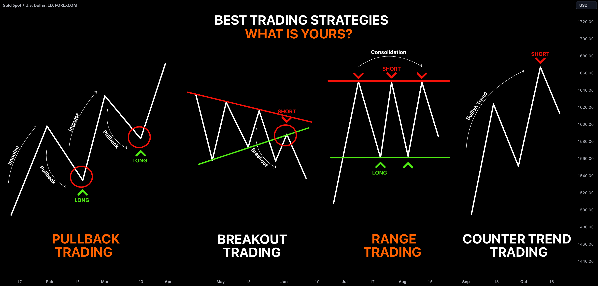

## Table of Contents

## What is TradingView and why is it used for trading strategies?

TradingView is a website and app where people can look at charts and data about stocks, cryptocurrencies, and other things they can trade. It's like a big online tool that helps traders see what's happening in the markets. People use it because it has lots of different charts and tools that make it easier to understand how prices are moving. You can also share your ideas and see what other traders are thinking about the markets.

Traders use TradingView for their trading strategies because it helps them make better decisions. They can use the charts and tools to find patterns and signals that tell them when to buy or sell. For example, if a trader sees a certain pattern on a chart, they might decide it's a good time to buy a stock. TradingView also lets traders test their strategies using old data to see if they would have worked in the past. This can help them feel more confident about using those strategies in the future.

## How do beginners start using TradingView for trading strategies?

Beginners can start using TradingView for trading strategies by first creating an account on the website or app. Once they're signed up, they should explore the platform to get familiar with it. They can start by looking at different charts for stocks, cryptocurrencies, or other assets they're interested in. TradingView has a lot of tools and indicators that can help beginners understand how prices are moving. They can play around with these tools to see what they do and how they can help in making trading decisions.

After getting comfortable with the platform, beginners should start learning about basic trading strategies. They can use TradingView's educational resources, like the built-in tutorials and the community's shared ideas, to learn more. It's a good idea to start with simple strategies and practice them using the platform's paper trading feature, which lets you trade without using real money. This way, beginners can test their strategies and see how they would work without risking any money. As they gain more experience, they can start trying out more complex strategies and eventually move to real trading.

## What are the basic components of a trading strategy on TradingView?

A trading strategy on TradingView has a few basic parts that help traders make decisions. The first part is the entry signal, which tells you when to buy or sell. This can be based on things like price patterns, moving averages, or other indicators. The second part is the exit signal, which tells you when to close your trade. This could be when you reach a certain profit or when the price moves against you too much. The third part is the risk management rules, which help you decide how much money to risk on each trade. This can include setting stop-loss orders to limit your losses.

Another important part of a trading strategy is the timeframe you're looking at. Are you trading based on daily charts, hourly charts, or even shorter timeframes? This can affect how you set your entry and exit signals. Lastly, you need to have a clear goal for your strategy. Are you trying to make quick profits, or are you looking to hold onto trades for a longer time? Knowing your goal helps you stick to your strategy and not get swayed by short-term market movements. By putting all these parts together, you can create a solid trading strategy on TradingView.

## How can I use indicators and overlays in TradingView to develop a strategy?

To develop a trading strategy using indicators and overlays on TradingView, start by choosing the right indicators that match your trading goals. Indicators like moving averages, RSI (Relative Strength Index), and MACD (Moving Average Convergence Divergence) can help you spot trends and momentum. For example, if you see the price crossing above a moving average, it might be a good time to buy. Overlays, like trend lines and Fibonacci retracement levels, can also help you see where the price might go next. By adding these tools to your chart, you can start to see patterns that tell you when to enter and exit trades.

Once you have your indicators and overlays set up, you can start testing your strategy. TradingView lets you look at past data to see how your strategy would have worked before. This is called backtesting. If your strategy looks good in the past, you can feel more confident using it in the future. Remember to keep adjusting your strategy as you learn more. Maybe you find that one indicator works better than another, or that you need to change your entry and exit signals. The key is to keep learning and tweaking your strategy until it works well for you.

## What are some common trading strategies available on TradingView for beginners?

One common trading strategy for beginners on TradingView is the Moving Average Crossover strategy. This strategy uses two moving averages, one short-term and one long-term. When the short-term moving average crosses above the long-term one, it's a signal to buy. When it crosses below, it's a signal to sell. This strategy is easy to understand and set up on TradingView. You just need to add the moving average indicators to your chart and watch for the crossovers.

Another simple strategy is the RSI (Relative Strength Index) strategy. The RSI measures how fast a stock's price is moving and if it's overbought or oversold. If the RSI goes above 70, it might mean the stock is overbought and could go down soon, so you might want to sell. If it goes below 30, it might mean the stock is oversold and could go up, so you might want to buy. On TradingView, you can add the RSI indicator to your chart and set alerts for when it hits these levels.

A third strategy beginners might try is the Trendline Breakout strategy. This involves drawing trendlines on your chart to see the direction of the price. If the price breaks above an upward trendline, it could be a good time to buy. If it breaks below a downward trendline, it might be a good time to sell. TradingView makes it easy to draw these lines and set alerts for when the price breaks them. This strategy helps beginners see the bigger picture of where the price is going.

## How do I backtest a trading strategy on TradingView?

To backtest a trading strategy on TradingView, first, you need to set up your strategy on the chart. Choose the indicators and overlays you want to use, like moving averages or RSI, and decide on your entry and exit signals. Once your strategy is set up, go to the "Strategy Tester" tab on the right side of the screen. Here, you can turn your strategy into a script that TradingView can test. You can use the Pine Script editor to write the code for your strategy if you want to get more detailed, but TradingView also has a lot of pre-made strategies you can use.

After setting up your strategy in the Strategy Tester, you can run the backtest. Click on the "Replay" button to see how your strategy would have worked in the past. TradingView will show you a report with details like how much money you would have made or lost, how many trades you would have made, and other important stats. You can change the time period for the backtest to see how your strategy works in different market conditions. If your strategy doesn't work well, you can go back and tweak it, then run the backtest again until you're happy with the results.

## What are the key metrics to look at when evaluating a strategy's performance?

When you're looking at how well your trading strategy did in the backtest, there are a few important numbers to check. One is the total profit or loss, which tells you how much money you would have made or lost if you used this strategy in the past. Another key number is the win rate, which shows the percentage of trades that made money. You also want to look at the average win and the average loss to see how big your wins and losses were. The risk-reward ratio is another important metric; it compares how much you could win to how much you could lose on each trade. Lastly, the maximum drawdown tells you the biggest drop in your account balance, which helps you understand the risk of the strategy.

It's also good to look at how often you would have traded with this strategy, which is called the trading frequency. A strategy that trades a lot might be more stressful and could cost more in fees. The Sharpe ratio is another useful number; it measures how much return you're getting for the risk you're taking. A higher Sharpe ratio means your strategy is doing a good job of balancing risk and reward. By looking at all these numbers together, you can get a good idea of how well your strategy might work in the future and if it fits with your trading goals and how much risk you're willing to take.

## How can I optimize a trading strategy on TradingView?

To optimize a trading strategy on TradingView, start by looking at the backtest results and figuring out what's working and what's not. If your strategy is making money but the wins are small and the losses are big, you might want to change your entry and exit signals to make your wins bigger or your losses smaller. You can also try different indicators or change the settings on the ones you're using. For example, if you're using moving averages, you might try different time periods to see if that makes your strategy work better. Keep running backtests with these changes until you find a setup that gives you good results.

Another way to optimize your strategy is to look at how it performs in different market conditions. You can do this by changing the time period of your backtest to see how your strategy would have done in bull markets, bear markets, and times when the market isn't moving much. If your strategy works well in some conditions but not others, you might need to add rules to your strategy to make it work better in all kinds of markets. Also, don't forget to check how often you're trading and how much risk you're taking. Sometimes, making small changes to these can make a big difference in how well your strategy works.

## What advanced features does TradingView offer for strategy development?

TradingView has some cool advanced features that can help you make your trading strategies even better. One of these is the Pine Script editor, which lets you write your own code for your strategies. This means you can make your strategies as simple or as complicated as you want. You can also use TradingView's built-in functions to do things like check if a certain condition is true or calculate how much money you might make or lose. Another neat feature is the ability to set up alerts. You can tell TradingView to send you a message or make a sound when your strategy says it's time to buy or sell. This can help you not miss any good trading chances.

Another advanced feature is the Strategy Tester, which lets you test your strategies on past data to see how they would have worked. You can change the time period you're looking at to see how your strategy does in different market conditions. TradingView also has a feature called "Replay," which lets you watch your strategy work in real-time on past data. This can help you see how your strategy would have played out day by day. Plus, TradingView has a big community where you can share your strategies and get ideas from other traders. This can help you learn new ways to make your strategies even better.

## How do I use Pine Script to create custom trading strategies?

To use Pine Script to create custom trading strategies on TradingView, you first need to open the Pine Script editor. You can find it by clicking on the "Pine Editor" button on the bottom of the screen. Once you're in the editor, you can start writing your strategy. Pine Script uses a simple language that's easy to learn, even if you've never coded before. You'll need to define your entry and exit signals using the indicators and conditions you want to use. For example, you might write a script that says to buy when the price crosses above a moving average and to sell when it crosses below. After you've written your script, you can add it to your chart and see how it works.

Once your strategy is set up, you can use the Strategy Tester to backtest it. This means you can see how your strategy would have worked in the past. You can change the time period to test it in different market conditions and see if it makes money or loses money. If your strategy doesn't work well, you can go back to the Pine Script editor and change your code to make it better. You might need to try different indicators or change the rules for when to buy and sell. Keep testing and tweaking your strategy until you're happy with how it performs.

## What are some expert-level strategies used by experienced traders on TradingView?

Experienced traders on TradingView often use complex strategies like the "Mean Reversion" strategy. This strategy is based on the idea that prices will eventually return to their average after moving too far away. Traders using this strategy might look at indicators like the Bollinger Bands, which show how far the price is from its average. When the price goes outside the bands, it might be a good time to buy or sell, expecting the price to come back to the middle. These traders also use other tools like the Relative Strength Index (RSI) to see if a stock is overbought or oversold. By combining these indicators, they can make more accurate predictions about when the price will revert to its mean.

Another expert-level strategy is the "Breakout Trading" strategy. This involves looking for times when the price breaks out of a certain range or pattern. Traders might use trend lines or chart patterns like triangles or flags to spot these breakouts. When the price breaks above a resistance level or below a support level, it could be a signal to buy or sell. Experienced traders often use volume indicators to confirm these breakouts, because a breakout with high volume is more likely to be real. They might also set up multiple timeframes to see if the breakout is happening on both short-term and long-term charts, making their strategy more reliable.

## How can I integrate TradingView strategies with external trading platforms?

To integrate TradingView strategies with external trading platforms, you can use TradingView's alert system. First, set up your trading strategy on TradingView and create alerts for your entry and exit signals. These alerts can send messages to your phone or email, but you can also use them to connect to external platforms. Many trading platforms have APIs (Application Programming Interfaces) that let you send orders automatically when you get an alert from TradingView. You'll need to find the right API for your trading platform and set it up to work with TradingView's alerts. This way, when your strategy says it's time to buy or sell, the alert can trigger an order on your external platform without you having to do it manually.

Another way to integrate TradingView strategies with external platforms is by using third-party services that act as a bridge between the two. Services like webhooks or trading bots can take the alerts from TradingView and turn them into orders on your trading platform. For example, you might use a service like Zapier or IFTTT to connect TradingView to your trading account. These services let you set up rules so that when TradingView sends an alert, it automatically triggers an action on your trading platform. This can be a bit more complicated to set up, but it gives you more flexibility and control over how your strategies work with external platforms.

## References & Further Reading

[1]: Bergstra, J., Bardenet, R., Bengio, Y., & Kégl, B. (2011). ["Algorithms for Hyper-Parameter Optimization."](https://dl.acm.org/doi/10.5555/2986459.2986743) Advances in Neural Information Processing Systems 24.

[2]: ["Advances in Financial Machine Learning"](https://www.amazon.com/Advances-Financial-Machine-Learning-Marcos/dp/1119482089) by Marcos Lopez de Prado

[3]: ["Evidence-Based Technical Analysis: Applying the Scientific Method and Statistical Inference to Trading Signals"](https://www.amazon.com/Evidence-Based-Technical-Analysis-Scientific-Statistical/dp/0470008741) by David Aronson

[4]: ["Machine Learning for Algorithmic Trading"](https://github.com/stefan-jansen/machine-learning-for-trading) by Stefan Jansen

[5]: ["Quantitative Trading: How to Build Your Own Algorithmic Trading Business"](https://books.google.com/books/about/Quantitative_Trading.html?id=j70yEAAAQBAJ) by Ernest P. Chan