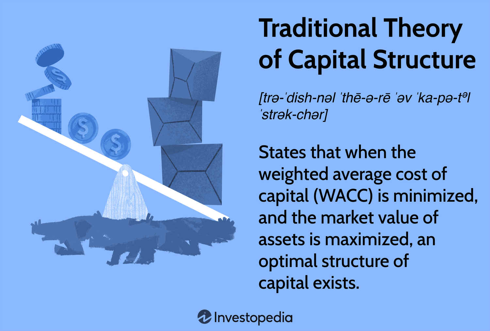

In today's dynamic financial landscape, understanding the interplay between financial management, capital structure, traditional theory, and algorithmic trading is crucial for informed decision-making. These components form the bedrock of modern financial strategies, each influencing the other significantly.

Financial management embodies the systematic planning, organizing, directing, and controlling of financial resources. This discipline is essential for optimizing both short-term and long-term investment decisions, guiding firms towards sustainable growth and value maximization. By mastering financial management practices, organizations can make sound investment choices, effectively manage cash flows, and analyze profitability to enhance overall performance.

Concurrently, the traditional theory of capital structure offers a foundational perspective on how firms finance their operations through a mix of debt and equity. This theory emphasizes the existence of an optimal capital structure that minimizes the Weighted Average Cost of Capital (WACC) and maximizes firm value. Despite its historical significance, the assumptions of the theory—such as market efficiency and rational behavior—have invited scrutiny and debate, especially regarding their applicability in contemporary markets.

Algorithmic trading represents a transformative force in modern finance, using sophisticated algorithms and data analysis to automate trading operations. This technological advancement has redefined traditional trading approaches, offering unparalleled speed, accuracy, and reduced human error. The emergence of algorithmic trading poses new challenges and opportunities for traditional financial theories, especially concerning market dynamics such as liquidity and volatility.

This article aims to explore the relationships and implications of these elements, examining how financial management practices and the traditional theory of capital structure are reshaped by algorithmic trading. The intersection of these components plays a vital role in financial decision-making and market dynamics, demanding a comprehensive understanding to navigate today's financial landscape effectively.

## Table of Contents

## Understanding Financial Management

Financial management is fundamental to the governance of any organization, encompassing a wide array of activities related to the planning, organization, direction, and control of financial enterprises. It plays a crucial role in an organization's strategic and operational decision-making. Primarily, financial management involves devising strategies that optimize the economic output of the organization, both in the short term and long term.

At the core of financial management are key components such as capital budgeting, cash flow management, and profitability analysis, each contributing significantly to the financial stability and growth of an organization.

### Capital Budgeting

Capital budgeting, also known as investment appraisal, is a vital process that facilitates long-term decision-making on investments in assets and projects. The aim is to allocate resources efficiently to projects that promise the best returns. Techniques such as Net Present Value (NPV), Internal Rate of Return (IRR), and payback period are typically employed to evaluate potential investments. The process involves predicting the future cash flows and profitability of projects, determining the scale and timing of investments, and ensuring that the organization is on a path to sustainable growth. 

$$

NPV = \sum \frac{{C_t}}{{(1 + r)^t}} - C_0 
$$

Where:
- $C_t$ = Net cash inflow during the period
- $r$ = Discount rate
- $t$ = Number of time periods
- $C_0$ = Initial investment cost

### Cash Flow Management

Cash flow management is the process of tracking, analyzing, and optimizing the net amount of cash receipts minus cash expenses. This component is critical for maintaining the [liquidity](/wiki/liquidity-risk-premium) necessary to meet the short-term obligations of the firm. Effective cash flow management ensures that a company has sufficient cash to support its daily operations and financial commitments. Techniques such as cash budgeting and the cash conversion cycle are tools that financial managers adopt to streamline cash flows and improve timing of cash inflows and outflows, thus minimizing deficiencies and optimizing surplus.

### Profitability Analysis

Profitability analysis involves assessing the company’s ability to generate earnings compared to its expenses over a specified period. This analysis is crucial for making informed operational and financial decisions that enhance the company's profit margins. Ratios such as Return on Assets (ROA), Return on Equity (ROE), and profit margin are commonly used metrics to gauge an organization's financial performance. The analysis aids in identifying areas of the business that are most profitable, facilitating strategic decisions that boost overall performance.

Implementing robust financial management strategies characterized by extensive capital budgeting, meticulous cash flow management, and precise profitability analysis can lead firms to sustainable growth and value maximization. These strategies enable an organization to allocate resources effectively, anticipate future financial needs, and mitigate risks in an ever-evolving economic landscape. By ensuring that financial resources are optimally deployed, organizations can enhance their ability to compete, adapt, and thrive in complex financial environments.

## Traditional Theory of Capital Structure

The traditional theory of capital structure posits that there exists an optimal balance between debt and equity that minimizes a firm's Weighted Average Cost of Capital (WACC) and therefore maximizes its value. This premise is rooted in the idea of financial leverage, which argues that while debt can amplify returns on equity, excessive debt levels may equally increase financial distress, thereby diluting overall firm value.

The mathematical representation of the WACC in its most basic form is:
$$

\text{WACC} = \frac{E}{V} \times r_E + \frac{D}{V} \times r_D \times (1 - T)
$$

where:
- $E$ is the market value of the equity
- $V$ is the total market value of equity and debt
- $r_E$ is the cost of equity
- $D$ is the market value of the debt
- $r_D$ is the cost of debt
- $T$ is the corporate tax rate

According to the traditional capital structure theory, a firm can lower its WACC by finding the optimal ratio of debt to equity. This is said to occur where the marginal return on debt equates to the marginal return on equity, ensuring that increases in leverage continue to outweigh the associated risks of higher interest costs and potential insolvency.

Critics of the traditional theory point to its assumptions, particularly regarding market conditions and rational investor behavior. It presumes perfect capital markets, in which there are no transaction costs, taxes, or asymmetries in information. Moreover, it assumes that firms and investors are rational actors who consistently seek to maximize value. However, real-world markets often exhibit [volatility](/wiki/volatility-trading-strategies) and irrational behavior that challenge these core assumptions.

Compounding these limitations, behavioral finance suggests that management's risk perceptions and strategic motivations can skew capital structure decisions. Market imperfections, such as agency costs and asymmetric information, further complicate the task of determining an optimal capital structure. These factors lead to ongoing discussions regarding the modern applicability of traditional capital structure theories and whether they adequately address the complexities of contemporary financial environments.

## Algorithmic Trading in Modern Finance

Algorithmic trading represents a significant advancement in modern finance, leveraging automated systems to execute trades in financial securities with remarkable efficiency. These systems rely heavily on sophisticated algorithms and exhaustive data analysis, which have reshaped the landscape of traditional trading methods.

One of the primary advantages of [algorithmic trading](/wiki/algorithmic-trading) is its incredible speed. Automated systems can process vast amounts of data and execute trades within fractions of a second, far surpassing human capabilities. This speed enables traders to capitalize on fleeting market opportunities, optimizing the timing and pricing of trades. In addition to speed, algorithmic trading enhances accuracy by minimizing the human errors that can arise from emotional decision-making or fatigue. Automated systems operate based on pre-defined criteria, executing trades only when specific market conditions are met, thereby reducing the impact of irrational behavior.

Moreover, algorithmic trading significantly impacts the liquidity and volatility of financial markets. By providing a continuous flow of buy and sell orders, these systems enhance market liquidity, making it easier for investors to enter or [exit](/wiki/exit-strategy) positions without large price disruptions. However, this increased activity can also contribute to heightened volatility, as rapid trades amplify short-term price movements.

These changes have notable implications for traditional theories of capital structure. For instance, the traditional theory suggests an optimal balance between debt and equity financing to minimize the Weighted Average Cost of Capital (WACC). However, the increased market efficiency and volatility driven by algorithmic trading can affect the marginal costs associated with these financing options. As market conditions become more dynamic, firms may need to reassess their capital structure strategies, considering how algorithmic trading influences the risk and return profiles of different financing methods.

In summary, algorithmic trading is a transformative force in modern finance, introducing new dimensions of speed, accuracy, and market influence. Its impact on liquidity, volatility, and capital structure requires a reassessment of traditional financial theories, ushering in an era where technology increasingly guides financial decision-making processes.

## Financial Management and Capital Structure in the Age of Algo Trading

The introduction of algorithmic trading into financial markets has significantly altered the landscape of financial management and capital structure strategies. Traditional financial theories, which have long provided the foundation for corporate finance decisions, now face the challenge of adapting to the rapid pace of technological advancement. Algorithmic trading, driven by AI and [machine learning](/wiki/machine-learning), presents new possibilities and complexities that influence financial decision-making at various levels.

AI-driven algorithmic strategies require a reassessment of financial management practices. With the ability to process vast amounts of data, algorithms can identify market patterns and predict price movements with high precision. This capability enhances decision-making processes, allowing for more accurate forecasting and improved investment strategies. As a result, firms must integrate these technologies within their financial operations to maintain a competitive edge. The challenge lies in adapting these AI technologies to align with the company's strategic goals while managing the associated risks.

Algorithmic trading also impacts capital structure strategies, chiefly by reshaping risk management and leverage decisions. The traditional theory of capital structure suggests maintaining an optimal mix of debt and equity to minimize the Weighted Average Cost of Capital (WACC). However, the speed and efficiency of algorithmic trading necessitate a rethinking of this balance. For instance, algorithms can rapidly adjust to changes in market conditions, potentially allowing firms to maintain higher leverage than previously considered prudent. This adaptability helps in managing risk exposure, but also demands robust monitoring systems to prevent excessive financial risk.

Moreover, the introduction of algorithms influences market liquidity and volatility, which, in turn, affect capital structure considerations. Increased liquidity, resulting from high-frequency trading, can lower transaction costs and enhance market efficiency. However, the potential for increased volatility needs to be carefully managed, as it can lead to significant shifts in asset pricing and market behavior. Firms must therefore develop sophisticated risk management frameworks to harness the benefits of algorithmic trading while mitigating its adverse effects.

Understanding these shifts is crucial for optimizing financial operations in an era dominated by technology. By embracing algorithmic trading, companies can achieve more dynamic and responsive capital structures tailored to the fast-paced market environment. However, it requires a careful balance between leveraging new technology and adhering to sound financial principles. Ultimately, the successful integration of algorithmic trading into financial management practices holds the potential to refine capital structure strategies and enhance overall firm value.

## Conclusion

The interplay between financial management, capital structure theories, and algorithmic trading is characterized by continuous evolution. This dynamic relationship is indicative of the ever-changing nature of financial markets, where the integration of strategic methodologies from these distinct areas can significantly enhance decision-making processes. The traditional theories, while offering foundational insights, must increasingly be viewed through the lens of technological advancements brought about by algorithmic trading.

The integration of technology in finance necessitates that professionals remain agile, adapting to new methodologies while maintaining an understanding of established theoretical frameworks. As algorithmic trading incorporates elements of [artificial intelligence](/wiki/ai-artificial-intelligence) and machine learning, it introduces complexities that challenge traditional assumptions about market behavior and efficiency. This requires a reevaluation of strategies and the development of new models that can accommodate these advancements.

Projected financial landscapes are likely to exhibit a synergistic blend of established theories, practical strategies, and cutting-edge technological innovation. Professionals who can synthesize these elements effectively will be well-positioned to navigate and capitalize on emerging opportunities. This convergence underscores the importance of continuous learning and adaptation, ensuring that financial strategies remain robust and relevant in an increasingly complex and tech-driven financial environment.

## References & Further Reading

[1]: Modigliani, F., & Miller, M. H. (1958). ["The Cost of Capital, Corporation Finance and the Theory of Investment."](https://www.jstor.org/stable/1812919) The American Economic Review, 48(3), 261-297.

[2]: Bodie, Z., Kane, A., & Marcus, A. J. (2014). ["Investments"](https://www.mheducation.com/highered/product/investments-bodie-kane/M9781264412662.html). McGraw-Hill Education.

[3]: Fabozzi, F. J., & Peterson Drake, P. (2009). ["Finance: Capital Markets, Financial Management, and Investment Management"](https://books.google.com/books/about/Finance.html?id=mUBsAwAAQBAJ). Wiley.

[4]: ["Algorithmic Trading: Winning Strategies and Their Rationale"](https://onlinelibrary.wiley.com/doi/pdf/10.1002/9781118676998.fmatter) by Ernest P. Chan

[5]: Hull, J. C. (2015). ["Options, Futures, and Other Derivatives"](https://www.amazon.com/Options-Futures-Other-Derivatives-9th/dp/0133456315). Prentice Hall.