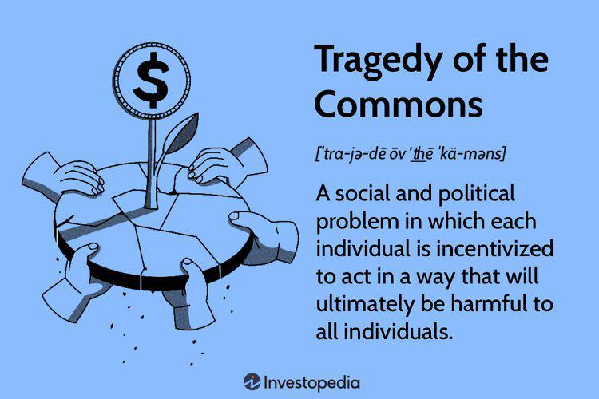

## Table of Contents

## What is the Tragedy of the Commons?

The Tragedy of the Commons is a situation where people use a shared resource too much, which harms it. Imagine a village with a common pasture where everyone can let their cows graze. If each person tries to get more from the pasture by adding more cows, the pasture can get overgrazed and ruined. No one person wants to stop because they worry others won't stop either, so everyone keeps adding cows until the pasture is destroyed.

This problem can happen with many things, like air, water, or fish in the ocean. When people don't have to pay for using these resources, they might use them too much without thinking about the future. To fix this, rules or limits can be set to make sure the resources are used wisely and last longer. If people work together and agree on how to share, they can prevent the tragedy from happening.

## Who coined the term 'Tragedy of the Commons'?

The term "Tragedy of the Commons" was coined by a man named Garrett Hardin. He was a biologist and philosopher who wrote about this idea in an article in 1968. In his article, he explained how people can ruin shared resources if they all try to use them too much.

Hardin used the example of a shared pasture to show how this tragedy happens. He said that if every farmer adds more cows to the pasture to get more milk and meat, the pasture can get overused and damaged. This problem can happen with many things, like clean air or fish in the ocean. Hardin's idea made people think about how to take care of shared resources so they last longer.

## Can you provide a simple example of the Tragedy of the Commons?

Imagine a small lake in a village where everyone can fish. At first, there are plenty of fish, and everyone can catch enough for their family. But then, people start thinking, "If I catch more fish, I'll have more to eat or sell." So, they start fishing more and more. Soon, everyone is doing the same thing, trying to catch as many fish as they can. The lake can't keep up with all the fishing, and the number of fish starts to go down.

Before long, the lake is almost empty of fish. People who used to rely on the lake for food now have to look elsewhere. The lake, which was once a shared resource that helped everyone, is now ruined because everyone tried to take too much from it. This is the Tragedy of the Commons – when people overuse a shared resource until it's gone, because no one wants to stop using it, thinking others won't stop either.

## How does the Tragedy of the Commons relate to economic theory?

The Tragedy of the Commons is an important idea in economics because it shows what can happen when people don't have to pay for using something that everyone shares. In economics, this is called a "common-pool resource." When people can use these resources for free, they might use them too much because they don't feel the cost of using them. This can lead to the resource being overused and damaged, which is bad for everyone in the long run. Economists study this problem to find ways to stop it from happening, like setting rules or making people pay for using the resource.

Economists also use the idea of the Tragedy of the Commons to think about how to manage resources better. They look at ways to make sure that people use shared resources in a way that keeps them around for the future. This might mean setting up rules about how much people can use, or finding ways to make people care more about the resource. By understanding the Tragedy of the Commons, economists can help create systems that protect shared resources and make sure they last longer for everyone to use.

## What are the main causes of the Tragedy of the Commons?

The main cause of the Tragedy of the Commons is that people don't have to pay for using shared resources. When something is free, people might use too much of it because they don't feel the cost. They might think, "If I use more, I'll get more for myself." But if everyone thinks this way, they all use too much, and the resource gets damaged or used up. This happens because no one person wants to use less, thinking others won't stop either.

Another cause is that people might not think about the future. They focus on what they can get right now, instead of thinking about how using too much now can hurt everyone later. For example, if people keep cutting down trees in a forest, they might not think about how their children won't have a forest to enjoy. This short-term thinking can lead to the resource being overused and ruined for everyone.

## What are some real-world examples of the Tragedy of the Commons?

One real-world example of the Tragedy of the Commons is overfishing in the ocean. The ocean is a shared resource that many countries and fishermen use. They all want to catch as many fish as they can to make money or feed their families. But if everyone keeps catching more and more fish, the number of fish in the ocean goes down. Soon, there aren't enough fish left for anyone. This has happened in many places around the world, where once-rich fishing areas are now empty because too many fish were taken out of the water.

Another example is air pollution. The air we breathe is a shared resource that everyone uses. When factories and cars release pollution into the air, it can make the air dirty and hard to breathe. Each factory or car owner might think, "If I pollute a little more, it won't make a big difference." But if everyone thinks this way, the air gets very polluted. This has happened in many big cities, where the air is so dirty that it makes people sick. If people don't work together to reduce pollution, the air can become a tragedy of the commons.

## How can the Tragedy of the Commons be mitigated or solved?

One way to stop the Tragedy of the Commons is to make rules about how people can use shared resources. For example, the government can set limits on how many fish people can catch from the ocean or how much pollution factories can put into the air. By making these rules, everyone has to follow them, and the shared resource can be used more carefully. This helps make sure that there will be enough fish or clean air for everyone in the future. Another way is to make people pay for using the resource. If people have to pay, they might use less of it because they want to save money. This can help stop the resource from being overused.

Another solution is for people to work together and agree on how to share the resource. If everyone in a village agrees to only take a certain number of fish from the lake each day, the lake can stay healthy. This needs everyone to trust each other and follow the agreement. Sometimes, groups can set up their own rules and watch each other to make sure no one is using too much. By working together, people can take care of the shared resource and prevent it from being ruined.

In some cases, turning a shared resource into something that someone owns can help. If a person or a company owns a forest, they might take better care of it because they want it to last. They can make money from the forest over many years if they cut down trees slowly and let new ones grow. This way, the resource is used more carefully, and the tragedy of the commons can be avoided. It's all about finding ways to make sure that everyone uses shared resources wisely so they last for a long time.

## What role does government regulation play in addressing the Tragedy of the Commons?

Government regulation plays a big role in stopping the Tragedy of the Commons. When the government makes rules about how people can use shared resources, it helps make sure that everyone uses them carefully. For example, the government can set limits on how many fish people can catch from the ocean or how much pollution factories can put into the air. These rules help stop people from using too much of the resource, which can keep it from being overused and ruined. By making sure everyone follows the same rules, the government helps protect shared resources for the future.

Another way the government can help is by making people pay for using the resource. When people have to pay, they might use less of it because they want to save money. This can help stop the resource from being overused. For example, if the government makes factories pay for the pollution they create, the factories might find ways to pollute less. By using these kinds of rules and payments, the government can help make sure that shared resources are used wisely and last longer for everyone to use.

## How does privatization affect the Tragedy of the Commons?

Privatization can help stop the Tragedy of the Commons. When a shared resource is owned by someone, they might take better care of it. For example, if a person owns a forest, they can make money from the trees over many years if they cut them down slowly and let new ones grow. This way, the owner has a reason to keep the forest healthy. If the forest was shared and everyone could cut down trees, people might take too many trees too quickly, and the forest could be ruined.

But privatization is not always the answer. Sometimes, it can make things worse if the owner doesn't care about the resource or just wants to make money fast. For example, if someone buys a lake and starts letting people fish as much as they want for a fee, the lake could still be overfished. It's important that the owner has rules and cares about keeping the resource healthy. So, privatization can help, but it needs to be done in a way that makes sure the resource is used wisely and lasts for the future.

## What are the criticisms of the Tragedy of the Commons theory?

Some people say that the Tragedy of the Commons theory doesn't always show how people really act. They think it's too simple and doesn't think about how people can work together to take care of shared things. In real life, communities often make their own rules to make sure everyone uses resources wisely. For example, villages might agree on how much fish to take from a lake so it doesn't get empty. These rules can help keep the resource healthy, even if it's shared by many people.

Another criticism is that the theory can make people think that the only way to fix the problem is by making things private or having the government control them. But some say this isn't always the best way. They think that people can manage shared resources well if they talk and agree on how to use them. By working together, communities can find ways to use resources without ruining them. So, the Tragedy of the Commons might not happen if people work together and care about the future.

## How does the concept of the Tragedy of the Commons apply to global commons like the atmosphere and oceans?

The Tragedy of the Commons applies to global commons like the atmosphere and oceans because these are shared resources that everyone can use. When countries or companies pollute the air or overfish the oceans, they might think, "If I use a little more, it won't make a big difference." But if everyone thinks this way, the air can get very dirty, and the number of fish in the oceans can go down a lot. This is a problem because the atmosphere and oceans are important for everyone's health and food. If they get ruined, it can hurt people all over the world.

To stop the Tragedy of the Commons from happening with global commons, countries need to work together. They can make rules about how much pollution is allowed or how many fish can be caught. For example, many countries have agreed on rules to reduce greenhouse gases to stop the air from getting too dirty. They also set limits on fishing to keep the oceans healthy. By working together and following these rules, countries can help make sure that the atmosphere and oceans stay good for everyone to use now and in the future.

## What advanced economic models or theories have been developed to address the Tragedy of the Commons?

One advanced economic model that helps address the Tragedy of the Commons is called "Coase Theorem." This idea, named after economist Ronald Coase, says that if people can talk to each other and make deals easily, they can solve problems with shared resources. For example, if two farmers are using the same pasture and one's cows are eating too much grass, they can agree on how to share the pasture better. The key is that they need to be able to talk and make deals without too much trouble. If they can do this, they can find a way to use the resource wisely without needing strict rules from the government.

Another important theory is "Ostrom's Principles," developed by Elinor Ostrom. She studied how communities can manage shared resources well without them being owned by one person or controlled by the government. Ostrom found that communities can make their own rules to take care of things like forests or lakes. Her principles include things like making sure everyone agrees on the rules, having ways to watch and make sure people follow the rules, and having ways to solve problems when they come up. By following these principles, communities can stop the Tragedy of the Commons from happening and keep shared resources healthy for everyone to use.

## What is the Tragedy of the Commons and how can we understand it?

The "Tragedy of the Commons" describes a situation where individuals, driven by self-interest, overconsume and deplete shared resources, ultimately harming the collective welfare. The concept gained prominence through Garrett Hardin's seminal essay published in 1968, which highlighted how unregulated common resources are vulnerable to overuse and eventual exhaustion. At its core, the tragedy arises from the disconnect between individual incentives and collective outcomes, where each user gains immediate benefits from exploiting the resource while the negative consequences of depletion are distributed across the entire group.

Hardin's theory serves as a pivotal framework for understanding various environmental and economic challenges where commons are involved. A classic example is overfishing in international waters, where the lack of enforceable property rights or regulations leads to fish stocks being harvested beyond sustainable levels. As each fishing entity seeks to maximize its catch without considering the long-term availability of the resource, the fish population declines, eventually threatening the viability of the fishery and the livelihoods dependent on it.

Another illustrative case is the overgrazing of public lands. When multiple herders graze their animals on a shared pasture, each is motivated to increase the size of their herd to boost personal profit. However, if all herders follow this logic, the pasture becomes overgrazed, reducing its ability to regenerate and support livestock in the future. This overexploitation results in the degradation of the pasture, thereby diminishing its value for everyone.

The tragedy of the commons underscores the necessity for mechanisms—whether they be governmental regulations, community-managed systems, or market-based solutions—that align individual incentives with sustainable collective outcomes. By regulating access and usage or by assigning property rights, these approaches can help prevent the depletion of resources, ensuring their availability for future generations.

Mathematically, the tragedy can be analyzed using game theory. A simple representation involves a common-pool resource game where the payoff for each player (individual) is a function of both their usage and the total usage by all players. Let $U_i$ represent the utility of player $i$, and $x_i$ be their level of resource use. The utility function might be modeled as:

$$
U_i = f(x_i, X)
$$

where $X = \sum_{j} x_j$ is the total exploitation of the resource. The tragedy of the commons arises when the derivative of the utility with respect to an individual's resource use, holding others' use constant, is positive:

$$
\frac{\partial U_i}{\partial x_i} > 0
$$

while the derivative with respect to total use is negative:

$$
\frac{\partial U_i}{\partial X} < 0
$$

This suggests that while individual use increases private utility, the overall impact on the collective resource is detrimental, leading to reduced utility for all. Addressing this imbalance through appropriate policy interventions is crucial for the sustainable management of shared resources.

## How does Economic Theory relate to Resource Allocation?

Economics offers a structured approach to understanding and managing resources, ensuring their sustainable use over time. At the heart of this endeavor is resource allocation, a critical process that influences both immediate economic gains and the long-term viability of economic systems. 

Resource allocation involves the distribution of available resources among various possible uses and is a central concern in economics. Effective resource allocation aims to maximize utility and efficiency while avoiding waste. Decisions made in this process directly impact profitability in the short term. Businesses, for example, must allocate resources wisely to remain competitive and profitable, whether by optimizing the supply chain, investing in technology, or deploying labor efficiently.

Long-term sustainability, however, requires balancing current economic benefits with the preservation of resources for future use. This notion is particularly relevant when considering environmental and communal resources, where over-exploitation can lead to depletion, negatively impacting long-term economic stability.

The interplay of supply and demand further complicates resource allocation within competitive markets. Demand refers to the quantity of a good or service consumers are willing and able to purchase at various prices, while supply represents how much the market can offer at those prices. The law of supply and demand dictates that an increase in demand, with a constant supply, generally leads to higher prices. Conversely, an increase in supply, with a constant demand, results in lower prices. 

$$
\text{Price Elasticity of Demand} = \frac{\%\text{ change in quantity demanded}}{\%\text{ change in price}}
$$

This elasticity affects how resources are allocated because it determines how responsive the quantity demanded is to a price change. In highly elastic markets, small price changes cause significant demand shifts, leading to substantial reallocation of resources. In contrast, inelastic markets react less dramatically, often requiring more strategic adjustments in resource use.

Efficient resource allocation is vital to achieving equilibrium, where the quantity demanded equals the quantity supplied. This equilibrium ensures optimal pricing and utilization of resources, forming the backbone of economic theory. Market forces naturally drive towards this balance, but external interventions such as government policies, technological advancements, and shifts in consumer behavior can create deviations. 

Advanced economic models and computational techniques, including [algorithmic trading](/wiki/algorithmic-trading), have begun to revolutionize how resource allocation decisions are made. These systems use mathematical algorithms and real-time data analysis to optimize trading strategies, ultimately influencing how capital and resources are distributed across financial markets.

Economics continues to evolve, integrating traditional theories of resource allocation with innovative technological solutions to address both emerging and longstanding challenges in sustainable resource management.

## What is the Tragedy of the Commons in Financial Markets?

Financial markets, much like common-pool resources, operate on shared elements crucial to their functioning, such as [liquidity](/wiki/liquidity-risk-premium) and market access. In these markets, liquidity represents the ease with which assets can be bought or sold without causing significant price movement. Market access refers to the ability of participants to engage in trading with minimal barriers. Much like traditional commons, these resources face the risk of overexploitation and depletion due to unregulated use, particularly when subjected to intense activity from algorithmic trading.

Algorithmic trading, employing sophisticated computer algorithms, executes trades at speeds and frequencies beyond human capability. This high-speed trading can strain market resources by rapidly depleting liquidity. As algorithms react to market signals and execute trades en masse, the available liquidity can diminish swiftly, leading to increased [volatility](/wiki/volatility-trading-strategies) and potentially destabilizing the market. This scenario echoes the tragedy of the commons, where individual pursuits of profit can collectively result in adverse market conditions.

The depletion of liquidity in such a rapid manner can trigger a cascade of price swings, as other market participants may face difficulty entering or exiting positions at their target prices. This can lead to wider bid-ask spreads, where the difference between buying and selling prices increases, indicating reduced market efficiency. Furthermore, during times of market stress, the impact of algorithmic trading on liquidity can exacerbate panic selling or buying, intensifying already volatile conditions.

To illustrate, consider a situation where multiple algorithmic trading systems detect a specific market opportunity simultaneously. As each algorithm acts on this opportunity, they consume available liquidity, potentially leading to a liquidity drought. This situation can result in extreme price movements, as described mathematically by the volatility formula, where $\sigma$ is the volatility, $P_t$ is the asset price at time $t$, and $n$ is the number of price observations:

$$
\sigma = \sqrt{\frac{\sum_{t=1}^{n}(P_t - \bar{P})^2}{n-1}}
$$

where $\bar{P}$ is the mean price.

The above formula indicates how fluctuations in asset prices increase overall market volatility, reflecting the fragility of liquidity as a shared resource. Such rapid consumption of liquidity is akin to overgrazing in a pasture, where individual cattle owners act in their own interest, depleting the grass and ultimately harming the entire community. Similarly, the unchecked speed and [volume](/wiki/volume-trading-strategy) of algorithmic trading can strip financial markets of their vital liquidity, leading to instability and inefficiency, underscoring the need for balanced regulation and innovative solutions to maintain market health.

## References & Further Reading

[1]: Hardin, G. (1968). "The Tragedy of the Commons." *Science*, 162(3859), 1243-1248. [DOI: 10.1126/science.162.3859.1243](https://www.science.org/doi/10.1126/science.162.3859.1243)

[2]: Easley, D., López de Prado, M. M., & O'Hara, M. (2012). "The volume clock: Insights into the high-frequency paradigm." *The Journal of Portfolio Management,* 39(1), 19-29. [DOI: 10.3905/jpm.2012.39.1.019](https://www.semanticscholar.org/paper/The-Volume-Clock%3A-Insights-into-the-High-Frequency-Easley-Prado/c56c19929ea91468852ff183b677b8f1169b5ca8)

[3]: Biais, B., Foucault, T., & Moinas, S. (2015). "Equilibrium high-frequency trading." *Journal of Financial Economics,* 116(2), 292-313. [DOI: 10.1016/j.jfineco.2015.03.004](https://www.sciencedirect.com/science/article/abs/pii/S0304405X15000288)

[4]: MacKenzie, D. (2015). "Trading at the speed of light: how markets became unstable." *Scientific American,* 313(5), 72-77. [DOI: 10.1038/scientificamerican1115-72](https://www.academia.edu/113394875/Pacific_walrus_Odobenus_rosmarus_survey_results_near_Cape_Inchoun_Chukchi_Sea_haulout_2017)

[5]: Aldridge, I. (2010). ["High-Frequency Trading: A Practical Guide to Algorithmic Strategies and Trading Systems"](https://www.ahmetbeyefendi.com/wp-content/uploads/2020/07/High-Frequency-Trading-Irene-Aldridge.pdf). Wiley.

[6]: Lopez de Prado, M. (2018). ["Advances in Financial Machine Learning"](https://www.amazon.com/Advances-Financial-Machine-Learning-Marcos/dp/1119482089). Wiley.

[7]: Chan, E. P. (2009). ["Quantitative Trading: How to Build Your Own Algorithmic Trading Business"](https://github.com/ftvision/quant_trading_echan_book). Wiley.