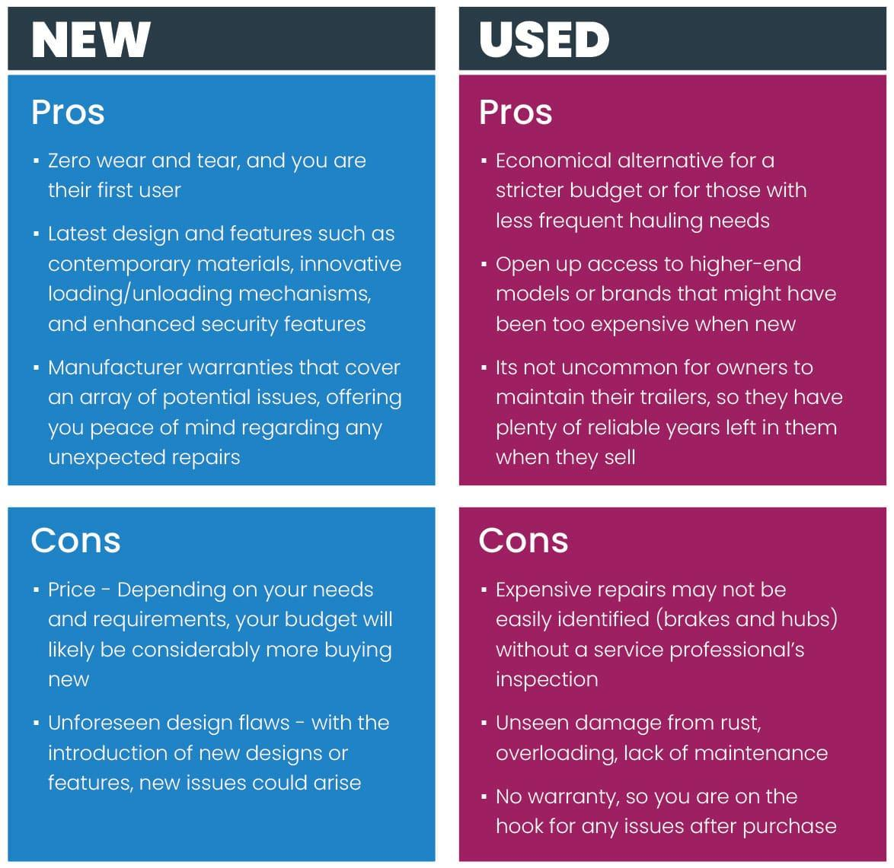

## Table of Contents

## What are trailer fees?

Trailer fees are payments that mutual fund companies make to financial advisors or brokers. These fees are a way to thank the advisors for recommending their funds to clients. The fees come out of the fund's management expense ratio, which means they are indirectly paid by the investors in the fund.

These fees are usually a percentage of the total amount of money that clients have invested in the fund. For example, if a client has $10,000 invested in a fund with a trailer fee of 1%, the advisor would get $100 per year. Trailer fees can help advisors cover the costs of giving advice and managing client accounts, but they can also create a conflict of interest because advisors might be more likely to recommend funds that pay higher trailer fees.

## How do trailer fees work?

Trailer fees are payments that mutual fund companies give to financial advisors or brokers. These payments are a way to say thank you for recommending their funds to clients. The money for these fees comes from the fund's management expense ratio, which means that investors in the fund indirectly pay for them. The fees are usually a small percentage of the total amount of money that clients have invested in the fund.

For example, if a client has $10,000 invested in a fund with a trailer fee of 1%, the advisor would receive $100 each year. These fees help advisors cover the costs of giving advice and managing client accounts. However, trailer fees can also create a problem because advisors might choose to recommend funds that pay them more, even if those funds are not the best choice for their clients.

## Who typically pays trailer fees?

Trailer fees are paid by the mutual fund companies, but the money comes from the investors in the fund. This happens because the fees are taken out of the fund's management expense ratio. So, when investors buy shares in a mutual fund, a small part of their investment goes towards paying these fees.

These fees are given to financial advisors or brokers as a way to thank them for recommending the fund to their clients. The amount of the trailer fee is usually a small percentage of the total money that clients have invested in the fund. For example, if a client has $10,000 in a fund with a 1% trailer fee, the advisor gets $100 each year.

## What is the purpose of trailer fees?

Trailer fees are payments that mutual fund companies give to financial advisors or brokers. The main purpose of these fees is to thank the advisors for recommending their funds to clients. When advisors suggest a particular fund, it helps the fund company grow because more people invest in it. So, the trailer fee is like a reward for the advisor's help in bringing in more investors.

The money for trailer fees comes from the fund's management expense ratio, which means it is indirectly paid by the investors in the fund. This fee is usually a small percentage of the total amount of money that clients have invested. For example, if a client has $10,000 in a fund with a 1% trailer fee, the advisor gets $100 each year. While trailer fees can help advisors cover the costs of giving advice and managing client accounts, they can also create a conflict of interest. Advisors might be more likely to recommend funds that pay higher trailer fees, even if those funds might not be the best choice for their clients.

## How are trailer fees calculated?

Trailer fees are calculated as a percentage of the total amount of money that clients have invested in a mutual fund. For example, if a client has $10,000 invested in a fund with a trailer fee of 1%, the financial advisor would receive $100 each year. This percentage is set by the mutual fund company and can vary from one fund to another.

The money for trailer fees comes from the fund's management expense ratio. This means that investors in the fund indirectly pay for these fees. So, when someone buys shares in a mutual fund, a small part of their investment goes towards paying the trailer fee to the advisor who recommended the fund.

## What are the advantages of trailer fees for investors?

Trailer fees can help investors by making it easier for them to get advice from financial advisors. Since advisors get paid a small part of the money invested in the fund, they can use this money to cover the costs of giving advice and managing client accounts. This means that investors might not have to pay extra fees for financial advice because the trailer fee helps cover those costs.

However, trailer fees can also have some downsides for investors. Because advisors get paid more for recommending funds with higher trailer fees, they might not always suggest the best fund for the investor. Instead, they might choose a fund that pays them more, even if it's not the best choice for the investor's needs. So, while trailer fees can make financial advice more affordable, they can also lead to conflicts of interest that might not be good for the investor.

## What are the disadvantages of trailer fees for investors?

Trailer fees can be a problem for investors because they might not get the best advice. Since advisors get paid more for recommending funds with higher trailer fees, they might choose those funds even if they are not the best fit for the investor's needs. This can lead to a situation where the advisor's interests are put before the investor's interests, which is not good for the investor.

Also, trailer fees come out of the fund's management expense ratio, which means investors are indirectly paying for them. This can make the overall cost of investing in the fund higher than it seems. Even though the fees help advisors cover their costs, investors might end up paying more than they expect, which can eat into their investment returns over time.

## How do trailer fees impact the performance of an investment?

Trailer fees can make the overall cost of investing in a mutual fund higher. These fees are taken out of the fund's management expense ratio, which means that investors are indirectly paying for them. When the costs go up, the returns on the investment can go down. For example, if a fund earns a 5% return but has a 1% trailer fee, the investor only gets to keep 4% after the fee is taken out. Over time, even small fees can add up and reduce the amount of money an investor makes.

Another way trailer fees can impact investment performance is by affecting the advice investors get. Since financial advisors earn more from funds with higher trailer fees, they might recommend those funds even if they are not the best choice for the investor. This means the investor might end up with a fund that doesn't match their goals or risk level, which can hurt their investment performance. So, it's important for investors to understand how trailer fees work and how they might influence the advice they receive.

## Are trailer fees regulated, and if so, how?

Trailer fees are regulated to help make sure they are fair and clear to everyone. In many countries, financial regulators have rules about how much trailer fees can be and how they need to be shown to investors. For example, in Canada, the Canadian Securities Administrators (CSA) have rules that say trailer fees can't be paid on certain types of accounts, like fee-based accounts, to avoid conflicts of interest. This means that if an advisor charges a fee for their advice, they can't also get a trailer fee from the fund.

In the United States, the Securities and Exchange Commission (SEC) keeps an eye on trailer fees to make sure they are shown clearly in the fund's documents. The SEC wants investors to know about all the costs, including trailer fees, so they can make smart choices about where to put their money. These rules help make sure that trailer fees don't hide other costs and that investors get the full picture of what they are paying for.

## How do trailer fees compare to other types of fees in investment products?

Trailer fees are just one type of fee that investors might see when they put their money into investment products like mutual funds. Another common fee is the management expense ratio (MER), which covers the costs of running the fund, like paying the fund manager and other operating expenses. Unlike trailer fees, which go to financial advisors, the MER goes to the fund company. Both fees can make the total cost of investing higher, but they serve different purposes: trailer fees are a way to thank advisors for recommending the fund, while the MER pays for the fund's day-to-day operations.

There are also front-end and back-end loads, which are fees investors pay when they buy or sell shares in a fund. A front-end load is charged when you buy the fund, and a back-end load is charged when you sell it. These fees are different from trailer fees because they are one-time charges, not ongoing like trailer fees. Front-end and back-end loads can make it more expensive to get into or out of a fund, while trailer fees keep going as long as the money stays in the fund. Each type of fee can affect how much money an investor ends up with, so it's important to understand them all when choosing where to invest.

## What are the ethical considerations surrounding trailer fees?

Trailer fees can create a big problem because they might make financial advisors choose funds that pay them more money, not the ones that are best for their clients. This is called a conflict of interest. When advisors get paid more for suggesting certain funds, they might not give the best advice. This can be unfair to investors who trust their advisors to help them make good choices about their money.

To deal with this problem, some countries have rules about trailer fees. These rules try to make sure that advisors give good advice and that investors know about all the fees they are paying. But even with these rules, it's still important for investors to be careful and ask questions about why their advisor is recommending a certain fund. By understanding trailer fees and how they work, investors can make better choices and protect their money.

## How have trailer fees evolved over time, and what might future trends look like?

Trailer fees have changed a lot over the years. At first, they were a big part of how financial advisors got paid. Advisors liked them because they got a steady stream of money just for recommending certain funds. But as time went on, people started to see that trailer fees could be a problem. They made advisors want to suggest funds that paid more, even if those funds weren't the best for their clients. So, rules started to change. In some places, like Canada, new laws said that trailer fees couldn't be paid on certain types of accounts. This was to make sure advisors were giving good advice, not just trying to make more money.

Looking ahead, trailer fees might keep changing. More and more, people are talking about being clear about all the costs of investing. This means that future rules might make it even harder for advisors to get trailer fees, or they might have to tell their clients about them in a very clear way. Also, as more people learn about investing on their own, they might choose funds that don't have trailer fees at all. This could make funds without trailer fees more popular. In the end, the goal is to make sure that investors get the best advice and keep as much of their money as possible.

## What is the future of investment strategies?

As technology continues to advance, the role of algorithmic trading (algo trading) in fund management is expected to become more pronounced, offering fresh strategies and insights for investors. Algo trading, characterized by its ability to execute trades at high speeds and volumes based on pre-set criteria, provides a competitive edge through precision and efficiency. This technology is particularly impactful in optimizing transaction costs, which in turn can enhance fund performance.

The increased integration of algo trading in investment strategies underlines the importance of understanding both the technology itself and related financial incentives, such as trailer fees. Trailer fees, as commissions paid to advisors, can introduce potential conflicts of interest. Therefore, investors must be vigilant in acknowledging these fees when evaluating fund options.

Investment fund managers and investors are tasked with balancing these tools to maximize returns while managing associated risks and costs. The relationship can be expressed as a function of return maximization, $R$, with constraints on cost, $C$, and risk, $\sigma$. A simplified model could be represented as:

$$
\text{Maximize } R = f(\text{Algo Trading, Trailer Fees})
$$
$$
\text{Subject to: } C(\text{Algo Trading}) \leq \text{Budget}
$$
$$
\sigma(\text{Investment}) \leq \text{Risk Tolerance}
$$

Python, as a versatile programming language, can be employed to simulate and optimize such strategies. A basic example of calculating potential returns while considering transaction costs could look like the following:

```python
def calculate_return(investment, transaction_cost, potential_gain):
    net_gain = (investment * potential_gain) - transaction_cost
    return net_gain

investment = 100000  # Example investment amount
transaction_cost = 200  # Example transaction cost
potential_gain_percentage = 0.05  # Example potential gain (5%)

net_return = calculate_return(investment, transaction_cost, potential_gain_percentage)
print(f"Net Return on Investment: ${net_return}")
```

In this script, the function `calculate_return()` takes into account the transaction cost offsets against potential gains, an essential consideration when using algo trading.

Ultimately, the future of investment strategies will require an adept integration of technology with a pragmatic understanding of fees and market dynamics. Staying informed about such developments enables investors to navigate the complexities of modern financial markets, effectively leveraging the synergies of algo trading and traditional investment incentives.

## References & Further Reading

[1]: ["Advances in Financial Machine Learning"](https://www.amazon.com/Advances-Financial-Machine-Learning-Marcos/dp/1119482089) by Marcos Lopez de Prado

[2]: ["The Investor's Guidebook: Fund of Funds Investment"](https://www.wiley.com/en-us/Hedge+Fund+of+Funds+Investing%3A+An+Investor%27s+Guide-p-9781576601242) by Stuart R. Veale

[3]: ["Machine Learning for Algorithmic Trading"](https://github.com/stefan-jansen/machine-learning-for-trading) by Stefan Jansen

[4]: ["Quantitative Trading: How to Build Your Own Algorithmic Trading Business"](https://www.amazon.com/Quantitative-Trading-Build-Algorithmic-Business/dp/1119800064) by Ernest P. Chan

[5]: ["Evidence-Based Technical Analysis: Applying the Scientific Method and Statistical Inference to Trading Signals"](https://www.amazon.com/Evidence-Based-Technical-Analysis-Scientific-Statistical/dp/0470008741) by David Aronson