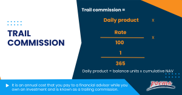

## Table of Contents

## What is a trailing commission?

A trailing commission is a type of payment that financial advisors or brokers receive for managing an investment over time. It is usually a percentage of the assets they manage and is paid regularly, often annually or quarterly. This kind of commission encourages the advisor to keep the client's investment performing well, as their payment depends on the value of the assets.

Trailing commissions are common in mutual funds and other investment products. They are different from upfront commissions, which are paid when an investment is first made. With trailing commissions, the advisor gets paid as long as the client keeps their money in the investment, providing an ongoing incentive to maintain a good relationship with the client and manage their funds effectively.

## How does a trailing commission differ from other types of commissions?

A trailing commission is different from other types of commissions because it is paid over time, not just once at the start. With a trailing commission, the financial advisor or broker gets a small percentage of the money they manage, and this payment comes regularly, like every year or every few months. This means that as long as the client keeps their money in the investment, the advisor keeps getting paid. It's a way to make sure the advisor wants to keep the investment doing well, because their pay depends on how much the investment is worth.

Other types of commissions, like upfront commissions, are paid just one time when the investment is made. For example, if someone buys a mutual fund, the advisor might get a big payment right away. After that, they don't get any more money from that specific investment. This can be good for the advisor because they get their money quickly, but it doesn't give them a reason to keep helping the client after the initial sale. Trailing commissions, on the other hand, help build a long-term relationship between the client and the advisor, because the advisor's pay keeps coming as long as the client stays invested.

## Who typically pays the trailing commission?

The company that manages the investment, like a mutual fund company, usually pays the trailing commission. They take a small part of the money that investors put into the fund and use it to pay the financial advisors or brokers who sold the fund to the investors.

This payment comes from the fees that investors pay to be part of the fund. So, in a way, the investors are the ones who end up paying for the trailing commission, even though it's the investment company that actually sends the money to the advisors.

## What is the average percentage rate of a trailing commission?

The average percentage rate of a trailing commission can vary a lot, but it's usually between 0.25% and 1% of the total amount of money being managed. This means if someone has $100,000 invested, the advisor might get between $250 and $1,000 each year as a trailing commission.

Different types of investments and different companies can have different rates. For example, mutual funds might have a different trailing commission rate than other kinds of investments. It's important for people to know what rate they're paying because it comes out of their investment money.

## How is the percentage of a trailing commission determined?

The percentage of a trailing commission is decided by the company that manages the investment, like a mutual fund company. They set the rate based on what they think is fair and what other companies are doing. Sometimes, they might make the rate higher to attract more advisors to sell their products, or they might lower it to keep their fees down for investors. The company looks at how much it costs them to manage the fund, how much profit they want to make, and what investors are willing to pay.

This rate can also change depending on the type of investment. For example, a mutual fund might have a different trailing commission rate than a different kind of investment product. The company might offer different rates for different funds they manage, too. It's all about finding a balance that works for the company, the advisors, and the investors. So, the percentage of a trailing commission is a mix of what the market will accept, the company's costs, and how they want to pay their advisors.

## Can the percentage of a trailing commission change over time?

Yes, the percentage of a trailing commission can change over time. The company that manages the investment, like a mutual fund company, can decide to change the rate. They might do this if they want to make their investment products more attractive to advisors or if they need to adjust their fees because of changes in the market or their costs.

When the percentage changes, it can affect both the advisors and the investors. If the rate goes up, advisors might get more money for managing the same amount of investments, but this could also mean higher costs for investors. If the rate goes down, advisors might earn less, but investors might pay less in fees. It's important for investors to keep an eye on these changes because they can impact how much they end up paying over time.

## What are the potential benefits of a trailing commission for financial advisors?

Trailing commissions give financial advisors a steady income over time. Instead of getting all their money at once when they sell an investment, they get paid a little bit every year or every few months. This means they don't have to worry about finding new clients all the time because they keep earning from the clients they already have. It makes their income more predictable and helps them plan their finances better.

Another benefit is that trailing commissions encourage advisors to keep their clients happy. Since they get paid as long as the client keeps their money in the investment, advisors have a reason to keep in touch with their clients and make sure their investments are doing well. This can help build long-term relationships and trust, which is good for both the advisor and the client.

## What are the potential drawbacks of a trailing commission for investors?

One potential drawback of a trailing commission for investors is that it can make their investment more expensive. The money for the trailing commission comes out of the fees that investors pay to be part of the investment. So, if the trailing commission is high, it means investors are paying more over time, which can reduce the amount of money they make from their investment.

Another issue is that trailing commissions might encourage financial advisors to keep investors in the same investment, even if there might be better options out there. Since advisors get paid as long as the investor stays in the investment, they might not suggest switching to something else, even if it would be better for the investor. This can stop investors from getting the best possible returns on their money.

## How can investors identify if they are paying a trailing commission?

Investors can find out if they are paying a trailing commission by looking at the documents they get when they buy an investment, like a mutual fund. These documents, called prospectuses or fund fact sheets, have all the details about the fees and costs. If there's a section about ongoing fees or management fees, it might include a trailing commission. Investors should look for words like "trailing commission," "ongoing commission," or "management fee" to see if they are paying one.

Another way to check is to talk to their financial advisor or the company that manages the investment. Investors can simply ask if there's a trailing commission and how much it is. The advisor or company should be able to explain it clearly. Knowing about trailing commissions helps investors understand how much they're really paying for their investments and whether it's worth it.

## What strategies can investors use to avoid or minimize trailing commissions?

Investors can choose investments that don't have trailing commissions. Some mutual funds and other investment products have lower fees or no trailing commissions at all. These are often called "no-load" funds or "fee-only" funds. By picking these kinds of investments, investors can keep more of their money instead of paying it out in fees. They can look for these options by reading the fund's prospectus or talking to their financial advisor about low-cost investment choices.

Another way to minimize trailing commissions is to work with fee-only financial advisors. These advisors charge a flat fee or a percentage of the assets they manage, but they don't get paid through commissions. This means they might suggest investments that are better for the investor, not just ones that pay them more. Investors can find fee-only advisors by searching online or asking for recommendations from friends and family. By choosing a fee-only advisor, investors can avoid the ongoing costs of trailing commissions and potentially get advice that's more focused on their needs.

## Are there regulatory considerations or changes regarding trailing commissions that investors should be aware of?

Yes, there are some important regulatory changes that investors should know about when it comes to trailing commissions. In some places, like Canada, regulators have made rules to stop the use of trailing commissions in certain situations. For example, they might not be allowed if the client has a fee-based account where they pay the advisor directly. This is because regulators want to make sure that advisors are giving advice that's best for the client, not just what earns them more money.

These changes are meant to help investors get advice that's in their best interest. By limiting or getting rid of trailing commissions, regulators hope that advisors will focus on finding the best investments for their clients, not just the ones that pay them the most. Investors should keep an eye on these rules because they can change how much they pay in fees and how their advisors work with them. It's always a good idea to stay informed and ask questions if something isn't clear.

## How do trailing commissions impact long-term investment performance and what alternatives exist?

Trailing commissions can affect long-term investment performance because they add to the costs that investors pay over time. If an investment has a high trailing commission, it means the investor is paying more in fees every year. This can eat into the returns that the investment makes, so the investor ends up with less money in the end. For example, if someone invests $10,000 and the investment grows by 5% each year, a 1% trailing commission would take away a big part of that growth. Over many years, these fees can add up and make a big difference in how much money the investor has when they want to use it.

There are alternatives to investments with trailing commissions that can help investors keep more of their money. One option is to choose "no-load" funds or "fee-only" funds, which don't have these ongoing fees. Another way is to work with a fee-only financial advisor who charges a flat fee or a percentage of the assets they manage, instead of getting paid through commissions. By picking these kinds of investments or advisors, investors can avoid the extra costs of trailing commissions and potentially get better advice that's focused on their needs, not on what pays the advisor more.

## How can these elements be integrated into a cohesive strategy?

Integrating financial strategies, comprehending investor fees, and utilizing algorithmic trading can optimize an investment approach for enhanced performance. The interplay of these components demands a nuanced understanding of their individual and collective impacts.

Firstly, a well-rounded investment approach necessitates periodic assessment and adjustment of strategies. This process ensures alignment with current market conditions and evolving personal financial goals. By remaining agile and responsive, investors can capitalize on emerging opportunities while mitigating potential risks. For instance, shifting market dynamics may prompt a reevaluation of asset allocations or a rebalancing of portfolios to preserve target risk levels.

Diversification and risk management remain cornerstones of successful investing. Diversification involves spreading investments across various asset classes, such as equities, fixed income, and real estate, to reduce exposure to any single investment's woes. This can be quantified as:

$$
\sigma_p = \sqrt{\sum_{i=1}^n \sum_{j=1}^n w_i w_j \sigma_i \sigma_j \rho_{ij}}
$$

where $\sigma_p$ is the portfolio standard deviation, $w_i$ and $w_j$ represent the weights of different assets, $\sigma_i$ and $\sigma_j$ are the standard deviations of returns of these assets, and $\rho_{ij}$ is the correlation coefficient between them. A well-diversified portfolio minimizes this standard deviation, reflecting reduced risk.

Moreover, understanding all associated investment costs, such as management fees, performance fees, and trailing commissions, is vital. These costs can significantly affect net returns, necessitating transparency and careful scrutiny to avoid erosion of gains.

While advancements in algorithmic trading offer speed and precision, they should be complemented with human oversight. Algorithms excel in executing trades based on data-driven criteria but may overlook qualitative factors such as geopolitical shifts or sudden market sentiment changes. Consequently, a hybrid approach that blends algorithmic efficiency with human intuition can yield optimal results.

Investors often benefit from professional guidance to amalgamate these complex strategies, ensuring compatibility with personal financial circumstances and objectives. Financial advisors can provide insights into the intricacies of different products, fee structures, and hedging techniques, aiding in holistic strategy formulation.

In conclusion, by integrating financial strategies, understanding costs, and leveraging technological advancements like algorithmic trading, investors can pave a path towards superior financial outcomes. This cohesive strategy, underscored by regular reviews and risk management, positions them to navigate market uncertainties and capitalize on growth opportunities.

## References & Further Reading

[1]: Bergstra, J., Bardenet, R., Bengio, Y., & Kégl, B. (2011). ["Algorithms for Hyper-Parameter Optimization."](https://papers.nips.cc/paper/4443-algorithms-for-hyper-parameter-optimization) Advances in Neural Information Processing Systems 24.

[2]: ["Advances in Financial Machine Learning"](https://www.amazon.com/Advances-Financial-Machine-Learning-Marcos/dp/1119482089) by Marcos Lopez de Prado

[3]: ["Evidence-Based Technical Analysis: Applying the Scientific Method and Statistical Inference to Trading Signals"](https://www.amazon.com/Evidence-Based-Technical-Analysis-Scientific-Statistical/dp/0470008741) by David Aronson

[4]: ["Machine Learning for Algorithmic Trading"](https://github.com/stefan-jansen/machine-learning-for-trading) by Stefan Jansen

[5]: ["Quantitative Trading: How to Build Your Own Algorithmic Trading Business"](https://www.amazon.com/Quantitative-Trading-Build-Algorithmic-Business/dp/1119800064) by Ernest P. Chan

[6]: ["Unbiased Financial Advice: The End of Commission-Driven Investment"](https://www.unbiased.com/discover/financial-advice/best-financial-advisor) by CFA Institute

[7]: ["The Intelligent Investor"](https://en.wikipedia.org/wiki/The_Intelligent_Investor) by Benjamin Graham

[8]: ["The Little Book of Common Sense Investing"](https://www.amazon.com/Little-Book-Common-Sense-Investing/dp/1119404509) by John C. Bogle