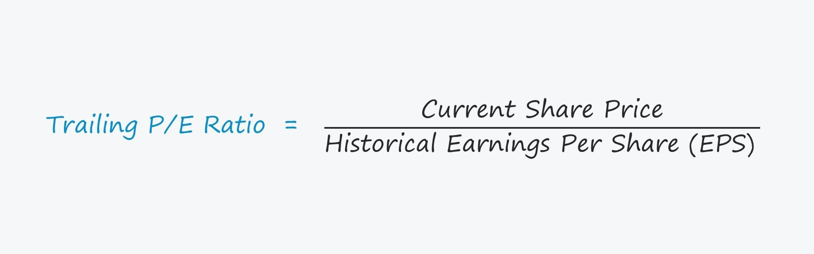

Earnings Per Share (EPS) is a fundamental financial metric employed by analysts and investors to gauge a company's profitability on a per-share basis. It encapsulates the portion of a company's profit allocated to each outstanding share of common stock, thus serving as a rudimentary measure of corporate health that informs investment decisions. Specifically, EPS is calculated by the formula:

$$
\text{EPS} = \frac{\text{Net Income} - \text{Preferred Dividends}}{\text{Average Outstanding Shares}}
$$



EPS plays a pivotal role in financial analysis, shedding light on a company's profitability and informing trading strategies. It is instrumental for assessing corporate performance, allowing stakeholders to evaluate if profits are growing and foresee potential dividends or capital gains. By comparing EPS figures across companies within the same industry, investors can discern which entities are performing better relative to their peers, facilitating more informed stock selections.

EPS is closely interwoven with algorithmic trading, where it serves as a crucial input for predictive models assessing stock price movements. Algorithmic traders rely on EPS to enhance the precision of automated trading decisions, analyzing patterns and predicting future price trends based on historical and projected earnings data. Trailing EPS, particularly, is used for assessing a company’s financial performance over the past four quarters, providing a comprehensive view of earnings trends and supporting strategic predictions.

Trailing EPS is invaluable for historical analysis, providing insights into how a company’s profitability has changed over time. This historical perspective aids in identifying consistent growth patterns or volatility in earnings, essential for long-term investment strategies and algorithmic trading models alike.

Future sections will delve deeper into the applications and implications of EPS, exploring its utility across various financial contexts and its integration into trading systems. This sets the stage for understanding how EPS not only informs universal financial analysis but also drives sophisticated trading strategies in modern markets.

## Table of Contents

## Understanding Earnings Per Share (EPS)

Earnings Per Share (EPS) is a key financial metric that indicates the profitability of a company. It is calculated by dividing a company's net income by its number of outstanding shares. Mathematically, it can be expressed as:

$$
\text{EPS} = \frac{\text{Net Income}}{\text{Outstanding Shares}}
$$

EPS can be categorized into two types: Basic EPS and Diluted EPS. Basic EPS is calculated using the total number of common shares currently outstanding. In contrast, Diluted EPS accounts for all possible shares that could be created through conversion or exercise of potential shares, such as options, convertible securities, or warrants. Diluted EPS provides a more conservative view of a company's earnings by considering the impact of financial instruments that could dilute existing shares.

EPS plays a critical role in evaluating a company's financial performance. It is a direct indicator of a company's profitability, showcasing how much money a company makes for each share of its stock. A higher EPS often signals greater profitability and is used by investors to determine the strength and profitability potential of a company.

Moreover, EPS offers insights into a company's growth potential. By analyzing historical EPS data, investors can assess whether a company's earnings are increasing over time, which may indicate potential for future expansion and profitability. Comparing EPS figures across time periods helps investors identify patterns in earnings growth, aiding in forecasting the company’s financial trajectory.

EPS is also crucial for comparing companies within the same industry. Since it standardizes earnings relative to the number of shares, it allows investors to evaluate companies' relative profitability accurately. A higher EPS compared to industry peers suggests a competitive advantage, helping investors in their decision-making process when building or adjusting portfolios. This comparative analysis is essential in identifying companies with robust performance within a competitive landscape.

By understanding EPS, investors can better assess a company's financial performance, growth prospects, and position within its industry, making EPS an indispensable tool for both [fundamental analysis](/wiki/fundamental-analysis) and strategic stock selection.

## Trailing EPS: Importance and Analysis

Trailing EPS, or Trailing Earnings Per Share, is a key metric in financial analysis that measures a company's profitability using its earnings over the most recent four quarters. It is a backward-looking indicator that aggregates historical data to provide insights into a company's sustained financial performance. By summing the net income for the last four quarters and dividing it by the average number of outstanding shares during the same period, trailing EPS offers a concise view of earnings available to shareholders.

The calculation of trailing EPS follows the formula:

$$
\text{Trailing EPS} = \frac{\text{Net Income Q1} + \text{Net Income Q2} + \text{Net Income Q3} + \text{Net Income Q4}}{\text{Average Outstanding Shares}}
$$

This rolling calculation is vital for trend analysis, as it facilitates a historical comparison of earnings performance, revealing patterns and identifying periods of growth or decline. Trailing EPS is especially useful in assessing the consistency of a company's [earning](/wiki/earning-announcement) power over time.

Trailing EPS holds particular importance for growth investors, who seek to identify firms with robust earning trajectories. By providing a historical perspective, it helps forecast a company's future performance and guides investment decisions. Companies that consistently report rising trailing EPS are often considered reliable growth investments, attracting investor confidence and potentially leading to stock price appreciation.

For instance, many public corporations report their trailing EPS in quarterly earnings announcements, highlighting how the figure plays a prominent role in stock valuation. An increase in trailing EPS may indicate stronger profitability, often leading to higher stock demand and potentially elevating market valuation. Conversely, a declining trailing EPS can signal potential issues, prompting investors to reassess their positions.

In conclusion, trailing EPS serves as a critical tool in financial analysis, delivering valuable historical insights that aid both growth investing and fundamental analysis. Its impact on stock valuation emphasizes its role as a key indicator of a company's financial health and future potential.

## EPS in Stock Valuation Models

Earnings Per Share (EPS) is integral to stock valuation models, serving as a cornerstone for multiple key valuation metrics that guide investors in evaluating a company's financial health and stock potential. One of the most prominent uses of EPS is in calculating the Price-to-Earnings (P/E) ratio, a widely adopted financial metric. The P/E ratio is defined as:

$$
\text{P/E Ratio} = \frac{\text{Market Price per Share}}{\text{Earnings Per Share (EPS)}}
$$

The P/E ratio provides investors with insights into how much they are paying for each dollar of earnings, thereby helping determine whether a stock is overvalued or undervalued compared to its earnings potential. A higher P/E ratio could indicate that the market expects high future growth rates, while a lower P/E ratio might suggest that the stock is undervalued or that the company is experiencing problems.

Complementing the P/E ratio are additional valuation metrics such as Earnings Yield and the PEG ratio. Earnings Yield, the inverse of the P/E ratio, is calculated as:

$$
\text{Earnings Yield} = \frac{\text{EPS}}{\text{Market Price per Share}} \times 100\%
$$

This metric expresses the percentage of each dollar invested in the stock that was earned by the company during the period. It is particularly useful for comparing stock performance relative to bond yields and can indicate the attractiveness of a stock as an investment.

The PEG ratio, which incorporates the growth aspect, is calculated by dividing the P/E ratio by the earnings growth rate:

$$
\text{PEG Ratio} = \frac{\text{P/E Ratio}}{\text{Annual EPS Growth Rate}}
$$

A PEG ratio close to or below 1 suggests that a stock may be undervalued relative to its expected earnings growth, while a higher PEG ratio can be seen as a warning sign that a stock is overvalued.

Investors harness these EPS-based metrics to assess a stock's potential and make informed investment decisions. EPS offers a snapshot of profitability, allowing investors to compare companies within the same industry efficiently. In a comprehensive stock analysis, EPS works alongside other financial indicators such as revenue growth, profit margins, and return on equity. This multifaceted approach ensures a balanced assessment that encompasses various aspects of a company's financial health.

In conclusion, EPS is more than just a measure of a company's profitability. It plays a pivotal role in stock valuation models, providing critical data points for investors to evaluate the fair value of stocks and support their investment strategies with nuanced understanding and analysis.

## Incorporating EPS in Algorithmic Trading

The integration of Earnings Per Share (EPS) into [algorithmic trading](/wiki/algorithmic-trading) strategies is an essential aspect of enhancing financial analysis. EPS serves as a critical input in automated systems designed to predict stock price movements. Algorithmic traders utilize EPS to build predictive models by assessing its historical data alongside other financial metrics such as revenue growth and profitability indicators. These models often incorporate [machine learning](/wiki/machine-learning) techniques, allowing systems to identify patterns and make data-driven decisions.

EPS plays a pivotal role in algorithm development due to its sensitivity to earnings surprises and growth rates. Earnings surprises—situations where reported earnings deviate significantly from market expectations—are particularly impactful. These surprises can cause substantial and rapid stock price movements, presenting opportunities for traders. Incorporating growth rates and historical EPS trends allows algorithms to adjust predictive models dynamically, improving accuracy and responsiveness to new information.

Algorithmic methodologies often employ statistical techniques like regression analysis and machine learning models to create EPS-based trading strategies. For example, a basic Python implementation using machine learning to predict stock movement could involve the following steps:

```python
import numpy as np
import pandas as pd
from sklearn.model_selection import train_test_split
from sklearn.ensemble import RandomForestClassifier
from sklearn.metrics import classification_report

# Mock data with 'EPS' and 'Price Movement' columns
data = pd.DataFrame({
    'EPS': np.random.normal(3, 1, 100),
    'Price Movement': np.random.choice([-1, 1], 100) # -1 for down, 1 for up
})

# Features and target variable
X = data[['EPS']]
y = data['Price Movement']

# Split the data
X_train, X_test, y_train, y_test = train_test_split(X, y, test_size=0.2, random_state=42)

# Train a Random Forest model
model = RandomForestClassifier(n_estimators=100, random_state=42)
model.fit(X_train, y_train)

# Predict and evaluate
y_pred = model.predict(X_test)
print(classification_report(y_test, y_pred))
```

This example demonstrates a simplistic approach where a machine learning model leverages EPS data to predict whether a stock price will move up or down. The benefits of utilizing EPS data in algorithmic trading include increased speed and accuracy in decision-making, as EPS provides timely insights into a company's financial health and future earnings potential.

The swift decision-making advantage offered by EPS-integrated trading systems is crucial in the fast-paced stock market environment. By automating the analysis process, traders can respond to market events with agility, minimizing the latency associated with manual data evaluation. Moreover, EPS-based algorithms can outperform traditional trading strategies by incorporating real-time data analysis, offering a distinct competitive edge. As market dynamics evolve, continuously refining these strategies ensures their relevance and effectiveness in supporting informed investment decisions.

## Challenges and Limitations of Using EPS in Trading

Earnings Per Share (EPS) is a widely used financial metric for evaluating a company's profitability. However, its use in trading and financial analysis is not without challenges and limitations. One significant issue is the potential manipulation of EPS, which can occur through share buybacks and certain accounting practices. Share buybacks reduce the number of outstanding shares, artificially increasing the EPS even if the net income remains unchanged. Additionally, companies might use creative accounting techniques, such as changing depreciation methods or recognizing revenue earlier than usual, to present a more favorable EPS.

EPS can also be limited in capturing a comprehensive picture of stock valuation when used without context. EPS focuses solely on profitability, disregarding other critical factors such as debt levels, cash flow, and future growth potential, which can significantly impact a company's valuation. For instance, two companies with similar EPS figures might have vastly different risk profiles or growth prospects, affecting their overall valuation.

In algorithmic trading, historical EPS data can lead to overfitting, a common challenge where a model is excessively complex and captures noise instead of the underlying data pattern. Overfitting results in models that perform well on historical data but poorly in predicting future outcomes. To mitigate overfitting, it is crucial to use techniques such as cross-validation, where the data is split into different subsets to validate the model's performance consistently. Additionally, incorporating randomness in the data selection process can help ensure the model's robustness.

Given these challenges, it is essential to combine EPS with other financial metrics for a balanced analysis. Relying solely on EPS can result in misleading conclusions, especially in complex financial environments. Other metrics, such as Price-to-Earnings (P/E) ratios, Return on Equity (ROE), and debt-to-equity ratios, provide additional insights that can complement EPS and improve the evaluation of a company's financial health.

To effectively mitigate the limitations of EPS, traders and analysts can adopt strategies such as:

1. **Diversifying metrics**: Use a comprehensive set of financial ratios and metrics alongside EPS to evaluate a company's performance.
2. **Adjustment for buybacks**: Consider the impact of share buybacks by analyzing changes in outstanding shares and adjusting EPS calculations accordingly.
3. **Accounting for non-recurring items**: Exclude non-recurring income or expenses from net income to derive a clearer picture of a company's ongoing profitability.

By understanding these challenges and adopting strategies to address them, traders and analysts can utilize EPS more effectively in their analyses, making better-informed decisions in their investment strategies.

## Advanced Techniques: EPS in Algorithmic Strategies

Modern technologies such as machine learning have significantly enhanced the efficacy of EPS-based trading signals. Machine learning algorithms can analyze vast datasets, identify patterns, and generate predictions with a level of precision unattainable by traditional analysis techniques. For instance, machine learning models can automatically identify non-linear relationships between EPS and stock returns that may not be observable through simple mathematical models.

**Sentiment Analysis and NLP in EPS Analysis**

Sentiment analysis and natural language processing (NLP) are used to gauge market sentiment surrounding EPS announcements. By analyzing news articles, earnings calls, and social media platforms, investors can assess how market perceptions align with the reported EPS values. For example, while an EPS increase may generally be viewed positively, sentiment analysis can uncover nuanced perceptions, such as concerns over unsustainable growth methods or market skepticism, that might affect stock prices.

Python example for sentiment analysis using NLP:

```python
from textblob import TextBlob

def analyze_sentiment(text):
    analysis = TextBlob(text)
    return analysis.sentiment.polarity

news_headlines = ["Company X reports record EPS growth", "Market doubts sustainability of Company X's earnings increase"]
sentiment_scores = [analyze_sentiment(headline) for headline in news_headlines]
print(sentiment_scores)
```

**Integration of Alternative Data Sources**

To complement traditional financial metrics like EPS, traders increasingly rely on [alternative data](/wiki/best-alternative-data) sources. These include consumer transaction data, web traffic [statistics](/wiki/bayesian-statistics), and satellite imagery, which offer additional perspectives on a company's performance. Incorporating such diverse data sets allows for a comprehensive analysis, mitigating the limitations of relying solely on EPS. For instance, strong EPS coupled with increasing web traffic may reinforce confidence in future stock performance.

**Post-Earnings Announcement Drift (PEAD)**

Post-Earnings Announcement Drift (PEAD) refers to the phenomenon where a stock's cumulative abnormal returns drift in the direction of an earnings surprise for an extended period. Understanding PEAD enables traders to capitalize on the lag in market reaction following an EPS announcement. By employing algorithms that identify these drifts, traders can optimize entry and [exit](/wiki/exit-strategy) points to enhance returns.

Here's a simple Python code snippet that identifies PEAD using historical EPS data:

```python
import pandas as pd

# Assume df is a DataFrame containing past EPS data with columns 'Date', 'EPS', and 'Surprise'
df['Cumulative_Return'] = df['Surprise'].cumsum()
pead_signals = df[df['Cumulative_Return'] > threshold]  # Adjust threshold based on acceptable risk
```

**Real-World Examples of Successful EPS-Driven Algorithmic Models**

Several EPS-driven algorithmic trading models have demonstrated success. For example, Renaissance Technologies, a prominent quantitative [hedge fund](/wiki/hedge-fund-trading-strategies), employs machine learning and big data analytics to leverage EPS data among other financial indicators. Additionally, quantitative strategies developed by firms like Two Sigma and D. E. Shaw integrate EPS data alongside broad-market and sentiment analysis to inform trading decisions.

In conclusion, advancements in technology have empowered traders to leverage EPS in increasingly sophisticated ways. The integration of machine learning, sentiment analysis, and alternative data sources has facilitated a deeper understanding of financial markets, enhancing the precision of trading strategies built around EPS metrics. By acknowledging the impact of phenomena like PEAD and continuously refining models based on real-world successes, traders and investors can stay ahead in dynamic market environments.

## Conclusion

Earnings Per Share (EPS) serves as a crucial metric in both financial analysis and algorithmic trading, offering significant insights into a company's profitability and performance. It acts as a pivotal tool for investors, providing a standardized measure to assess the financial health and growth potential of companies. By incorporating modern analytics, traders can enhance the predictive capabilities and accuracy of their trading strategies. For instance, machine learning algorithms can be employed to analyze large datasets, improving the precision of EPS forecasts and enabling real-time analysis for swift decision-making.

Nevertheless, EPS should not be viewed in isolation. It is vital to adopt a comprehensive approach that combines EPS with other financial indicators and market sentiment analyses. This ensures a more balanced and nuanced understanding of a company's valuation and future prospects. Metrics such as the Price-to-Earnings (P/E) ratio, Earnings Yield, and industry comparisons complement EPS data, offering a broader context for investment decisions.

As markets continue to evolve, so too should the strategies incorporating EPS. Continuous refinement and adaptation are essential to maintain competitive advantage, leveraging advancements in technology and data analysis. Strategies must be agile, ready to incorporate new insights and methodologies as they emerge.

Therefore, traders and investors are encouraged to harness the power of EPS alongside cutting-edge analytics to make informed and strategic decisions. By doing so, they can better navigate the complexities of financial markets, optimizing their investment outcomes in the process.

## References & Further Reading

[1]: Damodaran, Aswath. ["Investment Valuation: Tools and Techniques for Determining the Value of Any Asset."](https://www.amazon.com/Investment-Valuation-Tools-Techniques-Determining/dp/111801152X) Wiley Finance.

[2]: ["Security Analysis: Sixth Edition, Foreword by Warren Buffett"](https://www.amazon.com/Security-Analysis-Foreword-Buffett-Editions/dp/0071592539) by Benjamin Graham and David Dodd.

[3]: Zhang, J., & Zhang, Y. (2018). ["The Impact of Earnings Surprises on Stock Prices in Different Market States: Evidence from China."](https://www.sciencedirect.com/science/article/pii/S277244332400059X) Journal of Financial Markets.

[4]: Peterson, Richard L., & Booth, Graham G. (2011). ["Earnings Surprises and Investor Biases: How Benchmarking Optimizes Building an Investment Strategy."](https://en.wikipedia.org/wiki/List_of_University_of_Pennsylvania_people) CFA Institute.

[5]: Tetlock, Paul C. (2007). ["Giving Content to Investor Sentiment: The Role of Media in the Stock Market."](https://onlinelibrary.wiley.com/doi/abs/10.1111/j.1540-6261.2007.01232.x) The Quarterly Journal of Economics. 

[6]: ["Machine Learning for Algorithmic Trading"](https://github.com/stefan-jansen/machine-learning-for-trading) by Stefan Jansen.