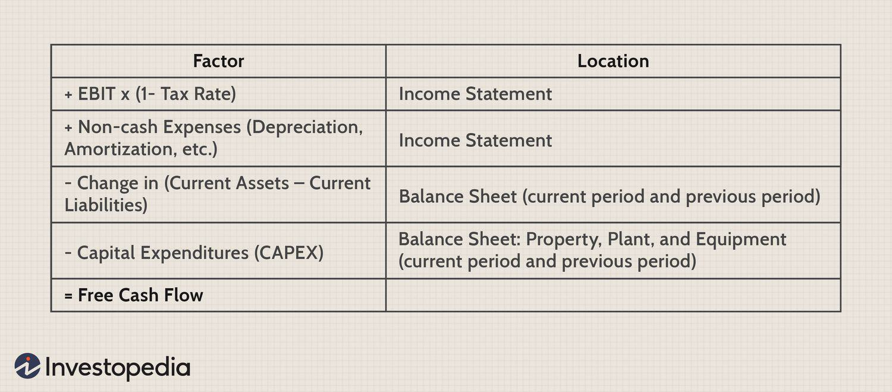

In the fast-paced world of finance, free cash flow (FCF) stands out as a pivotal metric for investors looking to make informed decisions. FCF provides a transparent view of a company's financial health by concentrating on actual cash generation rather than relying on accounting figures that may include non-cash items. This focus on real cash flows renders it a crucial indicator for assessing a company's ability to operate efficiently, meet obligations, and fund growth.

This article examines the calculation and significance of trailing Free Cash Flow, a variant that assesses cash flow over a specific period, typically the previous twelve months. Trailing FCF is particularly rewarding in the context of financial analysis and algorithmic trading. For algorithmic trading strategies, precise and timely data about a company's financial health is vital. FCF fills this need by offering a measure that investors use to evaluate a company's liquidity, sustainability, and growth potential.



By understanding how trailing FCF is computed and its implications for investors, one can appreciate why it is a valued tool in investment analysis. It equips traders and investors with insights that are essential for making prudent investment decisions. In this article, we will explore the diverse aspects of trailing FCF calculation, its application in the investment landscape, and its integral role in algorithmic trading strategies, thus underscoring its importance in modern financial decision-making.

## Table of Contents

## Understanding Trailing Free Cash Flow (FCF)

Trailing Free Cash Flow (FCF) is a crucial financial metric that measures a company's ability to generate cash over a specific period, typically the last twelve months. Unlike other metrics that heavily rely on accounting adjustments, such as net income or earnings before interest and taxes (EBIT), FCF focuses on the actual cash that a company has at its disposal after fulfilling necessary operational and capital expenditure commitments. This distinction is essential because it provides a more accurate representation of a company's financial health and potential to sustain operations without external financing.

FCF is calculated by subtracting capital expenditures from operating cash flow. The formula can be represented as:

$$
\text{FCF} = \text{Operating Cash Flow} - \text{Capital Expenditures}
$$

This calculation shows the cash available to be distributed among a company’s stakeholders or to be reinvested in the business. By focusing purely on cash transactions, FCF avoids the potential distortions caused by non-cash accounting entries, providing a clearer picture of [liquidity](/wiki/liquidity-risk-premium) and financial flexibility.

For investors, trailing FCF is a valuable tool for assessing a company’s long-term profitability and liquidity. Companies with strong FCF are generally more capable of weathering economic downturns, funding new projects, or enhancing shareholder value through dividends and share buybacks. Conversely, a low or negative FCF might indicate potential financial challenges or the need for substantial capital investments to spur growth. Therefore, understanding a company's trailing FCF is vital for evaluating its financial strength and strategic potential.

## How Trailing Free Cash Flow (FCF) Works

Trailing Free Cash Flow (FCF) is a crucial financial metric that measures the cash generated by a company after accounting for operational expenses and capital investments. It offers an unvarnished look at a company's ability to generate cash independently. This cash could be used for a variety of purposes, including financing growth initiatives, paying off creditors, or distributing to shareholders in the form of dividends or share buybacks.

At its core, trailing FCF is calculated by starting with the company's revenue and subtracting operating expenses, capital expenditures, and any changes in working capital. This results in the cash available for discretionary uses. A simple representation of this calculation is as follows:

$$
\text{Free Cash Flow} = \text{Operating Cash Flow} - \text{Capital Expenditures}
$$

This computation shows how much cash is truly available after sustaining the company's ongoing operations and necessary capital investments.

A positive trailing FCF is indicative of a company that is capable of sustaining its current levels of operation and investment, while also having surplus funds for other financial maneuvers. Such a company can reinvest in its business, making strategic decisions to grow by entering new markets or developing new products. Moreover, it can strengthen its balance sheet by reducing debt or return value to shareholders by paying dividends or buying back shares.

Investors rely on trailing FCF to gauge the financial flexibility and sustainability of a company. A strong trailing FCF can suggest a lower financial risk, making the company more attractive to investors who seek stability and potential growth. Conversely, a weak or negative free cash flow may trigger concerns about the company's ability to meet its financial obligations or to fund expansion without seeking additional financing.

Overall, trailing FCF serves as a comprehensive indicator of a company’s financial health and operational efficiency, reflecting its capability to generate cash in excess of operational and reinvestment needs.

## Calculating Trailing Free Cash Flow (FCF)

To calculate trailing Free Cash Flow (FCF), a thorough understanding of a company's financial activities over the past twelve months is essential. The process begins with the prior twelve months' Earnings Before Interest and Taxes (EBIT). This figure represents a company's profitability from its operations before the cost of interest and taxes are deducted. 

The next step in the calculation is to adjust EBIT for taxes. This involves estimating the tax liability on the EBIT to arrive at the Net Operating Profit After Tax (NOPAT). The formula for NOPAT is:

$$
\text{NOPAT} = \text{EBIT} \times (1 - \text{Tax Rate})
$$

Depreciation and amortization, non-cash expenses typically added back to the EBIT, must also be considered in the FCF calculation. These adjustments compensate for accounting allocations that do not involve actual cash outflows.

The formula to reach Operating Cash Flow (OCF) is:

$$
\text{Operating Cash Flow} = \text{NOPAT} + \text{Depreciation} + \text{Amortization}
$$

Additionally, changes in capital expenditures (CapEx) and working capital are critical in the final FCF computation. Capital expenditures represent the funds a company uses to acquire or upgrade physical assets such as property, industrial buildings, or equipment. These investments are necessary for maintaining and expanding the business but can be substantial cash outflows. Working capital adjustments, which involve current assets and current liabilities, further refine the cash calculation, reflecting operational liquidity needs.

The formula to calculate the trailing FCF is:

$$
\text{Free Cash Flow} = \text{Operating Cash Flow} - \text{Capital Expenditures} - \Delta \text{Working Capital}
$$

Alternatively, FCF can be derived directly from the Cash Flow from Operating Activities section of the Cash Flow Statement, providing a straightforward computation based on readily available financial records. In this method, you subtract capital expenditures from the cash generated by operating activities:

$$
\text{FCF} = \text{Cash Flow from Operating Activities} - \text{Capital Expenditures}
$$

Using these methods, analysts and investors can accurately determine the trailing Free Cash Flow, thereby gaining insight into the actual cash generation capacity of the company beyond mere accounting profits.

## Benefits of Using Free Cash Flow

Free Cash Flow (FCF) is a critical financial metric that provides an unvarnished view of a company’s liquidity and its potential to invest and grow sustainably. By concentrating on actual cash flows instead of accounting figures subject to various interpretations and manipulations, FCF offers a transparent measure of financial health.

Firstly, FCF serves as a reliable indicator of a company's ability to generate sufficient cash to maintain and expand operations. Unlike net income, which can be affected by non-cash accounting elements such as depreciation and amortization, FCF offers clarity by showing the actual funds available post essential expenditures. This makes FCF invaluable for assessing operational efficiency. A company with robust FCF is often able to reinvest in its operations, funding research and development, upgrading infrastructure, or acquiring new assets. This reinvestment potential is crucial for maintaining competitive advantage and ensuring long-term growth.

Furthermore, FCF is essential for evaluating a company's potential for growth. It reflects the ability to pursue strategic initiatives, such as mergers and acquisitions, which can drive expansion and increase market share. A high FCF often implies a firm has the resources to capitalize on growth opportunities, either in terms of entering new markets or enhancing existing capabilities.

FCF is also a pivotal tool for assessing the potential for dividend payments and stock buybacks, which are key components of shareholder value creation. Companies with strong, consistent free cash flow are often in a better position to provide returns to shareholders through regular dividends or share repurchase programs. In effect, FCF provides insight into a company’s capacity to reward its investors, making it a critical consideration for those looking to invest in dividend-yielding stocks.

Overall, understanding and tracking Free Cash Flow is essential for investors and financial analysts who seek a purely cash-centric view of a company's financial standing and future capabilities. By focusing on FCF, stakeholders can make more informed decisions regarding a company’s investment potential and overall financial health.

## Interpreting Free Cash Flow Trends

Interpreting Free Cash Flow (FCF) trends is essential for assessing a company's financial health and potential stock performance. Consistent or improving FCF trends are generally indicative of a company's robust financial position. When a company demonstrates a steady or rising FCF, it is more likely to have sufficient resources to fund expansion, manage debt obligations, and deliver shareholder returns through dividends or stock buybacks. This financial stability often translates into a positive perception in the stock market, potentially enhancing the company’s stock performance.

On the other hand, a stable FCF indicates reliability, suggesting that a company can consistently generate cash flow to cover its operational costs and investments, even in varying economic conditions. This consistency can make a company more attractive to conservative investors who prioritize steady cash flow over ambitious growth targets.

Conversely, declining FCF trends could raise concerns as they might signal underlying financial distress or a deliberate strategic direction towards major investments. A drop in FCF may be due to increased capital expenditure aimed at future growth, which could strain the company's immediate cash reserves. Alternatively, it might reflect operational inefficiencies or reduced revenues, raising red flags for potential investors.

Analyzing FCF trends requires considering the context of these changes. For example, in a high-growth industry, a temporary decline in FCF might be acceptable if the capital expenditures are directed towards scaling operations or entering new markets. Investors should scrutinize the reasons behind changing FCF figures to distinguish between healthy strategic investments and underlying financial distress. 

Overall, understanding FCF trends is crucial for making informed investment decisions, as they provide insight into a company’s capability to generate cash and its strategic financial management.

## The Role of FCF in Algorithmic Trading

Algorithmic trading systems rely heavily on data to make swift and informed decisions. Free Cash Flow (FCF) is a critical component of these data sets, providing insights into a company's financial health and liquidity. By incorporating FCF into algorithmic models, traders and investors can develop more refined screening criteria for stock selection.

In [algorithmic trading](/wiki/algorithmic-trading), the behavior of FCF serves as a significant trigger for trading actions. Rising FCF often indicates that a company is generating more cash than it is consuming, which can be interpreted as a sign of financial robustness and potential for growth. This financial state might trigger buy signals within an algorithmic trading system, as the company shows prospects for reinvestment and shareholder returns.

Conversely, falling FCF might prompt a reevaluation of the holding or a sell order. Deteriorating FCF can signal potential liquidity issues, an increase in operational costs, or capital misallocation, making it a critical metric for risk assessment. Algorithms use such signals to adjust portfolios accordingly, either reducing exposure to potentially underperforming assets or exiting positions altogether.

Algorithmic models leveraging FCF data may include lines of programming code that set thresholds for these cash flow metrics. For example:

```python
def evaluate_fcf_movement(fcf_current, fcf_previous, threshold):
    if (fcf_current - fcf_previous) > threshold:
        return "Buy Signal"
    elif (fcf_previous - fcf_current) > threshold:
        return "Sell Signal"
    else:
        return "Hold"

# Example usage
fcf_current = 120.0  # current FCF in millions
fcf_previous = 110.0  # previous FCF in millions
threshold = 5.0  # threshold in millions
decision = evaluate_fcf_movement(fcf_current, fcf_previous, threshold)
print(decision)
```

In this example, the function `evaluate_fcf_movement` checks for significant changes in FCF, issuing a buy or sell signal if the change exceeds a predefined threshold. Such models enable automated systems to dynamically adjust to real-time financial data, ensuring that trading decisions remain aligned with a company's evolving cash flow situation.

In summary, integrating FCF into algorithmic trading models enriches the analysis by providing a direct measure of financial stability and potential for growth. This allows for more precise stock screening and better risk management, ultimately enhancing the efficacy of automated trading strategies.

## Real-World Applications of Free Cash Flow

Free Cash Flow (FCF) serves as a crucial financial metric that can be deployed strategically to navigate economic uncertainties. Its role extends across various business decisions, including mergers, acquisitions, and capital investments. By providing excess cash flow beyond the necessary operational costs and capital expenditures, FCF can act as a financial cushion, enabling companies to undertake initiatives without relying on external funding sources.

One primary application of FCF is in mergers and acquisitions (M&A). Companies with substantial FCF are often in a better position to pursue acquisition targets aggressively. They can finance acquisitions directly without increasing leverage, allowing them to expand their market presence or diversify their product offerings more effectively. This financial health not only facilitates smoother transactions but also places acquiring companies in a better competitive stance post-acquisition.

In terms of capital investments, FCF allows businesses to reinvest in themselves with autonomy. Companies can allocate these funds towards innovative projects, infrastructure upgrades, or technological advancements, which foster long-term growth and operational efficiency. These investments are critical in maintaining or gaining a competitive edge in rapidly evolving industries.

Beyond growth and expansion, FCF also enhances shareholder returns through dividends and share buybacks. High levels of FCF typically enable companies to return capital to shareholders, providing regular dividend payments or engaging in share repurchase programs, which can boost the stock's value by reducing the shares outstanding. This strategic financial management underscores a commitment to delivering shareholder value and enhances investor confidence, often reflected in the company’s stock performance.

Additionally, FCF provides flexibility in times of economic downturns. During periods of financial instability or reduced revenue, a robust FCF can ensure that a company meets its operational demands without incurring additional debt. This capability not only aids in sustaining operations but also positions the company to capitalize on opportunities that may arise during challenging economic times.

In summary, the strategic application of FCF is multifaceted, supporting a company’s growth initiatives, M&A activities, capital investments, and shareholder value enhancement, while also acting as a safeguard against economic [volatility](/wiki/volatility-trading-strategies). These diverse applications make FCF an indispensable tool for robust financial planning and management.

## Conclusion

Understanding and applying Free Cash Flow (FCF) calculations in financial strategies and investment analyses is vital for making informed decisions. FCF focuses on actual cash generation, offering a reliable indicator of a company's financial stability and growth potential. By concentrating on the cash left after operational and capital expenditures, FCF provides a clear picture of the resources available for reinvestment, debt repayment, or shareholder returns.

For professionals and investors, integrating FCF analysis into evaluations enhances financial decision-making. The ability to assess a company's liquidity and profitability based on real cash flows, rather than merely accounting figures, allows for a more nuanced understanding of its fiscal health. This insight can lead to better predictions of stock performance, informed strategic planning, and adaptable investment strategies that can accommodate changing market conditions.

In practical terms, FCF's importance is evident when assessing opportunities like mergers and acquisitions, or when planning for capital investment projects. Its role in determining dividend policies or buyback strategies further underscores its utility. Moreover, in algorithmic trading, FCF data is invaluable for developing and executing trading strategies based on quantifiable financial health metrics.

Overall, FCF is an indispensable component for any thorough financial analysis or strategy development. Its focus on tangible cash flow metrics makes it a powerful tool for assessing and predicting a company's financial trajectory and investment potential.

## References & Further Reading

[1]: ["Free Cash Flow: Seeing Through the Accounting Fog Machine to Find Great Stocks"](https://www.amazon.com/Free-Cash-Flow-Through-Accounting/dp/0470391758) by George C. Christy and Benton E. Gup

[2]: Damodaran, A. (2006). ["Valuation Approaches and Metrics: A Survey of the Theory and Evidence."](https://people.stern.nyu.edu/adamodar/pdfiles/papers/valuesurvey.pdf) Foundations and Trends in Finance, 1(8).

[3]: ["Investing Between the Lines: How to Make Smarter Decisions By Decoding CEO Communications"](https://www.amazon.com/Investing-Between-Lines-Decisions-Communications/dp/0071714073) by L.J. Rittenhouse

[4]: Dechow, P. M., Richardson, S. A., & Sloan, R. G. (2008). ["The Persistence and Pricing of the Cash Component of Earnings."](https://www.jstor.org/stable/40058145) Journal of Accounting Research, 46(3), 537-566.

[5]: ["Understanding Cash Flow: Analysis for the Investor"](https://www.financestrategists.com/wealth-management/financial-statements/cash-flow-statement/cash-flow-analysis/) by Franklin J. Plewa Jr. and William B. Friedlob