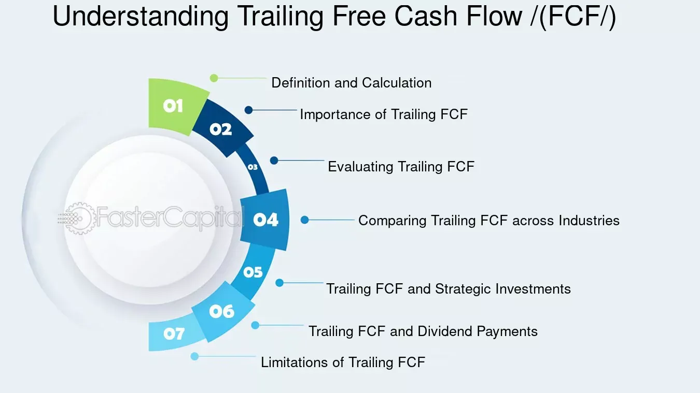

## Table of Contents

## What is trailing free cash flow?

Trailing free cash flow is the money a company has left after it pays for everything it needs to keep running and growing. It looks at the cash flow from the past year, usually the last 12 months. This number is important because it shows how much money the company can use for things like paying dividends, buying back its own stock, or investing in new projects.

Investors and analysts like to use trailing free cash flow because it gives a clear picture of a company's financial health over a recent period. By looking at this number, they can see if the company is generating enough cash to support its operations and growth without needing to borrow more money. It's a useful tool for making decisions about whether to invest in the company or not.

## Why is trailing free cash flow important for investors?

Trailing free cash flow is important for investors because it shows how much money a company has left over after paying for all its bills and expenses. This money can be used for things like paying dividends to shareholders, buying back its own stock, or investing in new projects. By looking at the trailing free cash flow, investors can see if the company is making enough money to support its operations and growth without needing to borrow more.

It's also a good way for investors to check the financial health of a company over the last year. Since trailing free cash flow looks at the past 12 months, it gives a recent and clear picture of how the company is doing. Investors can use this information to decide if they want to invest in the company or not. If the trailing free cash flow is high, it might mean the company is in a good position to grow and reward its shareholders.

## How does trailing free cash flow differ from other cash flow metrics?

Trailing free cash flow is different from other cash flow metrics because it looks at the money a company has left over after paying for everything it needs in the past year. This is different from operating cash flow, which just shows the cash a company makes from its normal business activities without taking out the money spent on things like new equipment or buildings. Trailing free cash flow gives a fuller picture because it includes these costs, showing how much money is really available for other uses.

Another important difference is between trailing free cash flow and projected free cash flow. Projected free cash flow tries to guess how much money a company will have in the future, while trailing free cash flow tells us about the past year. Investors like to use trailing free cash flow because it's based on real numbers, not guesses. This makes it a more reliable way to see if a company is doing well and has enough cash to keep growing or pay dividends.

## What are the components needed to calculate trailing free cash flow?

To calculate trailing free cash flow, you need to start with the company's operating cash flow. This is the money the company makes from its regular business activities over the last year. From this, you subtract the capital expenditures, which are the costs of buying things like new equipment or buildings that the company needs to keep running and growing. The result is the trailing free cash flow, which shows how much money the company has left over after paying for everything it needs.

Sometimes, you might also need to consider changes in working capital. This includes things like inventory, accounts receivable, and accounts payable. If these change, it can affect the amount of cash the company has available. So, you might need to adjust the operating cash flow for these changes before subtracting the capital expenditures to get a more accurate picture of the trailing free cash flow.

## Can you provide a step-by-step guide on how to calculate trailing free cash flow?

To calculate trailing free cash flow, start by finding the company's operating cash flow for the past year. This is the money the company made from its normal business activities over the last 12 months. You can usually find this number in the company's financial statements, specifically in the cash flow statement. Once you have the operating cash flow, the next step is to subtract the capital expenditures. These are the costs the company spent on things like new equipment or buildings during the same period. Subtracting the capital expenditures from the operating cash flow gives you the trailing free cash flow, which shows how much money the company has left over after paying for everything it needs.

Sometimes, you might also need to adjust the operating cash flow for changes in working capital. Working capital includes things like inventory, accounts receivable, and accounts payable. If these numbers change, it can affect how much cash the company has available. To adjust for these changes, you look at the difference in working capital from the beginning to the end of the year and add or subtract this amount from the operating cash flow before you subtract the capital expenditures. This gives you a more accurate picture of the trailing free cash flow, showing the real amount of money the company has left over after all its expenses.

## What are common sources of data for calculating trailing free cash flow?

The most common source of data for calculating trailing free cash flow is a company's financial statements. These statements are usually found in the company's annual report or quarterly filings with the Securities and Exchange Commission (SEC). In these documents, you can find the operating cash flow in the cash flow statement, which shows the money the company made from its normal business activities over the last 12 months. You can also find the capital expenditures in the same statement, which are the costs the company spent on things like new equipment or buildings.

Sometimes, you might need to look at other parts of the financial statements to adjust for changes in working capital. This includes things like inventory, accounts receivable, and accounts payable. These numbers can be found in the balance sheet, which shows the company's financial position at a specific point in time. By looking at the difference in working capital from the beginning to the end of the year, you can make the necessary adjustments to the operating cash flow before calculating the trailing free cash flow.

## How can trailing free cash flow be used to assess a company's financial health?

Trailing free cash flow is a good way to see how healthy a company is financially. It shows how much money a company has left over after paying for everything it needs to run and grow. If a company has a lot of trailing free cash flow, it means it's making more money than it's spending. This is a good sign because the company can use this extra money to pay dividends to shareholders, buy back its own stock, or invest in new projects. It also means the company doesn't need to borrow money to keep going, which is important for staying financially stable.

Investors and analysts look at trailing free cash flow to decide if a company is a good investment. If the trailing free cash flow is high and growing, it can mean the company is doing well and has a bright future. On the other hand, if the trailing free cash flow is low or shrinking, it might be a warning sign that the company is struggling. By comparing the trailing free cash flow to other companies in the same industry, investors can also see how well the company is doing compared to its competitors. This helps them make better decisions about where to put their money.

## What are the limitations of using trailing free cash flow as a metric?

Trailing free cash flow is a useful way to see how much money a company has left over after paying for everything it needs. But it has some limitations. One big problem is that it only looks at the past year. This means it might not tell you much about what will happen in the future. A company might have a high trailing free cash flow now, but if things change, like the economy getting worse or a new competitor coming in, the company might not keep making that much money.

Another limitation is that trailing free cash flow can be affected by one-time events. For example, if a company sells a big piece of property, it might make a lot of money that year, but that doesn't mean it will keep making that much money every year. Also, companies can sometimes change how they report their cash flow to make their numbers look better. So, it's important to look at other things too, like the company's debt, how much it's growing, and what's happening in the industry, to get a full picture of its financial health.

## How does trailing free cash flow impact valuation models like DCF?

Trailing free cash flow is really important when using valuation models like the Discounted Cash Flow (DCF) method. In a DCF model, you try to guess what a company will be worth in the future by looking at how much money it will make. The trailing free cash flow helps because it gives you a starting point. You can see how much money the company made in the last year, and then you can use that to guess how much it will make in the future. If the trailing free cash flow is high and growing, it might mean the company will keep making a lot of money, so it could be worth more.

But, there are some things to be careful about when using trailing free cash flow in a DCF model. Since it only looks at the past year, it might not tell you everything you need to know about the future. The company might have had a really good year last year, but things could change. Also, if the company did something unusual, like selling a big piece of property, it might make the trailing free cash flow look better than it really is. So, when using trailing free cash flow in a DCF model, it's smart to also look at other things, like the company's debt, how it's growing, and what's happening in the industry, to get a full picture of what the company might be worth.

## Can you explain how seasonal variations affect trailing free cash flow?

Seasonal variations can really change how much trailing free cash flow a company has. Some businesses make more money at certain times of the year, like toy companies that sell a lot more during the holiday season. If you look at the trailing free cash flow for the past year, and that year had a really good holiday season, the number might look higher than usual. But if you only look at that number, you might think the company always makes that much money, which isn't true.

So, it's important to understand the company's business and how it changes with the seasons. If you know that a company makes most of its money during certain months, you can see if the trailing free cash flow is high because of a good season or if it's really doing well all year. This helps you get a better idea of the company's financial health and not be tricked by one good or bad season.

## What are some advanced techniques for adjusting trailing free cash flow for more accurate analysis?

One advanced technique for adjusting trailing free cash flow is to normalize it by removing one-time events. If a company sold a big piece of property or had a large legal settlement, these can make the trailing free cash flow look different than it usually is. By taking out these one-time events, you can see what the company's normal cash flow looks like. This gives you a better idea of how much money the company makes year after year, without being tricked by unusual things that happened in the past year.

Another technique is to adjust for seasonal variations. Some businesses make more money at certain times of the year, like toy companies during the holiday season. If you know when these busy times are, you can look at the trailing free cash flow over several years to see how it changes with the seasons. This helps you understand if the company's high or low cash flow is because of the time of year or if it's really doing well or poorly. By doing this, you can get a clearer picture of the company's financial health over time.

## How can trailing free cash flow be integrated into a comprehensive investment strategy?

Trailing free cash flow can be a big part of a good investment strategy. It shows how much money a company has left over after paying for everything it needs to run and grow. By looking at this number, investors can see if a company is making enough money to pay dividends, buy back its own stock, or invest in new projects. If a company has a lot of trailing free cash flow, it might be a good investment because it means the company is financially healthy and doesn't need to borrow money to keep going. Investors can use this information to decide which companies to invest in, by comparing the trailing free cash flow of different companies to see which ones are doing the best.

But, trailing free cash flow should not be the only thing investors look at. It's important to use it with other financial metrics and information about the company and its industry. For example, investors should also look at the company's debt, how it's growing, and what's happening in the market. By putting all this information together, investors can get a full picture of a company's financial health. This helps them make smarter choices about where to put their money, making sure they pick companies that are not just doing well now but are likely to do well in the future too.

## What is Understanding Trailing Free Cash Flow (FCF)?

Trailing Free Cash Flow (FCF) is a crucial financial metric that measures a company's ability to generate cash over a specific period, typically the last twelve months. Unlike other metrics that heavily rely on accounting adjustments, such as net income or earnings before interest and taxes (EBIT), FCF focuses on the actual cash that a company has at its disposal after fulfilling necessary operational and capital expenditure commitments. This distinction is essential because it provides a more accurate representation of a company's financial health and potential to sustain operations without external financing.

FCF is calculated by subtracting capital expenditures from operating cash flow. The formula can be represented as:

$$
\text{FCF} = \text{Operating Cash Flow} - \text{Capital Expenditures}
$$

This calculation shows the cash available to be distributed among a company’s stakeholders or to be reinvested in the business. By focusing purely on cash transactions, FCF avoids the potential distortions caused by non-cash accounting entries, providing a clearer picture of [liquidity](/wiki/liquidity-risk-premium) and financial flexibility.

For investors, trailing FCF is a valuable tool for assessing a company’s long-term profitability and liquidity. Companies with strong FCF are generally more capable of weathering economic downturns, funding new projects, or enhancing shareholder value through dividends and share buybacks. Conversely, a low or negative FCF might indicate potential financial challenges or the need for substantial capital investments to spur growth. Therefore, understanding a company's trailing FCF is vital for evaluating its financial strength and strategic potential.

## How does Trailing Free Cash Flow (FCF) work?

Trailing Free Cash Flow (FCF) is a crucial financial metric that measures the cash generated by a company after accounting for operational expenses and capital investments. It offers an unvarnished look at a company's ability to generate cash independently. This cash could be used for a variety of purposes, including financing growth initiatives, paying off creditors, or distributing to shareholders in the form of dividends or share buybacks.

At its core, trailing FCF is calculated by starting with the company's revenue and subtracting operating expenses, capital expenditures, and any changes in working capital. This results in the cash available for discretionary uses. A simple representation of this calculation is as follows:

$$
\text{Free Cash Flow} = \text{Operating Cash Flow} - \text{Capital Expenditures}
$$

This computation shows how much cash is truly available after sustaining the company's ongoing operations and necessary capital investments.

A positive trailing FCF is indicative of a company that is capable of sustaining its current levels of operation and investment, while also having surplus funds for other financial maneuvers. Such a company can reinvest in its business, making strategic decisions to grow by entering new markets or developing new products. Moreover, it can strengthen its balance sheet by reducing debt or return value to shareholders by paying dividends or buying back shares.

Investors rely on trailing FCF to gauge the financial flexibility and sustainability of a company. A strong trailing FCF can suggest a lower financial risk, making the company more attractive to investors who seek stability and potential growth. Conversely, a weak or negative free cash flow may trigger concerns about the company's ability to meet its financial obligations or to fund expansion without seeking additional financing.

Overall, trailing FCF serves as a comprehensive indicator of a company’s financial health and operational efficiency, reflecting its capability to generate cash in excess of operational and reinvestment needs.

## How do you calculate Trailing Free Cash Flow (FCF)?

To calculate trailing Free Cash Flow (FCF), a thorough understanding of a company's financial activities over the past twelve months is essential. The process begins with the prior twelve months' Earnings Before Interest and Taxes (EBIT). This figure represents a company's profitability from its operations before the cost of interest and taxes are deducted. 

The next step in the calculation is to adjust EBIT for taxes. This involves estimating the tax liability on the EBIT to arrive at the Net Operating Profit After Tax (NOPAT). The formula for NOPAT is:

$$
\text{NOPAT} = \text{EBIT} \times (1 - \text{Tax Rate})
$$

Depreciation and amortization, non-cash expenses typically added back to the EBIT, must also be considered in the FCF calculation. These adjustments compensate for accounting allocations that do not involve actual cash outflows.

The formula to reach Operating Cash Flow (OCF) is:

$$
\text{Operating Cash Flow} = \text{NOPAT} + \text{Depreciation} + \text{Amortization}
$$

Additionally, changes in capital expenditures (CapEx) and working capital are critical in the final FCF computation. Capital expenditures represent the funds a company uses to acquire or upgrade physical assets such as property, industrial buildings, or equipment. These investments are necessary for maintaining and expanding the business but can be substantial cash outflows. Working capital adjustments, which involve current assets and current liabilities, further refine the cash calculation, reflecting operational liquidity needs.

The formula to calculate the trailing FCF is:

$$
\text{Free Cash Flow} = \text{Operating Cash Flow} - \text{Capital Expenditures} - \Delta \text{Working Capital}
$$

Alternatively, FCF can be derived directly from the Cash Flow from Operating Activities section of the Cash Flow Statement, providing a straightforward computation based on readily available financial records. In this method, you subtract capital expenditures from the cash generated by operating activities:

$$
\text{FCF} = \text{Cash Flow from Operating Activities} - \text{Capital Expenditures}
$$

Using these methods, analysts and investors can accurately determine the trailing Free Cash Flow, thereby gaining insight into the actual cash generation capacity of the company beyond mere accounting profits.

## References & Further Reading

[1]: ["Free Cash Flow: Seeing Through the Accounting Fog Machine to Find Great Stocks"](https://www.amazon.com/Free-Cash-Flow-Through-Accounting/dp/0470391758) by George C. Christy and Benton E. Gup

[2]: Damodaran, A. (2006). ["Valuation Approaches and Metrics: A Survey of the Theory and Evidence."](https://people.stern.nyu.edu/adamodar/pdfiles/papers/valuesurvey.pdf) Foundations and Trends in Finance, 1(8).

[3]: ["Investing Between the Lines: How to Make Smarter Decisions By Decoding CEO Communications"](https://www.amazon.com/Investing-Between-Lines-Decisions-Communications/dp/0071714073) by L.J. Rittenhouse

[4]: Dechow, P. M., Richardson, S. A., & Sloan, R. G. (2008). ["The Persistence and Pricing of the Cash Component of Earnings."](https://www.jstor.org/stable/40058145) Journal of Accounting Research, 46(3), 537-566.

[5]: ["Understanding Cash Flow: Analysis for the Investor"](https://www.financestrategists.com/wealth-management/financial-statements/cash-flow-statement/cash-flow-analysis/) by Franklin J. Plewa Jr. and William B. Friedlob