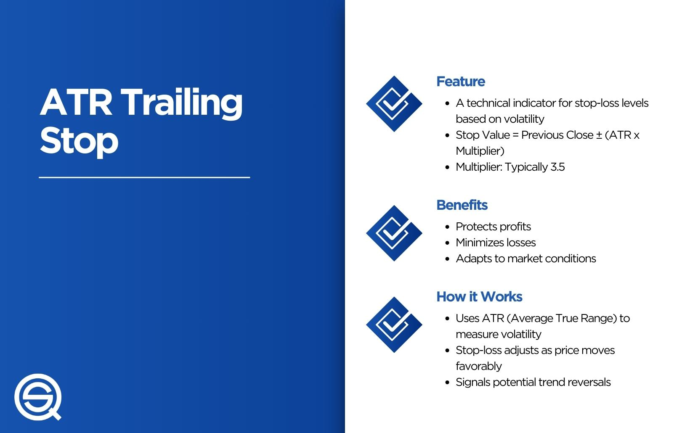

In the world of algo trading, mastering the evaluation of performance metrics is crucial for success. Performance metrics provide quantitative measures that help traders assess the effectiveness and efficiency of their trading algorithms. These metrics enable traders to evaluate how well their algorithms are performing, identifying areas that require enhancement and adjustments. Essential performance metrics such as return on investment (ROI), Sharpe ratio, and maximum drawdown offer deep insights into both profitability and risk management capabilities of trading strategies.

Tracking these metrics allows traders to gain a comprehensive understanding of their algorithms' strengths and weaknesses. Through this understanding, they can make informed decisions that lead to the optimization of their trading strategies. By coupling performance metrics with trailing indicators and advanced measurement tools, traders can not only measure past performance but also enhance future outcomes.



As markets are dynamic and constantly changing, the continuous analysis of performance metrics supports traders in adapting their algorithms to evolving market conditions. This adaptability is vital for maintaining a competitive edge and achieving long-term success in algorithmic trading. Thus, the evaluation of performance metrics is indispensable for traders aiming to navigate the competitive landscape of financial markets efficiently.

## Table of Contents

## Understanding Performance Metrics in Algo Trading

Performance metrics are critical in assessing the efficacy and success of trading algorithms. These metrics offer quantitative insights that help traders evaluate how well their algorithms are performing, identify strengths and weaknesses, and uncover opportunities for enhancement. By offering data-driven evidence of trading performance, metrics enable traders to make informed choices in algorithmic investments.

One of the most fundamental performance metrics is the Return on Investment (ROI), which measures the gain or loss generated relative to the initial investment. It is calculated as:

$$
\text{ROI} = \frac{\text{Net Profit}}{\text{Total Investment}} \times 100\%
$$

This formula provides a straightforward percentage that indicates profitability. A positive ROI signifies gains, while a negative value indicates losses.

Another key metric is the Sharpe Ratio, which evaluates the risk-adjusted return of a trading algorithm. It is defined as:

$$
\text{Sharpe Ratio} = \frac{\text{Average Return} - \text{Risk-Free Rate}}{\text{Standard Deviation of Return}}
$$

The Sharpe Ratio measures the return over and above the risk-free rate per unit of risk, represented by standard deviation. A higher Sharpe Ratio indicates a more desirable risk-adjusted return.

Maximum drawdown reflects the greatest loss from a peak to a trough in a portfolio, illustrating potential exposure to significant downturns. This metric is crucial for understanding worst-case scenarios and assessing algorithmic risk management capabilities. It is calculated as:

$$
\text{Maximum Drawdown} = \frac{\text{Trough Value} - \text{Peak Value}}{\text{Peak Value}}
$$

Volatility metrics, including standard deviation and beta, provide insights into risk exposure and variability in returns. Standard deviation quantifies the [dispersion](/wiki/dispersion-trading) of returns, indicating the degree of variation or uncertainty in a portfolio's performance. The formula for standard deviation $\sigma$ is:

$$
\sigma = \sqrt{\frac{1}{N}\sum_{i=1}^{N}(R_i - \bar{R})^2}
$$

where $R_i$ stands for each return, $\bar{R}$ is the mean return, and $N$ is the number of observations.

Traders benefit from these metrics by comparing different algorithms, each with unique risk and return profiles. By examining these measures, traders can pinpoint underperforming algorithms, assess how changes affect outcomes, and identify potential areas for optimization. These performance metrics, therefore, serve as a cornerstone for evaluating, refining, and enhancing trading strategies to align with desired financial objectives.

## The Role of Trailing Indicators in Trading

Trailing indicators are essential instruments in the world of trading. They serve as retrospective tools, analyzing historical data to provide insights into past performance, which can assist traders in understanding and interpreting historical trends. Their primary function is to identify patterns or trends that have occurred and provide a sense of how these might affect future movements.

Common trailing indicators include:

1. **Trailing Returns**: These evaluate the historical performance of an asset over a specific period. Trailing returns are typically measured over periods like 1-month, 6-month, 1-year, 3-year, etc. They offer a quick glance at how an asset has performed relative to its past, which can be instrumental for comparative analysis against benchmarks or other assets.

2. **Moving Averages**: These include simple moving averages (SMA) and exponential moving averages (EMA). A moving average smooths out price data by creating a constantly updated average price. The formula for a simple moving average for the last $n$ days is:
$$
   SMA = \frac{P_1 + P_2 + ... + P_n}{n}

$$

   Here, $P_1, P_2, ..., P_n$ represent the closing prices over $n$ days. Moving averages help identify the direction of a trend over a set period. The EMA gives more weight to the most recent prices, making it more responsive to newer information.

3. **Historical Volatility**: This measures the variation or dispersion of price over time. It provides insight into the potential risk associated with the asset due to fluctuations in its price. Historical volatility can be represented mathematically as the standard deviation of the logarithmic returns of the asset over a given period. The formula is:
$$
   \sigma = \sqrt{\frac{\sum_{i=1}^{N}(R_i - \bar{R})^2}{N-1}}

$$

   where $R_i$ is the log return of the price at time $i$, $\bar{R}$ is the average log return, and $N$ is the number of observations.

While trailing indicators offer valuable historical insight, they have inherent limitations because they are backward-looking. As they solely rely on past data, they may not accurately predict future market movements, especially in volatile or rapidly changing markets. Therefore, effective trading strategies should integrate trailing indicators with other predictive tools and metrics for a comprehensive market analysis and decision-making process. This holistic approach, combining historical analysis with forward-looking strategies, enables traders to adapt more effectively to market dynamics.

## Key Performance Metrics for Evaluating Trading Algorithms

Performance metrics are vital for evaluating trading algorithms, as they offer quantifiable insights into an algorithm's effectiveness and potential risks. Key metrics encompass financial viability, risk-adjusted returns, potential for losses, and exposure to market [volatility](/wiki/volatility-trading-strategies).

**Financial Viability: Assessing ROI and Consistency Over Time**

Return on Investment (ROI) is a fundamental metric used to measure the efficiency and profitability of a trading algorithm. ROI is calculated as:

$$
\text{ROI} = \left(\frac{\text{Net Profit}}{\text{Cost of Investment}}\right) \times 100
$$

A consistently positive ROI indicates that the algorithm can generate profits over different market conditions, which is vital for long-term financial viability. Traders often monitor ROI over time to ensure the algorithm remains effective and adapts to market shifts.

**Sharpe Ratio: Measuring Risk-adjusted Returns**

The Sharpe Ratio is a widely-used metric to determine the efficiency of an algorithm by comparing its return to its risk. The formula for the Sharpe Ratio is:

$$
\text{Sharpe Ratio} = \frac{E[R] - R_f}{\sigma}
$$

where $E[R]$ is the expected return of the algorithm, $R_f$ is the risk-free rate, and $\sigma$ is the standard deviation of the algorithm's excess returns. A higher Sharpe Ratio indicates that the algorithm is more efficient in generating returns per unit of risk, thus providing a better risk-adjusted performance benchmark.

**Maximum Drawdown: Analyzing Potential for Significant Losses**

Maximum Drawdown (MDD) measures the largest peak-to-trough decline in an algorithm's equity curve and represents the potential risk of a significant loss. It is expressed as a percentage:

$$
\text{Maximum Drawdown} = \frac{\text{Peak Value} - \text{Trough Value}}{\text{Peak Value}} \times 100
$$

MDD helps traders understand the worst-case scenario concerning capital loss, which is crucial for effective risk management.

**Volatility Metrics: Understanding Risk Exposure**

Volatility is a statistical measure of the dispersion of returns for a given security or market index, typically measured using standard deviation. In the context of trading algorithms, volatility metrics assist in evaluating the risk exposure of the strategy:

$$
\sigma = \sqrt{\frac{1}{N-1} \sum_{i=1}^{N} (R_i - \bar{R})^2}
$$

where $R_i$ represents each return in the dataset, $\bar{R}$ is the mean return, and $N$ is the number of returns. Greater volatility indicates higher risk, as the algorithm's performance can deviate significantly from its expected return. Understanding volatility aids in developing strategies that align with the trader's risk tolerance.

Incorporating these key performance metrics facilitates a comprehensive evaluation of trading algorithms, enabling traders to make informed decisions to enhance and optimize their strategies.

## Effective Measurement Tools for Algo Trading

Effective measurement tools are indispensable in the context of [algorithmic trading](/wiki/algorithmic-trading), enabling traders to assess and optimize the performance of their trading algorithms. Several specialized platforms cater to this need by offering comprehensive analysis and risk assessment features, the most prominent being MetaTrader, TradeStation, Amibroker, and NinjaTrader.

### MetaTrader

MetaTrader is a widely used platform that provides robust tools for algorithmic traders. It supports multiple financial instruments and offers a suite of analytical tools, including various charting tools and custom indicators. MetaTrader’s [backtesting](/wiki/backtesting) capabilities allow traders to test their trading algorithms against historical data, providing insights into their potential performance. The platform also supports the use of Expert Advisors (EAs) for automating trading strategies, which can be evaluated using performance metrics such as maximum drawdown, profit [factor](/wiki/factor-investing), and Sharpe ratio.

### TradeStation

TradeStation is renowned for its advanced analysis capabilities and is popular among professional traders. It incorporates a powerful toolset for designing, testing, and optimizing trading algorithms. Traders can leverage TradeStation’s in-depth performance reports, which include detailed [statistics](/wiki/bayesian-statistics) on returns, drawdowns, and volatility. Its simulation environment allows users to test their strategies under various market conditions, helping to identify and mitigate potential risks.

### Amibroker

Amibroker is another potent tool, particularly favored for its flexibility and speed. It provides advanced charting, portfolio backtesting, and optimization capabilities, allowing traders to thoroughly evaluate the performance of their algorithms. Amibroker’s coding environment, based on its proprietary scripting language AFL (Amibroker Formula Language), facilitates the creation of custom indicators and trading rules. Its optimization feature is particularly beneficial, enabling the exploration of different parameter settings to maximize strategy performance.

### NinjaTrader

NinjaTrader offers a comprehensive suite of tools tailored for algorithmic trading. It supports advanced charting, market analysis, and trading automation. NinjaTrader’s Strategy Analyzer allows traders to backtest and optimize their algorithms using historical data. The platform’s detailed performance metrics include profit factor, average trade, and win/loss ratios, providing a granular view of strategy effectiveness. Additionally, the availability of hundreds of third-party add-ons extends its functionality further.

### Code and Simulation

These platforms allow traders to write code to automate their trading strategies and perform extensive simulations. In Python, a simple snippet to calculate basic performance metrics like return and volatility could look like this:

```python
import numpy as np

# Example returns data
returns = np.array([0.01, 0.02, -0.01, 0.005, 0.0075])

# Calculate average return
average_return = np.mean(returns)

# Calculate volatility (standard deviation of returns)
volatility = np.std(returns)

print(f'Average Return: {average_return}, Volatility: {volatility}')
```

This code provides a fundamental illustration of how performance metrics can be calculated, forming the foundation for more complex evaluations using the tools mentioned.

### Conclusion

In summary, these measurement tools are critical for traders seeking to optimize their trading performance. By utilizing the comprehensive features of platforms like MetaTrader, TradeStation, Amibroker, and NinjaTrader, traders can effectively track and analyze their algorithms, facilitating informed decision-making and strategy optimization.

## Improving Performance Through Optimization

Continually optimizing trading algorithms is fundamental to maintaining their effectiveness amid fluctuating market conditions. Traders can enhance their algorithms by concentrating on three primary areas: tuning algorithm parameters, enhancing risk management strategies, and diversifying trading approaches.

### Tuning Algorithms

Algorithm tuning involves adjusting the parameters to improve performance. Typically, this includes optimizing parameters such as stop-loss levels, position size, and entry/[exit](/wiki/exit-strategy) signals. Algorithms should be regularly backtested against historical data to ensure that parameter adjustments lead to enhanced performance without overfitting to past data. The use of cross-validation methods can aid in validating the robustness of these optimizations.

Example in Python:
```python
import numpy as np
from sklearn.model_selection import TimeSeriesSplit, GridSearchCV
from sklearn.ensemble import RandomForestRegressor

# Example parameters
param_grid = {
    'n_estimators': [50, 100, 200],
    'max_depth': [5, 10, 20]
}

# TimeSeriesSplit for cross-validation in time-series data
tscv = TimeSeriesSplit(n_splits=5)

# Dummy X and y, replace with actual features and target
X, y = np.random.rand(100, 5), np.random.rand(100)

# Model tuning
model = RandomForestRegressor()
grid_search = GridSearchCV(model, param_grid, cv=tscv)
grid_search.fit(X, y)

best_params = grid_search.best_params_
print("Optimized Parameters:", best_params)
```

### Enhancing Risk Management Strategies

Improving risk management strategies is crucial for protecting investments from unforeseen market fluctuations. Techniques such as dynamic stop-loss adjustments, position sizing algorithms like the Kelly Criterion, and incorporating hedging strategies can help minimize potential losses. Risk metrics should be continuously monitored, and adjustments should be made wherever there is an indication of elevated risk exposure.

### Diversifying Approaches

Diversification is a critical strategy to mitigate risk and enhance the chances of achieving consistent returns. By incorporating a variety of trading strategies—such as trend-following, mean-reversion, or market-neutral strategies—traders can reduce the impact of any single market event on their overall portfolio. Diversifying algorithms to operate across different asset classes and market conditions can further lower risk and enhance performance.

### Regular Performance Analysis

Regular analysis of algorithmic performance is pivotal. This process includes reviewing backtested results and real-time performance metrics to identify patterns of underperformance or inefficiencies. Advanced analytical tools can simulate scenario analyses to predict how algorithms might perform under various market conditions, enabling preemptive adjustments.

By focusing on these areas, traders can continually refine their algorithmic strategies, ensuring they adapt to the dynamic nature of financial markets and maintain optimal performance.

## Conclusion

In algo trading, the precise measurement and comprehension of performance metrics are fundamental to achieving successful outcomes. The dynamic nature of financial markets requires traders to not only measure these metrics accurately but also to interpret them for effective decision-making. Trailing indicators play a significant role in providing insights by analyzing historical data, allowing traders to understand past trends and patterns. These indicators, however, should be used in combination with other tools to present a comprehensive view of an algorithm's performance, as relying solely on past data can be misleading.

Robust measurement tools such as MetaTrader, TradeStation, Amibroker, and NinjaTrader are essential for traders seeking to analyze and optimize their trading algorithms. These platforms offer diverse functionalities that enable the monitoring of key performance metrics, simulation of trading scenarios, and comprehensive risk assessment. Traders can leverage these tools to continually refine their trading strategies, ensuring they remain effective amid evolving market conditions.

Optimization and adaptation are critical components of sustaining success in algo trading. Algorithms must be frequently evaluated and fine-tuned to adapt to new data and changing market environments. This continuous process involves improving aspects like algorithmic efficiency, risk management strategies, and diversification of trading approaches. Regular performance analysis helps to pinpoint areas for improvement, ensuring that trading strategies are robust and resilient against market fluctuations.

In conclusion, the accurate and insightful interpretation of performance metrics, supported by trailing indicators and advanced measurement tools, is vital in the fast-paced world of algo trading. Consistent optimization and the ability to adapt trading algorithms to new conditions are crucial for long-term success, allowing traders to navigate the complexities of the market efficiently.

## References & Further Reading

[1]: Bergstra, J., Bardenet, R., Bengio, Y., & Kégl, B. (2011). ["Algorithms for Hyper-Parameter Optimization."](https://dl.acm.org/doi/10.5555/2986459.2986743) Advances in Neural Information Processing Systems 24.

[2]: ["Advances in Financial Machine Learning"](https://www.amazon.com/Advances-Financial-Machine-Learning-Marcos/dp/1119482089) by Marcos Lopez de Prado

[3]: ["Evidence-Based Technical Analysis: Applying the Scientific Method and Statistical Inference to Trading Signals"](https://www.amazon.com/Evidence-Based-Technical-Analysis-Scientific-Statistical/dp/0470008741) by David Aronson

[4]: ["Machine Learning for Algorithmic Trading"](https://github.com/stefan-jansen/machine-learning-for-trading) by Stefan Jansen

[5]: ["Quantitative Trading: How to Build Your Own Algorithmic Trading Business"](https://www.amazon.com/Quantitative-Trading-Build-Algorithmic-Business/dp/1119800064) by Ernest P. Chan