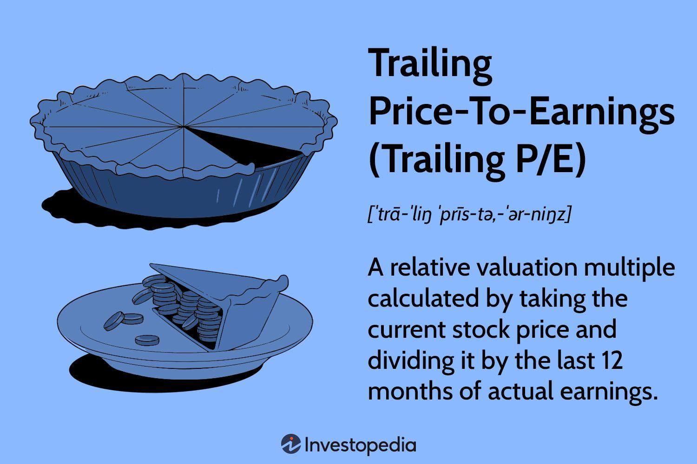

## Table of Contents

## What is the Trailing Price-To-Earnings (P/E) Ratio?

The Trailing Price-To-Earnings (P/E) Ratio is a way to figure out how much investors are willing to pay for a company's earnings. It's calculated by dividing the current stock price by the company's earnings per share over the past 12 months. This ratio helps investors see if a stock is a good value or if it's overpriced. If the P/E ratio is high, it means investors are expecting big things from the company in the future. If it's low, it might mean the company isn't doing so well or that the stock is a bargain.

Using the Trailing P/E Ratio can be helpful, but it's not perfect. It looks at past earnings, so it doesn't tell you about future growth or changes in the company. Also, different industries have different average P/E ratios, so you need to compare apples to apples. For example, tech companies often have higher P/E ratios than utility companies. So, while the Trailing P/E Ratio is a useful tool, it's best used along with other information to get a full picture of a company's value.

## How is the Trailing P/E Ratio calculated?

The Trailing P/E Ratio is calculated by taking the current market price of a company's stock and dividing it by the company's earnings per share over the last 12 months. To find the earnings per share, you take the company's total earnings for the past year and divide it by the number of outstanding shares. This gives you a per-share figure that represents the company's earnings.

Once you have the earnings per share, you divide the current stock price by this number. For example, if a stock is trading at $50 and the earnings per share over the last year were $5, the Trailing P/E Ratio would be $50 divided by $5, which equals 10. This ratio tells investors how much they are paying for each dollar of the company's earnings, based on historical data.

## Why is the Trailing P/E Ratio important for investors?

The Trailing P/E Ratio is important for investors because it helps them see if a stock is a good deal or if it's too expensive. It tells you how much you're paying for each dollar of the company's earnings from the past year. If the ratio is low, it might mean the stock is a bargain and the company could be undervalued. On the other hand, a high ratio might mean the stock is pricey, and investors might expect the company to grow a lot in the future.

However, the Trailing P/E Ratio isn't perfect. It only looks at the past, so it doesn't tell you anything about what might happen next. Also, different kinds of businesses have different normal P/E ratios. For example, a tech company might have a higher ratio than a utility company, and that's okay. So, while the Trailing P/E Ratio is a handy tool, it's best used with other information to get a complete picture of whether a stock is a good investment.

## How does the Trailing P/E Ratio differ from the Forward P/E Ratio?

The Trailing P/E Ratio and the Forward P/E Ratio both help investors understand if a stock is a good deal, but they look at different things. The Trailing P/E Ratio uses the company's earnings from the last 12 months to figure out the price you're paying for each dollar of earnings. It's like looking in the rearview mirror to see how the company has done in the past. This can be useful because it's based on real, known numbers, but it doesn't tell you anything about what might happen next.

The Forward P/E Ratio, on the other hand, looks at the company's expected earnings for the next 12 months. It tries to guess what the company's earnings will be in the future and then uses that guess to figure out the price you're paying for each dollar of future earnings. This can be helpful because it gives you an idea of what investors think the company will do in the future, but it's based on predictions that might not be accurate. Both ratios are useful, but they give you different pieces of the puzzle when you're trying to decide if a stock is a good investment.

## What does a high Trailing P/E Ratio indicate about a company?

A high Trailing P/E Ratio means that investors are willing to pay a lot for each dollar of the company's past earnings. This can suggest that people think the company will do really well in the future. They might believe the company will grow a lot, make more money, or become more valuable. For example, if a company's stock is trading at $100 and its earnings per share over the last year were $2, the Trailing P/E Ratio would be 50. That's a high number, and it shows that investors are betting on big things from this company.

But a high Trailing P/E Ratio can also mean the stock might be too expensive. If the company doesn't grow as much as expected, the stock price could go down. It's important to compare the company's P/E Ratio with other companies in the same industry because what's considered "high" can be different for tech companies than for utility companies. So while a high Trailing P/E Ratio might show that investors are excited about the company's future, it also comes with risks if those expectations aren't met.

## What does a low Trailing P/E Ratio suggest about a company's stock?

A low Trailing P/E Ratio suggests that the stock might be a good deal. It means investors are paying less for each dollar of the company's past earnings. If a company's stock has a low P/E Ratio, it could mean that the company is undervalued, and the stock price might be lower than it should be. This could be a good time to buy the stock because it might go up in value later.

However, a low P/E Ratio can also mean that the company is not doing well. Maybe it's not making as much money as it used to, or people think it won't do well in the future. It's important to look at other things about the company, like its business, the industry it's in, and what other people are saying about it. A low P/E Ratio is a clue, but you need more information to decide if it's a good investment.

## How can the Trailing P/E Ratio be used to compare companies within the same industry?

The Trailing P/E Ratio is a helpful tool for comparing companies within the same industry because it shows how much investors are willing to pay for each dollar of earnings. If you're looking at two companies in the same industry, like two car makers, you can compare their P/E Ratios to see which one might be a better deal. If one car maker has a lower P/E Ratio than the other, it might mean that the first company is a better value, and its stock could be a bargain.

But it's important to remember that even within the same industry, there can be other things to think about. For example, one company might be growing faster than the other, or it might have better products. So, while the Trailing P/E Ratio gives you a good starting point for comparing companies, you should also look at other information like their growth plans, financial health, and what experts are saying about them. This way, you can make a smarter choice about which stock to invest in.

## What are the limitations of using the Trailing P/E Ratio as an investment metric?

The Trailing P/E Ratio has some limits when you use it to decide if a stock is a good investment. It only looks at what the company earned in the past year, so it doesn't tell you anything about what might happen next. If a company's earnings are going to grow a lot in the future, the Trailing P/E Ratio won't show that. Also, it can be affected by one-time events, like selling a big part of the business or getting a huge tax break. These things can make the earnings look different from what they usually are, so the P/E Ratio might not give you a true picture of the company's value.

Another problem with the Trailing P/E Ratio is that it doesn't work the same for all types of companies. Different industries have different normal P/E Ratios. For example, tech companies often have higher P/E Ratios than utility companies because people expect them to grow faster. If you compare a tech company to a utility company just by looking at their P/E Ratios, you might think the tech company is too expensive when it's really not. So, while the Trailing P/E Ratio can be a useful tool, you need to use it carefully and look at other information too to make the best investment choices.

## How does the Trailing P/E Ratio relate to a company's growth prospects?

The Trailing P/E Ratio can give you some clues about what investors think about a company's growth prospects. If a company has a high Trailing P/E Ratio, it means investors are willing to pay a lot for each dollar of the company's past earnings. This might mean they think the company will grow a lot in the future. They might expect the company to make more money or become more valuable. But remember, the Trailing P/E Ratio only looks at the past, so it's not a perfect way to predict the future.

On the other hand, a low Trailing P/E Ratio might mean investors don't think the company will grow much or they think it's not doing well. The stock could be a good deal if the company is actually better than people think. But it could also mean the company really is struggling. So, while the Trailing P/E Ratio can give you an idea about growth, you need to look at other things too, like what the company plans to do and what experts say about it.

## Can the Trailing P/E Ratio be misleading, and if so, under what circumstances?

The Trailing P/E Ratio can be misleading if you don't look at the whole picture. It only tells you about a company's past earnings, not what might happen next. If a company had a really good year because of something that won't happen again, like selling a big part of the business, the Trailing P/E Ratio might make the company look cheaper than it really is. Also, if a company's earnings are going to grow a lot in the future, the Trailing P/E Ratio won't show that, so you might think the company is too expensive when it's not.

Another way the Trailing P/E Ratio can be misleading is when you compare companies from different industries. Different kinds of businesses have different normal P/E Ratios. For example, tech companies often have higher P/E Ratios than utility companies because people expect them to grow faster. If you compare a tech company to a utility company just by looking at their P/E Ratios, you might think the tech company is too expensive when it's really not. So, while the Trailing P/E Ratio can be a helpful tool, you need to use it carefully and look at other information too.

## How do analysts adjust the Trailing P/E Ratio for cyclical businesses?

Analysts adjust the Trailing P/E Ratio for cyclical businesses because these companies have earnings that go up and down a lot depending on the economy. For example, car makers might sell more cars when the economy is good and fewer when it's bad. So, if you just look at the Trailing P/E Ratio, it might not give you a good idea of the company's value because it only shows what happened in the last year. To fix this, analysts might use a different way to figure out the P/E Ratio, like looking at the average earnings over several years instead of just the last year. This gives a better idea of what the company usually earns, not just what it earned in a good or bad year.

Another way analysts adjust the Trailing P/E Ratio for cyclical businesses is by using a normalized earnings figure. This means they try to guess what the company's earnings would be if the economy was normal, not really good or really bad. They might look at what the company earned in the past over different economic cycles and use that to come up with a number that's more typical. By using this normalized earnings figure instead of the actual earnings from the last year, the P/E Ratio gives a better idea of whether the stock is a good deal or not. This helps investors make smarter choices about whether to buy or sell the stock of a cyclical business.

## What advanced techniques can be used to refine the analysis of Trailing P/E Ratios across different sectors?

When looking at Trailing P/E Ratios across different sectors, one advanced technique is to use sector-specific benchmarks. Different industries have different average P/E Ratios because they grow at different rates and have different business models. For example, tech companies often have higher P/E Ratios than utility companies. To get a better idea of if a stock is a good deal, you can compare its P/E Ratio to the average P/E Ratio for its sector. This helps you see if the stock is priced higher or lower than what's normal for that industry.

Another technique is to look at the P/E Ratio over time, not just at one moment. This is called historical P/E analysis. By seeing how a company's P/E Ratio has changed over the years, you can spot trends and see if the stock is usually more expensive or cheaper than it is now. This can help you decide if the current P/E Ratio is a good sign or a warning. You can also use this to compare the company's P/E Ratio to the sector's average P/E Ratio over time, which gives you an even better idea of how the stock is doing compared to others in its industry.

## What is the Trailing P/E Ratio and How Can We Understand It?

Trailing Price-to-Earnings (P/E) ratio is a key metric that helps investors assess a company's valuation by examining its earnings over the past 12 months. This ratio indicates how much investors are willing to pay for each dollar of earnings and is expressed mathematically as:

$$
\text{Trailing P/E Ratio} = \frac{\text{Current Share Price}}{\text{Trailing 12-Month EPS}}
$$

Here, the Current Share Price refers to the price at which a company's stock is trading, and the Trailing 12-Month EPS (Earnings Per Share) represents the company's earnings distributed over the last twelve months. The trailing P/E offers a historical view, providing clarity on how a stock's price aligns with its earnings performance.

The trailing P/E is favored due to its foundation in actual, reported earnings, furnishing investors with a tangible perspective of a company's valuation. When comparing stocks in the same industry, this metric helps investors discern whether one company is undervalued or overvalued relative to its peers. It allows for standardization across different time frames and varying business cycles, contributing to informed decision-making.

However, it is essential to acknowledge that the trailing P/E ratio, with its backward-looking nature, presents limitations. It primarily reflects past performance and may not capture the nuances of a company's future prospects. Changes in management strategy, innovation, market conditions, or external factors like regulatory modifications may significantly impact future earnings but are not considered in this metric.

Thus, while the trailing P/E ratio is instrumental in understanding current valuations, investors should complement it with other financial indicators and forward-looking analyses for a comprehensive investment strategy.

## What are the advantages and limitations of the Trailing P/E Ratio?

The trailing Price-to-Earnings (P/E) ratio presents several advantages and limitations that investors should consider when utilizing it as part of their investment strategy. One of the primary advantages of the trailing P/E ratio is its reliance on actual earnings data. This characteristic makes it a reliable measure for investors who prioritize historical performance and concrete financial results. The trailing P/E is calculated by dividing a company's current share price by its earnings per share (EPS) over the last 12 months, providing a snapshot of what investors are currently willing to pay for a unit of the company's earnings.

Mathematically, the trailing P/E ratio is expressed as:

$$
\text{Trailing P/E Ratio} = \frac{\text{Current Share Price}}{\text{Trailing 12-Month EPS}}
$$

This formula's dependency on real earnings data allows for standardized comparisons of share prices across different periods or among various companies, facilitating investment decisions grounded in tangible financial metrics.

However, the trailing P/E ratio is not without its limitations. A notable drawback is its focus on past earnings, which may not accurately reflect a company's current performance or future potential. Such reliance on historical data could lead investors to overlook recent changes in a company's strategy or evolving market conditions that could significantly impact its earnings trajectory.

Additionally, the trailing P/E ratio does not account for external factors such as economic shifts, competitive dynamics, or regulatory changes that may influence a company's profitability moving forward. Consequently, it is essential for investors to remain cautious and complement the trailing P/E analysis with consideration of these external variables and potential strategic changes within a company. This balanced perspective can help mitigate the risk of overemphasizing past performance while ensuring a thorough assessment of a company's financial health and future prospects.

## How can Trailing P/E be utilized in algorithmic trading according to the case study?

A hypothetical trading strategy utilizing the trailing P/E ratio encompasses several key components: data collection, stock screening, and execution. 

In the data collection phase, critical financial information such as stock prices, earnings over the past 12 months, and sector classifications are gathered. This information forms the basis for calculating the trailing P/E ratio, which is computed using the formula:

$$
\text{Trailing P/E Ratio} = \frac{\text{Current Share Price}}{\text{Trailing 12-Month EPS}}
$$

Here, the earnings per share (EPS) reflects the company's earnings divided by the outstanding shares over the trailing twelve months. Sector classifications help contextualize P/E ratios within specific industry averages, providing a benchmark for comparison.

The next step involves screening stocks using the trailing P/E ratio against their respective sector averages. The aim is to identify stocks that appear undervalued or overvalued compared to their peers. For instance, a stock with a trailing P/E ratio significantly lower than its sector average might be undervalued, flagging a potential buying opportunity. Conversely, a higher-than-average P/E ratio may suggest that a stock is overpriced, warranting caution or even short selling.

Here is a simplified Python code snippet for filtering stocks based on trailing P/E ratios:

```python
import pandas as pd

# Sample DataFrame for stocks data
data = {'Stock': ['A', 'B', 'C'], 'Price': [100, 150, 200], 'EPS': [5, 3, 10], 'Sector PE Avg': [25, 50, 15]}
df = pd.DataFrame(data)

# Calculate Trailing P/E Ratio
df['Trailing P/E'] = df['Price'] / df['EPS']

# Filter stocks with Trailing P/E < Sector Average
potential_buys = df[df['Trailing P/E'] < df['Sector PE Avg']]

print(potential_buys)
```

Execution involves deciding on buy or sell actions based on the screened stocks. The timing and [volume](/wiki/volume-trading-strategy) of trades can be automated through algorithmic trading systems, enabling rapid response to market movements.

Performance evaluation employs metrics such as return on investment (ROI), [volatility](/wiki/volatility-trading-strategies), and drawdowns to gauge the strategy's effectiveness. ROI measures the profitability of trades, while volatility assesses the price fluctuations. Drawdowns indicate the peak-to-trough declines in portfolio value, providing insights into risk exposure.

The P/E-focused strategy, while insightful, also faces challenges. Relying solely on the trailing P/E ratio might overlook factors beyond past earnings, such as market sentiment or macroeconomic changes. Thus, integrating additional financial indicators can enhance the robustness of trading strategies.

## What are Broader Investment Strategies?

In the domain of stock evaluation, relying solely on the trailing P/E ratio could overlook significant financial insights that other metrics offer. Investors and traders are thus advised to incorporate a mix of financial ratios and metrics to gain a well-rounded understanding of a company's financial health and market position. Notably, the Return on Equity (ROE) and the Price/Earnings to Growth (PEG) ratio are two crucial metrics that can complement the trailing P/E ratio.

ROE is calculated using the formula:

$$
\text{ROE} = \frac{\text{Net Income}}{\text{Shareholder's Equity}}
$$

This metric provides insights into how effectively a company uses its equity capital to generate profits. It helps investors determine whether the company is maintaining a good profit relative to its equity, which is essential for assessing the efficiency of management in using shareholder funds.

The PEG ratio, on the other hand, adjusts the P/E ratio for the growth rate of earnings:

$$
\text{PEG Ratio} = \frac{\text{P/E Ratio}}{\text{Annual EPS Growth Rate}}
$$

By incorporating growth into the valuation, the PEG ratio offers a more dynamic perspective, adjusting for high growth rates which may justify higher P/E ratios. A PEG ratio below one could suggest that a stock is undervalued considering its earnings growth.

Besides these metrics, other financial and qualitative measures like the Debt-to-Equity ratio, dividend yield, and industry-specific factors should be considered as well. These additional metrics aid investors in creating a diversified investment strategy that encompasses risk management and provides a clearer picture of actual stock value.

Through diversification of metrics, investors can achieve a more robust assessment process, reducing the risk of overlooking key indicators of a company’s potential. This approach can enhance decision-making by uncovering more accurate valuations, leading to potentially more informed and profitable trading strategies.

## References & Further Reading

For those interested in expanding their knowledge of financial metrics and the intricacies of algorithmic trading, several resources are available that provide comprehensive insights. "Security Analysis" by Benjamin Graham is a classic text that lays the groundwork for understanding [fundamental analysis](/wiki/fundamental-analysis), including key metrics such as the Price-to-Earnings (P/E) ratio. This book is instrumental for anyone looking to grasp the underpinnings of stock valuation.

Online resources such as Investopedia offer accessible explanations and detailed articles on various financial metrics, including the trailing P/E ratio, and their applications in modern trading strategies. Websites like these also discuss the integration of financial metrics in algorithmic trading, introducing the basics of how algorithms can be designed to execute trades based on specific financial indicators.

For those looking to apply these concepts practically, a familiarity with programming is beneficial. Python is especially recommended due to its robust libraries for data analysis and algorithmic trading, such as pandas and NumPy for data handling, and libraries like TA-Lib for technical analysis. Below is a simple Python snippet that demonstrates how one might begin to calculate a trailing P/E ratio using pandas:

```python
import pandas as pd

# Example data
data = {'Company': ['A', 'B'],
        'Current Share Price': [150, 200],
        'Trailing 12-Month EPS': [3.75, 8.00]}

# Create a DataFrame
df = pd.DataFrame(data)

# Calculate Trailing P/E Ratio
df['Trailing P/E Ratio'] = df['Current Share Price'] / df['Trailing 12-Month EPS']

print(df)
```

In addition, academic journals and publications provide valuable insights into the latest developments in algorithmic trading. Keeping up with academic papers can reveal emerging trends and novel approaches to integrating financial metrics with algorithmic strategies, ensuring a well-rounded understanding of the field.

Ultimately, a combination of classic literature, online resources, and hands-on practice is recommended for those wishing to deepen their understanding of financial metrics and their application in algorithmic trading.

