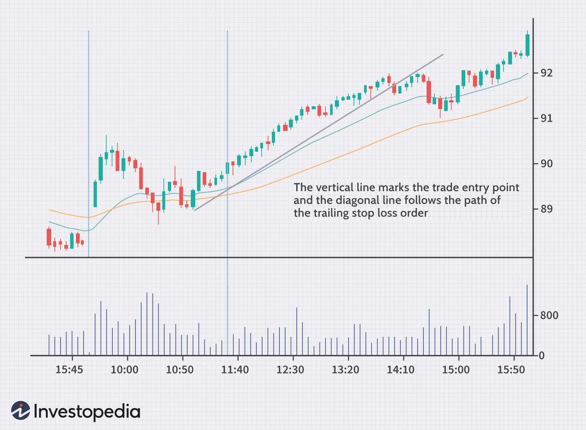

In the fast-paced world of trading, algorithms have become instrumental, providing the precision and efficiency that traditional methods often lack. Among the variety of strategies that traders utilize, the trailing step stock market trading strategy distinguishes itself with its adaptive approach to risk management and profit securing. In the context of ever-evolving market conditions, this strategy allows traders to embrace fluctuations while minimizing potential losses.

This article aims to dissect the trailing step stock market trading strategy within the framework of algorithmic trading. By examining its mechanics, benefits, and implementation, we will present a detailed perspective that could enhance your trading performance. Such understanding is essential, given that algorithmic trading is now a cornerstone of modern financial markets, optimizing trades through predefined conditions with minimal human intervention.



The trailing step strategy is particularly noteworthy because it provides a dynamic approach to stop-loss adjustments, ensuring that favorable market movements are capitalized upon while protecting against negative reversals. This strategy not only retains the automated benefits of algo trading but also introduces a layer of flexibility that is pertinent to volatile trading environments. By understanding and implementing this strategy, traders can improve their odds of securing profits and mitigating risks, making it a valuable component of the algorithmic trader's toolkit.

## Table of Contents

## What is a Trailing Step in Trading?

A trailing step is an integral component of the trailing stop order, a widely used stop-loss strategy in trading. Trailing stop orders are designed to protect traders by automatically adjusting the stop-loss level based on the security's price movements in a favorable direction.

The trailing step itself is set in predefined units called pips or points, depending on the market or asset being traded. These units represent the minimal price change required to trigger an adjustment in the stop-loss level. For instance, in foreign exchange trading, a pip typically refers to a one-hundredth of a percent change in the exchange rate for a currency pair.

Essentially, the trailing step permits the stop-loss order to move incrementally in accordance with favorable price changes, thus capturing potential gains while simultaneously offering protection against adverse market reversals. The dynamics involve maintaining a specific distance between the current market price and the stop-loss order, which adjusts upwards (in a long position) or downwards (in a short position) as the security's price progresses favorably.

To illustrate, consider a stock trading at $100 with a trailing stop order defined by a trailing step of 5% for a long position. If the stock price increases to $110, the trailing stop order automatically adjusts the stop-loss from $95 to $104.50, keeping a 5% distance from the current market price. Should the price then decline to $104.50, the stock would be sold to lock in profits, thus preventing a further drop in value.

This mechanism provides a strategic advantage in trading by allowing traders to let profits run while mitigating significant losses, contributing to more effective risk management and potential profit maximization.

## Understanding the Trailing Stop Order

Trailing stop orders are a sophisticated trading strategy that provides a dynamic approach to risk management. Unlike traditional stop-loss orders, which are set at a fixed price, trailing stop orders automatically adjust according to market movements. This adaptability is one of their primary advantages, offering traders a mechanism to secure profits while concurrently safeguarding against potential losses.

The core functionality of a trailing stop order is the automatic adjustment of the stop price relative to market price movements. As a stock's market price rises, the trailing stop order's stop price rises in tandem, maintaining a predetermined percentage or absolute dollar amount from the current market level. For instance, if a stock is purchased at $100 with a trailing stop set at $5, the stop price would initially be $95. If the stock's price increases to $110, the stop price moves to $105, permanently locking in profits should the stock's price decline.

The inherent flexibility of trailing stop orders makes them particularly appealing in volatile markets. By maintaining a calculated distance from the current market price, traders can participate in upward price trends without the need for constant manual adjustments. This dynamic nature allows traders to capitalize on favorable market conditions, continuously securing gains as prices ascend while controlling downside risk in case of reversals.

Mathematically, if $P_t$ denotes the trailing stop price at time $t$ and $M_t$ denotes the current market price, then:

$$

P_t = \max(P_0, M_t - d)
$$

where $P_0$ is the initial trailing stop price, and $d$ is the set trailing distance. This relationship ensures that the stop price only moves in the direction beneficial to the trader—upward in a bullish market scenario—and holds steady or executes in a bearish trend.

To implement a trailing stop order programmatically, traders often incorporate the strategy within [algorithmic trading](/wiki/algorithmic-trading) platforms, utilizing code to continually monitor market conditions and adjust the stop price accordingly. Here is an example in Python:

```python
def update_trailing_stop(current_price, trailing_stop, trailing_distance):
    new_trailing_stop = max(trailing_stop, current_price - trailing_distance)
    return new_trailing_stop

# Example usage
initial_price = 100
trailing_distance = 5
trailing_stop = initial_price - trailing_distance

current_prices = [102, 105, 110, 108]

for price in current_prices:
    trailing_stop = update_trailing_stop(price, trailing_stop, trailing_distance)
    print(f"Current Price: {price}, Trailing Stop: {trailing_stop}")
```

In this example, the trailing stop price is updated as market prices fluctuate, ensuring the investor can maximize gains and minimize losses in an automated fashion. This feature underscores the versatility of trailing stop orders, making them an essential component in effective trading strategies.

## The Role of Algo Trading in Trailing Step Strategy

Algorithmic trading, commonly referred to as algo trading, is a powerful tool that automates the execution of trading strategies through the use of computer algorithms. These algorithms execute trades based on pre-defined conditions derived from sophisticated mathematical models and statistical analyses. By integrating trailing steps within these algorithms, traders achieve not only faster trade executions but also improved precision by systematically adapting to market conditions.

Incorporating trailing steps into algorithmic trading frameworks primarily serves two significant purposes: enhancing decision-making speed and minimizing the impact of trader emotions on trading outcomes. Emotional decision-making, characterized by impulsive reactions to market fluctuations, can often lead to suboptimal trade executions. Algo trading inherently mitigates this by executing trades based solely on pre-programmed logic, without human intervention. This aspect is further amplified by the trailing step mechanism, which allows a dynamic adjustment of stop-loss levels in relation to favorable market movements. This mobility assists in safeguarding profits while accommodating beneficial trends.

Moreover, the precision offered by algorithmic trading, coupled with trailing steps, is sharpened through the process of [backtesting](/wiki/backtesting). Backtesting involves running trading strategies using historical market data to evaluate how well the strategy might perform in real-time conditions. This enables traders to analyze the effectiveness of their trailing stop loss settings and refine parameters such as trailing distance, entry and [exit](/wiki/exit-strategy) points, and overall strategy viability. The insights garnered from backtesting are instrumental in optimizing strategies for live market conditions.

In a practical implementation, a trader might use Python to set up an algorithmic strategy that employs a trailing step. For instance, using the popular library `pandas` for data manipulation and `[backtrader](/wiki/backtrader)` for strategy testing, a simple algo trading strategy with a trailing stop might look like this:

```python
import backtrader as bt

class TrailingStepStrategy(bt.Strategy):
    params = (('trailing_distance', 0.05), )  # Trailing distance of 5%

    def __init__(self):
        self.trailing_stop = None

    def next(self):
        if self.position:
            # Update the trailing stop price
            new_stop = self.data.close[0] * (1 - self.params.trailing_distance)
            if new_stop > self.trailing_stop:
                self.trailing_stop = new_stop
                self.sell_stop()

        else:
            # Buy with a trailing stop
            self.buy()

    def buy(self):
        self.trailing_stop = self.data.close[0] * (1 - self.params.trailing_distance)
        self.buy()

    def sell_stop(self):
        self.sell(exectype=bt.Order.Stop, price=self.trailing_stop)

# Instantiate a simulation and run the strategy
if __name__ == '__main__':
    cerebro = bt.Cerebro()
    cerebro.addstrategy(TrailingStepStrategy)

    data = bt.feeds.YahooFinanceData(dataname='AAPL', fromdate=datetime(2020, 1, 1),
                                     todate=datetime(2021, 1, 1))
    cerebro.adddata(data)
    cerebro.run()
```

In summary, incorporating trailing steps into algo trading not only ensures trades are executed promptly and accurately but also provides a framework for robust risk management. The use of historical data in backtesting allows traders to effectively optimize and fine-tune their strategies, ultimately enhancing their potential for success in the competitive landscape of stock market trading.

## Setting Up a Trailing Step in Algorithmic Trading

Selecting the right software platform is an essential step when setting up a trailing step in algorithmic trading. The platform must support trailing stop functionalities to automate the trading strategy effectively. A variety of trading software, such as MetaTrader, NinjaTrader, or proprietary platforms, offer capabilities to integrate trailing stop orders, which are central to implementing a trailing step strategy.

The customization of trailing parameters is crucial for aligning the strategy with specific trading goals. The trailing distance, which is often set in pips or points, determines how closely the stop-loss price tracks the current market price. A tight trailing distance may lock in profits quickly but risks being stopped out by market noise, whereas a wider trailing distance may provide more room for price fluctuation but can potentially give back more profits. The choice of trigger price, the threshold at which the trailing stop becomes active, is another crucial parameter. Additionally, selecting the order type—market, limit, or stop order—can impact execution depending on [liquidity](/wiki/liquidity-risk-premium) and market conditions.

Backtesting is a critical process for evaluating how the trailing step strategy would have performed in past trading scenarios. This involves using historical data to simulate the trailing stop strategy and analyze its outcomes over time. Backtesting allows traders to assess the impact of different trailing parameters and refine their strategy before deploying it live. Python, with libraries like Backtrader or Zipline, is a popular choice for backtesting strategies. Below is an example of a simple Python implementation to backtest a trailing stop strategy:

```python
import backtrader as bt

class TrailingStopStrategy(bt.SignalStrategy):
    params = (('trailing_distance', 20),)  # distance in points

    def __init__(self):
        self.order = None

    def next(self):
        if self.order:
            return

        # Example entry condition
        if not self.position:
            self.order = self.buy()

        # Implement trailing stop
        if self.position:
            self.stop_price = max(self.stop_price or 0, self.data.close[0] - self.params.trailing_distance)
            if self.data.close[0] < self.stop_price:
                self.order = self.sell()

cerebro = bt.Cerebro()
cerebro.addstrategy(TrailingStopStrategy)
# Add data and run backtest
```

This basic implementation demonstrates how to apply a trailing stop within a backtesting framework, adjusting the stop price dynamically as the market price increases. By simulating different scenarios, traders can determine optimal parameters and refine their strategy to seek the right balance between securing profits and managing risks.

## Benefits of Using a Trailing Step Strategy

Trailing step strategies in trading introduce significant advantages, primarily in the domain of risk management and operational efficiency. By employing automated risk management systems, these strategies allow traders to allocate time and resources towards refining their trading methodologies and exploring new opportunities. The automation aspect reduces the emotional burden associated with manual trading decisions, minimizing the likelihood of errors induced by human psychology under pressure.

One of the key strengths of a trailing step strategy is its inherent flexibility. Unlike static stop-loss orders, trailing steps adjust dynamically to market conditions, preserving the trader's gains in upward-trending markets while providing a safeguard against downside risks. This dynamic adjustment allows trades to remain open longer during favorable market conditions, capturing more significant profit potential without the need for constant monitoring.

In fast-changing markets, the ability of trailing step strategies to automatically adapt offers a significant competitive edge. Traders can enjoy peace of mind knowing that their positions are continually managed by pre-defined mathematical rules, ensuring that the stop-loss levels are always a calculated distance from the current market price. This systematic approach supports a strategic alignment with market movements, enhancing profit potential while effectively managing downside risks.

For example, if a trader sets a trailing stop at 5%, the stop-loss value will increase in line with the market price. If a stock originally priced at $100 reaches $110, the trailing stop will move up to $104.5, locking in profits while maintaining protection against a sudden price drop. This adaptability is crucial in volatile markets, where price [momentum](/wiki/momentum) can shift rapidly.

In essence, trailing step strategies offer a robust framework for risk management and profit maximization, integrating seamlessly into algorithmic trading systems. They provide an automated, flexible solution ideal for both novice and experienced traders, enhancing the ability to secure profits while effectively managing exposure to potential market downturns.

## Challenges and Considerations

Monitoring market gaps and slippage is crucial in implementing a trailing step stock market trading strategy, particularly during volatile periods. Market gaps can occur when prices move sharply from one level to another with little or no trading in between, often due to news releases or significant economic events. These gaps can lead to a situation where a trailing stop is executed at a less favorable price than intended, affecting the strategy's effectiveness. Similarly, slippage, which is the difference between the expected price of a trade and the actual price, can also disrupt the trailing step strategy. This occurs more frequently in fast-moving markets and can increase transaction costs, resulting in reduced profits or increased losses.

To mitigate these challenges, fine-tuning trailing parameters according to market conditions is essential. Trailing distance, often set in pips or points, must be calibrated to balance between staying close enough to lock in profits and far enough to withstand minor market fluctuations. For instance, a tight trailing distance in a volatile market may lead to premature stop-loss activation, while a wider distance may expose the trade to adverse movements. Additionally, considering asset type and trading objectives during parameter specification can enhance strategy effectiveness. Different asset classes, such as stocks, [forex](/wiki/forex-system), and commodities, exhibit varying degrees of [volatility](/wiki/volatility-trading-strategies) and liquidity, impacting how trailing stops should be set.

Traders must be prepared to adjust their strategy in the live market based on observed performance. This adaptive approach requires continuous market monitoring and data analysis to refine trailing parameters and improve decision-making. Implementing a feedback loop where the strategy is tested, evaluated, and modified accordingly can be beneficial. This could involve the use of automated trading systems with capabilities for real-time data processing and strategy recalibration. Here's a simple Python example to illustrate setting up a trailing stop logic in an automated trading strategy:

```python
def trailing_stop_loss(current_price, entry_price, trailing_distance):
    stop_loss = entry_price
    if current_price > entry_price + trailing_distance:
        new_stop_loss = current_price - trailing_distance
        stop_loss = max(stop_loss, new_stop_loss)
    return stop_loss

# Example usage
entry_price = 100
trailing_distance = 5
current_price = 110
adjusted_stop_loss = trailing_stop_loss(current_price, entry_price, trailing_distance)
print("Adjusted Stop Loss: ", adjusted_stop_loss)
```

In this code, the stop-loss level is adjusted only if the current price increases sufficiently, securing profits while adhering to the trailing distance parameter. This adaptability is crucial in ensuring the trailing step strategy remains robust in varying market environments.

## Conclusion

The trailing step stock market trading strategy, when combined with algorithmic trading, offers a comprehensive approach to enhancing trading efficiency and outcomes. This strategy is distinguished by its adaptive nature, allowing traders to dynamically manage risks while securing profits. By continually adjusting the stop-loss levels as prices move in favorable directions, it provides a mechanism to protect gains without the need for constant monitoring.

Integrating trailing steps into algorithmic trading systems augments the precision and speed of order executions. Algorithms can be programmed to automatically adjust trailing parameters, reducing the impact of emotional biases that typically influence manual trading decisions. This automation allows traders to focus on refining and innovating their strategies, knowing that the execution is optimized for protecting profitability even during market volatility.

Continuous learning, monitoring, and optimization are imperative for maintaining the effectiveness of this strategy. Markets are inherently unpredictable, and algorithms must be regularly assessed against historical data and live conditions to ensure they remain aligned with current market dynamics. Traders should leverage backtesting and real-time analytics to iterate on their strategies, refining trailing parameters to align with specific asset behaviors and market conditions. By doing so, they can better manage potential pitfalls such as market gaps and slippage.

In summary, the trailing step strategy represents a valuable component in an algorithmic trader's toolkit. Its capacity to automatically manage risk and secure gains in dynamic markets underscores its importance in modern trading. To achieve sustained success, traders are encouraged to remain proactive in their learning and strategy optimization efforts, ensuring they adapt to the ever-evolving financial landscape.

## References & Further Reading

[1]: Bergstra, J., Bardenet, R., Bengio, Y., & Kégl, B. (2011). ["Algorithms for Hyper-Parameter Optimization."](https://papers.nips.cc/paper/4443-algorithms-for-hyper-parameter-optimization) Advances in Neural Information Processing Systems 24.

[2]: ["Advances in Financial Machine Learning"](https://www.amazon.com/Advances-Financial-Machine-Learning-Marcos/dp/1119482089) by Marcos Lopez de Prado

[3]: ["Evidence-Based Technical Analysis: Applying the Scientific Method and Statistical Inference to Trading Signals"](https://www.amazon.com/Evidence-Based-Technical-Analysis-Scientific-Statistical/dp/0470008741) by David Aronson

[4]: ["Machine Learning for Algorithmic Trading"](https://github.com/stefan-jansen/machine-learning-for-trading) by Stefan Jansen

[5]: ["Quantitative Trading: How to Build Your Own Algorithmic Trading Business"](https://books.google.com/books/about/Quantitative_Trading.html?id=j70yEAAAQBAJ) by Ernest P. Chan