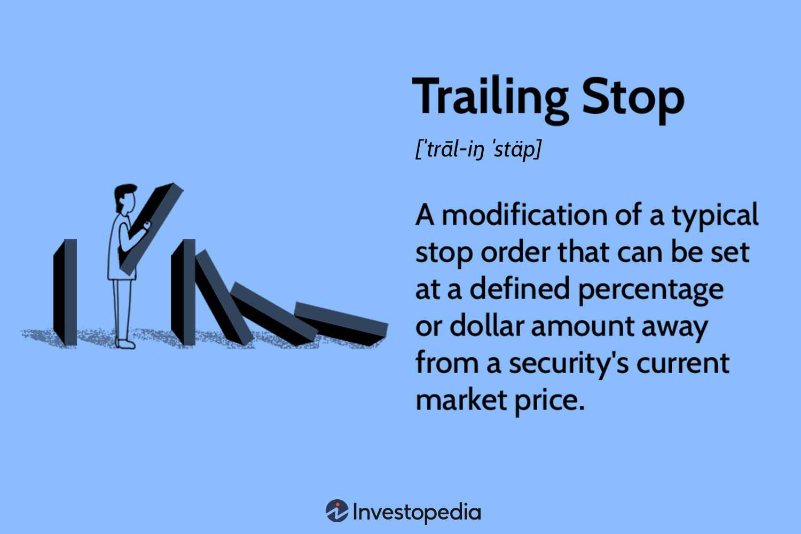

In today's fast-paced financial markets, investors are constantly seeking effective strategies to maximize their returns while managing risks. Among the various investment strategies gaining prominence is algorithmic trading, commonly referred to as algo trading. This method utilizes sophisticated computer programs to execute trades at unprecedented speeds with optimal precision, thus minimizing human intervention and errors.

A crucial strategy within this framework is the use of a trailing stop, a tool that provides dynamic risk management by adjusting stop-loss levels in accordance with the asset's price movements. This mechanism is particularly popular among traders for its dual capacity to protect investments from severe downturns while capturing upward market trends. The trailing stop adjusts automatically, moving in favor of the trade, which allows traders to lock in profits as the market moves in a favorable direction, while limiting potential losses during unfavorable fluctuations.



This article offers a comprehensive overview of the trailing stop trading strategy, detailing its integration within algorithmic trading systems. It addresses the operational nuances and technical considerations required to effectively implement this strategy. By reading on, investors will gain valuable insights into the practical benefits and potential challenges associated with trailing stops as a versatile investment tool in today's digital trading landscape.

## Table of Contents

## Understanding Algo Trading

Algorithmic trading, colloquially known as algo trading, has fundamentally transformed the landscape of modern finance. It involves the use of computer programs to automate trading decisions and execute orders based on predefined criteria. This approach to trading is critical in a financial environment where speed, precision, and data analysis are paramount.

Algo trading relies on mathematical models and algorithms to evaluate market conditions, determine optimal trade timings, and execute buy or sell orders at lightning speed. These computer programs can process vast quantities of market data far more efficiently than humans, allowing traders to capitalize on minute price discrepancies in milliseconds. The significance of algo trading in modern finance is underscored by its dominance in global markets, with estimates suggesting that a significant portion of trades in equities and foreign exchange markets are now conducted algorithmically.

One of the core advantages of algorithmic trading is its ability to execute trades at a pace unachievable by manual processes. This speed is especially crucial in high-frequency trading (HFT), a subset of algo trading that seeks to exploit very short-term market inefficiencies. Furthermore, algo trading reduces human error, offering a systematic approach that mitigates the impact of emotions and cognitive biases on investment decisions. Backtesting is another significant benefit, allowing traders to evaluate a strategy's potential effectiveness using historical data before deploying live capital.

Common [algorithmic trading](/wiki/algorithmic-trading) strategies encompass a range of techniques designed to exploit different market scenarios. Beyond the trailing stop strategy, traders often employ:

1. **Market Making**: Involving placing both buy and sell limit orders to capture the bid-ask spread.

2. **Statistical Arbitrage**: Using statistical and econometric models to profit from price discrepancies between correlated financial instruments.

3. **Mean Reversion Strategies**: Based on the assumption that prices will revert to their historical averages, these strategies capitalize on deviations from the mean.

4. **Trend Following**: Leveraging movements in market prices, this strategy seeks to buy assets in an upward trend and sell them in a downward trend.

5. **Index Arbitrage**: Exploiting the price differential between an index and its constituent stocks.

These strategies highlight the diverse applications of algo trading, each tailored to specific market conditions and objectives. As algorithmic trading continues to evolve, it is expected to further its influence, necessitating a deep understanding of its mechanisms among traders and investors.

## What is a Trailing Stop?

A trailing stop is recognized as a dynamic risk management tool used predominantly in algorithmic trading to protect profits and cap potential losses. Unlike traditional stop-loss orders, which are fixed at a specific price point below the purchase price to limit losses, a trailing stop moves with the market price, adjusting upwards as the asset price rises. When the price of an asset increases, the trailing stop keeps a fixed distance calculated as either a percentage or a dollar amount below the current market price. If the asset price decreases, the stop-loss price remains unchanged, thus capturing profits when the price retraces to this set level.

For example, consider an asset purchased at $100, and a trailing stop is set to activate at a 10% decline. Initially, the stop-loss would be set at $90. Should the asset price increase to $120, the trailing stop will adjust to $108 (10% below $120). If the price subsequently falls to $108, the asset will be sold, locking in the profit acquired when the price was higher.

Trailing stops provide several advantages over traditional stop-loss orders. They allow traders to potentially capitalize on gains made during upward price movements without the need to constantly monitor and manually adjust positions. This dynamic adjustment maintains protection against downturns while enabling continued participation in upward trends. Trailing stops can be particularly beneficial in volatile markets, where price movements can be swift and unpredictable.

To effectively implement trailing stops, adjustments based on market [volatility](/wiki/volatility-trading-strategies) and asset behavior are crucial. A volatile market requires more resilient trading strategies to avoid premature stop-loss activations due to minor market fluctuations. Adaptive algorithms may use volatility indicators like the Average True Range (ATR) to fine-tune trailing stop distances. The formula for ATR is:

$$
\text{ATR} = \frac{1}{n} \sum_{i=1}^{n} \max(H_i - L_i, |H_i - C_{i-1}|, |L_i - C_{i-1}|)
$$

where $H_i$ is the high price, $L_i$ is the low price, and $C_{i-1}$ is the previous close price over a set number of periods $n$. 

This calculation provides insight into daily price volatility, allowing traders to adjust their trailing stop margin appropriately to avoid unnecessary stop-loss triggers in a highly volatile market. Proteinenting this into an algorithm, a typical Python code snippet for setting a trailing stop may resemble the following:

```python
def calculate_trailing_stop(entry_price, current_price, trail_percent):
    trail_value = entry_price * (trail_percent / 100)
    trailing_stop = entry_price + trail_value
    return max(trailing_stop, current_price - trail_value)

entry_price = 100  # This is the initial buying price of the asset
trail_percent = 10  # Trailing stop set at 10%
current_prices = [100, 110, 120, 115, 112, 108]

for current_price in current_prices:
    trailing_stop = calculate_trailing_stop(entry_price, current_price, trail_percent)
    print(f"Current Price: {current_price}, Trailing Stop: {trailing_stop}")
```

This Python example outlines a straightforward method for dynamically adjusting the trailing stop according to market conditions, thereby offering a robust risk management strategy to traders. Integrating such strategies into algorithmic trading frameworks allows for systematic control over investment outcomes, balancing between securing potential gains and limiting losses.

## Implementing Trailing Stops in Algo Trading

Implementing trailing stops into algorithmic trading systems involves several key steps, starting with understanding the dynamics of this order type and translating them into code efficiently. This entails programming considerations, technical requirements, sample coding for constructing a basic trailing stop strategy, and the critical process of [backtesting](/wiki/backtesting) and optimization.

### Step-by-Step Guide to Integrating Trailing Stops

1. **Conceptual Design**:
   Begin by defining the logic of the trailing stop. A trailing stop typically follows the asset price by a specific percentage or amount. For instance, if a stock's price increases, the trailing stop moves upwards to lock in profits. If the stock price begins to fall, the trailing stop holds its position and executes a sell order when the price drops to the trailing stop level.

2. **Technical Requirements**:
   - **Programming Language**: Select a suitable programming language for trading algorithms like Python due to its ease of use and extensive libraries.
   - **Trading Platform/Environment**: Choose a platform that supports automated trading and allows integration with your algorithm. Examples include Interactive Brokers, MetaTrader, or QuantConnect.
   - **Market Data**: Ensure access to real-time and historical data to analyze price movements and adjust the trailing stop accordingly.

3. **Key Programming Considerations**:
   - **Real-Time Data Handling**: Implement real-time data feeds to update trailing stop levels dynamically.
   - **Event-Driven Architecture**: Use an event-driven approach to respond to price changes immediately. This may involve using WebSockets or other asynchronous data handling techniques.
   - **Order Execution**: Configure the algorithm to send stop loss orders to the broker when the trailing stop criterion is met.

4. **Algorithm Example for a Basic Trailing Stop Strategy**:

   In Python, a simple algorithm using a 5% trailing stop might look like this:

   ```python
   # Initial setup
   purchase_price = 100
   trailing_percent = 0.05
   trailing_stop_price = purchase_price * (1 - trailing_percent)

   # Function to update trailing stop
   def update_trailing_stop(current_price, trailing_stop_price, trailing_percent):
       new_stop_price = current_price * (1 - trailing_percent)
       return max(trailing_stop_price, new_stop_price)

   # Simulated market updates
   price_updates = [105, 110, 108, 112, 107, 115]

   for price in price_updates:
       trailing_stop_price = update_trailing_stop(price, trailing_stop_price, trailing_percent)
       print(f"Current Price: {price}, Trailing Stop Price: {trailing_stop_price}")

       if price <= trailing_stop_price:
           print("Sell order executed!")
           break
   ```

5. **Backtesting and Optimization**:
   - **Backtesting**: Validate the trailing stop strategy using historical data to test its performance across different market conditions. This helps identify its effectiveness and spot potential improvements.
   - **Optimization**: Fine-tune the trailing percentage and other algorithm parameters to enhance profitability and risk management. This might involve running simulations on various datasets and adjusting criteria until an optimal configuration is found.

By integrating trailing stops into an algorithm, traders can automate risk management and potentially increase returns. Proper implementation requires a blend of financial knowledge, programming skills, and continuous optimization to adapt to market conditions.

## Advantages of Trailing Stop Strategy in Algo Trading

The trailing stop strategy within algorithmic trading offers several distinct advantages, particularly in the domain of risk management and profit enhancement. By allowing a trading position to move in the direction of favorable market conditions while automatically limiting potential losses, trailing stops serve as a dynamic tool for optimizing returns.

One significant benefit of using trailing stops is their capacity to minimize potential losses. Traditional stop-loss orders remain stationary, potentially resulting in larger losses if the market moves unfavorably after the trigger level is set. In contrast, a trailing stop orders adjust dynamically with market movements. For instance, if an asset's price increases, the trailing stop rises proportionately, securing the accrued gains. This feature can be particularly advantageous in volatile markets where price movements can be swift and unpredictable.

Real-world scenarios illustrate the protective function of trailing stops. Consider a situation where an investor purchases a stock at $100 and sets a trailing stop at $10. Should the stock price rise to $120, the trailing stop would automatically move to $110, thereby locking in a $10 gain if the stock price falls. In this instance, the trailing stop acts as a safeguard against abrupt market downturns, ensuring that profits are protected even in the face of adverse price shifts.

Beyond risk management, trailing stops contribute to enhancing profitability through automated trade adjustments. By continuously recalibrating the stop level in response to market conditions, this strategy enables traders to maximize their profit potential. Unlike static strategies that might prematurely close a position, a trailing stop remains adaptive, allowing traders to capitalize on upward trends for as long as they persist.

When conducting a comparative analysis with other risk management strategies, trailing stops emerge as particularly advantageous due to their adaptability and automatic execution. Traditional stop-loss methods, while useful for setting a predetermined [exit](/wiki/exit-strategy) point, lack the flexibility inherent in trailing mechanisms. Moreover, options like hedging might provide protection but often at the cost of significant complexity and expense, which can detract from overall profitability.

In mathematical terms, consider a trailing stop where $P_t$ represents the current price, and $\Delta$ is the trailing stop distance. The stop price $S_t$ can be expressed as:

$$
S_t = \max(S_{t-1}, P_t - \Delta)
$$

This formula ensures the stop price only changes in one direction, aligning upward with price increases, thereby securing gains while maintaining loss protection.

The automation essential to trailing stops is facilitated through sophisticated algorithmic programming. Implementation using Python can be as straightforward as updating a stop price within a loop based on real-time asset data, allowing for efficient handling and execution of trades across diverse platforms.

In conclusion, the trailing stop strategy serves as an invaluable asset within algorithmic trading. It not only helps in minimizing potential losses but also enhances profitability by adapting seamlessly to market trends. Its comparative advantages over other risk management strategies, due to its flexible and automatic nature, make it a preferred choice for many traders looking to optimize their investment outcomes within dynamic financial markets.

## Challenges and Limitations

Algorithmic trading strategies like trailing stops can offer significant advantages in terms of risk management and profitability. However, they also come with their set of challenges and limitations, especially in volatile market conditions.

In volatile markets, the primary concern with trailing stops is the risk of premature stop triggers. Market noise and sudden fluctuations can cause a trailing stop to activate before the intended price movement has occurred, potentially resulting in missed opportunities. This phenomenon is particularly evident in high-frequency trading environments where price swings can mislead automated systems.

Another challenge involves the technical execution of trailing stop orders across various trading platforms. Each platform may have different programming interfaces, latency issues, and order execution capabilities, which can affect the reliability and effectiveness of trailing stops. For instance, if a platform's system lags or experiences a delay in processing price changes, it may not update the trailing stop order promptly, leading to incorrect stop loss executions.

Strategies to mitigate these challenges include optimizing the trailing stop parameters by considering asset-specific volatility and behavior. For example, setting a dynamic trailing stop mechanism that adjusts the stop distance based on the current volatility could reduce premature triggers. This can be accomplished by using techniques such as the Average True Range (ATR) to determine volatility levels, which can be integrated into the algo trading system using Python code as follows:

```python
import pandas as pd

def calculate_atr(data, period=14):
    data['H-L'] = abs(data['High'] - data['Low'])
    data['H-PC'] = abs(data['High'] - data['Close'].shift(1))
    data['L-PC'] = abs(data['Low'] - data['Close'].shift(1))

    tr = data[['H-L', 'H-PC', 'L-PC']].max(axis=1)
    atr = tr.rolling(window=period).mean()

    return atr

# Example usage
# Assuming 'df' is a DataFrame with 'High', 'Low', and 'Close' data
df['ATR'] = calculate_atr(df)
df['TrailingStop'] = df['Close'] - 2 * df['ATR']  # 2 times ATR for stop distance
```

Moreover, using [machine learning](/wiki/machine-learning) and predictive analytics to enhance decision-making processes can further refine trailing stop strategies, helping to distinguish between market noise and genuine price trends.

In conclusion, while trailing stops are powerful tools for managing trading risks, they require careful calibration and monitoring, particularly in volatile markets. Advanced techniques and ongoing adjustments are crucial to mitigating the challenges posed by rapid market movements and varying platform capabilities.

## Conclusion

The trailing stop trading strategy is a vital component within algorithmic trading, offering a dynamic approach to risk management. By automatically adjusting to favorable market movements, trailing stops provide a mechanism to lock in profits while still allowing for potential gains as asset prices rise. This flexibility makes trailing stops an essential tool for traders aiming to optimize their strategies in today's volatile markets.

Strategically, trailing stops hold substantial importance as they can significantly enhance an investor's ability to safeguard investments without the need for constant monitoring of market conditions. Their automated nature minimizes emotional decision-making, reducing the likelihood of premature exit from potentially profitable trades. This advantage is particularly beneficial in a fast-paced trading environment where rapid decision-making is paramount.

As traders explore the benefits of trailing stop mechanisms, it is crucial to remain aware of the prevailing market conditions. Market volatility, economic indicators, and asset-specific behaviors should be considered when configuring trailing stops. An inadequately set trailing stop may trigger premature selling or fail to protect against substantial losses, underscoring the importance of careful calibration.

Finally, traders and investors are encouraged to continuously educate themselves on innovative trading strategies, such as trailing stops. The rapidly evolving landscape of algo trading presents numerous opportunities for those willing to adapt and learn. By staying informed about new tools and approaches, investors can refine their strategies and improve their overall trading performance. Educational resources, industry webinars, and dedicated trading courses serve as valuable avenues for gaining the knowledge and skills necessary to thrive in algorithmic trading.

## Additional Resources

### Additional Resources

#### Recommended Books and Articles

1. **"Algorithmic Trading and DMA: An Introduction to Direct Access Trading Strategies" by Barry Johnson**  
   This book provides an in-depth understanding of algorithmic trading and includes practical examples and strategies, including trailing stops.

2. **"Quantitative Trading: How to Build Your Own Algorithmic Trading Business" by Ernie Chan**  
   Ernie Chan offers insights into developing [quantitative trading](/wiki/quantitative-trading) strategies and discusses the implementation and use of various trading models and tools.

3. **Research Papers and Articles**  
   - "The Science of Algorithmic Trading and Portfolio Management" by Robert Kissell.  
     This paper evaluates various trading strategies, addressing risk management techniques such as trailing stops.
   - "Market Microstructure: Implications for Integrated Algo Trading Strategies" – Utilizes empirical data to explore the technical elements of trading systems, focusing on stop strategies.

#### Online Courses and Webinars

1. **Coursera: "Algorithmic Trading and Finance Models with Python, R, and Stata"**  
   This [course](/wiki/best-algorithmic-trading-courses) provides comprehensive training on algorithmic trading concepts, featuring modules on risk management strategies like trailing stops.

2. **Udemy: "Algorithmic Trading: Backtest, Optimize & Automate in Python"**  
   Offers practical tutorials on coding trading strategies in Python, with emphasis on key concepts like trailing stops for risk mitigation.

3. **MIT OpenCourseWare: "Introduction to Algorithmic Trading"**  
   A free resource providing foundational knowledge on trading algorithms and their integration in financial markets, including strategies for safeguarding investments.

#### Software Tools and Platforms

1. **MetaTrader 5 (MT5)**  
   MT5 is a popular trading platform offering advanced technical analysis, and automated trading capabilities. It allows users to implement trailing stops as part of their trading systems.

2. **QuantConnect**  
   A cloud-based platform that supports algorithmic trading in multiple asset classes. It provides tools for backtesting and implementing strategies like trailing stops within its Lean Algorithm Framework.

3. **Interactive Brokers' API**  
   This API allows algorithmic traders to access robust trading functionalities, supporting complex order types like trailing stops. It provides integration with various programming languages including Python.

4. **Python's Backtrader Library**  
   Backtrader is an open-source trading platform designed for backtesting and live trading, featuring extensive support for the development and execution of strategies including trailing stops.

These resources provide a holistic view of algorithmic trading strategies, enabling practitioners to design, implement, and optimize trading systems effectively.

## References & Further Reading

[1]: Johnson, B. (2010). ["Algorithmic Trading and DMA: An Introduction to Direct Access Trading Strategies."](https://archive.org/details/algorithmictradi0000john) 4Myeloma Press.

[2]: Chan, E. (2009). ["Quantitative Trading: How to Build Your Own Algorithmic Trading Business."](https://github.com/ftvision/quant_trading_echan_book) Wiley.

[3]: Kissell, R. (2013). ["The Science of Algorithmic Trading and Portfolio Management."](https://www.sciencedirect.com/book/9780124016897/the-science-of-algorithmic-trading-and-portfolio-management) Academic Press.

[4]: Coursera. ["Algorithmic Trading and Finance Models with Python, R, and Stata."](https://www.linkedin.com/learning/algorithmic-trading-and-finance-models-with-python-r-and-stata-essential-training) Available online.

[5]: Udemy. ["Algorithmic Trading: Backtest, Optimize & Automate in Python."](https://www.udemy.com/course/algorithmic-trading-in-python/) Available online.

[6]: MIT OpenCourseWare. ["Introduction to Algorithmic Trading."](https://ocw.mit.edu/courses/6-006-introduction-to-algorithms-spring-2020/) Available online.

[7]: Backtrader. ["Backtrader: Python Backtesting Library."](https://github.com/mementum/backtrader) Available online.