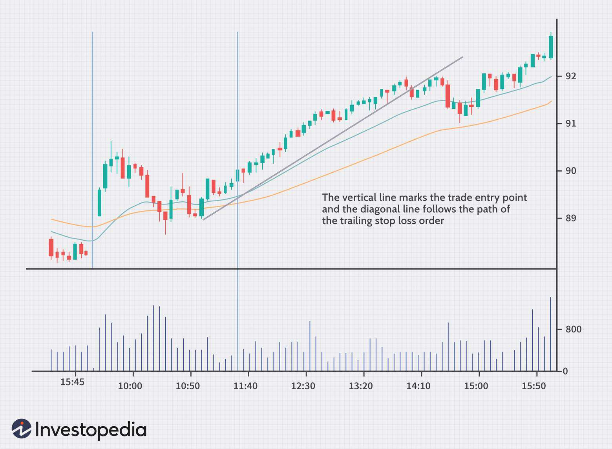

Trading in the financial markets involves various strategies to optimize risk management and maximize potential returns. At the forefront, stop-loss and trailing stop mechanisms play a crucial role in position management. These tools are indispensable for traders striving to navigate the complexities of the market, helping to minimize risks and lock in potential profits. With the advent of algorithmic trading, these mechanisms have evolved, providing new dimensions of accuracy and efficiency. Algorithmic strategies can seamlessly integrate stop-loss and trailing stop functionalities, allowing for refined risk management tailored to the dynamic landscape of market operations. This article explores the principles behind stop-loss and trailing stop orders and discusses their integration into algorithmic trading strategies. The objective is to furnish detailed insights on how traders can protect their investments while optimizing their gains using these vital techniques. Understanding and implementing these strategies is vital for any trader aiming to achieve optimal trading outcomes while safeguarding against adverse market movements.

## Table of Contents



## Understanding Stop-Loss Orders

Stop-loss orders are a fundamental component in the risk management toolkit of traders, acting as a financial safeguard against considerable losses. These orders function by automatically selling a security once it hits a predefined price, thereby preventing further downturns in value. This automation is particularly beneficial for traders who are unable to vigilantly monitor the market fluctuations continuously.

In volatile market scenarios, where prices exhibit rapid and unpredictable changes, the utility of a stop-loss is undeniably apparent. It offers a method to control risk efficiently without requiring a constant watch over the market. For instance, a trader who buys a stock at $100 might set a stop-loss order at $90. Should the stock price fall to $90, the stop-loss order would trigger an automatic sale, thereby capping the loss to approximately 10% of the initial investment.

The deployment of stop-loss orders requires strategic forethought to determine the optimal price point for exiting a trade. This involves analyzing the security's price volatility, historical price movements, and market conditions. Setting a stop-loss level too tight to the purchase price might result in the order being triggered by regular market noise, while setting it too loose could expose the trader to unwarranted losses.

Calculating the stop-loss price point can also be approached mathematically by considering the Average True Range (ATR), a measure of market volatility. A common method is to set the stop-loss at a certain multiple of the ATR away from the current price. For example:

$$
\text{Stop-Loss Price} = \text{Purchase Price} - (n \times \text{ATR})
$$

where $n$ is a factor chosen based on the trader's risk tolerance and market volatility assessment.

Effectively, utilizing stop-loss orders is about balancing risk control with flexibility, allowing traders to [exit](/wiki/exit-strategy) positions strategically under adverse market conditions.

## Exploring Trailing Stop Orders

A trailing stop order represents a sophisticated type of stop-loss order that automatically adjusts its position based on favorable market movements. Unlike standard stop-loss orders, which are static and require manual updates to modify their parameters, trailing stops are dynamic and recalibrate their stop-loss point as the market price moves positively for the trader. This automatic adjustment mechanism allows traders to effectively lock in profits while simultaneously limiting potential losses as the market fluctuates.

The trailing stop is set at a specific percentage or dollar amount below (for a long position) or above (for a short position) the current market price. As the market price moves in a favorable direction, the stop price adjusts accordingly, maintaining the set distance below or above the market price. For example, consider a trader who sets a trailing stop with a $5 drop from the highest price reached. If the stock moves from $100 to $110, the stop-loss will also move from $95 to $105, locking in profits if a reversal occurs. Should the price start to drop from this peak, the stop-loss will trigger at $105, securing the profit achieved.

The adaptive nature of trailing stops allows for greater flexibility and responsiveness to evolving market conditions. This characteristic is particularly beneficial in volatile environments, where prices can experience significant and rapid changes. The trailing stop order remains inactive until it reaches a predetermined market reversal point, at which it becomes a market order and executes based on available bids or asks.

By providing a mechanism for traders to capitalize on favorable trends without the necessity for continuous market monitoring, trailing stops facilitate more disciplined and strategic trading decisions. This allows traders to focus on broader market analyses and strategic adjustments rather than being tethered to their trading platforms for constant manual updates.

Incorporating trailing stop orders into an overall trading strategy helps protect capital and enhance profit opportunities. Traders can optimize their positions by ensuring that gains are locked while exposure to downside risks remains controlled. As such, trailing stops serve as an essential instrument in yielding optimal trading outcomes in various market contexts.

## The Synergy of Trailing Stop/Stop-Loss Combo

Combining stop-loss orders with trailing stops enhances a trading strategy by capturing potential profits during upward market movements while still providing a safety net for reversals. This dual approach optimizes the balance between risk and reward, allowing traders to continue benefiting from positive trends without substantial risk of experiencing significant drawdowns. This strategic combination requires meticulous planning, particularly in determining the appropriate percentages or price levels at which each element of the strategy will be triggered. 

For instance, consider a scenario where a trader sets a stop-loss at 5% below the purchase price to limit potential loss, while a trailing stop is set at 3% below the highest market price reached after purchase. As the market price increases, the trailing stop moves up accordingly, safeguarding accrued profits. This mechanism ensures that once the market reverses by an amount equal to the trailing percentage, the position is automatically closed, thus securing the profit attained up to that point. 

By employing a stop-loss and trailing stop combo, traders mitigate the emotional aspects of trading. Market conditions can provoke stress and impulsive decisions; relying on a pre-determined strategy supports more disciplined and rational responses to market fluctuations. The effectiveness of this approach is dependent on careful calibration of stop levels, factoring in market [volatility](/wiki/volatility-trading-strategies) and personal risk tolerance. 

Python can be used to illustrate this strategy as follows:

```python
def execute_trade_strategy(current_price, purchase_price, stop_loss_perc, trailing_stop_perc):
    stop_loss_price = purchase_price * (1 - stop_loss_perc / 100)
    trailing_stop_price = current_price * (1 - trailing_stop_perc / 100)

    if current_price <= stop_loss_price:
        return "Sell: Stop-loss triggered"
    elif current_price <= trailing_stop_price:
        return "Sell: Trailing stop triggered"

    return "Hold: No action triggered"

# Example usage
purchase_price = 100
current_price = 110
stop_loss_perc = 5
trailing_stop_perc = 3

action = execute_trade_strategy(current_price, purchase_price, stop_loss_perc, trailing_stop_perc)
print(action)
```

In this example, the code checks current market conditions against the predefined stop levels, automating decision-making and minimizing human emotional interference. Successful implementation of this strategy demands not only the right choice of parameters but also an ongoing awareness of market dynamics to make adjustments as necessary.

## Algorithmic Trading: Incorporating Stop-Loss and Trailing Stops

Algorithmic trading refers to the use of computerized systems to manage and execute trades based on pre-defined criteria. This approach significantly enhances the efficiency of trading operations and risk management by integrating tools such as stop-loss and trailing stop orders. These mechanisms are particularly effective in algorithmic contexts due to their ability to adapt quickly and automatically to market fluctuations without manual intervention.

By incorporating stop-loss and trailing stops, algorithmic systems are designed to protect capital by curbing potential losses and allowing gains to be secured as market conditions improve. A stop-loss order is set at a specific price point to prevent further losses if the market moves unfavorably, ensuring a consistent and automatic response during rapid market changes. On the other hand, a trailing stop automatically adjusts its threshold as the market price changes in a favorable direction, thereby locking in profits while providing a safety net against reversals.

The primary advantage of automating these functions is the reduction of human errors and the elimination of emotional trading decisions. By relying on preset rules and algorithms, traders are able to maintain consistency in their trading strategies, thus limiting the influence of emotions such as fear and greed. As markets can be unpredictable, the ability of an algorithm to execute orders based on logical criteria reduces the risk of impulsive decisions that might arise from volatile conditions.

Moreover, the efficacy of stop-loss and trailing stop mechanisms within [algorithmic trading](/wiki/algorithmic-trading) systems hinges heavily on thorough [backtesting](/wiki/backtesting). By simulating various market conditions, traders can assess the performance of their algorithms and make necessary adjustments before deploying them in live markets. Backtesting provides empirical data on how a strategy might perform, revealing insights that may not be immediately obvious in theoretical models. This step is crucial to ensure that the algorithms operate optimally and align with the intended risk management guidelines.

Overall, the strategic integration of stop-loss and trailing stop orders in algorithmic trading frameworks is indispensable for optimizing trading outcomes. The automation and precision offered by these systems present notable advantages, especially in dynamic market environments where speed and adaptability are paramount. As technology continues to evolve, the applications and capabilities of algorithmic trading are expected to become even more sophisticated, underscoring the importance of staying abreast of advancements in this domain.

## Trader Risks and Psychological Considerations

Trading with stop-loss and trailing stop orders involves certain risks, primarily due to market volatility, which can trigger premature stops. This can be particularly problematic in markets characterized by rapid price fluctuations, often referred to as "choppy" markets. In such cases, stop-loss orders set too tightly may cause traders to exit positions unnecessarily, leading to successive minor losses that cumulatively impact the trading account adversely.

A crucial aspect in navigating these risks is the psychological dimension of trading. Successful trading not only depends on market analysis but also on understanding and managing one's psychological responses. The fear of loss is a natural emotional reaction but can lead traders to make impulsive decisions, such as unnecessarily adjusting stop levels. This could result in missed opportunities if the market eventually moves favorably.

Setting balanced and rational points for stop orders requires an objective assessment of market conditions and an awareness of personal emotional biases. It involves considering historical price movements, current volatility levels, and individual risk tolerance. This assessment can be supported by using tools like the Average True Range (ATR) to set stops that account for normal market swings. The ATR can be calculated using Python as follows:

```python
import pandas as pd

def calculate_atr(data, period=14):
    data['High-Low'] = data['High'] - data['Low']
    data['High-Close'] = abs(data['High'] - data['Close'].shift(1))
    data['Low-Close'] = abs(data['Low'] - data['Close'].shift(1))
    true_range = data[['High-Low', 'High-Close', 'Low-Close']].max(axis=1)
    return true_range.rolling(window=period).mean()

# Example usage, assuming 'data' is a DataFrame with 'High', 'Low', 'Close' columns
atr = calculate_atr(data)
```

Maintaining a consistent strategy and temperament is essential for leveraging these tools effectively. Traders should follow a well-crafted trading plan and resist deviating from it without just cause. This discipline helps mitigate emotional influences and supports decision-making grounded in careful analysis rather than reactive impulses.

Furthermore, traders are encouraged to engage in continuous education and self-analysis to improve their skills and emotional resilience. This ongoing development aids in refining strategies and adapting to evolving market conditions, thereby enhancing the effective use of stop-loss and trailing stop mechanisms as part of a comprehensive risk management strategy.

## Choosing Between Trailing Stop and Take Profit

Trailing stops and take profit orders are fundamental tools for traders aiming to optimize their trading strategies in fluctuating markets. Trailing stops are ideal for traders who wish to capture long trends with the flexibility to adjust with market movements. This dynamic tool automatically adjusts the stop price as the market price continues to move in a favorable direction. If the market reverses by a specified amount, a sell or buy order is executed to exit the position, thereby protecting accumulated gains. This approach is particularly beneficial for traders looking to maintain a position as long as the market trend supports it without needing constant manual supervision.

In contrast, take profit orders are more suitable for traders who have a specific target gain and wish to exit their position once this profit level is reached. These orders are set at a pre-determined price level, ensuring that the position is closed at a profit when the market reaches the specified point. This method is advantageous for traders wanting to lock in profits and safeguard gains without being swayed by emotional decisions.

The decision between using trailing stops or take profit orders largely depends on an individual trader's risk tolerance, market strategy, and overall trading goals. Risk-averse traders might prefer take profit orders to secure gains quickly, while those willing to endure more market volatility for potentially larger gains might lean towards trailing stops.

A balanced strategy that incorporates both trailing stop and take profit orders can be particularly effective in managing trades. By setting precise trailing stops and take profit levels, traders can simultaneously capture potential market uptrends and guarantee exits at predetermined profit levels, thereby optimizing returns while mitigating risks.

For traders, it is essential to thoroughly evaluate market conditions and understand their personal trading style to effectively utilize these tools. Factors such as market volatility, [liquidity](/wiki/liquidity-risk-premium), and the trader's own psychological resilience should inform the choice and setup of either trailing stops, take profit orders, or a combination of both to achieve a balance between risk management and profit maximization.

## Conclusion

Implementing robust stop-loss and trailing stop strategies is pivotal for effective trading and risk management. These mechanisms provide essential safeguards and optimization tools, particularly when integrated into algorithmic trading systems. By automating the execution of these strategies, traders can take advantage of algorithmic precision and efficiency, reducing reliance on human decision-making and minimizing emotional biases that can affect trading outcomes.

The strategic application of stop-loss and trailing stop mechanisms enables traders to align their trading actions with market dynamics and specific financial goals. A well-devised strategy that adapts to changing market conditions allows for both risk mitigation and profit maximization. This approach ensures that traders capture potential gains during favorable trends while providing a safety net against adverse market movements.

Combined strategies, which incorporate both stop-loss and trailing stops, offer a comprehensive solution to managing market risks while optimizing returns. The use of dynamic methods that adjust based on market behavior can help traders achieve a balanced approach towards protecting their capital and seizing profitable opportunities. In today's complex trading environment, these strategies are indispensable for developing a sustainable trading model.

Continuous education on market intricacies and the evolving landscape of trading technologies is crucial for traders aiming to fully leverage the potential of these tools. By staying informed and adaptable, traders can refine their strategies, ensuring they are well-equipped to navigate the challenges and opportunities that arise in the financial markets.

## References & Further Reading

[1]: Pardo, R. (2008). ["The Evaluation and Optimization of Trading Strategies."](https://onlinelibrary.wiley.com/doi/book/10.1002/9781119196969) Wiley Trading.

[2]: Aldridge, I. (2013). ["High-Frequency Trading: A Practical Guide to Algorithmic Strategies and Trading Systems."](https://www.wiley.com/en-us/High+Frequency+Trading%3A+A+Practical+Guide+to+Algorithmic+Strategies+and+Trading+Systems%2C+2nd+Edition-p-9781118343500) Wiley.

[3]: Rutterford, J., & Pyper, J. (2018). ["Stop-loss and Stop-gain Orders and Individual Investor Trading Performance."](https://www.semanticscholar.org/paper/Stock-market-investors%27-use-of-stop-losses-and-the-Richards-Rutterford/8a2f997ee659e315594ef627cce6e8356b05ad9f) European Financial Management Journal.

[4]: Van Tharp, R. (2008). ["Trade Your Way to Financial Freedom."](https://www.amazon.com/Trade-Your-Way-Financial-Freedom/dp/007147871X) McGraw-Hill Education.

[5]: Brunnermeier, M. K. (2001). ["Asset Pricing under Asymmetric Information: Bubbles, Crashes, Technical Analysis, and Herding."](https://www.princeton.edu/~markus/research/papers/book0.pdf) Oxford University Press.