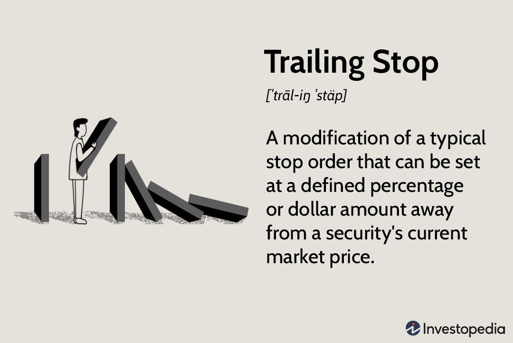

In the fast-paced world of trading, managing risk is crucial to success. This essential component of trading is about safeguarding investments against the volatility and unpredictability inherent in financial markets. Stop-loss methods are critical tools that traders employ to limit their potential losses on any given position. These orders enable traders to specify an exit point for a trade if the market moves against them, thereby reducing the emotional stress involved in decision-making and maintaining discipline in their trading approach.

This article focuses on various stop-loss strategies, placing a particular emphasis on trailing stops and their integration with algorithmic trading. Trailing stops, unlike their fixed counterparts, adjust dynamically with favorable price movements, allowing traders to lock in profits while keeping their positions open. This dynamic nature makes them especially advantageous in volatile market conditions, where price fluctuations are more pronounced.



Algorithmic trading further enhances the utility of stop-loss strategies by automating trade execution based on predefined criteria. This automation allows for consistent implementation of stop-loss orders, minimizing the emotional biases that can affect discretionary trading. In this context, trailing stops can be programmed efficiently into trading algorithms, providing a systematic approach to risk management and helping traders optimize their strategies.

By understanding these techniques, traders can improve their decision-making processes, enabling them to better navigate the complexities of financial markets. A clear grasp of various stop-loss methods, particularly within the framework of algorithmic trading, empowers traders to enhance their outcomes and potentially achieve greater returns while protecting their investments.

## Table of Contents

## Understanding Stop-Loss Orders

A stop-loss order is a fundamental tool employed by traders to manage potential losses in their investment portfolios. At its core, a stop-loss order is a predetermined instruction set to automatically sell a security once it falls to a specified price point. This mechanism serves as a protective barrier, aiming to curtail losses that might occur from unfavorable market movements.

The primary objective of a stop-loss order is to mitigate potential losses on a given position. When a security's price declines to the stop-loss level, the order is triggered, and the security is sold at the next available market price. This automatic execution helps investors avoid emotional decision-making, enabling a systematic approach to risk management.

Several types of stop-loss orders exist to cater to different trading styles and market environments. The most commonly used include fixed and trailing stops:

1. **Fixed Stop-Loss Orders**: This type of stop-loss is characterized by a static threshold set below the purchase price. For example, if a stock is bought at $50, a trader might set a fixed stop-loss at $45. This simple approach is particularly appealing to novice traders, as it establishes a clear risk threshold. However, a fixed stop-loss does not account for market volatility and could result in premature exits from trades during temporary price fluctuations.

2. **Trailing Stop-Loss Orders**: Unlike fixed stops, trailing stop-loss orders are dynamic. They adjust in tandem with the price of the security, allowing the stop price to move up as the market price increases but not decrease if the price moves against the position. This flexibility enables traders to lock in profits while still maintaining their positions open as long as the market trend is favorable.

The selection of an appropriate stop-loss strategy is contingent upon a trader's specific objectives and the prevailing market conditions. For instance, a trader operating in highly volatile markets might favor the adaptability of trailing stops while another seeking a straightforward approach might opt for fixed stops. Ultimately, the effectiveness of any stop-loss strategy hinges on its alignment with the trader's risk tolerance and overarching trading plan.

## Fixed Stop-Loss Strategies

Fixed stop-loss orders are a fundamental component of risk management in trading, offering a straightforward approach to protecting investments from significant losses. These orders are predefined at a specific price level, below the purchase price, ensuring that once the market price reaches this predetermined point, the asset is automatically sold. This mechanism helps traders restrict their losses to a predetermined amount, thereby maintaining control over potential downside risks.

For novice traders, fixed stop-loss orders serve as an accessible entry point to effective risk management. They provide a clear, uncomplicated method for ensuring that a position does not incur losses beyond a specified threshold. This simplicity is particularly valuable for those new to trading, as it eliminates the need for constant market monitoring and complex decision-making.

A fixed stop-loss order effectively acts as a safety net, guaranteeing that traders are only exposed to a loss they are prepared to absorb. The ease of setting such orders is often complemented by trading platforms that allow users to specify the stop-loss level as part of the order execution process, adding to the convenience and efficiency of this strategy.

However, the primary limitation of fixed stop-loss orders stems from their static nature. They do not adapt to changes in market conditions or price movements once set. For instance, in a rapidly changing market, a fixed stop-loss could be triggered prematurely due to short-term [volatility](/wiki/volatility-trading-strategies) rather than a sustained downturn. This drawback can lead to the liquidation of potentially profitable positions simply because the market experienced temporary fluctuations.

Consider a scenario where a trader buys a stock at $100 and sets a fixed stop-loss order at $95 to limit potential losses to 5%. If the stock price dips to $95 due to a transient market shock before rebounding, the fixed stop-loss would result in selling the stock at a loss, despite a potential for gain if the position had been maintained. This characteristic highlights the need for traders to be judicious when selecting the level at which to place stop-loss orders, taking into account the volatility and trend patterns of the particular asset being traded.

In summary, while fixed stop-loss orders are a valuable tool for mitigating risk, their rigidity may not be suitable for all trading environments. Traders must assess the market context and their risk tolerance when utilizing this strategy, ensuring that their stop-loss levels are appropriately aligned with their overall trading objectives.

 to Trailing Stop-Loss

Trailing stop-loss orders are a sophisticated type of stop-loss mechanism that automatically adjusts as the stock price moves in a favorable direction. Unlike fixed stop-loss orders, which are set at a specific price, trailing stops fluctuate with the market, allowing traders to secure profits while maintaining the opportunity for further gains. 

The essential function of a trailing stop-loss order is that it follows the stock price at a predetermined distance, known as the trailing distance. This distance can be defined either as a fixed dollar amount or as a percentage of the current market price. For instance, if a stock is purchased at $100 and a trailing stop of 5% is set, the initial stop-loss order would be at $95. If the stock price increases to $110, the trailing stop will move to $104.50, locking in profits and providing a buffer against future price declines.

Trailing stop-loss orders are particularly advantageous in volatile markets, where price fluctuations are frequent and significant. This dynamic adjustment enables traders to capitalize on upward trends without the need for constant market monitoring. For instance, in a high-volatility environment, a trailing stop allows investors to ride the price wave upwards, securing profits incrementally as the price increases.

The adaptability of trailing stops reduces the likelihood of premature exits in a growing market and minimizes risk by protecting accumulated profits. This approach can maximize gains by automatically capturing higher returns as the stock price appreciates. However, determining the appropriate trailing distance is crucial; too tight a distance could result in frequent stop-outs due to normal market noise, while too wide a distance might expose the trader to undesirable losses.

Here is a basic example in Python to illustrate a trailing stop mechanism:

```python
def update_trailing_stop(current_price, trailing_stop, trailing_distance):
    # Calculate new trailing stop
    new_trailing_stop = current_price - trailing_distance
    # Ensure the trailing stop only moves up, not down
    if new_trailing_stop > trailing_stop:
        return new_trailing_stop
    return trailing_stop

# Example usage
current_price = 110
trailing_stop = 95
trailing_distance = current_price * 0.05  # 5% trailing distance

trailing_stop = update_trailing_stop(current_price, trailing_stop, trailing_distance)
print(f"Updated trailing stop: {trailing_stop}")
```

In this example, the trailing stop is recalculated whenever the stock price increases sufficiently to justify an upward adjustment. This simple yet effective strategy helps traders automate part of their decision-making process, aligning with broader goals of maximizing profit while minimizing risk. Trailing stop-loss orders provide a flexible and responsive method to optimize investment returns in a dynamic market context.

## Implementing Trailing Stop-Loss in Trading

To effectively implement a trailing stop-loss in trading, a trader must initially determine the trailing distance, which is often calculated as a specific percentage or a fixed amount from the current market price. The trailing stop-loss technique is designed to adjust automatically as the security's price moves in the trader's favor, while remaining static when the price declines. This mechanism helps guard against substantial losses while simultaneously securing profits, all without requiring continuous oversight.

The trailing stop-loss is a dynamic tool that ensures the stop price trails by a fixed margin from the market price, only adjusting when there is a favorable movement. For instance, if an asset is purchased at $100 and the trailing stop is set at 10%, the stop-loss would begin at $90. If the asset's price rises to $120, the trailing stop adjusts upwards to $108 (i.e., 10% below the new price of $120). Should the asset's price then decline to $115, the stop-loss does not adjust downward, thereby securing a minimum [exit](/wiki/exit-strategy) price of $108 for the trader.

An essential aspect of applying a trailing stop-loss strategy is selecting the appropriate trailing distance. A trailing distance that is too narrow, such as 1-2%, may result in frequent stop-outs due to minor market fluctuations, potentially causing the trader to exit a position prematurely. Conversely, a trailing distance that is too wide might not adequately protect against significant declines, thereby risking losses exceeding the trader's risk tolerance.

Choosing the optimal trailing distance often involves [backtesting](/wiki/backtesting) and analysis of historical data to accommodate the asset's volatility and typical market patterns. Employing software tools or programming algorithms in Python can aid in determining an effective trailing distance by simulating potential outcomes across various market scenarios. An example of a simple Python implementation to calculate and update a trailing stop-loss is as follows:

```python
def update_trailing_stop(current_price, trail_perc, initial_price):
    trailing_stop = initial_price * (1 - trail_perc / 100)
    new_trail_stop = max(trailing_stop, current_price * (1 - trail_perc / 100))
    return new_trail_stop

# Example usage
current_price = 120
trail_perc = 10
initial_price = 100

print(update_trailing_stop(current_price, trail_perc, initial_price))  # Outputs 108.0
```

This straightforward approach demonstrates how the trailing stop is recalculated as the asset price changes, maintaining a stop level that guides the trader towards consistent profit capture while minimizing downside risks. Proper implementation of trailing stop-loss orders enhances a trader's ability to automate decision-making efficiently, adapting dynamically to market conditions.

## Algorithmic Trading and Stop-Loss Strategies

Algorithmic trading, often known as algo trading, is the process of using computer algorithms to execute trading decisions automatically. These algorithms are driven by a set of rules and parameters designed to determine the timing, pricing, and quantity of trades. The inclusion of stop-loss strategies within these systems significantly enhances automated decision-making by allowing traders to manage risk effectively without direct human intervention.

Incorporating stop-loss strategies in algorithmic systems provides several benefits, foremost among them being the ability to handle stop-loss orders more efficiently and with greater speed than manual trading methods. This computational efficiency is vital in volatile markets where prices can change rapidly, requiring swift execution to limit potential losses. Algorithmic trading platforms can manage both fixed and trailing stop-loss orders, adapting to diverse market conditions and trading styles.

The implementation of stop-loss strategies in algos generally involves programming predefined conditions under which the strategy should become active. For example, a fixed stop-loss strategy could be programmed to trigger a sell order when a security's price falls by a specified percentage from its purchase price. A trailing stop-loss could be programmed to adjust dynamically as the price of the asset moves in the trader's favor, thus securing gains while still minimizing potential losses.

Here's an example of how a trailing stop-loss might be implemented in Python using a simple algorithmic framework:

```python
class AlgoTrading:
    def __init__(self, initial_price, trailing_percentage):
        self.initial_price = initial_price
        self.trailing_percentage = trailing_percentage / 100
        self.stop_loss_price = initial_price * (1 - self.trailing_percentage)

    def update_price(self, current_price):
        if current_price > self.initial_price:
            self.stop_loss_price = max(self.stop_loss_price, current_price * (1 - self.trailing_percentage))
        return self.stop_loss_price

# Initialize with an initial price of $100 and trailing stop percentage of 5%
algo = AlgoTrading(initial_price=100, trailing_percentage=5)

# Assume that the prices are updated over time
for price in [102, 105, 107, 106, 110, 108]:
    stop_loss = algo.update_price(price)
    print(f"Current Price: {price}, Updated Stop-Loss Price: {stop_loss}")
```

In the code snippet, an `AlgoTrading` class is designed to handle a trailing stop-loss strategy. The `update_price()` method dynamically adjusts the stop-loss price based on the current price movements, thus illustrating the power of algorithms in managing risk systematically.

The flexibility and precision offered by algorithmic systems, combined with the automation of stop-loss strategies, make them an attractive choice for traders seeking to mitigate emotional biases. However, as with any technology, robust backtesting and consistent monitoring of these algorithms are crucial to ensure they function as intended. Additionally, algorithmic traders must be vigilant about technical issues and system failures, which could result in unintended losses if not addressed promptly.

## Advantages and Disadvantages of Trailing Stop-Loss in Algo Trading

One notable advantage of employing trailing stop-loss orders within [algorithmic trading](/wiki/algorithmic-trading) systems is the elimination of emotional bias. Human traders often fall prey to emotions such as fear and greed, which can cloud judgment and lead to inconsistent decision-making. In contrast, algorithms operate purely on predefined criteria, ensuring that trades are executed consistently in line with the specified strategy. This consistency is particularly beneficial when incorporating trailing stop-loss orders, as it allows for the systematic adjustment of stop levels without the influence of emotional responses to market fluctuations.

In addition to emotional neutrality, algorithms provide the capability to apply trailing stop-loss strategies uniformly across multiple trades. This uniformity can be particularly advantageous in managing large portfolios where manual adjustment of stop losses for each position would be impractical. By implementing a standardized approach, traders can ensure that all positions are subject to the same level of risk management, thereby enhancing overall portfolio performance.

However, the reliance on algorithmic systems necessitates thorough backtesting and ongoing monitoring. Backtesting involves simulating the algorithm’s performance using historical data to ensure its effectiveness under various market conditions. This process helps identify potential weaknesses and allows for optimization before deploying the system in live trading environments. It is crucial to regularly review algorithmic performance and adjust parameters as market dynamics evolve.

Despite rigorous backtesting, technical issues or system failures pose a significant risk. Algorithmic systems are dependent on technological infrastructure, and disruptions such as data feed errors, network outages, or software bugs can lead to unintended consequences. These issues can trigger incorrect trade executions or prevent the system from implementing the intended stop-loss adjustments. Traders must therefore establish robust contingency plans, such as redundant systems and real-time monitoring, to mitigate the impact of unforeseen technical failures.

In conclusion, while trailing stop-loss orders provide several advantages within algorithmic trading by removing emotional bias and enabling consistent application, they also require diligent planning and oversight to ensure success. Addressing the challenges associated with technical dependencies is paramount to safeguarding against potential losses and optimizing trading outcomes.

## Best Practices for Using Stop-Loss Strategies

Testing your stop-loss strategy under diverse market conditions is crucial to ascertain its robustness. This involves simulating your strategy with historical data to see how it would have performed in different scenarios. Backtesting can be implemented using various financial libraries in Python. For instance, utilizing the `[backtrader](/wiki/backtrader)` library allows for comprehensive strategy testing:

```python
import backtrader as bt

# Define a simple moving average crossover strategy
class SmaCross(bt.SignalStrategy):
    def __init__(self):
        sma1, sma2 = bt.ind.SMA(period=10), bt.ind.SMA(period=30)
        self.signal_add(bt.SIGNAL_LONG, bt.ind.CrossOver(sma1, sma2))

# Create a cerebro (the backtesting engine) object
cerebro = bt.Cerebro()

# Add strategy to the cerebro
cerebro.addstrategy(SmaCross)

data = bt.feeds.YahooFinanceData(dataname='AAPL',
                                 fromdate=datetime(2018, 1, 1),
                                 todate=datetime(2020, 12, 31))

cerebro.adddata(data)
cerebro.run()
cerebro.plot()
```

Combining stop-loss methods with other risk management tools is beneficial to create a comprehensive approach. Tools like position sizing, diversification across assets, and using derivatives for hedging can complement stop-loss strategies to mitigate risks effectively. For instance, the Kelly Criterion is a mathematical formula used to determine the optimal size of a series of bets, which can be applied to position sizing:

$$
f^* = \frac{bp - q}{b}
$$

where $f^*$ is the fraction of the capital to bet, $b$ is the odds received on the wager, $p$ is the probability of a win, and $q$ is the probability of a loss ( $q = 1 - p$ ).

Remaining updated with market news and adjusting stop-loss strategies accordingly is vital. Market conditions fluctuate due to geopolitical events, economic indicators, and company-specific news, which can all affect asset prices. By staying informed, traders can modify their strategies to protect against unforeseen volatility. Subscribing to reliable financial news sources and using economic calendars can help keep abreast of developments.

Regularly reviewing and optimizing stop-loss strategies is essential for aligning them with your trading goals. This involves analyzing past trades, evaluating the effectiveness of your stop-loss levels, and adjusting them based on performance. Reflecting on both successful and unsuccessful trades helps in understanding how external factors influenced trade outcomes, thereby allowing for more informed future adjustments. Employing a trading journal can facilitate this evaluation process by providing a structured format to log trades and insights.

By integrating these best practices, traders can enhance their stop-loss strategies, thereby fostering more disciplined trading and improved risk management.

## Conclusion

Stop-loss methods, particularly trailing stops, are essential tools for managing risk within trading strategies. These methods offer traders a means to safeguard their investments, whether they are engaged in manual trading or utilizing algorithmic systems. In manual trading, stop-loss techniques provide a disciplined approach to exit positions at predetermined loss thresholds, minimizing emotional decision-making. Trailing stops, with their capability to adapt dynamically to market price movements, offer an additional layer of flexibility by securing profits without premature exit when the market trends favorably.

Algorithmic trading systems further enhance the effectiveness of stop-loss strategies. These systems execute trades based on predefined criteria with precision and speed beyond human capability, ensuring consistent application of both fixed and trailing stop-loss orders across multiple trades. This automation can significantly reduce the emotional bias often associated with trading decisions, allowing for more systematic and disciplined risk management. However, to harness the full potential of algo-trading strategies with trailing stops, thorough backtesting and continual monitoring are crucial. This ensures the model's robustness and adaptability to various market conditions.

Implementing stop-loss strategies carefully can not only protect investments but also potentially increase returns. By minimizing downside risk and capitalizing on favorable market movements, traders can position themselves to achieve more favorable outcomes over time. Nonetheless, the environment's unpredictability necessitates understanding and regular refinement of these strategies. Consistent review and adjustment of stop-loss parameters to reflect current market conditions and trading goals are essential for sustaining success. Traders must remain vigilant, continuously calibrating their approach to maintain alignment with their overall trading objectives. In doing so, they can ensure that stop-loss methods remain effective components of their risk management toolkit.

## References & Further Reading

[1]: Balsara, N. J. (2002). ["Money Management Strategies for Futures Traders."](https://www.amazon.com/Money-Management-Strategies-Futures-Traders/dp/0471522155) Wiley.

[2]: Johnson, R. (2013). ["Algorithmic Trading & DMA: An introduction to Direct Access Trading Strategies."](https://www.amazon.com/Algorithmic-Trading-DMA-introduction-strategies/dp/0956399207) 4Myeloma Press.

[3]: Kaufman, P. J. (2013). ["Trading Systems and Methods."](https://www.amazon.com/Trading-Systems-Methods-Wiley/dp/1119605350) Wiley.

[4]: Pardo, R. (2008). ["The Evaluation and Optimization of Trading Strategies."](https://www.amazon.com/Evaluation-Optimization-Trading-Strategies/dp/0470128011) Wiley.

[5]: Ruggiero, M. (1997). ["Cybernetic Trading Strategies: Developing a Profitable Trading System with State-of-the-Art Technologies."](https://archive.org/details/cybernetictradin0000rugg) Wiley.

[6]: Chan, E. (2009). ["Quantitative Trading: How to Build Your Own Algorithmic Trading Business."](https://github.com/ftvision/quant_trading_echan_book) Wiley.