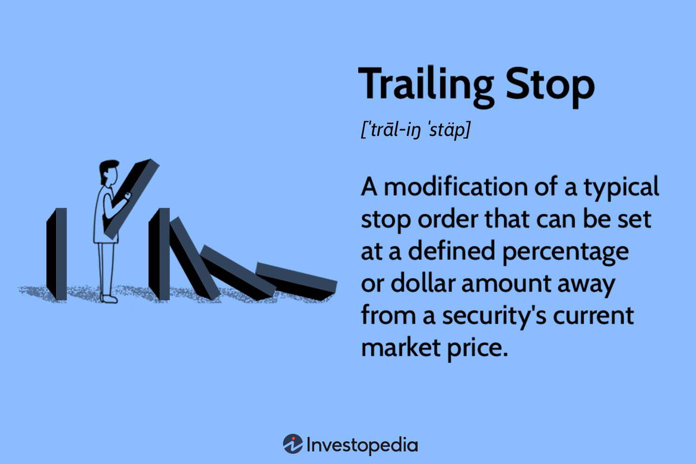

## Table of Contents

## What is a trailing stop in trading?

A trailing stop is a type of order used in trading that helps protect profits by automatically adjusting the stop price as the market price moves in your favor. When you set a trailing stop, you choose a percentage or a fixed amount that the stop price will trail behind the market price. If the market price goes up, the stop price also goes up, but if the market price goes down, the stop price stays where it is. This way, you can lock in gains while still giving the trade room to grow.

For example, if you buy a stock at $100 and set a trailing stop of 10%, the stop price will be $90 initially. If the stock price rises to $110, the stop price will move up to $99, which is 10% below the new high. If the stock price then drops to $105, the stop price stays at $99. If the stock price continues to fall and hits $99, the trailing stop order will be triggered, and the stock will be sold at the next available price, helping to protect your profits.

## How does a trailing stop work?

A trailing stop is a tool traders use to protect their profits. When you set a trailing stop, you pick a certain percentage or amount that follows the price of what you're trading. If the price goes up, the trailing stop moves up too, but it stays the same if the price goes down. This way, it helps you keep more of your gains as the price rises.

For example, imagine you buy a stock for $50 and set a trailing stop at 5%. The stop price starts at $47.50. If the stock price climbs to $60, the stop price moves up to $57, which is 5% less than $60. If the stock then drops to $58, the stop price stays at $57. If the stock keeps falling and reaches $57, the trailing stop will trigger a sell order, helping you lock in some of your profits before the price drops further.

## What are the benefits of using a trailing stop?

Using a trailing stop can help you make more money and lose less. When you use a trailing stop, it follows the price up but stays put if the price goes down. This means you can keep more of your profits as the price goes up. For example, if you buy a stock at $100 and it goes up to $120, a trailing stop can help you keep some of that $20 gain.

Another benefit is that a trailing stop can help you avoid big losses. If the price starts to fall a lot, the trailing stop will sell your stock before it loses too much value. This way, you don't have to watch the market all the time. You can set the trailing stop and let it do the work for you, helping to protect your money even when you're not looking.

## Can you explain the difference between a trailing stop and a standard stop-loss order?

A trailing stop and a standard stop-loss order both help you manage risk when you're trading, but they work a bit differently. A standard stop-loss order is set at a specific price. Once you set it, it stays at that price until the stock hits it and triggers a sell. For example, if you buy a stock at $50 and set a stop-loss at $45, it will sell your stock if the price drops to $45, no matter what happens to the price after you set the order.

On the other hand, a trailing stop moves with the price of the stock. When you set a trailing stop, you choose a percentage or a fixed amount that follows the stock's price. If the stock's price goes up, the trailing stop goes up too, but if the price goes down, the trailing stop stays where it is. This means you can keep more of your profits as the stock's price rises. For instance, if you buy a stock at $50 and set a 10% trailing stop, it starts at $45. If the stock goes up to $60, the trailing stop moves to $54. If the stock then falls to $54, it will trigger a sell, helping you lock in some of the gains you made.

## How do you set up a trailing stop on a trading platform?

Setting up a trailing stop on a trading platform is pretty easy. First, you need to find the order entry section of your trading platform. This is usually where you can place different types of orders. Look for an option that says "Trailing Stop" or something similar. Once you find it, you'll need to enter the percentage or dollar amount you want the trailing stop to be set at. For example, if you want a 5% trailing stop, you would enter 5 in the percentage field.

After you've entered the percentage or dollar amount, you'll need to confirm the order. Make sure you double-check all the details, like the stock symbol, the number of shares, and the trailing stop amount. Once everything looks good, hit the button to place the order. The trading platform will then keep track of the stock's price and adjust the stop price automatically based on the trailing stop you set. This way, you can let the platform do the work for you and help protect your profits.

## What are the common percentages or dollar amounts used for trailing stops?

When setting up a trailing stop, people often use percentages like 5%, 10%, or 15%. These percentages are common because they give a good balance between protecting profits and letting the stock's price move up. For example, if you buy a stock at $100 and set a 10% trailing stop, it starts at $90. If the stock goes up to $120, the trailing stop moves to $108, helping you keep more of your gains.

Some traders also use dollar amounts instead of percentages. Common dollar amounts for trailing stops might be $1, $2, or $5. This can be useful if you want a more fixed amount of protection. For instance, if you buy a stock at $50 and set a $2 trailing stop, it starts at $48. If the stock goes up to $60, the trailing stop moves to $58. Using dollar amounts can be simpler for some people, but it might not adjust as well to big changes in the stock's price.

## In what market conditions are trailing stops most effective?

Trailing stops work best in markets that are trending up. When the stock price keeps going higher, a trailing stop can help you keep more of your profits. It follows the price up, but stays put if the price starts to drop. This way, if the stock keeps going up, your stop price goes up too, protecting your gains. For example, if you buy a stock at $50 and it goes up to $70, a trailing stop can move your stop price from $45 to $63 if you set it at 10%. This means you can keep more of the $20 gain.

Trailing stops might not be as good in markets that move a lot but don't go in one clear direction. These are called volatile or choppy markets. In these conditions, the price might go up and down a lot, which can make the trailing stop trigger too soon. If the stop gets hit because of a small drop, you might miss out on more gains if the price goes back up. So, trailing stops are most helpful when the market is steadily going up, not when it's jumping around a lot.

## What are the potential risks or drawbacks of using trailing stops?

Using trailing stops can have some risks. One big risk is that they might get triggered too soon in a choppy market. If the stock price goes up and down a lot, the trailing stop might sell your stock during a small dip, even if the price goes back up later. This means you could miss out on more gains if the stock keeps going up after your stop gets hit.

Another drawback is that trailing stops don't always protect you from big drops. If the stock price falls really fast, the trailing stop might not be able to sell your stock at the price you set. This can happen because of something called "slippage," where the actual selling price is lower than your stop price. So, while trailing stops can help you keep more profits, they can't always stop you from losing money if the market drops a lot.

## How can trailing stops be adjusted dynamically based on market volatility?

You can adjust trailing stops based on how much the market is moving around. If the market is really jumpy, you might want to set a bigger percentage or dollar amount for your trailing stop. This way, it won't get triggered by small ups and downs, and you can keep your stock longer to see if it goes up more. For example, if the market is usually calm but starts to move a lot, you could change your trailing stop from 5% to 10% to give your stock more room to grow.

On the other hand, if the market is calm and not moving much, you might want to use a smaller trailing stop. A smaller percentage or dollar amount can help you lock in profits faster because the stock price won't move as much. So, if the market is steady, you could set your trailing stop at 3% instead of 5%. This way, you can protect your gains better when the market isn't as wild.

## Can trailing stops be used effectively in algorithmic trading strategies?

Trailing stops can be used well in algorithmic trading strategies. In algo trading, computers follow rules to buy and sell stocks. You can set up a rule that uses a trailing stop to help protect your profits. When the stock price goes up, the trailing stop moves up too, but if the price goes down, the stop stays where it is. This way, the computer can sell the stock at the right time to keep more of your gains without you having to watch the market all the time.

However, using trailing stops in algo trading also has some risks. If the market is moving a lot but not going in one clear direction, the trailing stop might get triggered too soon. This can make the computer sell the stock during a small dip, and you might miss out on more gains if the price goes back up. So, it's important to think about how much the market is moving and adjust the trailing stop to fit those conditions. This way, you can use trailing stops to help your algo trading strategy work better.

## What are some advanced techniques for optimizing trailing stop levels?

One way to make trailing stops work better is to change them based on how much the stock's price moves around. If the stock's price is jumping a lot, you might want to set a bigger trailing stop. This way, it won't sell your stock too soon during small ups and downs. For example, if the stock usually moves a lot, you could set your trailing stop at 10% instead of 5%. This gives the stock more room to grow before the stop gets hit. On the other hand, if the stock's price is pretty steady, you might want to use a smaller trailing stop, like 3%, to lock in profits faster.

Another technique is to use different trailing stops for different parts of the market. Some stocks might move more than others, so you can set different trailing stop levels for each one. For example, if you're trading tech stocks that often go up and down a lot, you might set a bigger trailing stop, like 15%. But for more stable stocks, like utilities, you might use a smaller trailing stop, like 5%. This way, you can adjust your trailing stops to fit the specific stocks you're trading, helping you protect your profits better.

## How do professional traders integrate trailing stops into their overall trading strategy?

Professional traders often use trailing stops as part of their overall trading strategy to help manage risk and protect profits. They might set a trailing stop at a certain percentage or dollar amount based on how much the stock's price usually moves. For example, if a stock tends to be pretty steady, they might use a smaller trailing stop, like 5%, to lock in gains quickly. But if the stock moves a lot, they might set a bigger trailing stop, like 10% or 15%, to give it more room to grow before selling. This way, they can keep more of their profits as the stock's price goes up.

They also think about the bigger picture when using trailing stops. Professional traders look at the overall market conditions and adjust their trailing stops to fit. If the market is really jumpy, they might use a bigger trailing stop to avoid selling too soon during small dips. But if the market is calm, they might use a smaller trailing stop to protect their gains faster. By changing their trailing stops based on how the market is acting, professional traders can use them to help their trading strategy work better and keep more of their money safe.

## References & Further Reading

[1]: ["Evidence-Based Technical Analysis: Applying the Scientific Method and Statistical Inference to Trading Signals"](https://www.amazon.com/Evidence-Based-Technical-Analysis-Scientific-Statistical/dp/0470008741) by David Aronson

[2]: ["Advances in Financial Machine Learning"](https://www.amazon.com/Advances-Financial-Machine-Learning-Marcos/dp/1119482089) by Marcos Lopez de Prado

[3]: ["Quantitative Trading: How to Build Your Own Algorithmic Trading Business"](https://www.amazon.com/Quantitative-Trading-Build-Algorithmic-Business/dp/1119800064) by Ernest P. Chan

[4]: ["Machine Learning for Algorithmic Trading"](https://github.com/stefan-jansen/machine-learning-for-trading) by Stefan Jansen

[5]: ["The New Trading for a Living: Psychology, Discipline, Trading Tools and Systems, Risk Control, Trade Management"](https://www.amazon.com/New-Trading-Living-Psychology-Discipline/dp/1118443926) by Dr. Alexander Elder