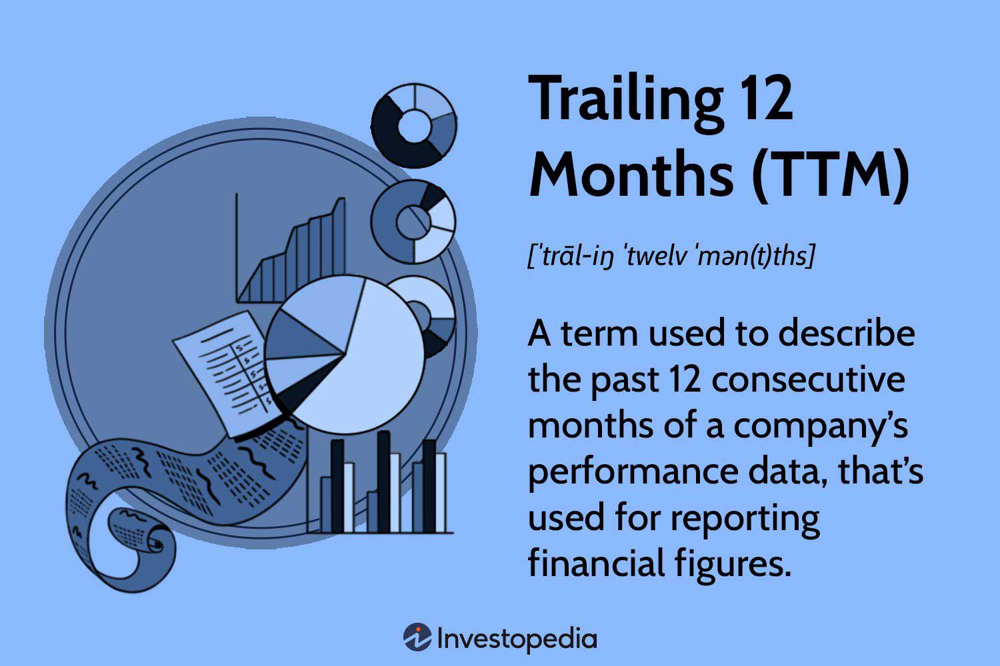

In today's fast-paced financial world, understanding key performance metrics is essential for both investors and strategy developers. Among these metrics, the Trailing Twelve Months (TTM) stands out as it offers a comprehensive view of a company's recent financial performance over the past year. By examining TTM, stakeholders can gain insights into a company's earnings, revenue, and other financial indicators more accurately than relying solely on annual reports, which may not reflect recent developments or seasonal trends.

The TTM approach strategically synthesizes data from the last twelve months, allowing for more timely and relevant analysis. This continuous update of financial information is invaluable for assessing trends and making informed decisions in an ever-evolving market landscape. As such, TTM has become a cornerstone in financial analysis, serving as a basis for calculating key metrics like earnings, price-to-earnings ratios, and yield.



Beyond traditional financial analysis, TTM is also pivotal in the field of algorithmic trading. By providing current and consistent data, TTM metrics enhance predictive models and algorithms, enabling more precise trading strategies. Traders and developers can capitalize on this information to optimize their algorithms, driving better accuracy and potentially increasing profitability in trading operations.

Throughout this article, the detailed application and benefits of TTM will be explored, highlighting its significance in integrated financial analysis and strategy development. By the end, readers will have a clearer understanding of how incorporating TTM can significantly refine financial decision-making processes, fostering a deeper understanding of corporate health and market dynamics.

## Table of Contents

## What is TTM?

Trailing Twelve Months (TTM) refers to a financial metric that encompasses data from the past 12 months, offering a rolling view of a company's performance. This approach allows stakeholders to analyze the most recent financial health status of a business, adjusting for seasonal variations and offering insights more current than traditional annual reports can provide. While an annual report offers a snapshot for a fixed period, TTM enables analysts and investors to gauge ongoing performance and make more timely assessments.

TTM is frequently utilized to calculate crucial financial metrics such as earnings, price-to-earnings (P/E) ratios, and revenue, providing stakeholders with a more responsive tool for financial analysis. For instance, TTM earnings are calculated by summing up the past four quarters' earnings, allowing for the capture of the most recent business environment impacts on financial results. Similarly, the TTM P/E ratio is determined by dividing the current stock price by the TTM earnings per share (EPS), thereby delivering a more immediate reflection of valuation relative to earnings.

The utility of TTM extends beyond the mere calculation of earnings and valuation metrics. By incorporating a period of twelve months that can shift with each new month, TTM metrics allow financial analysts to assess a company’s performance while mitigating the distortive effects of seasonality and one-time events more effectively than static annual figures. This offers investors and analysts a nuanced understanding of temporal trends and more synchronized timing for making investment decisions.

## Understanding TTM in Financial Analysis

Trailing Twelve Months (TTM) is pivotal for financial analysts who need timely updates on a company's performance beyond the confines of annual reports. By encompassing the last 12 months of financial data, TTM offers a rolling view that captures the most recent trends and patterns in a company's financial trajectory. This approach allows analysts to detect shifts in growth or decline that may not be evident in static yearly reports.

The use of TTM figures enables analysts to trace patterns over a consistent period across different quarters, providing insights into operations' cyclical or seasonal nature. For example, a company with a significant increase in TTM revenue might indicate successful new product launches or market expansion, while a decline could suggest operational challenges or shifts in consumer demand.

Furthermore, TTM figures are invaluable for cross-industry performance comparisons. Since annual reports can vary significantly due to the timing of revenue recognition, TTM metrics level the playing field by providing a uniform timeframe for comparison. This is especially useful for industries with seasonal sales patterns, such as retail or agriculture.

For a practical application, consider using Python to compute TTM revenue:

```python
# Sample data: Quarterly revenues in millions
quarterly_revenues = [100, 120, 110, 130]

# Calculate TTM Revenue
ttm_revenue = sum(quarterly_revenues[-4:])
print(f"TTM Revenue: {ttm_revenue} million")
```

In this code snippet, the total revenue over the last four quarters is calculated to assess the company's current financial health.

By regularly updating these figures, TTM provides a dynamic and responsive measure that supports more nuanced understanding and anticipation of a company's financial journey. This capability is indispensable for making informed investment decisions and adjusting strategies in real-time.

## Calculating Key TTM Metrics

Calculating key financial metrics using the Trailing Twelve Months (TTM) methodology provides valuable insights into a company's performance. Accurate calculation of TTM metrics is critical for investors and financial analysts aiming to gauge a firm's current financial health comprehensively. Below are the steps to compute common TTM metrics: TTM Revenue, TTM Yield, and TTM P/E Ratio.

### TTM Revenue

TTM Revenue is determined by summing the revenues recorded over the last four quarters. This calculation provides a continuous view of yearly performance without waiting for the fiscal year to close.

**Formula:**
$$

\text{TTM Revenue} = Q1\text{ Revenue} + Q2\text{ Revenue} + Q3\text{ Revenue} + Q4\text{ Revenue} 
$$

### TTM Yield

TTM Yield offers a consistent measure of income generation efficiency. It is calculated by averaging the yield over the past twelve months, providing an accurate reflection of the company's yield performance over the full year.

**Formula:**
$$

\text{TTM Yield} = \frac{\text{Sum of Monthly Yields over the last 12 months}}{12} 
$$

### TTM P/E Ratio

The Price-to-Earnings (P/E) Ratio, using the TTM approach, involves dividing the current stock price by the TTM Earnings Per Share (EPS). This ratio is pivotal for valuation analysis and reflects how much investors are willing to pay per dollar of earnings.

**Formula:**
$$

\text{TTM P/E Ratio} = \frac{\text{Current Stock Price}}{\text{TTM EPS}} 
$$

#### Python Code Example

Below is a Python code snippet that outlines how these calculations can be implemented programmatically, assuming the availability of input data:

```python
def calculate_ttm_revenue(quarterly_revenues):
    """ Calculate TTM Revenue from a list of four quarterly revenues """
    return sum(quarterly_revenues)

def calculate_ttm_yield(monthly_yields):
    """ Calculate TTM Yield from a list of twelve monthly yields """
    return sum(monthly_yields) / len(monthly_yields)

def calculate_ttm_pe_ratio(current_stock_price, ttm_eps):
    """ Calculate TTM P/E Ratio given current stock price and TTM EPS """
    return current_stock_price / ttm_eps

# Example input data
quarterly_revenues = [1000, 1100, 1050, 1150]
monthly_yields = [0.02, 0.018, 0.019, 0.02, 0.017, 0.021, 0.022, 0.016, 0.02, 0.019, 0.018, 0.02]
current_stock_price = 150
ttm_eps = 5

# Calculations
ttm_revenue = calculate_ttm_revenue(quarterly_revenues)
ttm_yield = calculate_ttm_yield(monthly_yields)
ttm_pe_ratio = calculate_ttm_pe_ratio(current_stock_price, ttm_eps)

print(f"TTM Revenue: {ttm_revenue}")
print(f"TTM Yield: {ttm_yield}")
print(f"TTM P/E Ratio: {ttm_pe_ratio}")
```

These calculations demonstrate the simplicity and effectiveness of utilizing TTM metrics to gain insights into financial performance promptly without waiting for annual reports. By understanding and calculating these metrics, financial professionals can make more informed decisions based on up-to-date data.

## Application of TTM in Algo Trading

Algorithmic trading significantly benefits from incorporating Trailing Twelve Months (TTM) metrics, as these metrics provide timely data reflective of a company's financial performance over the last year. TTM's rolling nature offers dynamic insights that are crucial for constructing and refining predictive models used in [algorithmic trading](/wiki/algorithmic-trading). These models depend on accurate and up-to-date financial data to predict market trends and enable informed decision-making.

Incorporating TTM metrics into algorithms can enhance trading accuracy. By using data that accounts for seasonal fluctuations and most recent market conditions, TTM offers a more stable basis for predictions compared to static annual reports. For instance, TTM Revenue or TTM Earnings Per Share (EPS) can serve as inputs in algorithms, ensuring that these reflect the latest financial health of the company being evaluated.

Consider the scenario where a trading algorithm aims to predict stock price movements based on the company's profitability trends. By utilizing the TTM Price-to-Earnings (P/E) ratio, the algorithm can determine if the stock is undervalued or overvalued in comparison to its earnings over the past 12 months. This is calculated as:
$$
\text{TTM P/E Ratio} = \frac{\text{Current Stock Price}}{\text{TTM EPS}}
$$

Python can be employed to implement these calculations within an algorithm:

```python
def calculate_ttm_pe_ratio(current_stock_price, ttm_eps):
    return current_stock_price / ttm_eps

# Example usage
current_stock_price = 250.0
ttm_eps = 12.5
ttm_pe = calculate_ttm_pe_ratio(current_stock_price, ttm_eps)
print(f'TTM P/E Ratio: {ttm_pe}')
```

Moreover, by continuously updating TTM metrics in an algorithm, trading strategies can be adjusted to reflect recent performance trends. This adaptability is crucial in high-frequency trading, where rapid responses to market changes are necessary for profitability.

The integration of TTM data enables traders to construct algorithms that not only react to historical data but also anticipate future market movements. This foresight can enhance the profitability of trading strategies by reducing exposure to risks associated with outdated information. In conclusion, TTM metrics are invaluable in the development of sophisticated algorithmic trading models, enhancing both accuracy and financial gains.

## Advantages of Using TTM

Trailing Twelve Months (TTM) is a financial metric that provides a balanced perspective by incorporating current data with seasonal trends, making it a valuable tool for both investors and analysts. This balanced view is made possible as TTM captures the latest available data for the last twelve months, rather than fixed annual periods, allowing for a nuanced understanding of a company's financial performance.

One primary advantage of using TTM is its capacity for continuous performance evaluation. By offering a rolling assessment of financial outcomes, TTM enables stakeholders to monitor performance consistently and react promptly to any emerging trends or changes. This continuous evaluation is crucial in fast-paced financial markets where timely decisions can significantly impact investment success.

Additionally, TTM is effective in reducing noise from potential fluctuations. By focusing on the most recent data, TTM performs a smoothing function that filters out anomalies typical of any shorter reporting periods. This approach allows the formulation of a more accurate picture of a company's operational health, minimizing the impact of short-lived variations that might confuse the analysis when using quarterly results.

The methodology for computing TTM can be illustrated through basic calculations. For example, to calculate TTM revenue, investors sum the revenues of the last four quarters. This simple aggregation helps analysts gain clarity regarding ongoing revenue trends unaffected by the distortions of seasonal variability. The same approach applies to other metrics like TTM Yield or TTM P/E Ratio, where understanding the average yield or price-to-earnings based on the most recent data enhances decision accuracy.

To summarize, TTM provides a relatable, up-to-date financial performance measure, positioning it as a critical tool in both individual investment strategies and broader market analyses. Through its balanced approach, TTM supports better investment decision-making by enabling users to discern genuine trends from mere statistical noise.

## Challenges and Considerations

TTM analysis stands out as a vital tool for investors and analysts aiming to assess a company's financial performance over the latest twelve-month period. However, its effective utilization requires accurate assembly and interpretation of quarterly data. One major challenge is the necessity for precision in data collection. Financial statements must be meticulously examined to extract quarterly results, ensuring that they are comprehensive and reflective of the business's operation during the period.

Comparing companies across different sectors using TTM can yield misleading conclusions due to varying industry characteristics and cycles. For instance, capital-intensive industries may have different operational patterns compared to service-based sectors. Therefore, investors should focus on comparing companies within the same sector to derive meaningful insights. This careful sector-specific approach allows for a nuanced understanding of the competitive landscape and relative financial performance.

TTM should ideally be part of a broader analytical toolkit. While it offers a rolling view of performance, integrating TTM with other financial analysis tools can provide a more robust perspective. Techniques such as discounted cash flow (DCF) analysis, ratio analysis, or Monte Carlo simulations can complement TTM by addressing its temporal limitations or by considering forward-looking projections. By doing so, analysts can achieve a balanced evaluation that factors in both historical performance and future expectations, mitigating the noise inherent in standalone TTM metrics. 

Ultimately, understanding these challenges and integrating TTM with other financial metrics ensures a comprehensive analysis, enhancing decision-making accuracy.

## Conclusion

As financial landscapes continue to evolve, the Trailing Twelve Months (TTM) metric remains a crucial tool for thorough analysis and strategic decision-making. TTM serves as a flexible and timely financial measure, capturing the most recent year of data while adjusting for seasonal variations. Its application in financial analysis allows analysts to track trends and patterns in a company's performance, offering a clearer picture than traditional annual reports. By providing continuous updates on earnings, revenue, and other key metrics, TTM empowers investors to make informed decisions quickly, reducing potential risks associated with outdated information.

In algorithmic trading, TTM metrics play a pivotal role by delivering current and precise financial data crucial for predictive models. Algorithms thrive on reliable and frequent data inputs, and TTM metrics ensure that trading strategies are based on the most recent financial health indicators. This results in improved accuracy and profitability of trades, as algorithms can swiftly adapt to market changes.

Understanding and effectively utilizing TTM data can significantly enhance financial acumen for both individuals and companies. By maintaining a balance between past performance and current trends, TTM enables a nuanced approach to evaluating corporate health. This dynamic measure acts not only as a barometer of present-day company success but also as a guide for future strategic directions. As the demand for real-time financial insights grows, mastering TTM analysis will become increasingly essential for staying competitive in the fast-paced financial world.

## References & Further Reading

[1]: ["Advances in Financial Machine Learning"](https://www.amazon.com/Advances-Financial-Machine-Learning-Marcos/dp/1119482089) by Marcos Lopez de Prado

[2]: ["Evidence-Based Technical Analysis: Applying the Scientific Method and Statistical Inference to Trading Signals"](https://www.amazon.com/Evidence-Based-Technical-Analysis-Scientific-Statistical/dp/0470008741) by David Aronson

[3]: ["Machine Learning for Algorithmic Trading: Predictive models to extract signals from market and alternative data for systematic trading strategies with Python"](https://github.com/stefan-jansen/machine-learning-for-trading) by Stefan Jansen

[4]: ["Quantitative Trading: How to Build Your Own Algorithmic Trading Business"](https://www.amazon.com/Quantitative-Trading-Build-Algorithmic-Business/dp/0470284889) by Ernest P. Chan

[5]: He, C. J., & Clark, B. (2015). ["TTM P/E ratio and stock returns"](https://smartasset.com/investing/what-is-a-good-pe-ratio). The North American Journal of Economics and Finance, 31, 59–69.