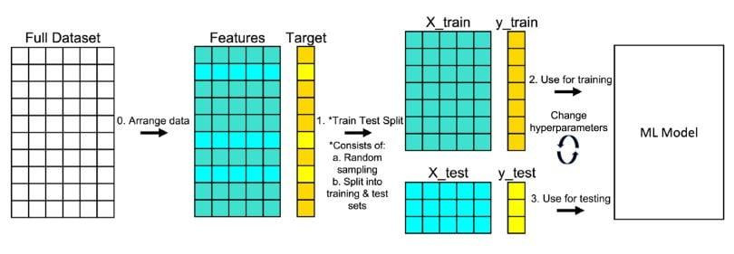

## Table of Contents

## What is a train-test split?

A train-test split is a way to divide a dataset into two parts: one for training a model and the other for testing it. When you want to build a machine learning model, you use the training part to teach the model how to make predictions. This part of the data helps the model learn patterns and relationships.

The testing part is used to see how well the model performs on new, unseen data. By using data that the model hasn't seen during training, you can check if it can make good predictions on new information. This helps you understand if the model is reliable and can be used in real situations.

## Why is it important to split data into training and testing sets?

Splitting data into training and testing sets is important because it helps us make sure our machine learning model works well. When we train a model, we want it to learn from some data and then be able to make good guesses on new data it hasn't seen before. If we use all our data to train the model, we won't know if it can really do this. By keeping some data separate for testing, we can see how the model performs on new information.

Using a test set also helps us avoid a problem called overfitting. Overfitting happens when a model learns the training data too well, including any mistakes or random patterns in it. This can make the model perform badly on new data because it's too focused on the training data. By testing the model on a separate set of data, we can see if it's overfitting and make changes to improve it. This way, we can trust that our model will work well in real situations.

## How does a train-test split help in evaluating model performance?

A train-test split helps in evaluating model performance by giving us a way to see how well the model works on new data. When we train a model, we use the training data to teach it how to make predictions. But we need to know if it can make good guesses on data it hasn't seen before. That's where the test data comes in. By using the test data, we can see how well the model performs on new, unseen information. This tells us if the model is reliable and can be used in real situations.

Using a train-test split also helps us check for a problem called overfitting. Overfitting happens when a model learns the training data too well, including any mistakes or random patterns. This can make the model do badly on new data because it's too focused on the training data. By testing the model on a separate set of data, we can see if it's overfitting. If the model does much worse on the test data than on the training data, it might be overfitting. This helps us make changes to the model to make it better and more reliable.

## What is the typical ratio used for train-test split?

The most common ratio for a train-test split is 80-20. This means 80% of the data is used for training the model, and 20% is used for testing it. This ratio is popular because it gives the model enough data to learn from while still keeping a good amount of data to test how well it works on new information.

Sometimes, people use other ratios like 70-30 or 90-10, depending on how much data they have and what they need. If you have a lot of data, using more for training (like 90%) can help the model learn better. But if you don't have much data, you might want to use more for testing (like 30%) to make sure the model works well on new data. The key is to find a balance that works best for your specific situation.

## How do you perform a train-test split in Python using scikit-learn?

To perform a train-test split in Python using scikit-learn, you first need to import the necessary library and function. You can do this by writing `from sklearn.model_selection import train_test_split` at the beginning of your code. After importing, you can use the `train_test_split` function to split your data. You need to pass your features (usually called `X`) and your target variable (usually called `y`) into the function. You can also set the `test_size` parameter to decide the ratio of the split. For example, if you want an 80-20 split, you would set `test_size=0.2`.

Once you have set up the function, you can call it and assign the results to new variables. For example, you might write `X_train, X_test, y_train, y_test = train_test_split(X, y, test_size=0.2, random_state=42)`. The `random_state` parameter is used to make sure you get the same split every time you run your code, which is helpful for reproducibility. After running this code, `X_train` and `y_train` will contain the data for training your model, while `X_test` and `y_test` will contain the data for testing it. You can then use these new datasets to train and evaluate your model.

## What are the potential issues with not using a train-test split?

If you don't use a train-test split, you might run into big problems with your [machine learning](/wiki/machine-learning) model. Without splitting your data, you'll use all of it to train your model. This means you won't have any new data to check how well your model works on information it hasn't seen before. It's like studying for a test using all the questions you'll be asked. You might do great on those questions, but you won't know if you can answer new ones.

Another issue is that your model might overfit. Overfitting happens when your model learns the training data too well, including any mistakes or random patterns. If you use all your data for training, your model might become too focused on that specific data and not be able to make good guesses on new data. This can make your model seem better than it really is because it's not being tested on new information. Using a train-test split helps you avoid these problems and make sure your model works well in real situations.

## Can you explain the concept of overfitting and how train-test split helps prevent it?

Overfitting is when a machine learning model learns too much from the training data, including any mistakes or random patterns. It's like memorizing a test instead of learning the material. When a model overfits, it might do really well on the training data but not so well on new data because it's too focused on what it already knows. This can make the model seem better than it really is because it's not being tested on new information.

Using a train-test split helps prevent overfitting by giving the model a chance to learn from some data and then be tested on new data. When you split your data, you use part of it to train the model and keep the rest for testing. This way, you can see how well the model does on data it hasn't seen before. If the model does much worse on the test data than on the training data, it might be overfitting. By checking this, you can make changes to the model to make it better and more reliable for real situations.

## What is cross-validation and how does it relate to train-test split?

Cross-validation is another way to check how well a machine learning model works. It's like doing the train-test split many times in different ways. Instead of just splitting the data once into a training set and a test set, you split it into many smaller parts. You train the model on all but one part, and then you test it on the part you left out. You do this over and over, using a different part for testing each time. This helps you see how well the model works on different pieces of the data.

Cross-validation is related to train-test split because both methods help you check if your model is overfitting. With a train-test split, you only get one chance to see how your model does on new data. But with cross-validation, you get many chances because you're testing the model on different parts of the data. This can give you a better idea of how well your model will work in real situations. So, while a train-test split is simpler and faster, cross-validation can give you a more reliable picture of your model's performance.

## How can you ensure that your train and test sets are representative of the overall dataset?

To make sure your train and test sets are representative of the overall dataset, you need to split the data in a way that keeps the same mix of different types of data in both sets. For example, if your dataset has equal parts of different categories, like different types of animals, you want the same balance in your train and test sets. This can be done by using a method called stratified sampling, which makes sure each category is split in the same way. This way, your model learns from a good mix of data and is tested on a similar mix, making it more likely to work well on new data.

Another way to ensure representativeness is by using a random split but setting a random seed. This means you use a number to make sure the split is the same every time you run your code. By doing this, you can check if the split is fair and adjust it if needed. If you find that the split isn't representative, you can try different random seeds until you get a good one. This helps make sure your model is trained and tested on data that looks like the whole dataset, which is important for making sure it works well in real situations.

## What are stratified splits and when should they be used?

Stratified splits are a way to divide your data into training and testing sets while keeping the same mix of different types of data in both sets. Imagine you have a dataset with different categories, like different types of animals. If you want to make sure your model learns from a good mix of these animals, you use a stratified split. This method makes sure that each category is split in the same way, so if 20% of your data is cats, then 20% of your training set and 20% of your test set will also be cats. This helps your model learn and be tested on data that looks like the whole dataset.

You should use stratified splits when the different categories in your data are important for what you're trying to predict. For example, if you're trying to predict if someone will like a movie based on their age group, you want to make sure each age group is well-represented in both your training and testing sets. This way, your model will learn from a good mix of ages and be tested on a similar mix, making it more likely to work well on new data. Stratified splits are especially useful when you have imbalanced data, where some categories are much more common than others, to make sure your model doesn't ignore the less common categories.

## How does the size of the training set affect model performance?

The size of the training set can really change how well a machine learning model works. When you have a bigger training set, your model gets to see more examples and learn from them. This can help the model find patterns and make better guesses. But if your training set is too small, the model might not see enough examples to learn well. It might miss important patterns or even start to overfit, which means it learns the training data too well and doesn't do as well on new data.

On the other hand, having a very big training set isn't always the best either. Sometimes, adding more data doesn't help the model much because it already knows enough. Also, bigger datasets can take longer to train and need more computer power. So, you need to find a good balance. The right size of the training set depends on your data and what you're trying to predict. Trying different sizes can help you see what works best for your model.

## What advanced techniques can be used to optimize the train-test split process?

One advanced technique to optimize the train-test split process is called k-fold cross-validation. Instead of just splitting your data once into a training set and a test set, you split it into k smaller parts. You train your model on all but one part, and then you test it on the part you left out. You do this over and over, using a different part for testing each time. This helps you see how well your model works on different pieces of the data. It's like doing the train-test split many times in different ways, which can give you a better idea of how well your model will work in real situations.

Another technique is called stratified k-fold cross-validation. This is similar to k-fold cross-validation, but it makes sure that each smaller part has the same mix of different types of data as the whole dataset. This is really helpful when you have different categories in your data that are important for what you're trying to predict. For example, if you're trying to predict if someone will like a movie based on their age group, you want to make sure each age group is well-represented in each part. This way, your model learns from a good mix of data and is tested on a similar mix, making it more likely to work well on new data.

## References & Further Reading

[1]: Bergstra, J., Bardenet, R., Bengio, Y., & Kégl, B. (2011). ["Algorithms for Hyper-Parameter Optimization."](https://papers.nips.cc/paper/4443-algorithms-for-hyper-parameter-optimization) Advances in Neural Information Processing Systems 24.

[2]: ["Advances in Financial Machine Learning"](https://www.amazon.com/Advances-Financial-Machine-Learning-Marcos/dp/1119482089) by Marcos Lopez de Prado

[3]: ["Evidence-Based Technical Analysis: Applying the Scientific Method and Statistical Inference to Trading Signals"](https://www.amazon.com/Evidence-Based-Technical-Analysis-Scientific-Statistical/dp/0470008741) by David Aronson

[4]: ["Machine Learning for Algorithmic Trading"](https://github.com/stefan-jansen/machine-learning-for-trading) by Stefan Jansen

[5]: ["Quantitative Trading: How to Build Your Own Algorithmic Trading Business"](https://books.google.com/books/about/Quantitative_Trading.html?id=j70yEAAAQBAJ) by Ernest P. Chan