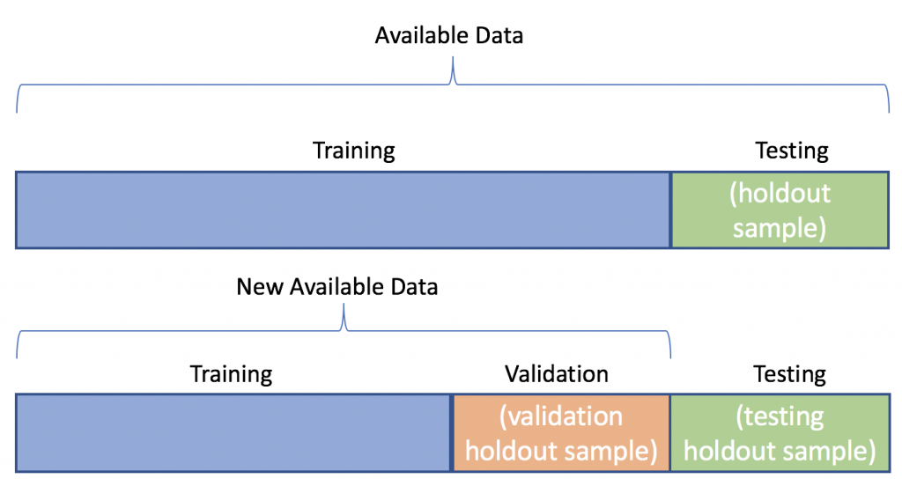

## Table of Contents

## What is training data?

Training data is the information used to teach a computer program, called a machine learning model, how to do its job. Imagine you're teaching a friend to cook a new dish. You show them different ingredients, explain how to mix them, and let them practice until they get it right. Similarly, training data is like the ingredients and instructions you give to a computer. It includes examples that the model studies to learn patterns and make predictions or decisions.

For example, if you want a computer to recognize pictures of cats, you would show it many pictures of cats. These pictures are the training data. The computer looks at these images, learns what features make up a cat, like whiskers and ears, and then can identify cats in new pictures it hasn't seen before. The more and better quality training data you provide, the better the computer gets at its task.

## Why is training data important in machine learning?

Training data is really important in machine learning because it's like the teacher for the computer. When you want a computer to do something new, like tell the difference between a dog and a cat, you need to show it lots of examples. These examples are the training data. The computer looks at these examples and learns from them. The more examples it sees, the better it gets at figuring out what makes a dog a dog and a cat a cat.

If the training data is good and has lots of different examples, the computer can learn to do its job well. But if the training data is not good, maybe because it doesn't have enough examples or the examples are all the same, the computer might not learn the right things. This can make the computer make mistakes when it tries to do its job with new examples it hasn't seen before. So, having good training data is key to making sure the computer can learn and work well.

## How is training data collected?

Training data is collected in many ways, depending on what the computer needs to learn. Sometimes, people gather data from the internet, like pictures or text, that they can use to teach the computer. For example, if you want the computer to recognize different types of birds, you might download lots of bird pictures from websites. Other times, data is collected by setting up cameras or sensors to capture information in the real world. For instance, if you're teaching a computer to drive a car, you might use cameras on real cars to record videos of roads and traffic.

Another way to collect training data is by using data that companies already have. Many businesses keep records of things like customer purchases or website visits. This data can be used to train computers to do things like suggest products to customers or predict how many people will visit a website. Sometimes, people also create new data on purpose. They might hire people to label pictures or write text to make sure the computer gets exactly the right kind of examples it needs to learn.

Collecting good training data can be a big job. It's important to make sure the data is varied and represents the real world well. If the data is too similar or doesn't cover all the situations the computer might see, the computer might not learn well. So, people spend a lot of time and effort making sure they have the right kind of data to teach the computer effectively.

## What are the common sources of training data?

Training data can come from many places. One common source is the internet. People can download pictures, videos, or text from websites to use as training data. For example, if you want to teach a computer to recognize different types of flowers, you might use pictures of flowers from the internet. Another source is data that companies already have. Businesses often keep records of things like what customers buy or how they use a website. This information can be used to train computers to do things like suggest products to customers or predict how busy a website will be.

Another way to get training data is by setting up cameras or sensors in the real world. For instance, if you're teaching a computer to drive a car, you might use cameras on real cars to record videos of roads and traffic. Sometimes, people also create new data on purpose. They might hire people to label pictures or write text to make sure the computer gets the right kind of examples it needs to learn. This can be a big job, but it's important to make sure the data is good and covers all the situations the computer might see.

Collecting good training data is really important. It needs to be varied and represent the real world well. If the data is too similar or doesn't cover all the situations the computer might see, the computer might not learn well. So, people spend a lot of time and effort making sure they have the right kind of data to teach the computer effectively.

## What are the key characteristics of good training data?

Good training data needs to be diverse. This means it should include many different examples so the computer can learn about all the possible situations it might see. If you're teaching a computer to recognize dogs, the training data should have pictures of all kinds of dogs, like big dogs, small dogs, dogs with different fur colors, and dogs in different places. This helps the computer understand that dogs can look very different but still be dogs. If the data only has pictures of one type of dog, the computer might not recognize other types of dogs.

Another important thing about good training data is that it should be accurate. This means the examples in the data should be labeled correctly. If you're teaching a computer to tell the difference between cats and dogs, all the pictures labeled as cats should really be cats, and all the pictures labeled as dogs should really be dogs. If the labels are wrong, the computer will learn the wrong things and make mistakes. So, it's important to check the data carefully and make sure everything is labeled right.

Lastly, good training data should be large enough. The more examples the computer sees, the better it can learn. If you only show the computer a few pictures of dogs, it might not learn enough to recognize dogs well. But if you show it thousands of pictures, it can learn a lot more about what makes a dog a dog. So, having a big enough set of data is really important for the computer to learn well.

## How does the quality of training data affect model performance?

The quality of training data is really important for how well a computer model works. If the data is good, the computer can learn the right things and do its job well. Good data means it has lots of different examples, and all the examples are labeled correctly. When the computer sees many different kinds of examples, it can understand all the different ways something might look or happen. This helps the computer make better guesses or decisions when it sees new things it hasn't seen before.

On the other hand, if the training data is not good, the computer might not learn well and could make a lot of mistakes. Bad data might have too few examples, or all the examples might be too similar. For example, if you're teaching a computer to recognize cats but only show it pictures of black cats, it might not recognize cats that are different colors. Also, if the labels are wrong, the computer will learn the wrong things. So, having good quality training data is key to making sure the computer can learn and work well.

## What are some common challenges in managing training data?

Managing training data can be tricky because it's hard to make sure you have enough good examples. You need a lot of different kinds of data to teach the computer well. If you don't have enough, or if the examples are too similar, the computer might not learn all the things it needs to know. For example, if you're teaching a computer to recognize different types of birds, you need pictures of many different birds, not just a few. It's also important to keep updating the data, because the world changes and new things come up that the computer needs to learn about.

Another challenge is making sure the data is labeled correctly. If the labels are wrong, the computer will learn the wrong things and make mistakes. Labeling data can take a lot of time and effort, especially if you need a lot of examples. Sometimes, people have to look at each example and decide what it is, which can be slow and hard work. It's also important to make sure the data is clean and doesn't have any mistakes or missing parts, because these can confuse the computer and make it harder for it to learn.

## How can biases in training data be identified and mitigated?

Biases in training data can be found by looking closely at the data and checking if it represents the real world well. If the data only shows certain kinds of people or situations, it might be biased. For example, if you're teaching a computer to recognize faces but only use pictures of people from one country, the computer might not recognize faces from other countries well. To find these biases, you can use tools that help you see if the data is missing some groups or if it's too focused on others. You can also ask people from different backgrounds to look at the data and tell you if they see any problems.

To fix biases in training data, you need to make the data more diverse. This means adding more examples that show different kinds of people or situations. If you found that your face recognition data only has pictures of young people, you can add pictures of older people too. Another way to help is by using special methods in the computer program that try to balance out the biases. These methods can make the computer pay more attention to the examples that are not well represented in the data. By doing these things, you can make the training data better and help the computer learn more fairly.

## What techniques are used to preprocess and augment training data?

Preprocessing training data means cleaning and preparing the data so the computer can use it better. One common technique is to remove or fix any mistakes in the data, like missing information or wrong labels. This helps make sure the computer learns from good examples. Another technique is to change the data into a format that the computer can understand easily. For example, if you're working with pictures, you might resize them or change them to black and white to make them simpler. You can also normalize the data, which means making all the numbers in the data fit into a certain range, so the computer can compare them more easily.

Augmenting training data means adding more examples to the data to make it better. One way to do this is by creating new examples from the ones you already have. For example, if you're teaching a computer to recognize pictures of dogs, you can take one picture and make new pictures by flipping it, rotating it, or changing its brightness. This gives the computer more examples to learn from without having to collect new data. Another way to augment data is by adding examples that are missing from the data. If your data doesn't have enough pictures of dogs in different places, you can add more pictures of dogs in parks, streets, or houses to make the data more diverse. This helps the computer learn about all the different situations it might see.

## How does the size of the training dataset impact model training?

The size of the training dataset is really important for how well a computer model learns. When you have a big dataset, the computer gets to see a lot of different examples. This helps it understand all the different ways something might look or happen. For example, if you're teaching a computer to recognize cats, a big dataset with lots of cat pictures will show it cats of different colors, sizes, and in different places. This makes the computer better at recognizing cats in new pictures it hasn't seen before. If the dataset is too small, the computer might not see enough examples to learn everything it needs to know, and it could make more mistakes.

But, having a big dataset isn't always enough. The quality of the data matters too. Even if you have a lot of data, if it's all the same or if it's labeled wrong, the computer won't learn well. So, it's important to make sure the data is diverse and correct. Also, bigger datasets can take longer to process and might need more powerful computers to work with. But if you can manage a big, good-quality dataset, it usually helps the computer learn better and perform better at its job.

## What are the ethical considerations when using training data?

When using training data, it's important to think about ethics. This means making sure the data doesn't hurt or treat people unfairly. One big thing to watch out for is bias. If the data only shows certain kinds of people or leaves out others, the computer might learn to make decisions that are not fair. For example, if a computer is taught to approve loans using data that mostly comes from one group of people, it might not work well for people from other groups. So, it's important to check the data carefully and make sure it represents everyone fairly.

Another ethical issue is privacy. People's personal information should be kept safe and not used without their permission. When collecting data, it's important to ask people if they're okay with their information being used. Also, the data should be stored securely so no one can steal it. Sometimes, you can use special methods to hide people's identities in the data, like blurring faces in pictures or changing names in records. This helps protect privacy while still letting the computer learn from the data.

## How can one evaluate the effectiveness of training data in model performance?

To evaluate how well training data helps a computer model work, you can use a part of the data to test the model. This part is called the validation set. You train the model with the rest of the data and then see how it does on the validation set. If the model does well on the validation set, it means the training data was good and the model learned a lot. But if the model makes a lot of mistakes, it might mean the training data wasn't good enough or didn't have enough different examples.

Another way to check the effectiveness of training data is by looking at how the model does on new data it hasn't seen before. This is called the test set. If the model can still do well on the test set, it shows that the training data was diverse and covered a lot of different situations. But if the model does poorly on the test set, it might mean the training data was too similar or didn't include all the things the model needs to know. By using both the validation set and the test set, you can get a good idea of how well the training data helped the model learn.

## What is the Importance of Quality Training Data?

The quality of training data fundamentally determines the accuracy and efficacy of trading algorithms. At the core of algorithmic trading lies the ability of a model to discern meaningful patterns in financial data and predict future market behavior. High-quality training data provides a solid foundation for these algorithms, ensuring they make precise and reliable predictions. Conversely, poor-quality data can severely hamper performance, leading to significant financial losses.

Quality training data enhances algorithm performance by offering comprehensive, clean, and relevant datasets from which models learn. This data should accurately represent the nuances and [volatility](/wiki/volatility-trading-strategies) of financial markets, allowing algorithms to make informed and timely decisions. The primary metric of success for trading algorithms is often their return on investment (ROI), and quality data directly influences this outcome.

One of the critical risks associated with poor training data is overfitting, where a model learns noise instead of significant patterns in the training dataset. Overfitting can occur when the data used is not representative of the real market conditions, causing the model to perform well on historical data but poorly on new, unseen data. This issue can be illustrated with the formula for a regularization penalty, such as the L2 norm:

$$
\text{Loss} = \text{MSE} + \lambda \sum_{j=1}^{n} \theta_j^2 
$$

where $\text{MSE}$ is the mean squared error, $\lambda$ is the regularization parameter, and $\theta_j$ are the model's coefficients. This regularization helps prevent overfitting by penalizing overly complex models, which is further mitigated by having diverse and high-quality training data.

Incorrect predictions are another risk stemming from inadequate training data. If the data lacks accuracy or completeness, algorithms may base decisions on false or misleading information, leading to unsuccessful trading strategies. This risk is compounded in fast-moving markets where timely and accurate data is paramount.

Case studies consistently demonstrate the importance of robust training data in developing successful algo trading strategies. For instance, firms employing advanced sentiment analysis using well-curated datasets from social media and financial news outlets have reported improved predictive capabilities. This approach allows algorithms to gauge market sentiment effectively, adapting their strategies according to fluctuations in public opinion and news events.

Moreover, the integration of alternative data sources has facilitated the development of more sophisticated trading models. Data on environmental conditions, consumer behavior, and logistics, for instance, provide additional layers of context, allowing algorithms to make more nuanced predictions. Traders who leverage such diverse and high-quality data often achieve better outcomes than those relying solely on traditional financial indicators.

In summary, the caliber of training data is pivotal to developing accurate and reliable trading algorithms. High-quality data enhances an algorithm's ability to predict market trends, mitigating the risks of overfitting and erroneous predictions. Successful case studies underscore the strategic advantage of employing comprehensive and robust training datasets. This ongoing focus on data quality and innovation will continue to be crucial as algorithmic trading evolves.

## References & Further Reading

[1]: Bergstra, J., Bardenet, R., Bengio, Y., & Kégl, B. (2011). ["Algorithms for Hyper-Parameter Optimization."](https://papers.nips.cc/paper_files/paper/2011/hash/86e8f7ab32cfd12577bc2619bc635690-Abstract.html) Advances in Neural Information Processing Systems 24.

[2]: ["Advances in Financial Machine Learning"](https://www.amazon.com/Advances-Financial-Machine-Learning-Marcos/dp/1119482089) by Marcos Lopez de Prado

[3]: ["Evidence-Based Technical Analysis: Applying the Scientific Method and Statistical Inference to Trading Signals"](https://www.wiley.com/en-gb/Evidence+Based+Technical+Analysis:+Applying+the+Scientific+Method+and+Statistical+Inference+to+Trading+Signals-p-9780470008744) by David Aronson

[4]: ["Machine Learning for Algorithmic Trading"](https://www.amazon.com/Machine-Learning-Algorithmic-Trading-intelligence/dp/9918608013) by Stefan Jansen

[5]: ["Quantitative Trading: How to Build Your Own Algorithmic Trading Business"](https://www.amazon.com/Quantitative-Trading-Build-Algorithmic-Business/dp/0470284889) by Ernest P. Chan