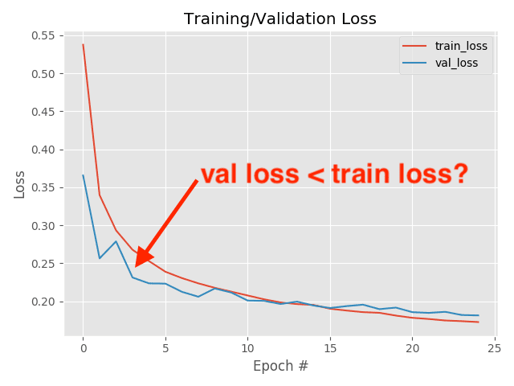

## Table of Contents

## What is training loss in machine learning?

Training loss in machine learning is a measure of how badly the model is doing on its training data. It tells us how far off the model's predictions are from the actual results. When we train a model, we want to minimize this loss, which means we want the model to get better at predicting the right answers. Think of it like a score in a game; the lower the score, the better the model is doing.

To calculate the training loss, we use a loss function. This function compares the model's predictions to the true values and gives us a number that represents the error. For example, if we're predicting house prices, the loss function would tell us how far off our predictions are from the actual prices. By adjusting the model's parameters to minimize this loss, we help the model learn from its mistakes and improve over time.

## Why is training loss important in the learning process?

Training loss is important because it tells us how well our machine learning model is learning from the data. When we train a model, we want it to make predictions that are as close as possible to the actual results. The training loss measures the difference between these predictions and the true values. By keeping an eye on the training loss, we can see if the model is getting better at its job. If the loss is going down, it means the model is learning and improving. If the loss stays high or goes up, it might mean we need to change something about how we're training the model.

Another reason training loss is important is that it helps us adjust the model to make better predictions. We use a loss function to calculate the training loss, and this function gives us a number that shows how big the errors are. For example, if we're trying to predict house prices, the loss function would tell us how far off our predictions are from the actual prices. By tweaking the model's parameters to make the loss smaller, we help the model learn from its mistakes. This process of minimizing the loss is what allows the model to get better over time and make more accurate predictions.

## How is training loss calculated?

Training loss is calculated using a loss function, which is a way to measure how far off the model's predictions are from the actual results. Think of it like a score that tells us how well the model is doing. If the predictions are close to the actual values, the loss will be small. If they're far off, the loss will be big. The goal is to make this loss as small as possible by adjusting the model's parameters.

For example, if we're trying to predict house prices, we might use a loss function called Mean Squared Error (MSE). The MSE calculates the average of the squared differences between the predicted and actual prices. The formula for MSE is $$ \text{MSE} = \frac{1}{n} \sum_{i=1}^{n} (y_i - \hat{y}_i)^2 $$, where $y_i$ is the actual price, $\hat{y}_i$ is the predicted price, and $n$ is the number of data points. By using this formula, we can see how much our predictions are off and work to make them better.

During training, the model keeps adjusting its parameters to minimize the loss. This process is done automatically by an optimization algorithm, like gradient descent. The algorithm looks at the loss and figures out how to change the parameters to make the loss smaller. Over many iterations, the model gets better at making predictions, and the training loss goes down.

## What are common types of loss functions used in machine learning?

In [machine learning](/wiki/machine-learning), different types of loss functions are used depending on the kind of problem we're solving. For problems where we're predicting a number, like house prices or temperatures, we often use Mean Squared Error (MSE). MSE measures the average of the squared differences between the predicted and actual values. The formula for MSE is $$ \text{MSE} = \frac{1}{n} \sum_{i=1}^{n} (y_i - \hat{y}_i)^2 $$. Another common choice for these types of problems is Mean Absolute Error (MAE), which calculates the average of the absolute differences between the predicted and actual values. The formula for MAE is $$ \text{MAE} = \frac{1}{n} \sum_{i=1}^{n} |y_i - \hat{y}_i| $$. Both MSE and MAE help us understand how far off our predictions are, but MSE puts more weight on larger errors because of the squaring.

For classification problems, where we're trying to categorize things into different groups, we use different loss functions. One popular choice is the Binary Cross-Entropy Loss, which is used when we're classifying things into just two categories, like spam or not spam. The formula for binary cross-entropy is $$ \text{Binary Cross-Entropy} = -\frac{1}{n} \sum_{i=1}^{n} [y_i \log(\hat{y}_i) + (1 - y_i) \log(1 - \hat{y}_i)] $$. For problems with more than two categories, we use Categorical Cross-Entropy Loss. Its formula is $$ \text{Categorical Cross-Entropy} = -\frac{1}{n} \sum_{i=1}^{n} \sum_{j=1}^{k} y_{ij} \log(\hat{y}_{ij}) $$, where $k$ is the number of categories. These loss functions help the model learn to make better predictions by focusing on how well it separates the different categories.

In some cases, we might use other specialized loss functions. For example, in ranking problems, we might use the Hinge Loss, which is often used in Support Vector Machines (SVMs). The formula for Hinge Loss is $$ \text{Hinge Loss} = \max(0, 1 - y_i \cdot \hat{y}_i) $$. For problems where we want to balance precision and recall, like in medical diagnoses, we might use the Focal Loss. These specialized loss functions are designed to handle specific challenges in different types of machine learning tasks, helping the model to learn more effectively.

## How does the choice of loss function affect model performance?

The choice of loss function can really change how well a model does its job. If you pick the right loss function, it can help your model learn better and make more accurate predictions. For example, if you're trying to guess house prices, using Mean Squared Error (MSE) $$ \text{MSE} = \frac{1}{n} \sum_{i=1}^{n} (y_i - \hat{y}_i)^2 $$ can be good because it makes big mistakes count more. But if you care more about getting all the guesses kind of close, Mean Absolute Error (MAE) $$ \text{MAE} = \frac{1}{n} \sum_{i=1}^{n} |y_i - \hat{y}_i| $$ might be better because it treats all mistakes the same. Picking the wrong loss function can make your model focus on the wrong things, so it's important to choose carefully.

For problems where you're sorting things into groups, the loss function you use can make a big difference too. If you're just telling if an email is spam or not, Binary Cross-Entropy Loss $$ \text{Binary Cross-Entropy} = -\frac{1}{n} \sum_{i=1}^{n} [y_i \log(\hat{y}_i) + (1 - y_i) \log(1 - \hat{y}_i)] $$ helps the model learn how to tell the two groups apart. If you have more than two groups, like sorting animals into different types, Categorical Cross-Entropy Loss $$ \text{Categorical Cross-Entropy} = -\frac{1}{n} \sum_{i=1}^{n} \sum_{j=1}^{k} y_{ij} \log(\hat{y}_{ij}) $$ can help the model learn to separate all the groups well. The right loss function can make your model better at its job, while the wrong one can make it worse.

## What is the difference between training loss and validation loss?

Training loss and validation loss are two important measures that help us understand how well a machine learning model is doing. Training loss is the error the model makes on the data it's learning from. It's like a score that tells us how far off the model's guesses are from the actual answers when it's practicing. We want this score to get smaller as the model learns, which means it's getting better at making predictions. The training loss is calculated using a loss function, like Mean Squared Error (MSE) $$ \text{MSE} = \frac{1}{n} \sum_{i=1}^{n} (y_i - \hat{y}_i)^2 $$, which measures the average difference between the model's predictions and the true values.

Validation loss, on the other hand, is the error the model makes on a different set of data that it hasn't seen during training. This set of data is called the validation set. The validation loss helps us see how well the model can guess answers for new data it hasn't practiced on. If the validation loss is low, it means the model is good at making predictions not just on the training data but also on new data. If the validation loss starts to go up while the training loss keeps going down, it might mean the model is overfitting, which means it's getting too good at the training data but not as good at new data.

## How can you interpret changes in training loss during model training?

When you're training a model, watching how the training loss changes can tell you a lot about how well it's learning. If the training loss goes down over time, it means the model is getting better at making guesses on the data it's practicing with. This is what you want to see because it means the model is learning from its mistakes and improving. For example, if you're using a loss function like Mean Squared Error (MSE) $$ \text{MSE} = \frac{1}{n} \sum_{i=1}^{n} (y_i - \hat{y}_i)^2 $$, a lower MSE means the model's predictions are getting closer to the actual values.

But if the training loss stops going down or starts to go up, it could mean different things. If it stops going down, the model might have learned as much as it can from the training data, and you might need more data or a different model to keep improving. If the training loss starts to go up, it could mean the model is overfitting. This happens when the model gets too good at the training data but might not do well on new data. Keeping an eye on the training loss helps you know when to stop training or make changes to help the model learn better.

## What are some strategies to reduce training loss?

To reduce training loss, you can try different things. One way is to use more data. If the model has more examples to learn from, it can get better at making guesses. Another way is to change the model's design. Sometimes, making the model bigger or smaller, or using a different type of model, can help. You can also try adjusting the learning rate, which is how fast the model learns from its mistakes. If the learning rate is too high, the model might jump around and miss the best answers. If it's too low, the model might learn too slowly. Finding the right learning rate can make a big difference in reducing the training loss.

Another strategy is to use regularization. This is a way to stop the model from overfitting, which means getting too good at the training data but not good at new data. Regularization adds a penalty to the loss function to keep the model's guesses from being too extreme. For example, if you're using L2 regularization, it adds a term to the loss function like $$ \text{Loss} = \text{MSE} + \lambda \sum_{i=1}^{n} w_i^2 $$, where $\lambda$ is a number that controls how strong the penalty is, and $w_i$ are the model's parameters. By using regularization, you can help the model learn better and reduce the training loss.

## How does overfitting relate to training loss?

Overfitting happens when a model gets too good at the data it's learning from but doesn't do well on new data. When a model is overfitting, the training loss keeps going down, but the validation loss, which is the error on new data, starts to go up. This means the model is learning the training data too well, including any mistakes or weird patterns in it, and not learning how to guess well on new data. If you see the training loss getting lower and lower while the validation loss goes up, it's a sign that your model might be overfitting.

To stop overfitting, you can try different things. One way is to use more data so the model has more examples to learn from. Another way is to make the model simpler, maybe by using fewer parameters or a smaller model. You can also use regularization, which adds a penalty to the loss function to stop the model's guesses from being too extreme. For example, if you're using L2 regularization, it adds a term to the loss function like $$ \text{Loss} = \text{MSE} + \lambda \sum_{i=1}^{n} w_i^2 $$, where $\lambda$ is a number that controls how strong the penalty is, and $w_i$ are the model's parameters. By using these strategies, you can help the model learn better and reduce the chance of overfitting.

## What advanced techniques can be used to optimize training loss?

One advanced technique to optimize training loss is using learning rate scheduling. This means changing the learning rate, which is how fast the model learns, as training goes on. At the start, you might use a high learning rate to help the model learn quickly. But as training continues, you can lower the learning rate to make the model learn more slowly and carefully. This can help the model find the best answers without jumping around too much. For example, you might use a learning rate scheduler like the one in PyTorch, which can be set up like this: ```python
from torch.optim.lr_scheduler import StepLR
scheduler = StepLR(optimizer, step_size=30, gamma=0.1)
``` This scheduler will lower the learning rate by a factor of 0.1 every 30 epochs.

Another technique is using advanced optimization algorithms like Adam or RMSprop. These algorithms adjust the learning rate for each parameter in the model, which can help the model learn better and faster. Adam, for example, uses both the average of recent gradients and the average of their squares to adjust the learning rate. This can help the model learn from its mistakes more effectively. The formula for updating the parameters in Adam is $$ \theta_{t+1} = \theta_t - \alpha \frac{\hat{m}_t}{\sqrt{\hat{v}_t} + \epsilon} $$, where $\theta$ are the parameters, $\alpha$ is the learning rate, $\hat{m}_t$ and $\hat{v}_t$ are the bias-corrected estimates of the first and second moments of the gradients, and $\epsilon$ is a small number to prevent division by zero. By using these advanced techniques, you can help the model learn better and reduce the training loss more effectively.

## How can you use training loss to diagnose model issues?

When you're training a machine learning model, keeping an eye on the training loss can help you figure out if something's going wrong. If the training loss is going down steadily, it means the model is learning from the data and getting better at making guesses. But if the training loss isn't going down, or if it's going down very slowly, it could mean there's a problem. Maybe the model is too simple and can't learn the patterns in the data, or maybe the data itself has mistakes that are making it hard for the model to learn. By looking at how the training loss changes, you can get clues about what might be going wrong and how to fix it.

Another way to use training loss to diagnose issues is by comparing it to the validation loss. The validation loss is the error the model makes on a different set of data that it hasn't seen during training. If the training loss is going down but the validation loss is going up, it could mean the model is overfitting. Overfitting happens when the model gets too good at the training data but not good at new data. To fix this, you might need to use more data, make the model simpler, or use regularization. Regularization adds a penalty to the loss function to stop the model's guesses from being too extreme, like in L2 regularization where the loss function becomes $$ \text{Loss} = \text{MSE} + \lambda \sum_{i=1}^{n} w_i^2 $$. By using these strategies, you can help the model learn better and reduce the chance of overfitting.

## What are the latest research trends in managing training loss?

One of the latest trends in managing training loss is the use of adaptive loss functions. These functions can change during training to focus on the parts of the data where the model is making the most mistakes. For example, researchers are exploring loss functions that increase the weight of hard-to-learn examples, helping the model to pay more attention to these cases. This can lead to faster learning and better performance on challenging data. Another trend is the use of meta-learning, where the model learns how to learn from the data. This can help the model find the best way to minimize the training loss by adapting its learning strategy over time.

Another important trend is the development of new regularization techniques to prevent overfitting. Researchers are working on methods like dropout, which randomly turns off some of the model's connections during training to make it more robust. They are also exploring techniques like mixup, where the model is trained on combinations of different data points to help it generalize better. These methods help keep the training loss low while also ensuring the model performs well on new data. For example, the mixup technique can be implemented in code like this: ```python
import numpy as np
def mixup_data(x, y, alpha=1.0):
    if alpha > 0:
        lam = np.random.beta(alpha, alpha)
    else:
        lam = 1
    batch_size = x.size()[0]
    index = torch.randperm(batch_size)
    mixed_x = lam * x + (1 - lam) * x[index, :]
    mixed_y = lam * y + (1 - lam) * y[index]
    return mixed_x, mixed_y, lam
``` By using these advanced techniques, researchers are finding new ways to manage training loss and improve model performance.

## References & Further Reading

[1]: Goodfellow, I., Bengio, Y., & Courville, A. (2016). [Deep Learning](https://link.springer.com/article/10.1007/s10710-017-9314-z). MIT Press. 

[2]: Bishop, C. M. (2006). [Pattern Recognition and Machine Learning](https://link.springer.com/book/9780387310732). Springer.

[3]: Bottou, L. (2010). [Large-Scale Machine Learning with Stochastic Gradient Descent](https://link.springer.com/chapter/10.1007/978-3-7908-2604-3_16). Proceedings of COMPSTAT 2010, Springer, pp. 177-186.

[4]: Ruder, S. (2016). [An Overview of Gradient Descent Optimization Algorithms](https://arxiv.org/abs/1609.04747). arXiv:1609.04747.

[5]: Zhang, C., Bengio, S., Hardt, M., Recht, B., & Vinyals, O. (2016). [Understanding deep learning requires rethinking generalization](https://arxiv.org/abs/1611.03530). arXiv:1611.03530.

[6]: Srivastava, N., Hinton, G., Krizhevsky, A., Sutskever, I., & Salakhutdinov, R. (2014). [Dropout: A Simple Way to Prevent Neural Networks from Overfitting](https://dl.acm.org/doi/abs/10.5555/2627435.2670313). Journal of Machine Learning Research, 15(56):1929−1958.