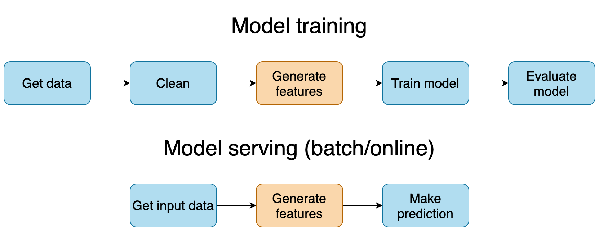

## Table of Contents

## What is Training-Serving Skew in machine learning?

Training-Serving Skew in machine learning happens when a model works differently during training compared to when it's used in real life. This difference can make the model less accurate or useful. It often happens because the data used for training doesn't match the data the model sees when it's serving, or making predictions. For example, if a model is trained on clean, well-organized data but then used on messy, real-world data, it might not perform well.

There are different reasons why Training-Serving Skew can happen. One reason is a change in how data is collected or processed between training and serving. Another reason could be differences in the environment, like different software or hardware. To reduce Training-Serving Skew, it's important to make sure the training data is as similar as possible to the data the model will see in real life. Regularly checking and updating the model with new data can also help keep it working well.

## Why is Training-Serving Skew important to address in machine learning models?

Training-Serving Skew is important to address because it can make a machine learning model less effective when it's used in the real world. If a model is trained on data that doesn't match the data it sees when serving, it might give wrong or less accurate predictions. This can lead to problems, like a recommendation system suggesting items that users don't like, or a medical diagnosis tool missing important signs of illness. By fixing Training-Serving Skew, we can make sure the model works well and helps people in the best way possible.

To tackle Training-Serving Skew, it's helpful to use data for training that is as close as possible to what the model will see in real life. This means collecting and processing data in a way that matches how it will be when the model is serving. Regularly checking the model's performance and updating it with new data can also help keep it working well. By paying attention to these details, we can make sure the model stays accurate and useful over time.

## What are the common causes of Training-Serving Skew?

One common cause of Training-Serving Skew is a difference in data collection and processing between training and serving. For example, during training, data might be carefully cleaned and organized, but in real life, the data might be messy and have missing parts. This can make the model confused when it tries to use the messy data. Another reason could be changes in the environment, like using different software or hardware for training and serving. If the model is trained on one type of computer but used on another, it might not work as well.

Another cause of Training-Serving Skew is changes in the data over time. The world is always changing, and so is the data. A model trained on old data might not understand new trends or patterns. For instance, a model trained to predict stock prices might do well for a while, but if the market changes, it might start giving wrong predictions. Keeping the training data up to date with the latest information can help reduce this problem.

Lastly, biases in the data can also lead to Training-Serving Skew. If the training data doesn't represent all the different kinds of people or situations the model will see, it might not work well for everyone. For example, if a model is trained mostly on data from one country, it might not understand the needs of people from another country. Making sure the training data includes a wide variety of examples can help the model serve everyone better.

## How can differences in data distribution between training and serving phases lead to Training-Serving Skew?

Differences in data distribution between training and serving phases can lead to Training-Serving Skew when the model encounters data that it wasn't prepared for. For example, if a model is trained on data collected during the day but used to make predictions at night, the patterns in the data might be different. Daytime data might show more activity and different behaviors compared to nighttime data. If the model doesn't see nighttime data during training, it might make wrong predictions when it's serving at night. This mismatch in data distribution can make the model less accurate and useful.

Another way differences in data distribution can cause Training-Serving Skew is through changes in the types of data the model sees. For instance, if a model is trained on images of dogs but then used to identify cats in real life, it might struggle because the training data didn't include cats. The model might not recognize the features of cats because it was only trained on dogs. By making sure the training data includes a variety of examples that match what the model will see when serving, we can help reduce the chances of Training-Serving Skew and improve the model's performance.

## What are some examples of Training-Serving Skew in real-world applications?

One example of Training-Serving Skew can be seen in a recommendation system for an online shopping website. The system might be trained using data from a time when the website had fewer users and the shopping patterns were different. When the website grows and more people start using it, the data the system sees changes. The new users might have different tastes and buy different things. If the recommendation system is not updated with this new data, it might keep suggesting items that the new users don't like, leading to a poor shopping experience.

Another example is a speech recognition system used in a smart home device. The system might be trained on clear, studio-recorded voices but used in homes where there is background noise, like TV sounds or children playing. The difference between the clean training data and the noisy real-world data can cause the system to misunderstand commands. To fix this, the training data should include recordings with different levels of background noise to help the system understand commands better in real-life situations.

## How can preprocessing and feature engineering contribute to Training-Serving Skew?

Preprocessing and feature engineering can contribute to Training-Serving Skew if the methods used during training do not match what happens when the model is serving. For example, during training, data might be cleaned and transformed in a certain way, like removing missing values or normalizing numbers. But when the model is serving, the data it sees might not be cleaned the same way. If the serving data has more missing values or different ranges of numbers, the model might get confused because it was trained on data that looked different. This difference in how data is handled can lead to the model making less accurate predictions.

Feature engineering can also cause Training-Serving Skew if new features are created during training that are not available or are different when the model is serving. For instance, a model might be trained using a feature like the time of day, which is calculated in a specific way from the data. If the way this feature is calculated changes when the model is serving, or if the time data is not available in the same format, the model might not understand the new feature. To avoid these problems, it's important to make sure that preprocessing and feature engineering steps are consistent between training and serving, so the model sees data in a way it's used to.

## What techniques can be used to detect Training-Serving Skew?

One way to detect Training-Serving Skew is by comparing the performance of the model during training and serving. This can be done by looking at metrics like accuracy, precision, or recall. If the model's performance drops a lot when it starts serving, it might be a sign of Training-Serving Skew. Another method is to use A/B testing, where you compare the results of the model on different sets of data. If the model works well on the training data but not on the serving data, it can show that there is a skew.

Another technique is to monitor the data that the model sees during serving and compare it to the training data. You can use statistical methods to see if the data distributions are different. For example, if the average value of a feature in the serving data is much different from the training data, it could be a sign of skew. Tools like histograms or box plots can help visualize these differences. By keeping an eye on these changes, you can catch Training-Serving Skew early and fix it before it causes big problems.

## How can model retraining and updating help mitigate Training-Serving Skew?

Model retraining and updating can help fix Training-Serving Skew by making sure the model keeps learning from new data. When a model is retrained with fresh data, it can learn about new patterns and changes that happen over time. For example, if a model was trained on data from last year but the world has changed since then, retraining with new data helps the model understand these changes. This way, the model can make better predictions because it's not stuck with old information.

Updating the model regularly also helps because it can fix any problems that come up when the model is serving. If the model starts to perform worse, it might be because the data it's seeing is different from the training data. By updating the model with the latest serving data, it can adjust to these differences and work better. This keeps the model useful and accurate, even as the world around it changes.

## What role does monitoring and logging play in managing Training-Serving Skew?

Monitoring and logging are important tools for managing Training-Serving Skew because they help you keep an eye on how your model is doing. By watching the model's performance closely, you can see if it starts to do worse when it's serving compared to when it was trained. If you notice the model making more mistakes or giving wrong predictions, it might be a sign of Training-Serving Skew. Logging helps by keeping a record of the data the model sees and the predictions it makes. This way, you can look back and see exactly where things might be going wrong and fix them before they become big problems.

Using monitoring and logging also helps you understand the differences between the training and serving data. By comparing these data sets, you can spot if the serving data is different in some way, like having more missing values or different ranges of numbers. This can help you figure out why the model is not working as well and make changes to fix it. Regular monitoring and logging make it easier to keep the model working well and serving people in the best way possible.

## How can A/B testing be utilized to assess the impact of Training-Serving Skew?

A/B testing can help assess the impact of Training-Serving Skew by comparing how a model performs on different sets of data. In an A/B test, you can use one version of the model that was trained on the original data and another version that is updated with new data to see if it reduces skew. If the updated model performs better on the serving data, it shows that Training-Serving Skew was affecting the original model's performance. By looking at the results of the A/B test, you can see if the model's predictions are more accurate and useful after being updated with new data.

Running A/B tests regularly can help keep an eye on Training-Serving Skew over time. If you notice that the model's performance keeps getting worse on the serving data, it might mean that the data is changing and the model needs to be updated more often. By using A/B testing to check the model's performance, you can make sure it stays accurate and helpful, even as the world around it changes.

## What advanced strategies can be employed to minimize Training-Serving Skew in complex models?

One advanced strategy to minimize Training-Serving Skew in complex models is to use online learning. This means the model keeps learning from new data as it comes in, instead of just using the old training data. By doing this, the model can adjust to changes in the data over time. For example, if a model is used to predict stock prices, online learning can help it learn from new market trends and give better predictions. This way, the model stays up-to-date and reduces the chance of skew because it's always learning from the most recent data.

Another strategy is to use [data augmentation](/wiki/data-augmentation) and synthetic data. This means creating more data that looks like the real data the model will see when it's serving. For instance, if a model is trained on images, you can create new images by changing the existing ones slightly, like rotating them or adding noise. This helps the model learn to handle different types of data it might see in the real world. By using data augmentation, the model can be more prepared for the variety of data it will encounter, which helps reduce Training-Serving Skew.

## How do different machine learning frameworks handle or address Training-Serving Skew?

Different [machine learning](/wiki/machine-learning) frameworks have their own ways to handle or address Training-Serving Skew. For example, TensorFlow uses TensorFlow Extended (TFX) to help manage the entire machine learning pipeline, from data ingestion to model serving. TFX includes tools like the Transform component, which helps make sure that the preprocessing steps used during training are the same as those used during serving. This reduces the chance of skew by keeping the data processing consistent. Also, TensorFlow Model Analysis (TFMA) in TFX can help detect skew by comparing model performance across different slices of data, making it easier to spot and fix any issues.

Another popular framework, PyTorch, addresses Training-Serving Skew through its ecosystem and tools like PyTorch Lightning. PyTorch Lightning helps manage complex models and can include data preprocessing steps that are applied uniformly during both training and serving. This consistency helps minimize skew. Additionally, tools like Evidently can be used with PyTorch to monitor model performance and data drift, which helps in detecting when the serving data starts to differ from the training data. By using these tools and frameworks, developers can better manage and mitigate Training-Serving Skew, ensuring their models remain accurate and effective in real-world applications.