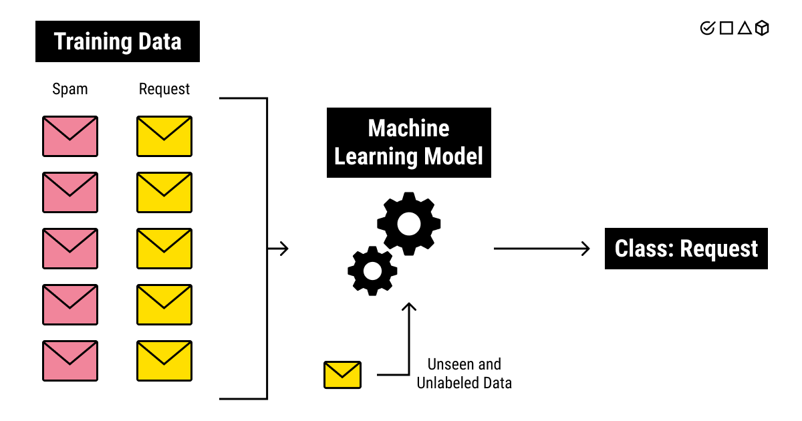

## Table of Contents

## What is a training set in machine learning?

A training set in machine learning is a collection of data used to teach a machine learning model how to make predictions or decisions. This data includes examples that the model will use to learn from. For instance, if you want to train a model to recognize pictures of cats and dogs, your training set would contain many pictures, each labeled as either a cat or a dog. The model looks at these examples and tries to find patterns that help it distinguish between the two.

Once the model has learned from the training set, it can then be tested on a different set of data, called the test set, to see how well it performs. It's important that the training set is large and diverse enough to cover a wide range of scenarios the model might encounter in real life. If the training set is too small or not varied enough, the model might not learn properly and could make mistakes when it encounters new data.

## Why is a training set important for machine learning models?

A training set is important for machine learning models because it's like a teacher for the model. It shows the model many examples so it can learn how to do its job right. For example, if you want a model to tell the difference between pictures of cats and dogs, you need to show it lots of pictures of cats and dogs. The more and better examples the model sees, the better it gets at telling them apart. Without a good training set, the model won't learn well and might make a lot of mistakes.

Also, the training set helps the model understand the patterns in the data. When the model looks at the training set, it tries to find things that are the same or different in the examples. This helps it make good guesses when it sees new data. If the training set is big and has lots of different examples, the model can learn about many situations and be ready for new ones. This makes the model more useful and reliable when it's used in real life.

## How do you collect data for a training set?

Collecting data for a training set starts with figuring out what kind of data your [machine learning](/wiki/machine-learning) model needs to learn from. For example, if you want to build a model that can recognize different types of flowers, you'll need lots of pictures of flowers. You can get these pictures from the internet, by taking your own photos, or by using special databases that have already collected this kind of data. It's important to make sure the data is good quality and includes a variety of examples, so the model can learn well.

Once you have the data, you need to prepare it for the model. This means organizing the data and making sure it's in the right format. For example, if you're using pictures, you might need to resize them or adjust their colors. You also need to label the data, which means telling the model what each example is. If you're using flower pictures, you would label each one with the name of the flower. This step can be done by hand or sometimes with the help of other tools or people. After the data is ready, you can use it to train your model and help it learn.

## What is the difference between a training set and a test set?

A training set is a group of data that you use to teach a machine learning model. It's like showing the model lots of examples so it can learn how to do its job. For example, if you want the model to tell the difference between cats and dogs, you would show it many pictures of cats and dogs. The model looks at these pictures and tries to find patterns that help it tell them apart. The more and better examples the model sees, the better it gets at its job.

A test set is different because it's used to check how well the model has learned. After the model has been trained with the training set, you show it the test set to see if it can make good guesses on new data it hasn't seen before. The test set should be separate from the training set and should have examples that are similar but not exactly the same. This helps you know if the model can really work well in real life, not just with the data it was trained on. If the model does well on the test set, it means it has learned well and can be trusted to make good predictions.

## How do you split data into training and testing sets?

Splitting data into training and testing sets is important for making sure your machine learning model works well. You usually start with all your data and then divide it into two parts. A common way to do this is to use 70-80% of the data for the training set and the rest, 20-30%, for the test set. This split helps the model learn from a lot of examples while still having enough new data to check how well it does.

To actually split the data, you can use tools like Python's `scikit-learn` library. Here's a simple way to do it using the `train_test_split` function:

```python
from sklearn.model_selection import train_test_split

# Assuming X is your feature data and y is your target data
X_train, X_test, y_train, y_test = train_test_split(X, y, test_size=0.2, random_state=42)
```

In this example, `test_size=0.2` means 20% of the data goes into the test set, and `random_state=42` makes sure the split is the same every time you run the code. This helps you keep track of how well your model is doing as you make changes to it.

## What are common preprocessing steps applied to a training set?

Before you use a training set to teach a machine learning model, you often need to clean and prepare the data. This is called preprocessing. One common step is handling missing data. If some pieces of information are missing, you might fill them in with guesses or just remove those examples. Another step is normalizing the data, which means making sure all the numbers are on a similar scale. For example, if you have data about people's heights in centimeters and weights in kilograms, you might change them so they're both between 0 and 1. This helps the model learn better because it treats all the data fairly.

Another important preprocessing step is encoding categorical data. This means turning words or labels into numbers that the model can understand. For example, if you have data about different types of fruits like apples, bananas, and oranges, you might turn them into numbers like 0, 1, and 2. You can also use something called one-hot encoding, which makes each category into its own column with a 1 or 0. This helps the model see the differences between categories clearly. Finally, you might need to reduce the size of your data by choosing only the most important pieces, a process called feature selection. This makes the model simpler and faster to train.

## How does the size of the training set affect model performance?

The size of the training set is really important for how well a machine learning model can learn and do its job. If the training set is too small, the model might not see enough examples to understand the patterns in the data well. This can make the model perform badly because it might make a lot of mistakes when it sees new data. On the other hand, if the training set is big enough, the model can learn from a lot of different examples. This helps the model understand the data better and make better guesses when it sees new things.

However, there's a point where making the training set even bigger doesn't help the model get much better. This is because the model can only learn so much, and after a certain size, adding more data won't make it perform much better. It's like studying for a test: after you've studied enough, reading more [books](/wiki/algo-trading-books) won't help you much. So, you need to find a good balance where the training set is big enough for the model to learn well but not so big that it's wasting time and resources.

## What are the challenges of working with imbalanced training sets?

Working with imbalanced training sets can be tricky because the model might learn to favor the more common examples and ignore the less common ones. For example, if you're trying to predict whether an email is spam or not, and most of your emails are not spam, the model might just guess "not spam" all the time. This can make the model seem like it's doing well, but it's not really learning to tell the difference between spam and not spam. This problem is called bias, and it can make the model less useful in real life.

To fix this, you can try different things. One way is to make the training set more balanced by adding more examples of the less common type or removing some of the more common ones. Another way is to use special techniques like changing how the model learns from the data, so it pays more attention to the less common examples. These methods can help the model learn better and make more accurate guesses, even when the training set is imbalanced.

## How can data augmentation techniques improve a training set?

Data augmentation techniques can make a training set better by adding more examples for the model to learn from. When you have a small training set, the model might not see enough different situations to learn well. By using [data augmentation](/wiki/data-augmentation), you can create new examples from the ones you already have. For example, if you're training a model to recognize pictures of cats, you can flip the pictures, rotate them, or change their colors a little bit. This gives the model more chances to learn and can help it do a better job when it sees new pictures.

Another way data augmentation helps is by making the training set more balanced. Sometimes, you might have a lot of examples of one thing but not enough of another. For instance, if you're trying to tell the difference between pictures of cats and dogs, but you have way more cat pictures, the model might learn to guess "cat" all the time. By using data augmentation to create more dog pictures, you can make the training set more even. This helps the model learn to tell the difference between cats and dogs better, making it more useful in real life.

## What are cross-validation techniques and how do they relate to training sets?

Cross-validation techniques are ways to check how well a machine learning model is learning from its training set. They help you make sure the model can do a good job with new data it hasn't seen before. One common way to do cross-validation is called k-fold cross-validation. In this method, you split the training set into k smaller parts, or "folds." You then train the model k times, each time using k-1 folds for training and the remaining fold for testing. This helps you see how well the model does on different parts of the data, giving you a better idea of its overall performance.

Cross-validation is important because it helps you avoid a problem called overfitting. Overfitting happens when a model learns the training set too well and can't do a good job with new data. By using cross-validation, you can see if the model is overfitting because it will do worse on the test folds if it's only good at the training data. This way, you can make changes to the model or the training set to help it learn better and be more useful in real life.

## How do you evaluate the quality of a training set?

Evaluating the quality of a training set involves checking if it has enough examples and if those examples are varied enough to help the model learn well. A good training set should be large enough so the model can see many different situations. If the training set is too small, the model might not learn all the important patterns and could make a lot of mistakes when it sees new data. Also, the training set should include examples from all the different types of data the model will see in real life. For example, if you're training a model to recognize pictures of animals, you need pictures of many different animals in different settings, not just one type of animal in the same place.

Another important part of evaluating a training set is checking for balance and relevance. The training set should have a good mix of all the different categories or outcomes the model needs to predict. If one category has a lot more examples than the others, the model might learn to favor that category and not do well with the others. This is called an imbalanced dataset. You can use techniques like data augmentation to add more examples of the less common categories. Also, the data in the training set should be relevant to what the model needs to learn. If the data is old or not related to the task, the model won't learn well. By making sure the training set is large, varied, balanced, and relevant, you can help the model learn better and be more useful in real life.

## What advanced techniques can be used to enhance learning from a training set?

Advanced techniques to enhance learning from a training set include transfer learning and ensemble methods. Transfer learning is when you use a model that has already been trained on a big dataset and then fine-tune it for your specific task. For example, if you want to teach a model to recognize different types of birds, you can start with a model that knows how to recognize animals in general. Then, you show it lots of bird pictures and teach it to focus on what makes birds different from other animals. This can save time and help the model learn better because it already knows some things about animals.

Ensemble methods are another advanced technique where you use more than one model to make better predictions. Instead of relying on just one model, you can train several models and let them vote on what the answer should be. For example, if you have three models trying to guess whether a picture shows a cat or a dog, and two of them say it's a cat while one says it's a dog, the final guess would be a cat. This can make the predictions more accurate because different models might be good at different things, and together they can do a better job.

## References & Further Reading

[1]: Géron, A. (2019). ["Hands-On Machine Learning with Scikit-Learn, Keras, and TensorFlow: Concepts, Tools, and Techniques to Build Intelligent Systems"](https://www.academia.edu/43840124/Hands_On_Machine_Learning_with_Scikit_Learn_Keras_and_TensorFlow_SECOND_EDITION_Concepts_Tools_and_Techniques_to_Build_Intelligent_Systems). O'Reilly Media.

[2]: Goodfellow, I., Bengio, Y., & Courville, A. (2016). ["Deep Learning"](https://www.deeplearningbook.org/). MIT Press.

[3]: Shalev-Shwartz, S., & Ben-David, S. (2014). ["Understanding Machine Learning: From Theory to Algorithms"](https://assets.cambridge.org/97811070/57135/frontmatter/9781107057135_frontmatter.pdf). Cambridge University Press.

[4]: Bishop, C. M. (2006). ["Pattern Recognition and Machine Learning"](https://www.cs.uoi.gr/~arly/courses/ml/tmp/Bishop_book.pdf). Springer.

[5]: Dietterich, T. G. (2000). ["Ensemble Methods in Machine Learning"](https://link.springer.com/chapter/10.1007/3-540-45014-9_1). In Multiple Classifier Systems (pp. 1-15). Springer, Berlin, Heidelberg. 

[6]: Brownlee, J. (2020). ["Data Preparation for Machine Learning: Data Cleaning, Feature Selection, and Data Transforms in Python"](https://machinelearningmastery.com/data-preparation-for-machine-learning/). Machine Learning Mastery.