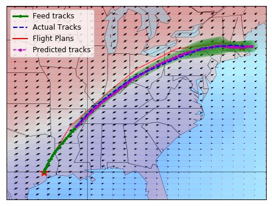

## Table of Contents

## What is trajectory prediction in the context of machine learning?

Trajectory prediction in machine learning is about guessing where something will go in the future based on where it has been in the past. This "something" could be a car, a person walking, or even a storm. Imagine you're watching a soccer game and you see a player dribbling the ball. By looking at how the player has moved so far, you might be able to predict where they're heading next. In machine learning, computers use data about past movements to make these predictions, often using math and algorithms to find patterns.

One common way to do trajectory prediction is by using a model called a Recurrent Neural Network (RNN), especially a type called Long Short-Term Memory (LSTM). These models are good at understanding sequences of data, like the steps in a path. They look at the history of movements and learn from it to guess future positions. For example, if you give an LSTM model data about how a car has driven over the last few minutes, it can predict where the car might be in the next few minutes. This kind of prediction is useful in many areas, like self-driving cars, sports analytics, and weather forecasting.

## Why is trajectory prediction important in various applications?

Trajectory prediction is important because it helps us plan and make decisions based on where things are likely to go. For example, in self-driving cars, knowing where other cars and pedestrians will be in the next few seconds is crucial for safe driving. If a car can predict that a pedestrian is about to cross the street, it can slow down or stop in time. This makes roads safer for everyone. In sports, coaches and players use trajectory prediction to understand how opponents move and plan their strategies accordingly. A soccer player might predict where a teammate will be to make a perfect pass.

In weather forecasting, trajectory prediction helps meteorologists predict the path of storms, which can save lives and property. If they can predict that a hurricane will hit a certain area, people in that area can prepare or evacuate. In robotics, robots use trajectory prediction to navigate around obstacles and reach their goals efficiently. For instance, a robot in a warehouse can predict the paths of other moving objects and plan its own route to avoid collisions. Overall, trajectory prediction makes our technology smarter and our lives safer and more efficient.

## What are the basic components of a trajectory prediction model?

A trajectory prediction model needs a few basic parts to work well. First, it needs data about past movements. This data could be the positions of a car over time or the steps a person took while walking. The model uses this data to learn patterns and make guesses about where things will go next. Another important part is the algorithm that does the prediction. A common choice is a type of [neural network](/wiki/neural-network) called a Recurrent Neural Network (RNN), often with Long Short-Term Memory (LSTM) units. These are good at understanding sequences of data, like the steps in a path.

The second part is how the model processes the data. It takes in the past positions and uses them to predict future positions. For example, if you have data about where a car was at times $$t_1, t_2, t_3$$ and so on, the model might use this to predict where the car will be at time $$t_{n+1}$$. The model needs to be trained on a lot of data to get good at making these predictions. This training involves adjusting the parameters of the model to minimize the difference between its predictions and the actual future positions.

Finally, the model needs a way to measure how well it's doing. This is usually done with a loss function, which tells the model how far off its predictions are from the real data. The model then uses this feedback to get better over time. For example, if the model predicts a car will be at position $$x$$ but it ends up at position $$y$$, the loss function will tell the model how big the mistake was, and the model will adjust to try to do better next time.

## How does Social-STGCNN approach trajectory prediction?

Social-STGCNN, which stands for Social Spatio-Temporal Graph Convolutional Neural Network, is a model used for predicting how people move in a crowd. It looks at both where people are and how they interact with each other. Imagine you're at a busy train station. Social-STGCNN would not only track each person's path but also consider how they might change direction because of the people around them. It uses a special kind of graph to represent these interactions, where each person is a point on the graph, and the connections between points show how close or how they might affect each other's movements.

The model works by combining two main ideas: spatial and temporal information. Spatial information is about where people are in relation to each other at one moment. Temporal information is about how their positions change over time. Social-STGCNN uses graph convolutional layers to understand the spatial part and convolutional layers to understand the temporal part. By putting these together, it can predict where each person will go next based on their past movements and the movements of the people around them. This makes it very useful for predicting how crowds will move in busy places like train stations or shopping centers.

## What are the key features of the OOSTraj model?

OOSTraj, which stands for Out-Of-Sample Trajectory prediction, is a model designed to predict how people move in crowded places. It focuses on understanding the paths people take when they're not in the training data. This means it can guess where new people, who the model hasn't seen before, will go. OOSTraj uses a special way of looking at how people move, called a "social-aware" approach. This means it looks at how people affect each other's paths. For example, if someone is walking fast and others are walking slowly, OOSTraj can predict how these different speeds will change everyone's direction.

The model uses a type of neural network called a Graph Neural Network (GNN). This network treats each person as a point on a graph, and the lines between points show how close people are to each other. By using this graph, OOSTraj can understand how people's movements are connected. It also uses something called "attention mechanisms" to focus on the most important parts of the data. This helps the model pay more attention to people who are likely to change their path because of others around them. Overall, OOSTraj is good at predicting paths in busy places where people are constantly interacting with each other.

## What datasets are commonly used for training trajectory prediction models?

Trajectory prediction models often use datasets like the ETH and UCY datasets. These datasets have videos of people walking in different places, like a university campus or a busy street. The videos are turned into data points that show where each person was at different times. This helps the models learn how people move in crowded places. Another common dataset is the SDD (Stanford Drone Dataset), which has aerial videos taken by drones flying over places like parking lots and streets. These videos are also turned into data points, showing where people and vehicles move over time.

Other datasets used for training include the TrajNet++ dataset, which combines data from multiple sources to give a bigger picture of how people move. It includes data from different places around the world, so the models can learn from a variety of situations. The nuScenes dataset is also used, especially for predicting the paths of cars and other vehicles. It has data from cars driving in cities, with information about where the cars were and how fast they were going. All these datasets help the models get better at guessing where people and vehicles will go next.

## How do Social-STGCNN and OOSTraj handle the social interactions between agents?

Social-STGCNN handles social interactions by using a graph to show how people are connected in a crowd. It looks at where each person is and how close they are to others. This model uses something called graph convolutional layers to understand these connections. Imagine you're in a busy place like a train station. Social-STGCNN would see you and the people around you as points on a graph, with lines between the points showing how close you are to each other. By understanding these connections, the model can predict how you might change your path because of the people around you. This helps it guess where everyone will go next in a crowded place.

OOSTraj also focuses on social interactions but does it in a way that works well for new people the model hasn't seen before. It uses a Graph Neural Network (GNN) to see each person as a point on a graph, with lines showing how close people are. OOSTraj pays special attention to how people affect each other's paths, using something called attention mechanisms. This means it can focus on the most important parts of the data, like people who might change their direction because of others around them. For example, if someone is walking fast and others are walking slowly, OOSTraj can predict how these different speeds will change everyone's direction. This makes it good at guessing where new people will go in busy places.

## What are the performance metrics used to evaluate trajectory prediction models?

Performance metrics are important to see how well trajectory prediction models work. A common metric is the Average Displacement Error (ADE). This measures how far off the model's predictions are from the actual paths on average. For example, if a model predicts a person will be at position $$x$$ but they end up at position $$y$$, the ADE tells us how big this average mistake is over all the predictions. Another important metric is the Final Displacement Error (FDE). This looks at the difference between the predicted final position and the actual final position. If a model is good at predicting where someone will end up, it will have a low FDE.

Besides ADE and FDE, models are also evaluated using the Miss Rate (MR). This tells us how often the model's predictions are way off, like if the predicted path is more than a certain distance away from the real path. A low MR means the model is usually pretty close to the right path. Some models also use metrics like the Negative Log-Likelihood (NLL) to see how well the model fits the data. NLL is a bit more complicated, but it helps to understand how confident the model is in its predictions. All these metrics help researchers and developers see which models work best and where they need to improve.

## How can trajectory prediction models be integrated into real-time systems?

Trajectory prediction models can be integrated into real-time systems by using fast computers and smart software. For example, in self-driving cars, the model needs to predict where other cars and people will go in just a few seconds. To do this, the model runs on a computer inside the car that quickly processes data from cameras and sensors. The model takes in this data, makes predictions, and then tells the car what to do next. This all happens very fast, often in less than a second, so the car can drive safely.

One way to make sure the model works well in real-time is to use special algorithms that can handle data quickly. These algorithms might use something called parallel processing, where the computer works on different parts of the problem at the same time. This makes the predictions faster. Also, the model might be simplified or made smaller so it can run on the computer without slowing down. By using these techniques, trajectory prediction models can help make real-time systems like self-driving cars, robots, and traffic management systems work better and safer.

## What are the challenges faced when scaling trajectory prediction models to large crowds?

Scaling trajectory prediction models to handle large crowds is tough because it means dealing with a lot more data. When you have many people moving around, each person's path can affect others. This makes the model's job harder because it needs to look at all these connections at once. Imagine trying to predict where everyone in a busy train station will go next. The model has to keep track of where each person is, how fast they're moving, and how they might change direction because of the people around them. This requires a lot of computing power and memory, which can slow things down and make real-time predictions harder.

Another challenge is making sure the model works well for new situations it hasn't seen before. In a large crowd, you might see different behaviors and interactions than what the model was trained on. For example, if the model was trained on data from a calm park but is used in a busy shopping center, it might not predict paths as well. To handle this, the model needs to be good at learning from new data quickly and adjusting its predictions. This means using smart algorithms that can adapt and learn on the fly, which adds another layer of complexity to scaling the model for large crowds.

## How do advancements in deep learning, such as attention mechanisms, improve trajectory prediction?

Advancements in [deep learning](/wiki/deep-learning), like attention mechanisms, make trajectory prediction models better by helping them focus on what's important. Imagine you're in a crowded place, and you need to predict where everyone will go next. An attention mechanism helps the model pay more attention to the people who are most likely to affect each other's paths. For example, if two people are walking close to each other, the model can focus more on how they might change direction because of each other. This makes the predictions more accurate because the model isn't just looking at everyone equally; it's looking at the key interactions that matter most.

These attention mechanisms also help the model handle new situations better. When a model is used in a place it hasn't seen before, like a busy shopping center instead of a calm park, it needs to quickly learn from the new data. Attention mechanisms let the model adapt by focusing on the most relevant parts of the new data. This means the model can adjust its predictions faster and more accurately, even in large crowds where people's behaviors can be very different from what the model was trained on. By using attention, trajectory prediction models become smarter and more flexible, making them useful in more real-world situations.

## What future developments can we expect in the field of trajectory prediction models?

In the future, trajectory prediction models will likely become even better at understanding how people move in crowded places. One big change we might see is the use of more advanced AI techniques, like transformer models. These models are good at looking at long sequences of data, which means they can track how someone has moved over a long time and use that to predict where they will go next. Imagine watching a soccer player run across the field for several minutes; a transformer model could use all that information to guess where the player will be in the next few seconds. This could make predictions more accurate, especially in busy places like train stations or shopping centers where people's paths can be very complicated.

Another development we can expect is better ways to handle new situations. Right now, models can struggle when they see something they haven't been trained on before. In the future, models might use something called "online learning," where they can learn from new data as it comes in. This means if a model is used in a new place, like a busy city street instead of a quiet park, it can quickly adjust and start making good predictions. This would make trajectory prediction models more useful in real-life scenarios where things are always changing.

## References & Further Reading

[1]: Alahi, A., Goel, K., Ramanathan, V., Robicquet, A., Fei-Fei, L., & Savarese, S. (2016). ["Social LSTM: Human Trajectory Prediction in Crowded Spaces."](https://ieeexplore.ieee.org/document/7780479) Proceedings of the IEEE Conference on Computer Vision and Pattern Recognition (CVPR).

[2]: Vemula, A., Muelling, K., & Oh, J. (2018). ["Social Attention: Modeling Attention in Human Crowds."](https://arxiv.org/abs/1710.04689) Proceedings of the 32nd AAAI Conference on Artificial Intelligence.

[3]: Kosaraju, V., Sadeghian, A., Martín-Martín, R., Reid, T., Rezatofighi, H., & Savarese, S. (2019). ["Social-BiGAT: Multimodal Trajectory Forecasting using Bicycle-GAN and Graph Attention Networks."](https://arxiv.org/abs/1907.03395) Advances in Neural Information Processing Systems 32.

[4]: Amirian, J., Pool, M., Hornauer, S., & Jensen, R. (2019). ["Social Ways: Learning Multi-Modal Distributions of Pedestrian Trajectories with GANs."](https://arxiv.org/abs/1904.09507) Proceedings of the IEEE/CVF Conference on Computer Vision and Pattern Recognition Workshops.

[5]: Gupta, A., Johnson, J., Fei-Fei, L., Savarese, S., & Alahi, A. (2018). ["Social GAN: Socially Acceptable Trajectories with Generative Adversarial Networks."](https://arxiv.org/abs/1803.10892) Proceedings of the IEEE Conference on Computer Vision and Pattern Recognition.

[6]: Kirsten, D., & Kohler, S. (2022). ["Learning Trajectory-Aware Graph Topologies for Effective Large Group Navigation"](https://www.researchgate.net/profile/Kirsten-Koehler) Proceedings of the IEEE/CVF Conference on Computer Vision and Pattern Recognition Workshops.

[7]: Zhang, P., Ouyang, H., Pu, S., & Xue, X. (2019). ["SR-LSTM: State Refinement for LSTM towards Pedestrian Trajectory Prediction."](https://ieeexplore.ieee.org/document/8954402) Proceedings of the IEEE/CVF Conference on Computer Vision and Pattern Recognition (CVPR).