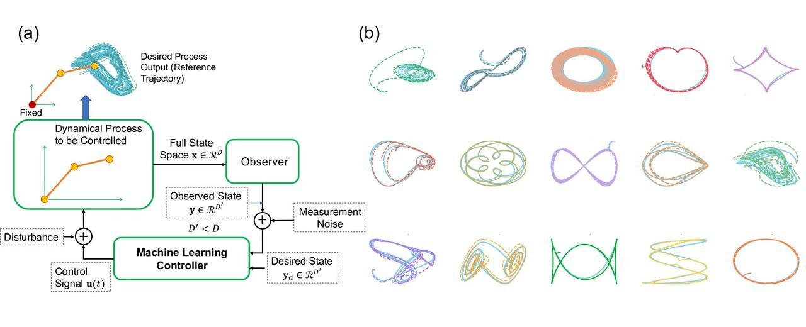

## Table of Contents

## What is trajectory in the context of machine learning?

In machine learning, a trajectory refers to the path or sequence of states that a model or an algorithm follows over time. Imagine you're tracking the movement of a ball rolling down a hill; the trajectory would be the specific route the ball takes from start to finish. Similarly, in machine learning, a trajectory could represent the sequence of positions a data point takes through a model's parameter space during training, or the sequence of actions taken by a reinforcement learning agent in an environment.

For example, in a neural network, the trajectory might describe how the weights and biases of the network change from one iteration to the next as the model learns from the data. This path is crucial because it shows how the model is adapting and improving its performance. In reinforcement learning, the trajectory could be the series of states, actions, and rewards an agent experiences as it tries to solve a task, like navigating a maze. Understanding these trajectories helps researchers and practitioners analyze and improve the learning process and performance of their models.

## How does trajectory analysis differ from traditional data analysis?

Trajectory analysis and traditional data analysis both deal with data, but they focus on different aspects. Traditional data analysis often looks at data points at specific moments in time, like taking a snapshot. It might involve calculating averages, finding trends, or making predictions based on these static points. For example, if you're analyzing sales data, you might look at the total sales for each month and try to predict future sales based on past patterns.

On the other hand, trajectory analysis is more about understanding the journey or path that data takes over time. Instead of just looking at where the data is at certain times, trajectory analysis tracks how it moves from one point to another. This is especially useful in fields like [machine learning](/wiki/machine-learning) where you want to see how a model's performance changes over many iterations, or in tracking the movement of objects in space. By understanding these paths, you can gain insights into how processes evolve and improve over time, which can be crucial for optimizing systems or predicting future behavior based on historical paths.

In summary, while traditional data analysis focuses on static data points and their relationships, trajectory analysis emphasizes the dynamic nature of data, tracking its movement and evolution. This difference in focus can lead to different types of insights and applications, making trajectory analysis a powerful tool in areas where understanding change over time is important.

## What are the common applications of trajectory machine learning?

Trajectory machine learning is used a lot in understanding how things move or change over time. One common place where it's used is in self-driving cars. These cars need to predict where other cars, bikes, and even people are going to be in the next few seconds. By looking at the past paths of these objects, the car can make smart guesses about their future movements and drive safely. Another area is in sports analytics, where coaches and players want to see how athletes move during a game. By studying these paths, teams can improve their strategies and training to perform better.

Another big use of trajectory machine learning is in robotics. Robots often need to navigate through complex spaces, and knowing the paths they take can help them avoid obstacles and reach their goals more efficiently. For example, a robot in a warehouse might use trajectory data to find the quickest route to pick up items and deliver them. In healthcare, doctors can use trajectory analysis to track the progression of diseases over time. By looking at how a patient's health markers change, doctors can predict how a disease might develop and plan treatments accordingly.

Lastly, trajectory machine learning is also important in finance. Traders and analysts use it to predict how stock prices will move based on past trends. By understanding the paths that prices have taken, they can make better decisions about when to buy or sell stocks. This can help them make more money and manage risks better. Overall, trajectory machine learning helps in many fields by giving insights into how things change and move over time, which can lead to smarter decisions and better outcomes.

## Can you explain the basic components of a trajectory data set?

A trajectory data set is made up of a few key parts. The first part is the position of an object at different times. This means you need to know where the object is at each moment. For example, if you're tracking a car, you would record its location on a map every few seconds. Along with the position, you also need to know the time when each position was recorded. This helps you understand the sequence of the object's movement. So, a basic trajectory data set includes a series of positions and the times when those positions were noted.

Another important part of a trajectory data set is the speed and direction of the object. Speed tells you how fast the object is moving, while direction tells you where it's going. By looking at these, you can understand the object's behavior better. For example, if a car is speeding up or slowing down, or if it's turning left or right, these details are part of the trajectory. Sometimes, other information like the object's size or type can also be included in the data set. This extra information can help make the analysis more detailed and useful.

## What algorithms are typically used for trajectory prediction?

Trajectory prediction often uses algorithms like Long Short-Term Memory (LSTM) networks, which are a type of recurrent [neural network](/wiki/neural-network) (RNN). LSTMs are good at remembering past information and using it to predict future movements. They work well for trajectory prediction because they can learn patterns in how objects move over time. For example, an LSTM might look at the past positions of a car and predict where it will go next based on those patterns.

Another common algorithm is the Kalman Filter, which is used to estimate the state of a system from noisy data. It's especially useful for tracking objects in real-time because it can update its predictions as new data comes in. The Kalman Filter uses a set of equations to predict the future state of an object and then corrects those predictions with new measurements. This makes it very effective for applications like tracking the movement of vehicles or predicting the path of a satellite.

In addition to these, some trajectory prediction tasks use Gaussian Processes, which are good at modeling uncertainty. Gaussian Processes can predict not just where an object will be, but also how confident the prediction is. This is helpful in situations where you need to know not just the most likely path, but also how likely other paths might be. For example, in autonomous driving, knowing the uncertainty of a pedestrian's path can help the car make safer decisions.

## How do you preprocess trajectory data for machine learning?

Preprocessing trajectory data for machine learning involves several steps to make the data clean and ready for analysis. First, you need to handle any missing or incomplete data points. If some positions or times are missing, you might fill them in using interpolation or just remove them if they won't affect your analysis too much. Next, you should smooth out the data to reduce noise. This can be done using techniques like moving averages or more advanced methods like Kalman filters. Smoothing helps make the trajectories clearer and easier for the machine learning models to understand.

After cleaning and smoothing the data, you need to transform it into a format that the machine learning algorithms can use. This often means converting the trajectory data into a sequence of vectors or matrices. For example, you might represent each position as a vector with x, y, and z coordinates, and then stack these vectors into a matrix. You might also need to normalize the data so that all the values are on a similar scale. This helps the machine learning model learn more effectively. Finally, you should split the data into training, validation, and test sets to make sure your model can generalize well to new data.

## What challenges are encountered when working with trajectory data?

Working with trajectory data can be tricky because it often has missing or noisy information. Imagine you're tracking a bird flying through the sky, but your camera misses some frames or the wind makes the bird's path look shaky. You need to figure out how to fill in those gaps or smooth out the wobbles. This is called data cleaning and smoothing. If you don't do it right, your machine learning model might get confused and make bad predictions.

Another challenge is making sure the data is in the right format for the machine learning algorithms. You have to turn the paths of moving objects into numbers that computers can understand. This might mean turning each position into a set of coordinates and then organizing these coordinates into a sequence. Sometimes, the data is too big or too messy, and you need to find ways to make it simpler without losing important information. This step is crucial because if the data is not well-prepared, the machine learning model won't be able to learn properly and make accurate predictions.

## How can trajectory machine learning be used to improve autonomous vehicle navigation?

Trajectory machine learning helps autonomous vehicles drive better by predicting where other cars, bikes, and people will go. Imagine you're driving and you see a car ahead of you. You can guess where it will go based on how it's moving now. Autonomous vehicles use trajectory machine learning to do the same thing, but with more data and smarter math. By looking at the past paths of other road users, the car can predict their future movements and plan its own route to avoid crashes and drive smoothly.

To make these predictions, the car uses special algorithms like Long Short-Term Memory (LSTM) networks. These algorithms are good at remembering past information and using it to predict what will happen next. For example, if a pedestrian is walking toward a crosswalk, the car can use the pedestrian's past movements to guess if they will cross the street. This helps the car slow down or stop in time. By understanding these paths, autonomous vehicles can navigate roads more safely and efficiently, making our roads safer for everyone.

## What are the state-of-the-art methods for trajectory clustering?

Trajectory clustering is about grouping similar paths together. One of the best ways to do this is with the DBSCAN (Density-Based Spatial Clustering of Applications with Noise) algorithm. DBSCAN looks at how close points are to each other and groups them into clusters based on their density. This is really useful for trajectory data because it can handle paths that might have different lengths or shapes. Another good method is the OPTICS (Ordering Points To Identify the Clustering Structure) algorithm, which is similar to DBSCAN but can find clusters of different densities. These methods help us understand common routes or patterns in how things move.

A newer approach is using [deep learning](/wiki/deep-learning), like with autoencoders. Autoencoders are neural networks that can learn to compress and then reconstruct data. By training an autoencoder on trajectory data, it can learn to find the important features of the paths and group similar ones together. This can be especially useful when the data is very complex or when traditional methods struggle. Researchers often combine these methods with other techniques, like using the Fréchet distance to measure how similar two paths are. The Fréchet distance is good at comparing trajectories because it takes into account the order of the points along the paths, not just their positions.

## How do you evaluate the performance of trajectory prediction models?

Evaluating the performance of trajectory prediction models involves comparing the predicted paths to the actual paths that objects take. One common way to do this is by using metrics like the Mean Absolute Error (MAE) or the Root Mean Square Error (RMSE). These metrics measure how far off the predictions are from the real data. For example, if you're predicting where a car will be in the next few seconds, you'd calculate the difference between your predicted position and the car's actual position. The smaller these errors are, the better your model is at predicting trajectories.

Another important way to evaluate trajectory prediction models is by looking at how well they handle uncertainty. This can be done using metrics like the Negative Log-Likelihood (NLL) or by checking the model's ability to predict multiple possible future paths. For instance, if a model can predict not just one path but a range of possible paths, and the actual path falls within that range, it shows that the model understands the uncertainty in the movement. This is crucial for applications like autonomous driving, where knowing the possible range of movements of other vehicles can help the car make safer decisions.

## What role does deep learning play in advancing trajectory machine learning?

Deep learning has made a big difference in how we predict and understand the paths that things take. It uses special kinds of neural networks, like Long Short-Term Memory (LSTM) networks, to remember past movements and guess where things will go next. These networks are good at finding patterns in data that change over time, which is perfect for tracking how cars, people, or even animals move. By using deep learning, we can make better guesses about future paths, which helps in things like self-driving cars or tracking wildlife.

Deep learning also helps us deal with the tricky parts of trajectory data, like when some information is missing or the data is messy. It can learn to fill in gaps and smooth out the paths, making the data easier to work with. This means that even if the data isn't perfect, deep learning can still make good predictions. This is really important for real-world applications where data might not always be clean and complete.

## Can you discuss any recent advancements in trajectory machine learning for real-time applications?

Recent advancements in trajectory machine learning for real-time applications have focused on making predictions faster and more accurate. One key development is the use of more efficient neural network architectures, like Temporal Convolutional Networks (TCNs). TCNs can process data quickly and handle long sequences of movements better than older methods. This makes them great for real-time tasks where every second counts, like in self-driving cars or tracking fast-moving objects. Researchers are also working on ways to make these models smaller and faster, so they can run on devices with limited power, like smartphones or drones.

Another important advancement is the use of [reinforcement learning](/wiki/reinforcement-learning) for trajectory prediction. This method lets the model learn from its mistakes and improve over time. For example, a self-driving car can use reinforcement learning to get better at predicting where other cars will go by practicing in a simulated environment. This approach helps the car make smarter decisions on the road, even in tricky situations. By combining these new methods, trajectory machine learning is becoming more useful for real-time applications, helping to make our technology safer and more reliable.

## References & Further Reading

[1]: Hochreiter, S., & Schmidhuber, J. (1997). ["Long Short-Term Memory."](https://www.researchgate.net/publication/13853244_Long_Short-term_Memory) Neural Computation, 9(8), 1735-1780.

[2]: Thrun, S., Burgard, W., & Fox, D. (2005). ["Probabilistic Robotics."](https://ieeexplore.ieee.org/document/6792214) MIT Press.

[3]: Kalman, R. (1960). ["A New Approach to Linear Filtering and Prediction Problems."](https://www.cs.unc.edu/~welch/kalman/media/pdf/Kalman1960.pdf) Transactions of the ASME–Journal of Basic Engineering, 82(Series D), 35-45.

[4]: Bishop, C. M. (2006). ["Pattern Recognition and Machine Learning."](https://link.springer.com/book/9780387310732) Springer.

[5]: LeCun, Y., Bengio, Y., & Hinton, G. (2015). ["Deep Learning."](https://www.nature.com/articles/nature14539) Nature, 521, 436-444.

[6]: Goodfellow, I., Bengio, Y., & Courville, A. (2016). ["Deep Learning."](https://www.deeplearningbook.org/) MIT Press.

[7]: Rasmussen, C. E., & Williams, C. K. I. (2006). ["Gaussian Processes for Machine Learning."](https://direct.mit.edu/books/monograph/2320/Gaussian-Processes-for-Machine-Learning) MIT Press.