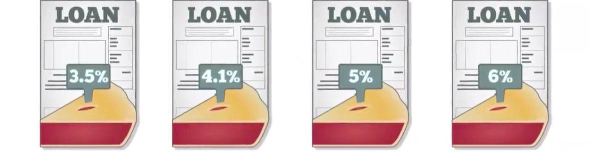

## Table of Contents

## What is a tranche in finance?

A tranche in finance is like a slice of a bigger pie. It's a part of a larger pool of financial assets, like loans or bonds, that is divided into smaller pieces. Each piece, or tranche, can have different levels of risk and return. This way, investors can choose the part that matches what they want and how much risk they are willing to take.

Tranches are often used in something called securitization. This is when banks take a bunch of loans, like mortgages, and turn them into securities that can be sold to investors. By dividing these securities into tranches, banks can make them more attractive to different kinds of investors. For example, one tranche might be safer with a lower return, while another might be riskier but offer a higher return. This helps spread out the risk and makes it easier for banks to sell these securities.

## How are tranches used in structured finance?

In structured finance, tranches are used to divide a pool of assets, like loans or bonds, into different parts. Each part, or tranche, has its own level of risk and return. This helps investors pick the part that fits what they want and how much risk they are willing to take. For example, a bank might take a bunch of mortgages and turn them into securities. By dividing these securities into tranches, the bank can make them more appealing to different kinds of investors.

The way tranches work in structured finance is by spreading out the risk. Some tranches are safer and offer lower returns, while others are riskier but offer higher returns. This is helpful because it lets investors choose the level of risk they are comfortable with. For instance, if you want a safer investment, you might pick a tranche that gets paid back first and has a lower risk of losing money. If you are okay with more risk for a chance at higher returns, you might choose a tranche that gets paid back later but offers more money if everything goes well.

## What are the different types of tranches?

In structured finance, tranches are divided into different types based on their risk and return. The main types are senior tranches, mezzanine tranches, and equity tranches. Senior tranches are the safest because they get paid back first from the cash flows of the underlying assets. This means they have the lowest risk but also the lowest return. Mezzanine tranches are in the middle. They get paid back after the senior tranches but before the equity tranches. They have more risk than senior tranches but less risk than equity tranches, and their returns are higher than senior tranches but lower than equity tranches. Equity tranches are the riskiest because they get paid back last. If the underlying assets do not perform well, equity tranches might not get paid at all. But if things go well, they can offer the highest returns.

These different types of tranches help investors choose the level of risk and return they are comfortable with. For example, if you want a safe investment, you might choose a senior tranche. If you are willing to take on more risk for a chance at higher returns, you might pick a mezzanine or equity tranche. This way, the same pool of assets can be attractive to different kinds of investors. By dividing the pool into tranches, banks and other financial institutions can sell these securities more easily and spread out the risk among different investors.

## Why are tranches important in securitization?

Tranches are important in securitization because they help break down a big pool of assets, like loans or bonds, into smaller pieces. This makes it easier for banks to sell these securities to different kinds of investors. By dividing the pool into tranches, each piece can have its own level of risk and return. This way, investors can pick the part that matches what they want and how much risk they are willing to take. For example, some investors might want a safe investment with a lower return, while others might be okay with more risk for a chance at higher returns.

This division into tranches also helps spread out the risk. If all the assets were sold as one big piece, it would be hard to find investors willing to take on all the risk. But by breaking it into tranches, the risk can be shared among different investors. Some tranches are safer and get paid back first, while others are riskier and get paid back later. This makes the securities more attractive to a wider range of investors, which helps banks sell them more easily and manage their own risk better.

## How do tranches affect the risk and return for investors?

Tranches affect the risk and return for investors by dividing a big pool of assets into smaller pieces, each with its own level of risk and return. This means investors can choose the part that fits what they want. For example, if you want a safe investment, you might pick a senior tranche. These tranches get paid back first and have the lowest risk, but they also offer the lowest return. On the other hand, if you are okay with more risk for a chance at higher returns, you might choose an equity tranche. These tranches get paid back last and are the riskiest, but they can offer the highest returns if everything goes well.

By having different tranches, investors can spread out their risk. Instead of putting all their money into one big, risky investment, they can invest in different tranches with different levels of risk. This way, if one tranche does not do well, the others might still be okay. This helps investors manage their risk better and pick investments that match their comfort level with risk and their goals for returns.

## Can you explain the concept of senior and junior tranches?

Senior and junior tranches are parts of a bigger pool of financial assets, like loans or bonds. They are used to divide the pool into pieces with different levels of risk and return. Senior tranches are the safest because they get paid back first from the money coming in from the assets. This means they have the lowest risk, but they also offer the lowest return. If you want a safe investment, you might choose a senior tranche.

Junior tranches, on the other hand, are riskier because they get paid back after the senior tranches. They are also called mezzanine or equity tranches. If the assets do not perform well, junior tranches might not get paid at all. But if things go well, they can offer higher returns. So, if you are okay with more risk for a chance at higher returns, you might pick a junior tranche. This way, investors can choose the level of risk and return that fits what they want.

## What role do tranches play in mortgage-backed securities?

Tranches are really important in mortgage-backed securities because they help break down a big bunch of mortgages into smaller pieces. Each piece, or tranche, has its own level of risk and return. This makes it easier for banks to sell these securities to different kinds of investors. For example, some investors might want a safe investment with a lower return, while others might be okay with more risk for a chance at higher returns. By dividing the mortgages into tranches, banks can make the securities more attractive to a wider range of investors.

This division into tranches also helps spread out the risk. If all the mortgages were sold as one big piece, it would be hard to find investors willing to take on all the risk. But by breaking it into tranches, the risk can be shared among different investors. Some tranches are safer and get paid back first, while others are riskier and get paid back later. This makes the securities more appealing to different investors, which helps banks sell them more easily and manage their own risk better.

## How are tranches prioritized in terms of payment?

Tranches are prioritized in terms of payment based on their level of risk. The safest tranches, called senior tranches, get paid back first. They have the lowest risk because they are the first to receive money from the underlying assets, like loans or mortgages. This means that if something goes wrong, senior tranches are more likely to get their money back. Because they are safer, they also offer the lowest return to investors.

The riskier tranches, like mezzanine and equity tranches, get paid back after the senior tranches. Mezzanine tranches are in the middle; they get paid back after the senior tranches but before the equity tranches. Equity tranches are the riskiest because they get paid back last. If the underlying assets do not perform well, equity tranches might not get paid at all. But if everything goes well, they can offer the highest returns. This way, investors can choose the level of risk and return that fits what they want.

## What are some common examples of tranches in financial products?

Tranches are often used in mortgage-backed securities. Imagine a bank has a bunch of home loans. Instead of keeping all these loans, the bank can turn them into securities and sell them to investors. By dividing these securities into tranches, the bank can make them more appealing to different kinds of investors. Some investors might want a safe investment, so they pick a senior tranche that gets paid back first. Others might be okay with more risk for a chance at higher returns, so they choose a junior tranche that gets paid back later.

Another common example is in collateralized debt obligations (CDOs). CDOs are like a big mix of different kinds of debt, like loans or bonds. Just like with mortgage-backed securities, these debts are divided into tranches. Each tranche has its own level of risk and return. Investors can pick the tranche that fits what they want. If you want a safer investment, you might choose a senior tranche. If you are okay with more risk for a chance at higher returns, you might pick a junior tranche. This way, the same pool of debt can be attractive to different kinds of investors.

## How do credit ratings influence the structuring of tranches?

Credit ratings play a big role in how tranches are set up. When banks or other financial institutions create securities like mortgage-backed securities or collateralized debt obligations, they get credit ratings from agencies like Moody's or Standard & Poor's. These ratings tell investors how safe or risky the tranches are. The safest tranches, called senior tranches, usually get the highest credit ratings because they are the first to get paid back from the money coming in from the underlying assets. This makes them more attractive to investors who want a safe investment.

The riskier tranches, like mezzanine and equity tranches, get lower credit ratings because they are paid back later and have a higher chance of not getting paid at all if things go wrong. Investors who are okay with more risk for a chance at higher returns might choose these tranches. By using credit ratings to structure the tranches, banks can make the securities more appealing to a wider range of investors. This helps them sell the securities more easily and manage their own risk better.

## What are the potential risks associated with investing in different tranches?

Investing in different tranches comes with different levels of risk. Senior tranches are the safest because they get paid back first from the money coming in from the underlying assets. But even though they are safer, there is still a small chance that something could go wrong and they might not get all their money back. For example, if a lot of people stop paying their mortgages, even the senior tranches could be affected. So, while the risk is lower, it's not zero.

Mezzanine and equity tranches are riskier because they get paid back after the senior tranches. If the underlying assets do not perform well, these tranches might not get paid at all. For instance, if a lot of people default on their loans, the mezzanine and equity tranches could lose a lot of money. But if everything goes well, these tranches can offer higher returns. So, the risk is higher, but so is the potential reward.

Understanding these risks is important for investors. They need to think about how much risk they are willing to take and what kind of returns they are looking for. By choosing the right tranche, investors can match their investment to their comfort level with risk and their financial goals.

## How have tranches been used in financial crises, such as the 2008 financial crisis?

Tranches played a big role in the 2008 financial crisis, especially in mortgage-backed securities. Banks took a bunch of home loans and turned them into securities. They divided these securities into tranches, with senior tranches being the safest and getting paid back first, and junior tranches being riskier and getting paid back later. Investors thought the senior tranches were safe because they had high credit ratings. But when a lot of people started defaulting on their mortgages, even the senior tranches lost value. This made investors lose a lot of money and caused a big problem in the financial markets.

The use of tranches made the crisis worse because it hid the real risk of the securities. Many investors did not understand how risky the junior tranches were, and even the senior tranches turned out to be riskier than expected. Banks sold these securities to investors all over the world, spreading the risk but also spreading the problems when things went wrong. This led to a lot of banks and financial institutions losing money, which made the crisis even bigger.

## References & Further Reading

[1]: Fabozzi, F. J., Bhattacharya, A. K., & Berliner, W. S. (2012). ["Mortgage-Backed Securities: Products, Structuring, and Analytical Techniques"](https://www.semanticscholar.org/paper/Mortgage-Backed-Securities%3A-Products%2C-Structuring%2C-Fabozzi-Bhattacharya/079a00b3778cd64b681de9581e75890513f35f01). Wiley.

[2]: [Hull, J. C. (2018). "Options, Futures, and Other Derivatives"](https://www.semanticscholar.org/paper/Options%2C-Futures%2C-and-Other-Derivatives-Hull/89bdee500c8623864fc9eb7a471546aa713acc44). Pearson.

[3]: ["Technical Analysis of Financial Markets: A Comprehensive Guide to Trading Methods and Applications"](https://www.amazon.com/Technical-Analysis-Financial-Markets-Comprehensive/dp/0735200661) by John J. Murphy

[4]: Wilmott, P. (2006). ["Paul Wilmott Introduces Quantitative Finance"](https://www.amazon.com/Paul-Wilmott-Introduces-Quantitative-Finance/dp/0470319585). Wiley.

[5]: ["Algorithmic Trading and DMA: An Introduction to Direct Access Trading Strategies"](https://archive.org/details/algorithmictradi0000john) by Barry Johnson