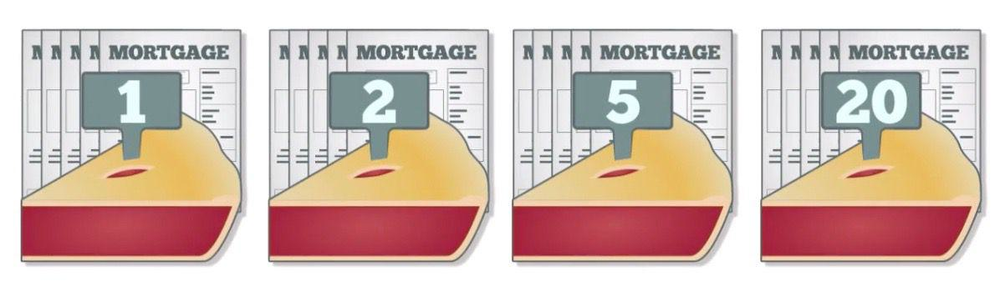

Financial instruments are assets that can be traded, including cash, evidence of ownership in an entity, or a contractual right to receive or deliver cash or another financial instrument. Common examples encompass stocks, bonds, and derivatives. These instruments play a crucial role in the allocation of capital and risk across different sectors of the economy, facilitating investment and hedging activities.

Structured finance, on the other hand, refers to the practice of pooling various types of debt—including loans and mortgages—and selling them as consolidated financial products to investors. The primary goal is to create financial products tailored to the specific risk and return preferences of different investors. Key components of structured finance include asset-backed securities, such as collateralized debt obligations (CDOs), collateralized mortgage obligations (CMOs), and mortgage-backed securities (MBS). These products often involve a process known as securitization, where the cash flows from a pool of assets are collected and redistributed to different classes of securities (known as tranches) based on their distinct risk levels.



Tranches are a critical concept within structured finance. They refer to slices or portions of a pooled collection of securities offering investors varying levels of risk and return based on their seniority and payment priority. Senior tranches generally receive payments first and are thus less risky, while junior tranches are subordinate, receiving payments only after senior tranches have been paid, and are therefore riskier.

Algorithmic trading is increasingly crucial in modern finance. It involves using computer programs to execute trades based on predetermined criteria at speeds and frequencies that are impossible for human traders. Algorithms can analyze vast amounts of data to identify trading opportunities, improve liquidity, and reduce transaction costs. In the context of structured finance, algorithmic trading can optimize the selection and management of different tranches and structured products, enhancing both efficiency and profitability.

This article aims to examine how these financial concepts intersect. It provides insights into how financial instruments and structured finance operate, the function of tranches, and the evolving role of algorithmic trading in the modern financial ecosystem. By understanding these interactions, investors and financial professionals can make informed decisions in an increasingly complex marketplace.

## Table of Contents

## Understanding Financial Instruments and Structured Finance

Financial instruments are legal contracts that represent monetary value and can be traded. They are essential to investing as they provide mechanisms for allocating capital, mitigating risk, and providing liquidity. Common examples include stocks, bonds, options, and derivatives. Each financial instrument comes with specific risk-return profiles and liquidity characteristics, allowing investors to tailor their portfolios based on their individual needs and risk appetite.

Structured finance is a sophisticated segment of financial services that aids in managing risk and optimizing capital structures. It involves complex financial transactions underpinned by legal and tax structures. The primary components of structured finance include the creation of financial products such as Collateralized Debt Obligations (CDOs), Collateralized Mortgage Obligations (CMOs), and Mortgage-Backed Securities (MBS).

Securitization is pivotal in structured finance—it involves pooling various types of contractual debt such as mortgages or loans and selling their related cash flows to third-party investors as securities. This transforms illiquid assets into liquid ones, allowing institutions to remove them from their balance sheets, thereby freeing up capital and dispersing risk.

Examples of structured products include:

1. **Collateralized Debt Obligations (CDOs):** These are complex instruments that pool together various loans and credit assets and redistribute the income they generate. CDOs can include diverse asset types, from mortgages to corporate bonds, grouped into tranches with varying levels of risk and return.

2. **Collateralized Mortgage Obligations (CMOs):** A type of mortgage-backed security that contains a pool of mortgages bundled together and sold as an investment. CMOs are divided into tranches that have different maturity dates and levels of risk, creating variations in return and cash flow prioritization.

3. **Mortgage-Backed Securities (MBS):** MBS are securities created from the pooling of mortgages sold to investors. They offer a way for financial institutions to offload mortgage loans from their balance sheets, transferring risk and improving liquidity.

Structured finance serves to distribute risk more effectively and provides customized solutions tailored to meet specific investment demands. It plays a crucial role in financial markets by increasing the availability of credit and improving capital flows. The intricacies of these financial products and processes underscore the importance of sophisticated financial engineering and the integration of advanced financial theories into practice.

## What are Tranches?

Tranches, derived from the French word for "slice," refer to segments within a financial instrument that divide its various characteristics, such as risk and return, among investors. This structuring enables tailored investment opportunities within a single security, appealing to investors with different risk appetites and investment goals. First gaining prominence in the structured financial markets of the 1980s, tranches became a foundational element in products such as collateralized mortgage obligations (CMOs), collateralized debt obligations (CDOs), and mortgage-backed securities (MBS).

In financial products, tranches are often categorized by their level of risk, maturity, and priority in receiving payments. Each tranche represents a portion of the underlying asset pool and carries different exposure to default risk. Typically, tranches are arranged in a hierarchy where senior tranches are given priority in payment and principal distribution, thus bearing lower risks. Conversely, junior or equity tranches absorb losses first and therefore offer potentially higher returns to compensate for their elevated risk. This hierarchy allows for precise risk allocation, which can be attractive to institutional investors seeking specific risk-return profiles.

When examining tranching in debt instruments, mortgage-backed securities (MBS) serve as a prime example. In an MBS, a bundle of mortgage loans is pooled together, and their income stream is used to pay investors in different tranches. The topmost or senior tranche receives payments first and is the least risky, while mezzanine and junior tranches receive payments sequentially and are exposed to greater risk. This structured payment system aims to increase marketability and investment flexibility by providing varying levels of credit risk tailored to the needs of diverse investors seeking exposure to mortgage assets.

Another mathematical approach to understanding tranches involves their pricing and risk evaluations, often implemented through models such as Gaussian copula or Monte Carlo simulation to estimate default probabilities and potential returns. Here's a basic example using Python to simulate a simple tranche risk profile:

```python
import numpy as np

# Variables for a hypothetical tranche
loss_given_default = 0.6  # 60% loss if default occurs
recovery_rate = 1 - loss_given_default

# Simulated default probability for different tranches
probabilities = {'senior': 0.05, 'mezzanine': 0.15, 'junior': 0.3}

# Expected loss calculation
def expected_loss(probability, loss_given_default):
    return probability * loss_given_default

# Calculate expected losses for each tranche
expected_losses = {tranche: expected_loss(prob, loss_given_default) for tranche, prob in probabilities.items()}

print("Expected Losses by Tranche:")
for tranche, loss in expected_losses.items():
    print(f"{tranche.capitalize()} Tranche: {loss:.2f}")
```

This code snippet calculates the expected loss for each tranche based on its default probability and loss given default, illustrating how different tranches within a structured product [carry](/wiki/carry-trading) varying levels of anticipated risk. Such analyses aid in decision-making for investors evaluating their potential commitments in tranches across structured financial products.

## Tranches in Mortgage-Backed Securities

Mortgage-backed securities (MBS) represent a class of structured finance products that are integral to the modern financial landscape. An MBS is essentially a type of asset-backed security secured by a collection of mortgages. These products are structured by pooling together mortgage loans and selling them as securities to investors. The cash flows received from the underlying mortgages, such as interest and principal payments, are then passed through to the investors in a defined structure.

Tranches play a pivotal role in the structuring of these securities. In this context, a tranche refers to a specific class or segment of a security that has varying levels of risk and reward. This segmentation allows different types of investors to choose tranches that align with their risk tolerance and investment objectives. Typically, MBS are divided into several tranches, each bearing distinct risk-return characteristics based on the priority of cash flow distribution.

The risk and reward dynamic in MBS tranches is crucial for investors. Lower-risk tranches, often referred to as senior tranches, have the first claim to the cash flows before the subordinated tranches are paid. Consequently, they offer lower yields but come with reduced risk. In contrast, junior or subordinated tranches bear a higher risk as they assume exposure to defaults and other credit risks first. However, these tranches compensate for this additional risk by offering higher potential returns.

Investors employ various strategies when selecting MBS tranches. Conservative investors might favor senior tranches due to their lower risk and protection against defaults. These tranches are often rated higher by credit rating agencies, thus appealing to institutional investors like pension funds and insurance companies seeking predictable, stable returns.

Conversely, risk-tolerant investors or hedge funds might choose to invest in subordinate tranches, capitalizing on higher yields and the potential for substantial returns in favorable economic conditions. These investors often employ sophisticated risk management techniques, including diversification and hedging, to mitigate potential losses.

The choice of tranche investment further considers factors such as the current economic outlook, changes in interest rates, and housing market conditions, as they impact mortgage defaults and prepayments. For instance, in an environment of rising interest rates, prepayments typically decrease, affecting the cash flow to MBS investors and shifting their strategies.

Overall, tranching in MBS enables a wide array of investment possibilities by offering diversified risk exposure, thereby catering to multiple investor profiles. It also underscores the importance of due diligence and thorough risk assessment when engaging with such structured finance products.

## Algorithmic Trading in Structured Finance

Algorithmic trading, often referred to as algo trading, utilizes computer algorithms to execute trades at high speeds and volumes, usually without human intervention. Its relevance in financial markets has grown substantially with the increasing complexity and velocity of trading activities. Algorithms enable traders to quickly analyze massive datasets, identify trading opportunities, and execute trades at optimal prices, thereby enhancing market efficiency and [liquidity](/wiki/liquidity-risk-premium).

### Integration of Algorithmic Trading with Structured Finance

Structured finance involves the issuance of complex financial instruments that are often derived from different asset classes, such as mortgages or corporate debt. The integration of [algorithmic trading](/wiki/algorithmic-trading) into structured finance allows for the efficient management and trading of these complex products, including tranches.

Tranches, which are subdivisions of structured finance products like Collateralized Debt Obligations (CDOs) or Mortgage-Backed Securities (MBS), can be managed more dynamically using algorithmic strategies. Algorithms can be programmed to monitor market conditions, assess tranche performance, and rebalance portfolios in real-time. This integration enhances precision in pricing, risk assessment, and diversification strategies.

A typical algorithm employed in this domain might involve the use of quantitative modeling and optimization techniques to select tranches based on risk profiles and expected returns. Algorithms can process historical data and predictive analytics to forecast price movements and liquidity changes, enabling traders to tweak tranche exposure accordingly.

### Benefits and Challenges of Using Algorithms in Managing Tranches and Structured Products

**Benefits:**

1. **Speed and Efficiency:** Algorithms can execute trades in milliseconds, allowing for rapid response to market developments. This speed is crucial for structured products, where price sensitivity and market volatility are significant.

2. **Data-Driven Decision Making:** Algorithms are capable of analyzing large datasets more thoroughly than a human could. This capability helps in making better-informed decisions about tranche selection, risk management, and hedging strategies.

3. **Cost Reduction:** Automation reduces the need for manual processing and oversight, which can lower transaction costs and improve operational efficiency.

4. **Risk Management:** Algorithms can continuously assess and adjust tranche positions based on real-time risk metrics and market dynamics, providing a robust framework for managing financial risk.

**Challenges:**

1. **Complexity of Structured Products:** The intricate nature of tranches requires sophisticated models that can handle various asset types and their interdependencies. Developing and maintaining these models is complex and resource-intensive.

2. **Market Liquidity:** For structured products, liquidity can be less predictable, making it challenging for algorithms to execute trades without impacting prices adversely.

3. **Model Risk:** Algorithmic trading strategies are reliant on financial models, which carry the risk of inaccuracies due to incorrect assumptions or data limitations.

4. **Technology Risk:** Systemic failures or cyber threats pose significant risks, necessitating robust IT infrastructure and security measures to minimize disruptions.

In conclusion, while algorithmic trading offers numerous advantages in the context of structured finance and tranche management, it also requires careful consideration of the associated challenges to optimize its application effectively. As technology evolves, algorithmic trading is likely to become even more integral to managing complex financial instruments, presenting opportunities for enhanced returns and risk management.

## Investment Strategies and Risk Management

Investors manage risk in structured financial products by carefully selecting tranches that align with their risk tolerance and return objectives. Tranches are segments of debt instruments that are divided based on different levels of risk and return, allowing investors to choose exposures that suit their needs. When investing in tranches, understanding and utilizing credit enhancements and tranche ratings are crucial for risk management.

Credit enhancements are mechanisms used to improve the creditworthiness of a tranche, thus reducing the perceived risk for investors. These enhancements may include overcollateralization, reserve accounts, or guarantees, which serve to protect investors from potential losses. By offering an additional layer of security, credit enhancements make lower-rated tranches more attractive to a broader range of investors.

Tranche ratings, typically provided by rating agencies, further assist investors in assessing and managing risk. These ratings—often ranging from AAA (or equivalent) for the least risky tranches to B or lower for the riskiest—offer insights into the default probability and potential returns associated with each tranche. Investors rely on these ratings to construct a diversified portfolio that balances risk and return according to their investment goals.

Market conditions significantly influence tranche investment strategies. During periods of economic growth and stability, investors might be more willing to invest in lower-rated, higher-yield tranches due to the lower perceived risk of default. Conversely, in uncertain economic times, risk-averse investors may prefer higher-rated tranches that offer greater security, albeit at lower returns.

The dynamic nature of market conditions also requires investors to continually reassess their tranche holdings. Interest rate changes, shifts in credit spreads, and macroeconomic indicators can all impact the attractiveness and risk profile of different tranches. For example, a rise in interest rates might lead to decreased prepayment speeds in mortgage-backed securities (MBS), affecting the cash flows of certain tranches and subsequently influencing investor strategy.

Quantitative models and tools play a vital role in optimizing tranche selection and risk management. By employing statistical analysis and Monte Carlo simulations, investors can forecast potential risks and develop strategies to mitigate them effectively. Python, for instance, provides powerful libraries such as NumPy and pandas for data analysis, which can be used to run simulations and stress tests on various tranche configurations to understand potential outcomes and risks better.

In conclusion, savvy tranche investors manage risk through detailed analysis of credit enhancements, tranche ratings, and current market conditions, balancing these factors to optimize their investment strategies. As financial markets continue to evolve, the ability to leverage advanced analytical tools will remain pivotal in navigating the complexities of tranche-based investments.

## The Role of Technology and Data Analytics

The integration of technology and data analytics in tranche management and structured finance has profoundly transformed how financial products are assessed, managed, and traded. The application of data analytics allows for improved decision-making by leveraging large datasets to inform strategies and manage risk more effectively. This section examines the key technological advancements, the role of algorithmic trading systems, and future trends in financial technology impacting tranche investments.

### The Use of Data Analytics in Tranche Management and Structured Finance

Data analytics has emerged as a crucial tool in the management of tranches and structured finance products. Through sophisticated analytics, financial professionals can access and interpret vast quantities of data, leading to more informed decision-making processes. Data analytics can help in predicting cash flows, assessing the risk levels of various tranches, and optimizing portfolio performance. For example, [machine learning](/wiki/machine-learning) algorithms can be trained to identify patterns or anomalies in historical pricing data, helping investors to predict future performance and price [volatility](/wiki/volatility-trading-strategies) of tranches.

### Technological Advancements in Algorithmic Trading Systems

Algorithmic trading systems use pre-programmed trading instructions and complex algorithms to execute trades at speeds and frequencies that are impossible for a human trader. These systems are designed to identify optimal trading opportunities by analyzing multiple data inputs concurrently. Key technological advancements in this area include the use of high-frequency trading ([HFT](/wiki/high-frequency-trading-strategies)) and the development of smart order routing systems that optimize trades across different markets.

Python, a programming language commonly utilized for its simplicity and extensive library ecosystem, facilitates the creation of these trading algorithms. Below is a simple example of a trading algorithm using Python:

```python
import numpy as np
import pandas as pd

# Sample data
data = pd.read_csv('historical_prices.csv')
moving_average_short = data['Price'].rolling(window=5).mean()
moving_average_long = data['Price'].rolling(window=20).mean()

# Generate signals
data['Signal'] = 0
data['Signal'][5:] = np.where(moving_average_short[5:] > moving_average_long[5:], 1, 0)

# Calculate positions
data['Position'] = data['Signal'].diff()

print(data[['Price', 'Signal', 'Position']])
```

This example calculates moving averages to generate buy or sell signals, serving as the foundation for a more sophisticated trading algorithm.

### Future Trends in Financial Technology Affecting Tranche Investments

Financial technology, or fintech, continues to evolve, significantly influencing tranche investment strategies. One emerging trend is the use of blockchain technology to enhance transparency and security in trading activities. Blockchain can provide an immutable record of transactions, reducing counterparty risks and increasing trust among investors.

Another trend is the increasing role of [artificial intelligence](/wiki/ai-artificial-intelligence) (AI) and machine learning in predictive modeling and decision-making processes. AI can enhance the accuracy of predictions regarding market trends and tranche performance, driving more efficient risk management strategies.

Moreover, the growing field of quantum computing holds the potential to revolutionize data processing speeds and computational capabilities, further advancing algorithmic trading and analytics practices.

In conclusion, the integration of technology and data analytics in tranche management and structured finance provides unprecedented opportunities for efficiency, accuracy, and innovation. With continual advancements and integration of new technologies, the financial landscape will become increasingly dynamic, necessitating adept adaptation by investors and managers alike.

## Conclusion and Future Outlook

The intersection of financial instruments, tranches, structured finance, and algorithmic trading marks a significant evolution in modern finance. This article has explored these elements, highlighting their interconnected roles in shaping investment strategies and risk management.

Structured finance, with its ability to transform illiquid assets into liquid ones, continues to support complex financial architectures. Through the mechanism of securitization, diversified financial products such as collateralized debt obligations (CDOs), collateralized mortgage obligations (CMOs), and mortgage-backed securities (MBS) have emerged, offering varied risk and return profiles to investors. The concept of tranching allows for the distribution of risk by creating different layers of investment, each with distinct risk levels and returns. This hierarchical structuring has been instrumental in catering to investors' varied risk appetites, emphasizing the need for diversified investment portfolios.

Algorithmic trading has revolutionized the financial market landscape by introducing speed, efficiency, and precision in trading activities. Its integration with structured finance enables the dynamic management of complex structured products and tranches, optimizing investment decisions and risk assessment. As algorithmic trading systems evolve, incorporating advanced data analytics and machine learning, we anticipate enhanced predictive capabilities and more sophisticated risk management strategies.

Looking forward, the evolution of structured finance and tranches will be shaped by innovations in financial technology. Increased automation, the development of artificial intelligence, and the utilization of big data are expected to drive the next phase of growth. In algorithmic trading, more adaptive and intelligent systems will likely dominate, offering unprecedented insights and opportunities for optimizing financial products.

In conclusion, the continuous transformation of structured finance and the increasing prominence of algorithmic trading promise to redefine the dynamics of financial markets. Investors and stakeholders must stay informed and agile to leverage these developments effectively, ensuring robustness and innovation in their financial practices.

## References & Further Reading

[1]: Fabozzi, F. J., Bhattacharya, A. K., & Berliner, W. S. (2012). ["Mortgage-Backed Securities: Products, Structuring, and Analytical Techniques"](https://www.semanticscholar.org/paper/Mortgage-Backed-Securities%3A-Products%2C-Structuring%2C-Fabozzi-Bhattacharya/079a00b3778cd64b681de9581e75890513f35f01). Wiley Finance.

[2]: O'Kane, D. (2008). ["Modelling Single-name and Multi-name Credit Derivatives"](https://download.e-bookshelf.de/download/0000/5780/36/L-G-0000578036-0015277939.pdf). Wiley Finance.

[3]: Gorton, G. B. (2010). ["Slapped by the Invisible Hand: The Panic of 2007"](https://www.atlantafed.org/-/media/Documents/news/conferences/2009/financial-markets-conference/gorton.pdf). Oxford University Press.

[4]: Hull, J. C. (2017). ["Options, Futures, and Other Derivatives"](https://www.semanticscholar.org/paper/Options%2C-Futures%2C-and-Other-Derivatives-Hull/89bdee500c8623864fc9eb7a471546aa713acc44). Pearson.

[5]: Lewis, M. (2011). ["The Big Short: Inside the Doomsday Machine"](https://books.google.com/books/about/The_Big_Short_Inside_the_Doomsday_Machin.html?id=eParwQ0YdrcC). W. W. Norton & Company.