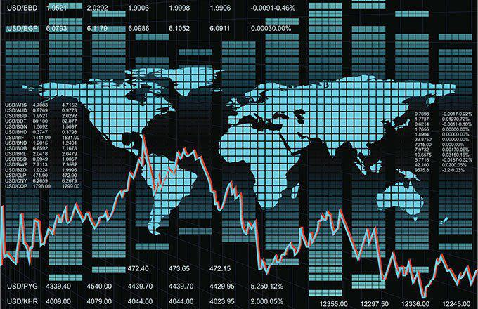

The Trans-Pacific Partnership (TPP) represented a pivotal initiative aimed at bolstering economic ties and enhancing trade across Pacific Rim economies. Spanning a total of 12 nations, including major economies such as the United States, Japan, and Australia, the TPP was structured to reduce trade barriers, such as tariffs, while promoting standards in labor and environmental practices. The breadth and scope of the agreement underscored its significance, potentially reshaping trade dynamics across one of the world’s most economically vibrant regions.

However, the journey of the TPP was fraught with challenges and eventual decline, marked most notably by the United States' withdrawal in 2017. This decision left the agreement without its largest economy, prompting the remaining members to explore viable alternatives. In this article, we analyze the comprehensive trajectory of the TPP, from its ambitious beginnings to subsequent adaptations that emerged in its wake.

Alongside examining these trade agreements, it is important to consider the role of technological advancement in this sphere. As global trading systems evolve, modern technologies, such as algorithmic trading, become increasingly intertwined with trade agreements. Algorithmic trading, which utilizes computers to execute trades at high speeds and volumes based on pre-set criteria, has revolutionized financial markets. Understanding how such technology aligns with contemporary trade agreements provides insights into the ongoing transformation of global trade processes.

This discussion highlights the multifaceted nature of trade agreements today, focusing on both geopolitical maneuvering and technological advancements that continuously redefine the global trading environment.

## Table of Contents

## Overview of the Trans-Pacific Partnership (TPP)

The Trans-Pacific Partnership (TPP) was a noteworthy multilateral trade agreement aimed at enhancing economic integration among 12 Pacific Rim countries, which included Australia, Brunei, Canada, Chile, Japan, Malaysia, Mexico, New Zealand, Peru, Singapore, the United States, and Vietnam. The primary objective of the TPP was to reduce tariffs and other trade barriers, thereby facilitating more efficient cross-border commerce and fostering a deeper economic collaboration between member nations.

The agreement, officially signed on February 4, 2016, was ambitious in its scope and intent. It sought not only to create market access by lowering tariffs but also to implement high standards on a range of trade-related issues. Among these were environmental commitments and labor standards, which were part of the broader pursuit to ensure that economic growth driven by trade would be sustainable and inclusive. The environmental provisions included measures to combat illegal wildlife trade and promote sustainable fisheries management. Labor standards aimed to uphold the rights of workers, seeking to prevent exploitation and improve working conditions across member countries.

However, the TPP encountered significant setbacks when the United States, initially the largest economy within the pact, withdrew from the agreement under the administration of President Donald Trump in January 2017. President Trump’s decision was motivated by a policy shift towards prioritizing bilateral trade deals over multilateral ones, as well as concerns over the potential negative impacts on domestic industries and employment. The U.S. withdrawal represented a pivotal moment for the TPP as it not only reduced the economic clout of the agreement but also prompted the remaining signatories to reevaluate their participation and the future of the pact.

In response to the challenges posed by the U.S. departure, the remaining countries continued to work towards preserving the principles of the TPP. Their efforts culminated in the creation of the Comprehensive and Progressive Agreement for Trans-Pacific Partnership (CPTPP), which retained much of the original TPP framework but with certain provisions suspended. The CPTPP signifies the enduring commitment of its members to pursue mutual economic benefits in a rapidly changing global trade environment.

## Challenges and Criticisms of the TPP

The Trans-Pacific Partnership (TPP) faced significant challenges and criticisms, which ultimately contributed to its contentious reputation. One of the primary critiques was the perceived secrecy surrounding the negotiations. Many stakeholders argued that the lack of transparency hindered public and governmental debate, leading to a deficit in accountability and democratic participation. According to critics, the negotiations were conducted behind closed doors, with limited input from civil society groups, thus raising concerns about the extent to which public interest was represented.

Another major concern was the potential impact on domestic employment. Opponents of the TPP contended that the agreement would exacerbate job losses in certain industries due to increased foreign competition. By reducing tariffs and opening markets, some argued that the TPP would encourage companies to relocate production to countries with lower labor costs, negatively affecting employment levels in higher-cost member countries. This apprehension about job displacement played a critical role in rallying opposition, particularly among labor unions and local industry representatives.

Moreover, the inclusion of investor-state dispute settlement (ISDS) clauses in the TPP sparked controversy over corporate influence on national sovereignty. ISDS provisions allow foreign investors to challenge government regulations and policies that they claim unfairly impact their investments. Critics argued that these clauses could empower multinational corporations to bypass domestic legal systems and potentially undermine national regulatory autonomy. There was a fear that ISDS mechanisms might prioritize corporate interests over public welfare, particularly in areas like environmental regulation, public health, and consumer protection.

Overall, the criticisms of the TPP highlighted fundamental tensions between the globalization of trade and concerns about sovereignty, transparency, and economic justice. These issues underscored the divisive nature of the TPP and fueled ongoing debates about the future of international trade agreements.

## Emergence of TPP Alternatives

Following the United States' withdrawal from the Trans-Pacific Partnership (TPP) in 2017, the remaining 11 countries initiated the Comprehensive and Progressive Agreement for Trans-Pacific Partnership (CPTPP). This agreement, which came into force on December 30, 2018, retained much of the original TPP framework but suspended several provisions at the behest of the United States. The CPTPP aimed to promote trade liberalization, reduce tariffs, and set high standards for environmental and labor regulations among its member countries, which include Australia, Canada, Japan, and Vietnam, among others. By reinforcing economic ties within the Pacific Rim, the CPTPP underscores these nations' dedication to fostering a multilateral trading system, despite the absence of the United States.

Simultaneously, China's engagement in the Regional Comprehensive Economic Partnership (RCEP) provided another strategic dimension to cooperative trade models. This agreement, signed in November 2020 and effective as of January 1, 2022, comprises 15 Asia-Pacific countries, including ASEAN members and key partners such as China, Japan, and South Korea. The RCEP focuses on lowering trade barriers and enhancing economic integration among its members, representing a market encompassing approximately 30% of global GDP. Unlike the CPTPP, RCEP is less stringent concerning labor and environmental stipulations, reflecting China's influence and strategic economic aspirations.

The establishment of these alternatives symbolizes significant geopolitical shifts and countries' ongoing commitment to sustaining multilateral cooperation amidst evolving global trade dynamics. The CPTPP and RCEP cater to different regional interests and economic strategies, signaling the complexities inherent in modern trade negotiations and the diverse approaches countries adopt in pursuing economic collaboration.

## Algorithmic Trading in the Context of Trade Agreements

Algorithmic trading, a method that uses computer algorithms to automate trading processes, has fundamentally transformed financial markets. This high-frequency trading technology leverages complex mathematical models and algorithms to execute trades at speeds and frequencies that are impossible for human traders. This development enhances market efficiency by increasing [liquidity](/wiki/liquidity-risk-premium) and reducing transaction costs, leading to more stable and well-functioning markets.

Trade agreements increasingly acknowledge the importance of digital trade and incorporate provisions that ensure fair and transparent digital markets. For instance, contemporary trade pacts often emphasize the need for regulatory environments that support secure data flows, electronic commerce, and the protection of digital services and intellectual property. These provisions are vital as [algorithmic trading](/wiki/algorithmic-trading) relies heavily on data accessibility and transmission across borders.

With the rapid adoption of algorithmic trading, modern trade agreements must carefully consider the implications of this technology. Ensuring that markets remain transparent and competitive involves regulating practices that could lead to market manipulation or unfair trading advantages. For example, flash crashes, largely attributed to high-frequency trading, highlight the need for robust regulatory frameworks to mitigate systemic risks. Therefore, aligning trade agreements with international standards on electronic trading and cybersecurity is essential.

The transformative role of technology in global trade is further underscored by the fusion of algorithmic trading with advances in [artificial intelligence](/wiki/ai-artificial-intelligence) (AI) and [machine learning](/wiki/machine-learning). These technologies enable the development of more sophisticated algorithms that can analyze vast datasets and make real-time trading decisions based on predictive analytics. Consequently, trade agreement provisions must evolve to accommodate these technological advancements, ensuring they foster inclusive growth and equitable access to the benefits of digital trade.

In conclusion, as globalization continues to intertwine with technological innovation, the role of algorithmic trading in trade agreements becomes increasingly critical. By establishing fair and transparent digital trade environments, nations can harness the benefits of algorithmic trading while safeguarding market integrity and promoting sustainable economic development.

## The Future of Global Trade Agreements

The proliferation of trade agreements such as the Comprehensive and Progressive Agreement for Trans-Pacific Partnership (CPTPP) and the Regional Comprehensive Economic Partnership (RCEP) has created a dynamic and multifaceted global trading environment. These agreements symbolize a continued commitment to multilateral trade frameworks, despite geopolitical shifts that challenge traditional trade paradigms. 

The future of global trade policies is inevitably tied to the capacity to balance economic growth with robust environmental and labor protections. Economic growth remains a central objective of any trade agreement, as it drives national prosperity and enhances competitiveness on the global stage. However, sustainable economic growth must integrate substantial environmental and labor safeguards to ensure long-term viability. Trade agreements are increasingly incorporating instruments that enforce such standards, recognizing the intrinsic link between sustainable practices and economic resilience.

Moreover, the integration of technology into trade frameworks is not merely beneficial but necessary. Algorithmic trading, for instance, has emerged as a critical component in modern financial markets, introducing efficiencies and enabling real-time decision-making processes. The inclusion of equitable technology integration within trade agreements ensures that economies can capitalize on technological advancements without exacerbating disparities between developed and developing nations. It also safeguards transparent and fair digital trade practices, underscoring the need for clear regulatory environments that accommodate technological evolution.

To further elaborate, algorithmic trading involves using pre-programmed instructions to execute trades at speeds and frequencies that are impossible for human traders. This technique relies heavily on quantitative models and advanced computational resources. For successful and equitable implementation in global trade, agreements must establish norms that prevent misuse and ensure competitive equality.

As we look forward, the ongoing development of global trade agreements presents both opportunities and challenges. Countries must navigate these complexities by fostering innovations that advance economic goals while maintaining ethical standards. The ability to adapt to these evolving conditions will be vital for achieving sustainable global trade that benefits all parties involved.

## Conclusion

The dynamics of trade across the Pacific Rim have undergone substantial transformations following the dissolution of the Trans-Pacific Partnership (TPP). Post-TPP, new trade agreements, such as the Comprehensive and Progressive Agreement for Trans-Pacific Partnership (CPTPP) and the Regional Comprehensive Economic Partnership (RCEP), have emerged as pivotal frameworks, reshaping the economic landscape and fostering enhanced cooperation among member countries. These agreements reflect a continuing commitment to multilateral trade, emphasizing the importance of reducing trade barriers and harmonizing standards for sustainable development.

Technological advancements, particularly in algorithmic trading, have become increasingly influential in shaping modern trade frameworks. Algorithmic trading allows for the execution of trades at unprecedented speeds and accuracy, optimizing market efficiencies and liquidity. As countries integrate such technologies into their financial systems, trade agreements must incorporate provisions to ensure transparency, fairness, and security in digital markets. This integration represents both a challenge and an opportunity, as it necessitates the development of regulations that keep pace with technological innovation while safeguarding against potential risks such as market manipulation and data privacy breaches.

The ongoing evolution of trade agreements presents a dual challenge and opportunity for achieving sustainable global trade. On one hand, these agreements have the potential to enhance economic growth by increasing market access and driving competitive advantages. On the other hand, the necessity of balancing economic objectives with environmental sustainability and equitable labor practices remains a complex task. Ensuring that technological advancements are harnessed responsibly and inclusively will be crucial to harmonizing economic interests with broader social and environmental goals. As global trade continues to evolve, the pursuit of frameworks that address these multifaceted dynamics will be essential for fostering an equitable and sustainable international trading system.

## References & Further Reading

[1]: ["Trans-Pacific Partnership Agreement: A Framework for Global Trade"](https://en.wikipedia.org/wiki/Trans-Pacific_Partnership) by the Office of the United States Trade Representative.

[2]: ["The Trans-Pacific Partnership: An Assessment"](https://www.amazon.com/Trans-Pacific-Partnership-Assessment-International-Economics/dp/0881327131) by Peter A. Petri and Michael G. Plummer, Peterson Institute for International Economics.

[3]: ["Algorithmic Trading: Winning Strategies and Their Rationale"](https://www.wiley.com/en-us/Algorithmic+Trading%3A+Winning+Strategies+and+Their+Rationale-p-9781118460146) by Ernie Chan.

[4]: Carmen Reinhart and Kenneth Rogoff (2010). ["Growth in a Time of Debt,"](https://www.nber.org/papers/w15639) American Economic Review Papers and Proceedings, American Economic Association.

[5]: ["The Comprehensive and Progressive Agreement for Trans-Pacific Partnership"](https://www.dfat.gov.au/trade/agreements/in-force/cptpp/comprehensive-and-progressive-agreement-for-trans-pacific-partnership) by Global Affairs Canada.