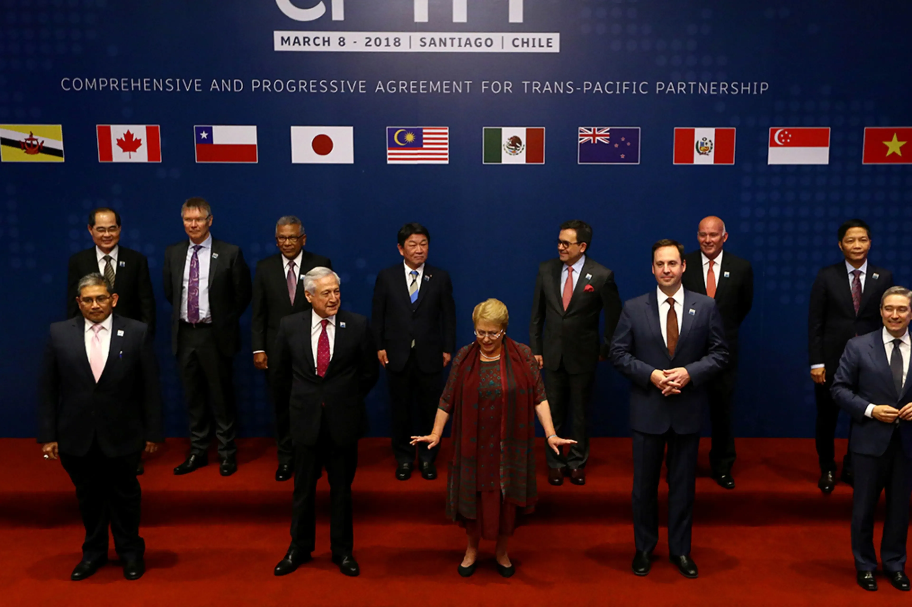

## Table of Contents

## What is the Trans-Pacific Partnership (TPP)?

The Trans-Pacific Partnership (TPP) is a trade agreement between several countries around the Pacific Ocean. It was signed in 2016 by countries like the United States, Japan, Australia, and others. The goal of the TPP was to make it easier for these countries to trade with each other by lowering tariffs and setting common rules for things like labor and the environment.

However, the United States decided to leave the TPP in 2017, which changed things a lot. The remaining countries went ahead and made a new agreement called the Comprehensive and Progressive Agreement for Trans-Pacific Partnership (CPTPP). This new agreement kept most of the original TPP rules but made some changes. The CPTPP aims to help the member countries trade more and grow their economies.

## Which countries were originally involved in the TPP?

The Trans-Pacific Partnership (TPP) started with 12 countries. These countries were the United States, Japan, Australia, New Zealand, Canada, Mexico, Peru, Chile, Malaysia, Singapore, Vietnam, and Brunei. They all wanted to work together to make trade easier and help their economies grow.

The TPP was signed in 2016, but then the United States decided to leave the agreement in 2017. This was a big change because the U.S. was one of the main countries involved. After the U.S. left, the other 11 countries decided to move forward and created a new agreement called the Comprehensive and Progressive Agreement for Trans-Pacific Partnership (CPTPP).

## What are the main objectives of the TPP?

The main goal of the Trans-Pacific Partnership (TPP) was to make trade easier between the countries involved. It wanted to do this by lowering tariffs, which are taxes on goods that countries trade with each other. By lowering these tariffs, the TPP aimed to help businesses sell their products in other countries more easily and at lower prices. This would help the economies of the member countries grow because more trade usually means more jobs and more money for people.

Another important objective of the TPP was to set common rules for things like labor, the environment, and intellectual property. These rules were meant to make sure that all the countries followed similar standards, which would make trade fairer and more predictable. For example, the TPP included rules to protect workers' rights and to make sure companies did not harm the environment. It also had rules to protect things like patents and copyrights, which are important for businesses that create new products or ideas.

## How does the TPP affect trade between member countries?

The TPP makes trade easier between the countries that are part of it. It does this by lowering tariffs, which are like taxes on goods that countries trade with each other. When tariffs are lower, it's cheaper for businesses to sell their products in other countries. This means more trade can happen, which is good for the economies of the member countries. More trade can lead to more jobs and more money for people.

The TPP also sets common rules for things like labor, the environment, and intellectual property. These rules help make trade fairer and more predictable. For example, the TPP has rules to protect workers' rights and to make sure companies don't harm the environment. It also has rules to protect things like patents and copyrights, which are important for businesses that create new products or ideas. By having these common rules, the TPP helps businesses know what to expect when they trade with other member countries.

## What are the key provisions of the TPP agreement?

The TPP agreement has many important parts that help make trade easier between the countries involved. One key part is lowering tariffs, which are taxes on goods that countries trade with each other. By lowering these tariffs, the TPP makes it cheaper for businesses to sell their products in other countries. This can lead to more trade, which is good for the economies of the member countries because more trade can mean more jobs and more money for people.

Another important part of the TPP is setting common rules for things like labor, the environment, and intellectual property. These rules help make trade fairer and more predictable. For example, the TPP has rules to protect workers' rights and to make sure companies don't harm the environment. It also has rules to protect things like patents and copyrights, which are important for businesses that create new products or ideas. By having these common rules, the TPP helps businesses know what to expect when they trade with other member countries.

## What are the potential benefits of the TPP for participating countries?

The TPP can bring many benefits to the countries that take part in it. One big benefit is that it makes trade easier. By lowering tariffs, which are taxes on goods that countries trade with each other, the TPP makes it cheaper for businesses to sell their products in other countries. This can lead to more trade, which is good for the economies of the member countries. More trade can mean more jobs and more money for people, which can help the economy grow.

Another benefit is that the TPP sets common rules for things like labor, the environment, and intellectual property. These rules help make trade fairer and more predictable. For example, the TPP has rules to protect workers' rights and to make sure companies don't harm the environment. It also has rules to protect things like patents and copyrights, which are important for businesses that create new products or ideas. By having these common rules, the TPP helps businesses know what to expect when they trade with other member countries, which can make them more confident about doing business.

## What criticisms have been made against the TPP?

One big criticism of the TPP is that it might hurt workers in the countries that are part of it. Some people worry that the TPP could make it easier for companies to move jobs to countries where workers get paid less. This could mean fewer jobs and lower wages for workers in countries like the United States and Canada. Critics also say that the TPP doesn't do enough to protect workers' rights and might make it harder for workers to fight for better pay and working conditions.

Another criticism is about the environment. Some people think that the TPP doesn't have strong enough rules to stop companies from harming the environment. They worry that the TPP might let companies pollute more or destroy natural areas to make more money. Critics also say that the TPP could make it harder for countries to pass new laws to protect the environment because companies might sue them for losing money.

A third criticism is about how the TPP was made. Some people think that big companies had too much say in writing the TPP and that regular people didn't have enough of a voice. They worry that the TPP might help big companies make more money but not do enough to help regular people. Critics also say that the TPP is too complicated and hard to understand, which makes it hard for people to know how it might affect them.

## How has the withdrawal of the United States affected the TPP?

The withdrawal of the United States from the TPP in 2017 changed the agreement a lot. The U.S. was one of the biggest countries in the TPP, so when it left, the other countries had to decide what to do next. They decided to go ahead without the U.S. and made a new agreement called the Comprehensive and Progressive Agreement for Trans-Pacific Partnership (CPTPP). This new agreement kept most of the original TPP rules but made some changes to make it work without the U.S.

The absence of the U.S. made the CPTPP less powerful than the original TPP. Without the U.S., the agreement covers a smaller part of the world's economy. But the other countries still think the CPTPP is important because it helps them trade more with each other and grow their economies. The CPTPP also shows that these countries can work together even without the U.S., which could make them stronger in the future.

## What is the Comprehensive and Progressive Agreement for Trans-Pacific Partnership (CPTPP)?

The Comprehensive and Progressive Agreement for Trans-Pacific Partnership (CPTPP) is a trade agreement that came after the United States left the original Trans-Pacific Partnership (TPP). It was made by the 11 remaining countries that were part of the TPP. These countries wanted to keep the benefits of the TPP, so they made the CPTPP. It keeps most of the rules from the TPP but made some changes to make it work without the U.S. The CPTPP aims to make trade easier between these countries by lowering tariffs and setting common rules for things like labor and the environment.

Even though the CPTPP is not as big as the original TPP because the U.S. is not part of it, it still helps the member countries trade more and grow their economies. The CPTPP shows that these countries can work together even without the U.S., which could make them stronger in the future. By having this agreement, the countries hope to create more jobs and make more money for their people.

## How do the CPTPP and TPP differ?

The CPTPP and TPP are very similar because the CPTPP is based on the TPP. The main difference is that the CPTPP does not include the United States, which was a big part of the TPP. When the U.S. left the TPP in 2017, the other 11 countries decided to make a new agreement called the CPTPP. They kept most of the rules from the TPP but made some changes to make it work without the U.S. For example, they suspended some parts of the TPP that were important to the U.S. but not as important to the other countries.

Even though the CPTPP is smaller without the U.S., it still helps the member countries trade more easily with each other. The CPTPP keeps the goal of lowering tariffs, which are taxes on goods that countries trade, and setting common rules for things like labor and the environment. This helps businesses know what to expect when they trade with other member countries. The CPTPP shows that these countries can work together and make their economies stronger even without the U.S.

## What alternative trade agreements have been proposed or implemented in response to the TPP?

After the United States left the TPP, other countries started looking for different ways to make trade easier. One big alternative is the Regional Comprehensive Economic Partnership (RCEP). This agreement includes countries like China, Japan, South Korea, Australia, and many others in Asia. The RCEP aims to lower tariffs and make trade rules simpler between these countries. It's different from the TPP because it doesn't have as many rules about things like labor and the environment, but it still helps countries trade more with each other.

Another alternative is the trade deals that countries have made on their own. For example, the United States has made new trade agreements with countries like Canada and Mexico, called the United States-Mexico-Canada Agreement (USMCA). This agreement replaced an older one called NAFTA. The USMCA has some rules that are similar to the TPP, like protecting workers' rights and the environment, but it's just between these three countries. These smaller agreements help countries keep trading even if they can't be part of a big agreement like the TPP.

## What are the future prospects for the TPP and similar trade agreements?

The future of the TPP and similar trade agreements depends a lot on what countries want and how their economies are doing. The TPP itself is not active anymore because the United States left it, but the CPTPP, which is the new version without the U.S., is still going strong. The countries in the CPTPP are working together to make trade easier and help their economies grow. They might even invite more countries to join, which could make the CPTPP bigger and more important in the future. But it's hard to say for sure because things like politics and the economy can change a lot.

Other trade agreements, like the RCEP, are also becoming more important. The RCEP includes big countries like China and Japan, and it helps them trade more with each other. This agreement might grow even bigger in the future, which could change how countries in Asia and other places trade. At the same time, countries like the United States are making their own smaller trade deals, like the USMCA with Canada and Mexico. These smaller agreements can help countries keep trading even if they can't be part of a big agreement like the TPP. So, the future of trade agreements will likely be a mix of big agreements like the CPTPP and RCEP, and smaller ones between just a few countries.

## References & Further Reading

[1]: ["Trans-Pacific Partnership Agreement: A Framework for Global Trade"](https://en.wikipedia.org/wiki/Trans-Pacific_Partnership) by the Office of the United States Trade Representative.

[2]: ["The Trans-Pacific Partnership: An Assessment"](https://www.amazon.com/Trans-Pacific-Partnership-Assessment-International-Economics/dp/0881327131) by Peter A. Petri and Michael G. Plummer, Peterson Institute for International Economics.

[3]: ["Algorithmic Trading: Winning Strategies and Their Rationale"](https://www.wiley.com/en-us/Algorithmic+Trading%3A+Winning+Strategies+and+Their+Rationale-p-9781118460146) by Ernie Chan.

[4]: Carmen Reinhart and Kenneth Rogoff (2010). ["Growth in a Time of Debt,"](https://www.nber.org/papers/w15639) American Economic Review Papers and Proceedings, American Economic Association.

[5]: ["The Comprehensive and Progressive Agreement for Trans-Pacific Partnership"](https://www.dfat.gov.au/trade/agreements/in-force/cptpp/comprehensive-and-progressive-agreement-for-trans-pacific-partnership) by Global Affairs Canada.