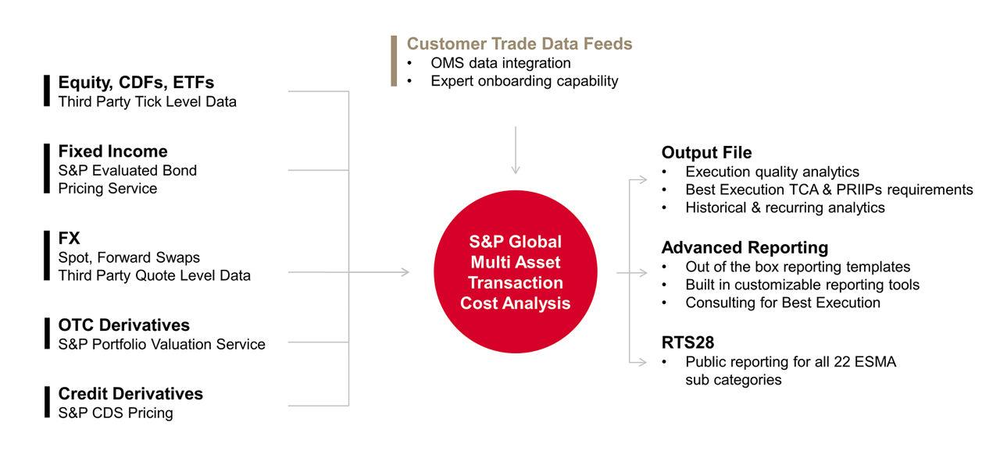

## Table of Contents

## What is Transaction Cost Analysis (TCA)?

Transaction Cost Analysis (TCA) is a method used to evaluate the costs and efficiency of trading in financial markets. It helps investors and traders understand how much they are paying to buy or sell assets, beyond just the price of the asset itself. This includes things like broker fees, taxes, and the difference between the price at which a trade is made and the best available price at that time, known as the "slippage."

TCA is important because it helps people make better trading decisions. By analyzing these costs, traders can see if they are getting a good deal or if they need to change their trading strategy. For example, if TCA shows that trading costs are too high, a trader might decide to use a different broker or trade at a different time of day when costs are lower. This way, TCA helps in saving money and improving the overall performance of investments.

## Why is TCA important in financial markets?

TCA is important in financial markets because it helps traders and investors understand how much they are really paying to buy or sell assets. It's not just about the price of the stock or bond; there are other costs like broker fees, taxes, and the difference between the price you get and the best price available at that moment. By looking at all these costs, TCA shows if you're getting a good deal or if you're paying too much.

Knowing these costs is key to making smarter trading choices. If TCA shows that your trading costs are too high, you might decide to switch to a different broker or trade at a different time when costs are lower. This can help you save money and make your investments perform better. In short, TCA helps you see the full picture of what you're paying, so you can trade more efficiently and effectively.

## What are the main components of TCA?

Transaction Cost Analysis (TCA) has several main parts that help traders understand the costs of buying and selling assets. One key part is the explicit costs, which are the easy-to-see costs like broker fees and taxes. These are the charges you pay directly when you make a trade. Another part is the implicit costs, which are harder to see but still important. These include things like the difference between the price you get and the best price available at that time, called slippage, and the cost of waiting to make a trade, known as market impact.

Another important part of TCA is the timing of trades. This looks at whether trading at a certain time of day or during certain market conditions can affect the costs. For example, trading when the market is very busy might lead to higher costs because it's harder to get the best price. TCA also considers the size of the trade. Larger trades can have a bigger impact on the market, which can increase costs. By looking at all these parts together, TCA helps traders see the full cost of their trades and make better decisions.

## How does TCA help in measuring trade performance?

TCA helps measure trade performance by looking at all the costs involved in buying or selling assets. It shows traders how much they are really paying, not just the price of the stock or bond. This includes things like broker fees, taxes, and the difference between the price you get and the best price available at that time. By understanding these costs, traders can see if they are getting a good deal or if they are paying too much. This helps them figure out how well their trades are doing.

For example, if TCA shows that the costs of trading are too high, a trader might decide to change their strategy. They might switch to a different broker who charges less, or they might choose to trade at a different time of day when the market is less busy and costs are lower. By using TCA to keep an eye on these costs, traders can make better decisions and improve their trade performance over time. This way, TCA helps traders save money and make their investments work better.

## What are the different types of TCA?

There are mainly two types of TCA: pre-trade TCA and post-trade TCA. Pre-trade TCA helps traders before they make a trade. It looks at things like the current market conditions and the costs of trading at that time. This helps traders decide if it's a good time to buy or sell, and how much it might cost them. By using pre-trade TCA, traders can plan their trades better and try to get the best price.

Post-trade TCA, on the other hand, happens after the trade is done. It looks back at the trade to see how much it really cost. This includes checking the broker fees, taxes, and the difference between the price you got and the best price available at that time. Post-trade TCA helps traders see if they got a good deal or if they could have done better. By looking at this information, traders can learn from their past trades and make better decisions in the future.

## How is TCA implemented in trading systems?

TCA is implemented in trading systems by using special software that tracks and analyzes the costs of trading. This software looks at things like broker fees, taxes, and the difference between the price you get and the best price available at that time. It can be set up to work automatically, so it keeps an eye on your trades all the time. Traders can use this information to see if they are paying too much and make changes to their trading strategy if needed.

There are two main ways TCA is used in trading systems: before a trade is made and after a trade is done. Before a trade, the system uses pre-trade TCA to look at the current market conditions and estimate the costs of trading at that time. This helps traders decide if it's a good time to buy or sell. After a trade, the system uses post-trade TCA to look back at the trade and see how much it really cost. This helps traders learn from their past trades and make better decisions in the future.

## What are the common metrics used in TCA?

Common metrics used in TCA help traders understand the costs of their trades. One important metric is the "implementation shortfall," which measures the difference between the price at which a trade is decided and the price at which it is actually executed. This shows how much the trade cost due to delays or market changes. Another key metric is the "slippage," which is the difference between the expected price of a trade and the price at which it is actually filled. Slippage can happen because of market [volatility](/wiki/volatility-trading-strategies) or the size of the trade.

Other metrics include "broker fees" and "taxes," which are the direct costs of trading. These are easy to see and add up over time. "Market impact" is another metric that looks at how a trade affects the market price of an asset. If a trader buys a lot of a stock, it might push the price up, which is a cost to consider. "Volume-weighted average price (VWAP)" is also used, which compares the price of a trade to the average price of the asset over a certain time period. This helps traders see if they got a good deal compared to the market average.

## How can TCA be used to improve trading strategies?

TCA can help traders make their trading strategies better by showing them where they are spending too much money. When traders use TCA, they can see all the costs of their trades, like broker fees, taxes, and the difference between the price they get and the best price available. If TCA shows that these costs are too high, traders can change their strategy. For example, they might switch to a broker that charges less or trade at a different time of day when the market is less busy and costs are lower. By understanding these costs, traders can save money and make their trades more profitable.

Another way TCA helps improve trading strategies is by looking at past trades to learn from them. After a trade is done, TCA can show traders how much it really cost and if they could have done better. This is called post-trade TCA. By studying these past trades, traders can see patterns and find out what works and what doesn't. They might find that certain times of day or certain types of trades are more costly. With this information, traders can adjust their strategies to avoid high-cost situations and make smarter decisions in the future.

## What are the challenges faced when conducting TCA?

Conducting TCA can be tricky because it involves looking at a lot of different costs and data. One big challenge is getting all the right information. Traders need to know about broker fees, taxes, and the difference between the price they get and the best price available. Sometimes, this information is hard to find or not very clear. Also, the market can change quickly, so the data needs to be up-to-date. If the data is old or wrong, the TCA won't be very helpful.

Another challenge is understanding how to use the TCA results to make better trades. TCA gives a lot of numbers and details, but it can be hard to know what to do with them. Traders need to figure out which costs are too high and how to lower them. This might mean changing brokers, trading at different times, or making smaller trades. It takes time and practice to learn how to use TCA to improve trading strategies.

## How does TCA vary across different asset classes?

TCA can be different for different types of assets like stocks, bonds, and futures. For stocks, TCA looks at things like broker fees, taxes, and the difference between the price you get and the best price available. Stocks are traded a lot, so the costs can change quickly. TCA for stocks needs to be very up-to-date to be useful. For bonds, TCA is a bit different because bonds are not traded as often as stocks. This means it can be harder to find the best price, and the costs might be higher because there are fewer buyers and sellers.

Futures are another type of asset where TCA is used. Futures are contracts to buy or sell something at a future date, and they can be traded on special markets. TCA for futures looks at things like the cost of holding the contract until it's time to buy or sell, and the difference between the price you get and the best price available. Each type of asset has its own way of trading and its own costs, so TCA needs to be adjusted to fit each one. By understanding these differences, traders can use TCA to make better decisions no matter what they are trading.

## What role does technology play in enhancing TCA?

Technology plays a big role in making TCA better. Special software can track and analyze all the costs of trading, like broker fees, taxes, and the difference between the price you get and the best price available. This software can work automatically, so it keeps an eye on your trades all the time. It can also use pre-trade TCA to look at the market conditions before you make a trade, helping you decide if it's a good time to buy or sell. This way, technology helps traders plan their trades better and try to get the best price.

After a trade is done, technology can use post-trade TCA to look back at the trade and see how much it really cost. This helps traders learn from their past trades and make better decisions in the future. With technology, TCA can be done quickly and accurately, which is important because the market can change fast. By using technology, traders can save time and make their investments work better.

## How can advanced TCA models predict future trading costs?

Advanced TCA models can predict future trading costs by using a lot of data and special math. These models look at past trades to find patterns and see how costs have changed over time. They also use information about the market, like how busy it is and how prices are moving. By putting all this together, the models can guess what the costs might be in the future. This helps traders plan their trades better and try to save money.

For example, if the model sees that trading costs go up when the market is very busy, it can predict that costs will be high at those times in the future. Traders can then decide to trade at quieter times to keep costs down. By using these predictions, traders can make smarter choices and improve their trading strategies. This way, advanced TCA models help traders get a better deal and make their investments work better.

## References & Further Reading

[1]: Kissell, R. (2013). ["The Science of Algorithmic Trading and Portfolio Management."](https://www.sciencedirect.com/book/9780124016897/the-science-of-algorithmic-trading-and-portfolio-management) Academic Press.

[2]: "Transaction Cost Analysis: A-Z Best Practice Guide and Implementation: July 2019." [Aite-Novarica Group Report](https://datos-insights.com/blog/trends-in-insurance/).

[3]: Aldridge, I. (2009). ["High-Frequency Trading: A Practical Guide to Algorithmic Strategies and Trading Systems."](https://www.ahmetbeyefendi.com/wp-content/uploads/2020/07/High-Frequency-Trading-Irene-Aldridge.pdf) Wiley.

[4]: Lopez de Prado, M. (2018). ["Advances in Financial Machine Learning."](https://www.amazon.com/Advances-Financial-Machine-Learning-Marcos/dp/1119482089) Wiley.

[5]: Harris, L. (2007). ["Trading and Exchanges: Market Microstructure for Practitioners."](https://academic.oup.com/book/52292) Oxford University Press.

[6]: Hearn, K., & Snowdon, M. (2015). ["A Definitive Guide to Transaction Cost Analysis."](https://journals.sagepub.com/doi/abs/10.1177/1039856215588228) TABB Group Report.