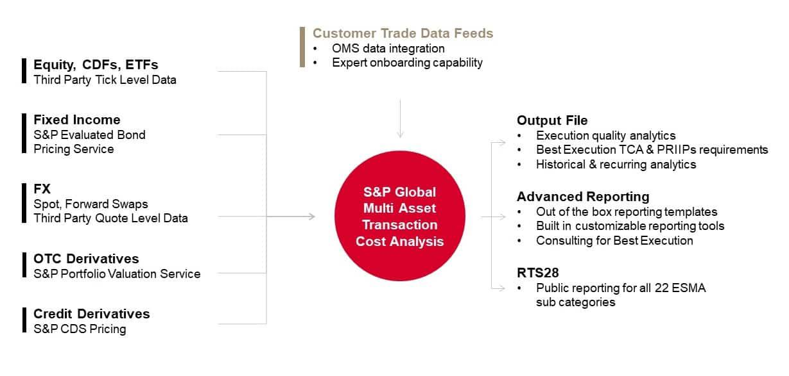

Transaction cost analysis (TCA) is essential in algorithmic trading, which has risen significantly as technology has advanced and financial markets have evolved. Algorithmic trading, distinguished by its reliance on complex algorithms to automate trade decisions, has brought transaction costs to the forefront as a critical determinant of trade profitability. Traders and firms prioritizing algorithmic trading must understand the various components that comprise transaction costs to optimize strategy and execution.

Transaction costs in trading can broadly be categorized into explicit and implicit costs. Explicit costs are visible and straightforward, including brokerage commissions and exchange fees; these are nominal charges made by financial institutions for trade execution and settlement services. Conversely, implicit costs are subtler and arise from trading dynamics such as bid-ask spread, market impact, and slippage. The bid-ask spread captures the cost difference between buying and selling prices at a given time, while market impact and slippage reflect the price changes and execution price disparities resulting from large trades.

The proliferation of algorithmic trading has heightened the focus on minimizing transaction costs. High-frequency trading environments demand cost-efficient execution strategies. Thus, TCA tools have become indispensable. These tools analyze and measure costs in real-time, offering insights that drive better decision-making processes. By effectively utilizing TCA, traders can achieve cost efficiencies, thereby directly enhancing trading performance and ultimately profitability.

Given the complexity and the rapid pace of modern trading scenarios, employing refined TCA strategies enables traders to address the significant impact transaction costs can have on their portfolio's returns. This article aims to explore the detailed nature and effects of transaction costs within algorithmic trading and the strategic implementation of TCA tools to mitigate these costs effectively.

## Table of Contents

## Understanding Transaction Costs in Algo Trading

Transaction costs in algorithmic trading are a crucial consideration that can significantly affect a trader's profitability and strategy effectiveness. They are broadly categorized into explicit and implicit costs.

Explicit costs are easily identifiable and quantifiable. They encompass brokerage commissions, which are the fees paid to brokers to execute trades, and exchange fees charged by the trading venues. These costs are generally fixed per transaction but can vary depending on the volume and frequency of trades. For example, a trader executing high-frequency trades may incur substantial brokerage fees, affecting overall profitability.

Implicit costs, on the other hand, are not directly visible and require careful analysis to quantify. Key elements of implicit costs include the bid-ask spread, market impact, and slippage. The bid-ask spread is the difference between the price at which a security is bought and sold; a narrow spread indicates lower costs, while a wider spread can increase transaction costs. Market impact refers to the change in the price of a security caused by executing a large order. This impact can increase costs as it often results in the security being purchased at a higher price or sold at a lower price than intended. Slippage represents the discrepancy between expected trade execution prices and the actual prices at which trades are executed. This can occur in fast-moving markets where price changes between the order placement and execution.

The implications of these costs are profound, as they can substantially affect the net gains from trading activities. An algorithmic strategy designed to capture small market inefficiencies may have its profitability eroded by high transaction costs, making cost management a pivotal component of trading strategy development. It requires an understanding of both explicit and implicit components, monitoring their patterns, and employing sophisticated tools to minimize their impact. For instance, effective cost management might involve selecting an optimal broker with competitive fee structures, timing trades to minimize bid-ask spreads, and utilizing algorithms adept at reducing market impact and slippage. By managing these transaction costs effectively, traders can improve the execution of their strategies and enhance their overall trading performance.

## Types of Transaction Costs

Transaction costs in [algorithmic trading](/wiki/algorithmic-trading) can be broadly categorized into explicit and implicit costs, both of which significantly influence the efficiency and profitability of trading strategies. Understanding each type of cost provides traders with the means to optimize their trading operations and enhance performance.

Explicit costs are straightforward and quantifiable financial obligations that traders incur during transactions. These consist mainly of brokerage commissions and exchange fees. Brokerage commissions are the charges levied by brokers for executing trades on behalf of traders. These fees are usually predetermined and vary depending on the broker, trading [volume](/wiki/volume-trading-strategy), and execution platform. Exchange fees are charges imposed by exchanges for utilizing their trading facilities, which can include costs related to order processing, connectivity, and data provision.

In contrast, implicit costs are more subtle and complex, arising from the mechanics of the trading process itself. These include the bid-ask spread, market impact, and slippage. The bid-ask spread represents the difference between the price a buyer is willing to pay for a security (bid) and the price a seller is willing to accept (ask). This spread can fluctuate based on market conditions, [liquidity](/wiki/liquidity-risk-premium), and the [volatility](/wiki/volatility-trading-strategies) of the traded asset. Mathematically, it can be expressed as:

$$
\text{Bid-Ask Spread} = \text{Ask Price} - \text{Bid Price}
$$

Market impact refers to the change in the price of an asset caused by executing a large order. Large trades can move the market price unfavorably, leading to increased costs for the trader. This impact is dependent on the order size relative to the average trading volume of the security; larger orders in less liquid markets typically result in greater price movements.

Slippage occurs when there is a disparity between the expected execution price of a trade and the actual price at which it is executed. This discrepancy can occur due to rapid market movements or delays in order processing. Slippage is especially problematic in high-frequency trading environments where timing precision is crucial.

To manage these costs effectively, traders need a keen understanding of both explicit and implicit costs, and the dynamics that influence them. By employing sophisticated trading algorithms and real-time market analysis, traders can better anticipate and mitigate the effects of bid-ask spreads, market impact, and slippage on their trading strategies.

## Analysis of Transaction Costs

Transaction Cost Analysis (TCA) tools perform a vital function in thoroughly evaluating trading costs within algorithmic trading strategies. These tools encompass a range of analytical techniques designed to dissect the individual components of transaction costs, thereby facilitating enhanced decision-making and strategy optimization.

Commission analytics is a fundamental component of TCA, offering insights into the costs incurred per trade. By analyzing these costs, traders can identify patterns and negotiate better terms with brokers, potentially reducing their overall expenses.

Understanding bid-ask spreads is another crucial aspect of TCA. These spreads represent the difference between the highest price a buyer is willing to pay (bid) and the lowest price a seller is willing to accept (ask). Analyzing bid-ask spread patterns over time allows traders to comprehend cost fluctuations and optimize trading strategies accordingly. This understanding is essential, as the spread can vary significantly based on market conditions and liquidity.

Market impact studies within TCA evaluate how large trade orders influence market prices. When a large order is executed, it can move the market price unfavorably, increasing the cost of the transaction. Through market impact analysis, traders can estimate and mitigate the adverse effects of their trades on prices, enabling more cost-effective execution strategies.

Slippage attribution is another critical element of TCA. Slippage occurs when there is a discrepancy between the expected price of a trade and the actual execution price. This often arises due to market volatility or delays in execution. By analyzing factors contributing to slippage, traders can enhance execution practices and minimize unexpected costs.

The integrative use of these analytical tools in TCA enables traders not only to dissect and understand various cost elements but also to devise strategies aimed at minimizing costs, enhancing trading efficiency, and ultimately improving profitability.

## Strategies to Minimize Trading Costs

Algorithm selection plays a pivotal role in optimizing trade execution and minimizing costs in algorithmic trading. By carefully choosing algorithms tailored to specific trading strategies, traders can achieve efficient execution and reduce transaction costs. Advanced algorithms are capable of navigating market complexities, thereby avoiding pitfalls that may lead to increased costs. The choice of algorithm can impact how effectively a trading strategy adapts to market conditions, thus influencing overall performance.

Negotiating broker commissions is another strategic approach for reducing transaction expenses. As commissions can significantly affect the bottom line, traders often engage in discussions with brokers to obtain favorable rates. Lowering commission fees directly translates into cost savings, enhancing the profitability of trading activities. This negotiation process can be further streamlined by leveraging trading volume to secure discounts, thus benefiting high-frequency traders.

Trade timing optimization is a crucial [factor](/wiki/factor-investing) in minimizing bid-ask spreads and market impacts. By executing trades at optimal times, traders can avoid periods of high volatility or illiquidity that may widen spreads and adversely affect prices. Utilizing market data and analytics, traders can identify patterns and trends that indicate the best times to execute trades. This strategic timing not only preserves capital but also ensures that trades are executed at prices closer to expectations.

Selecting an appropriate execution venue is instrumental in reducing overall transaction costs. Different trading venues offer varying levels of liquidity, pricing, and fee structures. By analyzing and comparing these venues, traders can identify those that offer the most cost-effective execution for their strategies. Venues with lower fees and higher liquidity are often preferred as they facilitate smoother and more cost-efficient trading activities.

Real-time monitoring is essential for making strategic adjustments that can mitigate trading costs. By continuously observing market conditions, traders can respond quickly to changes and recalibrate their strategies if necessary. Monitoring tools that provide real-time data analysis aid in detecting anomalies or unfavorable conditions promptly, allowing traders to minimize potential cost escalations. This dynamic adaptation to market movements ensures that strategies remain competitive and cost-effective.

## The Role of Technology in TCA

Technological advancements have become pivotal in transaction cost analysis (TCA), providing traders with tools and techniques for effective cost management. Smart order routing technology plays a significant role by optimizing both venue selection and execution timing. This technology leverages algorithms that analyze various trading venues and select the most cost-effective options in real-time, thereby reducing costs associated with poor execution. It considers factors such as liquidity, volatility, and historical venue performance to ensure optimal trade execution.

Advanced trading algorithms are instrumental in minimizing slippage and market impact. These algorithms are designed to execute trades in a manner that reduces the influence of large orders on market prices. By distributing trades across different times and venues or by using strategies like iceberg orders, these algorithms maintain a lower market footprint.

The integration of trading platforms streamlines processes for better cost efficiency. Integrated platforms allow for seamless data flow between different parts of the trading ecosystem, from order management systems (OMS) to execution management systems (EMS). This reduces the latency and manual interventions generally associated with multiple disparate systems, leading to a reduction in operational costs and errors.

Real-time analytics and dashboards are essential tools that enhance strategic trading decisions. These systems provide traders with instant access to transaction cost data, highlighting areas such as execution performance and cost anomalies. By using data visualization and real-time data analysis, traders can quickly adjust their strategies to capitalize on favorable market conditions and minimize costs. Advanced analytics can also employ [machine learning](/wiki/machine-learning) models to predict transaction costs and identify cost-saving opportunities.

Together, these technological tools form a comprehensive framework that enables traders to manage transaction costs effectively, balancing between cost minimization and the successful execution of trading strategies.

## Conclusion

Transaction Cost Analysis (TCA) serves as a critical backbone for successful algorithmic trading. It propels traders toward formulating strategies that are both effective and profitable by focusing on the intricate dynamics of transaction costs. An in-depth understanding of these costs facilitates better strategic decision-making, allowing for more precise targeting and execution of trades, thereby optimizing market performance.

Managing transaction costs is not a one-time task but a continuous process that demands regular analysis and strategic implementation. By employing TCA, traders can assess both explicit costs such as commissions and exchange fees, and implicit costs like bid-ask spreads, market impact, and slippage. This enables them to identify areas for potential cost savings, effectively enhancing profitability without compromising the efficacy of trading strategies.

A critical balance must be maintained between cost optimization and overall profitability. Traders should strive to minimize costs while ensuring their strategies remain robust and responsive to market movements. This balancing act requires sophisticated models and simulations to predict the potential impact of various transaction costs on overall trading performance.

Advancements in technology have become pivotal to the evolution of TCA. With the integration of advanced analytics and real-time data processing capabilities, traders can make informed decisions more swiftly. Technologies such as smart order routing and advanced trading algorithms enable significant reduction in transaction costs by optimizing the timing and venue of trade executions.

Going forward, technological innovations will continue to transform the landscape of transaction cost analysis. As more sophisticated tools and platforms emerge, traders will gain enhanced capabilities to fine-tune their strategies in real time, aligning cost management closely with dynamic market conditions. Embracing these technological advancements will be crucial for traders seeking to maintain a competitive edge in the fast-evolving environment of algorithmic trading.

## References & Further Reading

[1]: Harris, L. (2003). ["Trading and Exchanges: Market Microstructure for Practitioners."](https://www.amazon.com/Trading-Exchanges-Market-Microstructure-Practitioners/dp/0195144708) Oxford University Press.

[2]: Kissell, R. (2013). ["The Science of Algorithmic Trading and Portfolio Management."](https://www.sciencedirect.com/book/9780124016897/the-science-of-algorithmic-trading-and-portfolio-management) Academic Press.

[3]: Almgren, R., & Chriss, N. (2000). ["Optimal Execution of Portfolio Transactions."](https://smallake.kr/wp-content/uploads/2016/03/optliq.pdf) Journal of Risk.

[4]: Narang, R. K. (2009). ["Inside the Black Box: The Simple Truth About Quantitative Trading."](https://onlinelibrary.wiley.com/doi/book/10.1002/9781118267738) Wiley.

[5]: Hasbrouck, J. (2007). ["Empirical Market Microstructure: The Institutions, Economics, and Econometrics of Securities Trading."](https://academic.oup.com/book/52241) Oxford University Press.

[6]: Chan, E. (2009). ["Quantitative Trading: How to Build Your Own Algorithmic Trading Business."](https://github.com/ftvision/quant_trading_echan_book) Wiley. 

[7]: Kissell, R., & Glantz, M. (2013). ["Multi-Asset Risk Modeling."](https://www.sciencedirect.com/book/9780124016903/multi-asset-risk-modeling) Academic Press.

[8]: Bouchaud, J.-P., & Potters, M. (2003). ["Theory of Financial Risk and Derivative Pricing: From Statistical Physics to Risk Management."](https://www.cambridge.org/core/books/theory-of-financial-risk-and-derivative-pricing/5BBBA04CE72ED9E5E7C1C028D9A94FCB) Cambridge University Press.