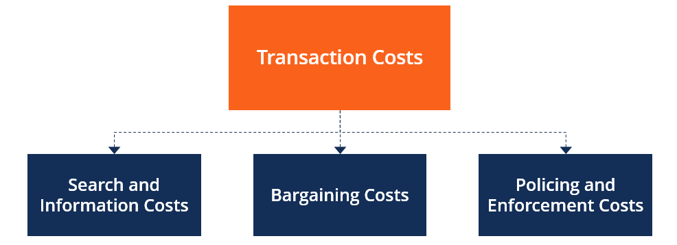

## Table of Contents

## What is Transaction Cost Analysis (TCA)?

Transaction Cost Analysis (TCA) is a method used to measure the costs of buying or selling a security in the market. It helps investors and traders understand how much they are really paying to execute their trades, beyond just the price of the security itself. TCA looks at things like commissions, fees, and the difference between the expected price and the actual price at which the trade was made. By analyzing these costs, investors can see if they are getting a good deal or if they could do better with different trading strategies or brokers.

Using TCA can be really helpful for improving how trades are done. For example, if TCA shows that a trader is often paying more than expected because of high fees or bad timing, they can try to change their approach. This might mean choosing a different broker with lower fees, or waiting for a better time to trade. By keeping an eye on transaction costs, investors can make smarter choices and hopefully get better results from their investments.

## Why is Transaction Cost Analysis important in trading?

Transaction Cost Analysis (TCA) is important in trading because it helps traders and investors see the real cost of their trades. When you buy or sell a stock, you don't just pay the price of the stock. There are other costs like commissions, fees, and the difference between the price you expected and the price you actually got. TCA adds all these costs up so you can see how much you're really spending. This is important because if you're not careful, these extra costs can eat into your profits.

By using TCA, traders can find ways to save money and make better trades. For example, if TCA shows that you're paying a lot in fees, you might switch to a broker with lower fees. Or if you're often getting a bad price because you're trading at the wrong time, TCA can help you figure out a better time to trade. This way, you can make smarter choices and hopefully make more money from your investments. TCA is like a tool that helps you keep more of your profits by showing you where you might be losing money.

## What are the main components of Transaction Cost Analysis?

Transaction Cost Analysis (TCA) has several main parts that help traders understand the true cost of their trades. One big part is the explicit costs, which are the easy-to-see fees like commissions and taxes. These are the charges that brokers or exchanges take for handling your trade. Another part is the implicit costs, which are harder to see. These include things like the bid-ask spread, which is the difference between the price someone is willing to sell a stock for and the price someone is willing to buy it for, and market impact, which is how your trade can change the price of the stock.

Another important part of TCA is the timing of the trade. This can affect the price you get, especially if you're trading a lot of shares. If you trade at a time when the market is busy, you might get a worse price because your trade can move the market. TCA also looks at the opportunity cost, which is what you might have earned if you had waited for a better time to trade. By looking at all these parts together, TCA gives a full picture of the costs of trading, helping traders make smarter decisions and save money.

## How does TCA help in measuring the performance of trades?

TCA helps measure the performance of trades by looking at all the costs involved in buying or selling a stock. It adds up the easy-to-see costs like commissions and taxes, and the harder-to-see costs like the difference between the price you wanted and the price you got. By doing this, TCA shows you how much you're really spending on each trade. This way, you can see if you're getting a good deal or if you could do better by changing how you trade.

For example, if TCA shows that you're paying a lot in fees, you might decide to switch to a broker with lower fees. Or if you're often getting a bad price because you're trading at the wrong time, TCA can help you find a better time to trade. By using TCA, you can compare your actual costs to what you expected and see if your trading strategy is working well. This helps you make smarter choices and hopefully make more money from your investments.

## What are the different types of transaction costs?

Transaction costs are the expenses you pay when you buy or sell something like a stock. There are two main types of these costs: explicit costs and implicit costs. Explicit costs are the easy-to-see fees, like the money you pay to a broker for handling your trade. These are things like commissions and taxes. They are straightforward because you can see them on your bill.

Implicit costs are harder to spot. These include the bid-ask spread, which is the difference between what someone is willing to sell a stock for and what someone is willing to buy it for. Another implicit cost is market impact, which happens when your trade changes the price of the stock. For example, if you buy a lot of shares, you might push the price up, making it more expensive for you. These costs can add up and affect how much money you make from your trades.

Timing can also be a type of transaction cost. If you trade at a busy time, you might get a worse price because your trade can move the market. This is called the opportunity cost, which is what you might have earned if you waited for a better time to trade. By understanding all these different types of costs, you can make smarter decisions and try to keep more of your profits.

## How can TCA be used to improve trading strategies?

TCA can help you improve your trading strategies by showing you where you're losing money on your trades. When you use TCA, you can see all the costs, like fees and the difference between the price you expected and the price you actually got. If TCA shows that you're paying too much in fees, you might decide to switch to a broker that charges less. Or if you're getting bad prices because you're trading at the wrong time, TCA can help you figure out a better time to trade. By looking at these costs, you can make changes to your strategy to save money and make more profit.

Another way TCA helps is by showing you how your trades affect the market. If you're buying or selling a lot of shares, your trade might change the price of the stock, which can cost you more money. TCA can help you see this market impact and find ways to trade without moving the market as much. For example, you might decide to break up your big trade into smaller ones spread out over time. By understanding all these costs and impacts, TCA lets you tweak your trading strategy to get better results and keep more of your profits.

## What are the common methodologies used in conducting TCA?

One common way to do TCA is by looking at the difference between the price you wanted and the price you actually got. This is called the "implementation shortfall" method. It measures how much you lost or gained because the trade didn't happen at the price you expected. To do this, you compare the price at the time you decided to trade with the price you actually got when you traded. This method helps you see how well your trades are going and where you might be losing money.

Another method is called "volume-weighted average price" or VWAP. This looks at the average price of a stock over a certain time, taking into account how many shares were traded at each price. If your trade's price is close to the VWAP, it means you got a good deal. If it's far away, you might have paid too much or sold for too little. VWAP is useful for seeing if your trades are happening at good times and prices.

A third way is called "post-trade analysis." This is when you look at your trades after they're done to see how much they cost you. You add up all the fees, commissions, and other costs, and then compare that to how much you made or lost on the trade. This helps you figure out if you're spending too much on trading and where you can save money. By doing this kind of analysis, you can make changes to your trading strategy to do better in the future.

## How does market impact affect transaction costs?

Market impact is a big part of transaction costs. It happens when your trade changes the price of the stock you're buying or selling. If you're buying a lot of shares, you might push the price up, which means you'll pay more for the last shares you buy. If you're selling a lot, you might push the price down, making you get less money for your last shares. This change in price is the market impact, and it can make your trade cost more than you planned.

To keep market impact low, traders often break up big trades into smaller ones. They might spread these trades out over time so they don't move the market as much. By doing this, they can get closer to the price they wanted and save money. Understanding and managing market impact is important because it helps traders keep their costs down and make more profit from their trades.

## What role does timing play in Transaction Cost Analysis?

Timing is really important in Transaction Cost Analysis because it can affect how much you pay or get for a trade. If you trade when the market is busy, your trade can move the price of the stock. For example, if you buy a lot of shares when everyone else is buying, you might push the price up and end up paying more than you wanted. This is called market impact, and it's a cost that TCA helps you see. By looking at the timing of your trades, TCA can show you if you're trading at good times or if you could do better by waiting.

TCA also helps you understand the opportunity cost of your timing. This is what you might have earned if you had waited for a better time to trade. If you sell a stock too early and the price goes up later, you miss out on that extra money. TCA can show you these missed chances and help you decide when to trade in the future. By using TCA to look at the timing of your trades, you can make smarter choices and hopefully save money on your trades.

## How can TCA be integrated into an automated trading system?

TCA can be added to an automated trading system to help make better trades. The system can use TCA to keep an eye on all the costs of trading, like fees and the difference between the expected price and the actual price. By doing this, the system can see if it's getting a good deal or if it needs to change how it trades. For example, if the TCA shows that the system is paying too much in fees, it might switch to a broker with lower fees. Or if it's getting bad prices because it's trading at the wrong time, the system can use TCA to find a better time to trade.

This way, the automated trading system can make smarter choices and hopefully make more money. TCA can also help the system break up big trades into smaller ones to avoid moving the market too much. By understanding all the costs and impacts, the system can tweak its trading strategy to get better results and keep more of its profits. Using TCA in an automated system means the trades can be done more efficiently and with less cost, which is good for making more money in the long run.

## What are the challenges and limitations of implementing TCA?

Implementing Transaction Cost Analysis (TCA) can be tough because it needs a lot of detailed data. You have to keep track of things like the price you expected, the price you actually got, and all the fees you paid. Getting all this data right can be hard, especially if you're trading a lot of different stocks or trading in different places. Sometimes, the data might not be complete or correct, which can make your TCA results less useful. Also, TCA can be tricky to use if the market is moving a lot because it's hard to tell if a bad trade was because of your timing or just because the market was changing.

Another challenge with TCA is that it's not always easy to understand what the results mean. Even if you have all the right data, figuring out how to use it to make your trading better can be hard. Sometimes, TCA might show you that you're losing money, but it might not be clear what you should do differently. Plus, TCA can be expensive to set up and run, especially if you need special software or people to help you with it. So, while TCA can help you make better trades, it takes a lot of work and money to do it right.

## How do advanced TCA models account for multi-asset trading environments?

Advanced TCA models help traders who deal with many different kinds of investments, like stocks, bonds, and currencies. These models look at all the costs of trading each type of asset and how they might affect each other. For example, if you're buying stocks and selling bonds at the same time, the TCA model can see if the price of one affects the other. This way, the model can give you a full picture of your trading costs across different markets.

These models also use special math to figure out the best way to trade in a multi-asset environment. They can help you see if you should trade one asset before another or if you should break up your trades to avoid moving the market too much. By understanding all these costs and impacts, advanced TCA models let you make smarter choices and hopefully save money on your trades, no matter how many different kinds of investments you're dealing with.

## What are the types of transaction costs?

Transaction costs in [algorithmic trading](/wiki/algorithmic-trading) can be broadly categorized into explicit and implicit costs, both of which significantly influence the efficiency and profitability of trading strategies. Understanding each type of cost provides traders with the means to optimize their trading operations and enhance performance.

Explicit costs are straightforward and quantifiable financial obligations that traders incur during transactions. These consist mainly of brokerage commissions and exchange fees. Brokerage commissions are the charges levied by brokers for executing trades on behalf of traders. These fees are usually predetermined and vary depending on the broker, trading [volume](/wiki/volume-trading-strategy), and execution platform. Exchange fees are charges imposed by exchanges for utilizing their trading facilities, which can include costs related to order processing, connectivity, and data provision.

In contrast, implicit costs are more subtle and complex, arising from the mechanics of the trading process itself. These include the bid-ask spread, market impact, and slippage. The bid-ask spread represents the difference between the price a buyer is willing to pay for a security (bid) and the price a seller is willing to accept (ask). This spread can fluctuate based on market conditions, [liquidity](/wiki/liquidity-risk-premium), and the [volatility](/wiki/volatility-trading-strategies) of the traded asset. Mathematically, it can be expressed as:

$$
\text{Bid-Ask Spread} = \text{Ask Price} - \text{Bid Price}
$$

Market impact refers to the change in the price of an asset caused by executing a large order. Large trades can move the market price unfavorably, leading to increased costs for the trader. This impact is dependent on the order size relative to the average trading volume of the security; larger orders in less liquid markets typically result in greater price movements.

Slippage occurs when there is a disparity between the expected execution price of a trade and the actual price at which it is executed. This discrepancy can occur due to rapid market movements or delays in order processing. Slippage is especially problematic in high-frequency trading environments where timing precision is crucial.

To manage these costs effectively, traders need a keen understanding of both explicit and implicit costs, and the dynamics that influence them. By employing sophisticated trading algorithms and real-time market analysis, traders can better anticipate and mitigate the effects of bid-ask spreads, market impact, and slippage on their trading strategies.

## References & Further Reading

[1]: Harris, L. (2003). ["Trading and Exchanges: Market Microstructure for Practitioners."](https://www.amazon.com/Trading-Exchanges-Market-Microstructure-Practitioners/dp/0195144708) Oxford University Press.

[2]: Kissell, R. (2013). ["The Science of Algorithmic Trading and Portfolio Management."](https://www.sciencedirect.com/book/9780124016897/the-science-of-algorithmic-trading-and-portfolio-management) Academic Press.

[3]: Almgren, R., & Chriss, N. (2000). ["Optimal Execution of Portfolio Transactions."](https://smallake.kr/wp-content/uploads/2016/03/optliq.pdf) Journal of Risk.

[4]: Narang, R. K. (2009). ["Inside the Black Box: The Simple Truth About Quantitative Trading."](https://onlinelibrary.wiley.com/doi/book/10.1002/9781118267738) Wiley.

[5]: Hasbrouck, J. (2007). ["Empirical Market Microstructure: The Institutions, Economics, and Econometrics of Securities Trading."](https://academic.oup.com/book/52241) Oxford University Press.

[6]: Chan, E. (2009). ["Quantitative Trading: How to Build Your Own Algorithmic Trading Business."](https://github.com/ftvision/quant_trading_echan_book) Wiley. 

[7]: Kissell, R., & Glantz, M. (2013). ["Multi-Asset Risk Modeling."](https://www.sciencedirect.com/book/9780124016903/multi-asset-risk-modeling) Academic Press.

[8]: Bouchaud, J.-P., & Potters, M. (2003). ["Theory of Financial Risk and Derivative Pricing: From Statistical Physics to Risk Management."](https://www.cambridge.org/core/books/theory-of-financial-risk-and-derivative-pricing/5BBBA04CE72ED9E5E7C1C028D9A94FCB) Cambridge University Press.