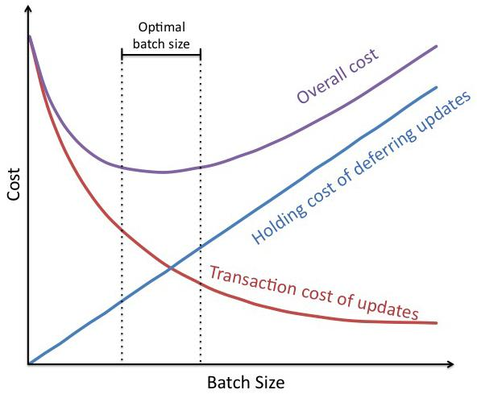

## Table of Contents

## What are transaction costs?

Transaction costs are the expenses that people or businesses have to pay when they buy or sell something. These costs can include fees, taxes, and the time and effort it takes to complete the transaction. For example, when you buy a stock, you might have to pay a brokerage fee, and when you buy a house, you might have to pay a real estate agent's commission.

These costs can affect how people make decisions. If the transaction costs are high, people might decide not to buy or sell something because it's too expensive. On the other hand, if the transaction costs are low, people might be more willing to trade. Understanding transaction costs is important for businesses and individuals because it helps them make better choices about when and how to trade.

## Why is transaction cost optimization important for businesses?

Transaction cost optimization is important for businesses because it helps them save money and work more efficiently. When businesses can lower the costs of buying and selling things, they can make more profit. For example, if a company can find a cheaper way to buy materials or sell its products, it will have more money left over at the end of the day. This extra money can be used to grow the business, pay employees better, or invest in new projects.

Lowering transaction costs also makes businesses run smoother. If it takes less time and effort to complete a transaction, employees can focus on other important tasks. This can make the whole business more productive. For instance, if a company can use technology to automate some of its buying and selling processes, it can save time and reduce mistakes. Overall, optimizing transaction costs helps businesses be more competitive and successful.

## What are the main components of transaction costs?

Transaction costs are made up of different parts that add up to the total cost of buying or selling something. One main part is the direct fees and charges that come with a transaction. These can include things like brokerage fees when you buy stocks, commissions for real estate [agents](/wiki/agents) when you buy a house, or shipping fees when you buy something online. These fees are easy to see and are often what people think of first when they think about transaction costs.

Another important part of transaction costs is the indirect costs, which are not as easy to see but can still be very important. These include the time and effort it takes to complete a transaction. For example, if you have to spend hours researching a product before you buy it, that time is part of the transaction cost. There are also costs like the risk of the transaction not going through or the cost of negotiating a deal. All these indirect costs can add up and make a big difference in the total cost of a transaction.

Understanding both the direct and indirect parts of transaction costs is important for businesses and individuals. By knowing all the costs involved, people can make better decisions about when and how to buy or sell things. This can help them save money and work more efficiently.

## How can transaction costs be measured and tracked?

Measuring and tracking transaction costs involves looking at both the direct and indirect costs of buying or selling something. For direct costs, you can keep track of fees and charges by saving receipts and invoices. For example, if you buy a stock, you can record the brokerage fee. If you buy a house, you can note down the real estate agent's commission. These costs are easy to see and can be added up to get a total of the direct transaction costs.

Indirect costs are harder to measure but still important. These include the time and effort you spend on a transaction. You can estimate this by keeping track of how many hours you spend researching a product or negotiating a deal. You can also think about the risk of the transaction not going through and how that might affect you. By adding up both the direct and indirect costs, you can get a full picture of the total transaction costs.

Keeping good records is key to measuring and tracking transaction costs. You can use a spreadsheet or a special software to write down all the costs as they happen. This way, you can see where your money is going and find ways to save on transaction costs in the future. By understanding and tracking these costs, you can make smarter decisions about buying and selling things.

## What are some common strategies for reducing transaction costs?

One common way to reduce transaction costs is by using technology. Many businesses use software and online tools to make buying and selling things easier and cheaper. For example, instead of calling a broker to buy stocks, you can use an online platform that charges lower fees. Also, businesses can use automated systems to handle orders and payments, which saves time and reduces the chance of mistakes. By using technology, businesses can cut down on both the direct costs, like fees, and the indirect costs, like the time spent on transactions.

Another strategy is to build strong relationships with suppliers and customers. When you have good relationships, you can often negotiate better deals and lower prices. For example, if you buy materials from the same supplier all the time, they might give you a discount. Also, working closely with your customers can help you understand what they need and find ways to serve them better without spending a lot of money. Good relationships can help lower the costs of negotiating and dealing with problems, making transactions smoother and cheaper.

Lastly, businesses can reduce transaction costs by simplifying their processes. This means looking at how they buy and sell things and finding ways to make it easier. For example, a business might decide to buy all its materials from one supplier instead of many, which can lower shipping costs and make ordering easier. They might also use standard contracts and agreements to speed up negotiations. By simplifying processes, businesses can save time and money, making their transactions more efficient and less costly.

## How does technology impact transaction cost optimization?

Technology helps businesses save money on transaction costs by making buying and selling easier and cheaper. For example, instead of paying a lot of money to a broker to buy stocks, you can use an online platform that charges less. Also, businesses can use computers and software to handle orders and payments automatically. This saves time and reduces mistakes, which means less money spent on fixing problems. By using technology, businesses can lower both the direct costs, like fees, and the indirect costs, like the time it takes to do a transaction.

Another way technology helps is by making it easier to find and compare prices. With the internet, businesses can quickly look at different suppliers and choose the one with the best deal. This can save a lot of money on buying materials or selling products. Also, technology can help businesses keep track of all their costs and find ways to save money. By using special software, businesses can see where they are spending too much and make changes to spend less. Overall, technology makes transactions faster, cheaper, and easier to manage, helping businesses save money and work more efficiently.

## What role does supply chain management play in transaction cost optimization?

Supply chain management helps businesses save money on transaction costs by making the process of buying and moving things smoother and cheaper. When a business manages its supply chain well, it can buy materials at lower prices and get them to where they need to go faster. This means less money spent on shipping and storage, and fewer delays that can cost money. By working closely with suppliers and using smart planning, businesses can cut down on the costs of buying things and make sure they always have what they need without spending too much.

Another way supply chain management helps with transaction costs is by making the whole process more efficient. When a business knows exactly what it needs and when, it can plan better and avoid wasting time and money. For example, if a business can predict how much of a product it will sell, it can order just the right amount and not have to pay for extra storage or rush orders. By using technology and good planning, businesses can make their supply chains work better, which means lower transaction costs and more money saved.

## Can you explain the concept of economies of scale in relation to transaction costs?

Economies of scale can help businesses lower their transaction costs. When a business gets bigger and buys more things at once, it can often get a better price. For example, if a company buys a lot of materials from one supplier, the supplier might give them a discount. This means the business spends less money on each item it buys. Also, when a business does a lot of the same kind of transaction, it can get better at it and spend less time and effort on each one. This can save money on the indirect costs of transactions, like the time spent negotiating or dealing with problems.

By using economies of scale, businesses can make their transactions more efficient. When a business buys things in large amounts, it can also save on shipping and handling costs. For example, it's cheaper to ship one big order than many small ones. This can lower the direct costs of transactions. Plus, when a business does a lot of transactions, it can use technology and automation to handle them more easily. This can save time and reduce mistakes, making the whole process smoother and less costly. Overall, economies of scale help businesses save money on transaction costs by buying more at once and doing transactions more efficiently.

## How do different market structures affect transaction cost optimization?

Different market structures can change how much it costs to buy and sell things. In a perfectly competitive market, there are lots of buyers and sellers, and everyone knows the prices. This makes it easy to find the best deal and keeps transaction costs low. But in a monopoly, where one company controls everything, it can be harder to find good prices and the costs might be higher. Also, in an oligopoly, where a few big companies control the market, they might work together to keep prices high, which can make transaction costs go up.

In other market structures, like monopolistic competition, companies try to be different from each other. They might spend a lot of money on advertising to make their products seem special, which can raise transaction costs. But if they can make their products stand out, they might be able to sell more and lower their costs in other ways. Overall, the type of market a business is in can make a big difference in how much it costs to buy and sell things. By understanding the market structure, businesses can find ways to save money and make their transactions more efficient.

## What advanced analytical tools can be used to optimize transaction costs?

Advanced analytical tools can help businesses save money on transaction costs by looking at a lot of data and finding patterns. One tool that businesses use is called data analytics software. This software can look at all the costs of buying and selling things and find where the business is spending too much money. It can also help businesses see how different choices might affect their costs. For example, it can show if buying materials from a different supplier would be cheaper. By using data analytics, businesses can make smarter decisions and lower their transaction costs.

Another tool that can help is [machine learning](/wiki/machine-learning). Machine learning is a type of computer program that can learn from data and make predictions. Businesses can use machine learning to predict how much they will need to buy in the future and when they should buy it. This can help them avoid spending too much on rush orders or extra storage. Machine learning can also help businesses find the best prices and deals by looking at a lot of information quickly. By using these advanced tools, businesses can make their transactions more efficient and save money.

## How can blockchain technology be utilized to reduce transaction costs?

Blockchain technology can help businesses save money on transaction costs by making buying and selling things faster and cheaper. With blockchain, transactions can happen directly between people without needing a middleman like a bank or a broker. This means businesses don't have to pay fees to these middlemen, which can save a lot of money. Also, blockchain keeps a record of all transactions that everyone can see, so it's easier to trust that the transaction is real and safe. This can lower the costs of checking and making sure everything is okay.

Another way blockchain helps is by making transactions faster and more efficient. Because blockchain works all the time and doesn't need a lot of people to check things, transactions can happen quickly. This saves time and money that businesses would spend waiting for transactions to go through. By using blockchain, businesses can make their buying and selling processes smoother and cheaper, which helps them save money and work better.

## What are the future trends in transaction cost optimization?

In the future, more businesses will use technology to make buying and selling things cheaper and easier. One big trend will be using [artificial intelligence](/wiki/ai-artificial-intelligence) (AI) to look at a lot of data and find the best ways to save money. AI can help businesses see where they are spending too much and find better deals. It can also help them predict what they will need to buy in the future, so they can plan better and avoid spending extra money on rush orders or storage. By using AI, businesses can make their transactions more efficient and save money.

Another trend will be using blockchain technology more often. Blockchain can help businesses save money by letting them do transactions without needing a middleman like a bank or a broker. This means they don't have to pay fees to these middlemen, which can save a lot of money. Blockchain also makes transactions faster and safer because it keeps a record that everyone can see. As more businesses start using blockchain, they will be able to make their buying and selling processes smoother and cheaper, helping them save money and work better.

## References & Further Reading

[1]: Kissell, R. (2013). ["The Science of Algorithmic Trading and Portfolio Management."](https://www.sciencedirect.com/book/9780124016897/the-science-of-algorithmic-trading-and-portfolio-management) Academic Press.

[2]: Hendershott, T., Jones, C. M., & Menkveld, A. J. (2011). ["Does Algorithmic Trading Improve Liquidity?"](https://onlinelibrary.wiley.com/doi/full/10.1111/j.1540-6261.2010.01624.x) The Review of Financial Studies, 24(3), 835-859.

[3]: Kissell, R. & Glantz, M. (2003). ["Optimal Trading Strategies: Quantitative Approaches for Managing Market Impact and Trading Risk."](https://archive.org/details/optimaltradingst0000kiss) AMACOM.

[4]: Harris, L. (2003). ["Trading and Exchanges: Market Microstructure for Practitioners."](https://www.amazon.com/Trading-Exchanges-Market-Microstructure-Practitioners/dp/0195144708) Oxford University Press.

[5]: Aldridge, I. (2013). ["High-Frequency Trading: A Practical Guide to Algorithmic Strategies and Trading Systems."](https://www.amazon.com/High-Frequency-Trading-Practical-Algorithmic-Strategies/dp/1118343506) Wiley.