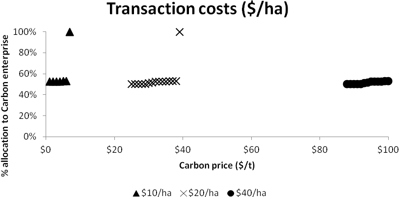

Algorithmic trading, often referred to as algo trading, has fundamentally transformed the landscape of financial markets. It employs complex algorithms to make trading decisions at speeds and frequencies far beyond the capacity of human traders. A crucial element that can significantly impact the profitability of algorithmic trading is transaction costs. These costs, which include a variety of expenses such as brokerage commissions, market spreads, and slippage, can erode potential profits.

Understanding transaction costs is essential for traders aiming to maximize their profits in the competitive arena of algorithmic trading. Evaluating these costs allows traders to optimize their strategies, ensuring that the benefits of high-frequency trading are not overshadowed by excessive expenses. Transaction costs can vary significantly based on factors such as market liquidity, the size of the order, and the choice of brokerage. Hence, a detailed comprehension of these costs is indispensable for sustaining profitability.



This article explores the concept of transaction costs in algorithmic trading, focusing on their impact, key factors influencing these costs, and strategies to minimize them. By addressing these elements, traders can develop more efficient trading algorithms that account not only for market opportunities but also for the cost dimension. Strategies such as optimizing execution methods, negotiating better rates with brokers, and employing advanced algorithms to reduce slippage will be discussed.

By integrating a thorough consideration of transaction costs, traders can enhance net returns and maintain a competitive edge. This approach not only improves profitability but also fortifies trading strategies against the inherent volatility and unpredictability of financial markets. Hence, meticulous attention to transaction costs is not just beneficial but crucial for sustained success in algorithmic trading.

## Table of Contents

## Understanding Transaction Costs

Transaction costs in algorithmic trading encompass various expenses associated with executing trades, significantly affecting overall profitability. As the frequency and volume of trades increase, these costs become substantial, underscoring the need for efficient cost management. The primary components of transaction costs include brokerage commissions, market spreads, slippage, exchange fees, and regulatory charges.

Brokerage commissions represent the fees charged by brokers for trade execution services. These fees can vary depending on the broker's pricing structure, the volume of trades, and the specific financial instruments traded. Minimizing brokerage commissions is essential for reducing overall transaction costs.

Market spreads—the difference between the bid and ask prices—constitute a fundamental component of transaction costs. Narrower spreads generally indicate a more competitive market, thereby reducing costs associated with entering or exiting trades. The spread can significantly impact profitability, especially in high-frequency trading scenarios where trades are executed rapidly and in large volumes.

Slippage refers to the difference between the expected price of a trade and the actual price at which the trade is executed. Market [volatility](/wiki/volatility-trading-strategies) and the size of the order can contribute to slippage, leading to unexpected costs. Utilizing advanced trade execution algorithms can help mitigate slippage and optimize trade entry and [exit](/wiki/exit-strategy) points.

Exchange fees are charges imposed by trading venues for facilitating transactions. These fees can vary based on the exchange and the type of financial instrument traded. Traders should consider these fees when selecting trading venues to minimize costs.

Regulatory charges include fees mandated by government agencies or regulatory bodies. These charges are designed to ensure market stability and transparency but can add to the overall cost of trading. Compliance with regulatory requirements is essential, and traders should account for these charges in their cost calculations.

An in-depth understanding of these transaction cost components is crucial for optimizing trading strategies and ensuring sustained profitability. Effective management of transaction costs enables traders to enhance net returns and maintain competitive trading strategies.

## Key Factors Impacting Transaction Costs

Market [liquidity](/wiki/liquidity-risk-premium) is a primary determinant of transaction costs in [algorithmic trading](/wiki/algorithmic-trading). In highly liquid markets, traders benefit from narrower spreads and reduced slippage, leading to more favorable execution prices. This is because high liquidity ensures a sufficient number of buyers and sellers, facilitating smoother transactions. Conversely, in illiquid markets, wider spreads and increased slippage are common, leading to elevated transaction costs.

The size of an order is another critical [factor](/wiki/factor-investing) influencing transaction costs. Large orders can significantly impact the market, causing price shifts that increase the cost of execution. This market impact occurs when the [volume](/wiki/volume-trading-strategy) of an order exceeds the available liquidity at the current bid or ask price, leading to less favorable execution prices. Thus, the more substantial the order size relative to the market's liquidity, the higher the potential transaction costs due to market impact.

High-frequency trading ([HFT](/wiki/high-frequency-trading-strategies)) strategies are designed to capitalize on small price movements, executing trades at a rapid pace. However, this rapid execution leads to increased transaction costs. The frequent turnover of positions incurs repeated costs from spreads, commissions, and potentially adverse price movements, highlighting the need to carefully manage these expenses within HFT frameworks.

Broker selection is a pivotal consideration in managing transaction costs, as brokers offer varying fee structures and levels of service. Some brokers might provide lower commissions or fees for high-volume traders, while others might offer advanced execution technologies that can reduce costs. Traders should thoroughly compare brokers to select one that provides a cost-efficient fee structure aligned with their trading strategy.

Bid-ask spreads represent the difference between the buying price (bid) and the selling price (ask) and are a direct contributor to transaction costs. Narrower spreads result in lower costs as the difference between buying and selling prices is minimized. Wider spreads, often encountered in less liquid markets, increase the transaction cost burden. Market impact costs, which arise from executing trades that shift market prices unfavorably, are similarly influential. These costs necessitate careful consideration of order timing and size, particularly in less liquid environments where market impact can be pronounced.

By understanding and managing these key factors—market liquidity, order size, high-frequency trading characteristics, broker selection, and bid-ask spreads along with market impact costs—traders can significantly influence their overall transaction costs and, by extension, the profitability of their algorithmic trading strategies.

## The Impact on Algorithmic Trading Strategies

Transaction costs play a pivotal role in determining the success of algorithmic trading strategies. As algorithmic trading heavily relies on executing a high volume of trades, often in rapid succession, even marginal increases in transaction costs can considerably erode potential profits. This is particularly acute in high-frequency trading (HFT), where trades are executed in fractions of a second. In such scenarios, the cumulative effect of elevated transaction costs can significantly diminish the frequency and volume of profitable trades.

Effective risk management demands a thorough understanding of transaction costs and their implications. Traders in algorithmic environments must be able to accurately estimate and incorporate these costs into their strategic planning. Failure to account for transaction costs can lead to a distortion in the perceived profitability of trading strategies. For instance, a strategy that appears profitable on a gross basis may, after accounting for transaction costs, yield negligible or even negative net returns.

Integrating transaction costs into risk management involves a multifaceted approach. Firstly, traders must develop robust models to estimate these costs accurately. These models should cover various components such as brokerage fees, market impact, and slippage. Incorporating these costs into the trading algorithms ensures a more realistic assessment of potential returns and risks.

Moreover, strategy optimization should include sensitivity analyses to assess how changes in transaction costs affect expected performance. This involves simulating different market conditions and fee structures to evaluate the resilience of trading strategies. By doing so, traders can identify the thresholds at which transaction costs render a strategy unviable and adjust their approach accordingly.

In conclusion, transaction costs are integral to the evaluation and optimization of algorithmic trading strategies. High transaction costs can severely constrain trading activities, particularly in high-frequency scenarios. Thus, a comprehensive understanding and integration of these costs into risk management and strategy development are essential for sustaining profitability in algorithmic trading.

## Strategies to Reduce Transaction Costs

Optimizing order execution is essential for minimizing transaction costs in algorithmic trading. One effective approach involves employing technologies like smart order routing. Smart order routing systems analyze multiple market destinations simultaneously, dynamically selecting the most cost-effective venues for trade execution. By executing trades in the venues with the best prices and liquidity, traders can reduce market impact and obtain better fill prices, ultimately decreasing transaction costs.

Negotiating with brokers for reduced commission rates can also lead to substantial cost savings. Brokers may offer tiered pricing models or reduced fees based on trade volumes, frequency, or account size. Further savings may be achieved by exploring fee rebate programs offered by exchanges or liquidity providers, which can offset some transaction costs through rebates for providing liquidity or hitting certain trading volume thresholds.

Minimizing slippage through the use of advanced algorithms is another crucial strategy. Slippage occurs when the executed trade price differs from the expected price, often due to rapid market movements or insufficient liquidity. By developing algorithms that account for real-time market conditions and employing execution tactics that adjust to volatility, traders can improve the precision of their trades, thereby reducing slippage.

Timing trades to coincide with periods of high market activity can also lower transaction costs. During peak trading hours, increased liquidity leads to tighter bid-ask spreads. By executing trades when market participation is high, traders can benefit from reduced spreads and minimize the cost of entering and exiting positions. Additionally, understanding patterns in market activity allows traders to strategically plan order submissions, optimizing cost efficiency.

By adopting these strategies, algorithmic traders can significantly reduce transaction costs, enhance execution efficiency, and improve overall profitability.

## The Role of Transaction Cost Analysis (TCA)

Transaction Cost Analysis (TCA) is an essential tool for evaluating and managing the costs associated with executing trades in algorithmic trading. By systematically assessing trade expenses, TCA identifies inefficiencies and suggests areas for improvement. This methodical approach allows traders to refine their algorithmic strategies by leveraging detailed cost data, ultimately optimizing trade initiation and execution methods.

At its core, TCA is designed to equip traders with the information needed to make well-informed decisions. This involves enhancing trade execution and accurately measuring performance. By analyzing cost components such as market impact, timing, and venue fees, TCA facilitates the identification of underlying patterns that could be optimized for cost reduction.

An example of TCA application involves comparing the expected and actual transaction costs. Traders can utilize statistical models to forecast optimal execution prices, subsequently comparing these projections with the realized trade prices. The discrepancy between expected and actual outcomes highlights inefficiencies in the trading process.

Furthermore, TCA supports a data-driven framework for minimizing transaction costs. This allows traders to strategically adjust their algorithms based on current market conditions. For instance, refining execution algorithms can reduce slippage, while strategic order placement can minimize the bid-ask spread impact.

For practical implementation, traders often rely on software solutions that automate TCA processes. These platforms integrate trade data, perform real-time cost analysis, and provide actionable insights. Python is a preferred language for developing such tools due to its versatility and extensive libraries for data analysis.

```python
import pandas as pd
import numpy as np

# Sample Trade Data
trade_data = pd.DataFrame({
    'Expected Price': [100, 101, 102],
    'Executed Price': [100.1, 101.2, 101.9],
    'Volume': [500, 1000, 1500]
})

# Function to Calculate Transaction Cost
def calculate_transaction_cost(expected, executed, volume):
    return np.abs(executed - expected) * volume

# Applying TCA to Trade Data
trade_data['Transaction Cost'] = trade_data.apply(lambda x: calculate_transaction_cost(x['Expected Price'], x['Executed Price'], x['Volume']), axis=1)

# Display Trade Data with Transaction Costs
print(trade_data)
```

By employing TCA, traders can enhance algorithmic trading profitability through strategic cost management and improved execution efficiency. This comprehensive analysis framework ensures that trades are executed with the least possible expense, contributing to sustained success in competitive financial markets.

## Conclusion

Transaction costs are a critical consideration in algorithmic trading, impacting net returns and the overall viability of trading strategies. Traders must evaluate and incorporate these costs meticulously to optimize their strategies and enhance performance. Ignoring transaction costs can lead to a significant erosion of profit margins and skewed risk assessments.

Efficient execution methods are vital for reducing costs and maintaining profitability. Techniques such as smart order routing can optimize the execution path of trades, ensuring that orders are filled at the most favorable prices and lowest possible costs. Similarly, better trade timing can leverage periods of increased market liquidity, thereby minimizing costs associated with wider spreads and slippage.

In competitive financial markets, where algorithmic trading is prevalent, effective management of transaction costs is key to sustained success and profitability. Traders who meticulously analyze and manage these costs can achieve superior net returns, giving them a competitive edge. Robust strategies that consider transaction costs will position traders to capital in dynamic trading environments effectively.

## References & Further Reading

[1]: Kissell, R. (2013). ["The Science of Algorithmic Trading and Portfolio Management."](https://www.sciencedirect.com/book/9780124016897/the-science-of-algorithmic-trading-and-portfolio-management) Academic Press.

[2]: Hendershott, T., Jones, C. M., & Menkveld, A. J. (2011). ["Does Algorithmic Trading Improve Liquidity?"](https://onlinelibrary.wiley.com/doi/full/10.1111/j.1540-6261.2010.01624.x) The Review of Financial Studies, 24(3), 835-859.

[3]: Kissell, R. & Glantz, M. (2003). ["Optimal Trading Strategies: Quantitative Approaches for Managing Market Impact and Trading Risk."](https://archive.org/details/optimaltradingst0000kiss) AMACOM.

[4]: Harris, L. (2003). ["Trading and Exchanges: Market Microstructure for Practitioners."](https://www.amazon.com/Trading-Exchanges-Market-Microstructure-Practitioners/dp/0195144708) Oxford University Press.

[5]: Aldridge, I. (2013). ["High-Frequency Trading: A Practical Guide to Algorithmic Strategies and Trading Systems."](https://www.amazon.com/High-Frequency-Trading-Practical-Algorithmic-Strategies/dp/1118343506) Wiley.