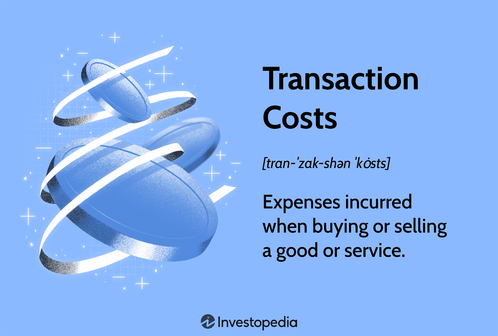

## Table of Contents

## What is a transaction cost?

A transaction cost is the total cost involved in making an economic exchange. This includes not just the price of the item or service you're buying, but also other costs like the time and effort you spend to find the item, negotiate the price, and complete the purchase. For example, if you're buying a car, the transaction cost includes the car's price, plus the time you spend researching different models, visiting dealerships, and haggling over the price.

These costs can be direct, like fees and taxes, or indirect, like the time and effort you put into the transaction. Transaction costs are important because they can affect how people and businesses make decisions. If the transaction costs are too high, people might decide not to make the exchange at all. Understanding transaction costs helps us see why some markets work well and others don't, and it can help businesses find ways to make buying and selling easier and cheaper.

## Why are transaction costs important in economics?

Transaction costs are important in economics because they affect how people and businesses make choices. When the costs of buying or selling something are high, people might decide not to do it. For example, if it takes a lot of time and money to buy a house, some people might choose to rent instead. This shows how transaction costs can change the way markets work. If these costs are too high, it can stop people from trading, which can slow down the economy.

Understanding transaction costs also helps explain why some markets work better than others. In some markets, like buying stocks online, the costs are low because everything can be done quickly and easily. But in other markets, like buying a used car, the costs can be high because you need to spend time looking at different cars and talking to sellers. By looking at transaction costs, economists can find ways to make markets more efficient. This means making it easier and cheaper for people to buy and sell things, which can help the economy grow.

## Can you give examples of transaction costs in everyday life?

When you go shopping at a grocery store, transaction costs are more than just the price of the food. They also include the time you spend driving to the store, walking around to find what you need, and waiting in line to pay. If the store is far away or always crowded, these costs can be high. You might decide to shop somewhere closer or buy less stuff to save time and effort.

Another example is buying a new phone. The transaction cost isn't just the price of the phone. It also includes the time you spend researching different models, reading reviews, and comparing prices at different stores. If you have to go to the store to buy it, you also need to think about the time and gas money for the trip. All these costs can make you think twice about buying a new phone or make you choose a different one that's easier to buy.

## How do transaction costs affect market efficiency?

Transaction costs can make markets less efficient. When it costs a lot of time, money, or effort to buy or sell something, fewer people will want to do it. If it's hard to find what you want to buy, or if you have to spend a lot of time talking to sellers, you might decide not to buy it at all. This means fewer trades happen, which can slow down the market. For example, if buying a used car takes a lot of time and effort, fewer people will buy used cars, and the used car market won't work as well as it could.

On the other hand, when transaction costs are low, markets can work better. If it's easy and cheap to buy and sell things, more people will do it. This can make the market more active and help the economy grow. For instance, buying stocks online is quick and cheap, so more people can trade stocks easily. This makes the stock market more efficient because more people can join in and more trades can happen.

## What is the difference between explicit and implicit transaction costs?

Explicit transaction costs are the direct costs you can see and measure easily. These are things like fees, taxes, and the price you pay for something. For example, when you buy a book online, the explicit costs include the price of the book and any shipping fees. These costs are clear and you know exactly how much you're paying.

Implicit transaction costs are the indirect costs that are harder to see and measure. These include the time and effort you spend on a transaction. For instance, when you're buying that book online, the time you spend looking for the best deal or waiting for the book to arrive are implicit costs. These costs are not as obvious, but they still affect your decision to buy something.

## How do transaction costs influence the choice between market and hierarchical organization?

Transaction costs play a big role in deciding whether to use a market or a hierarchical organization. In a market, people buy and sell things directly. But if the costs of finding the right seller, negotiating a price, and making sure the product is good are too high, it might be better to use a hierarchical organization. In a hierarchical organization, like a company, people work together under one boss. The boss can tell people what to do, which can save time and money compared to dealing with lots of different sellers in a market.

For example, if a company needs a special part for its machines, it could buy it from a market. But if finding the right part takes a lot of time and effort, the company might decide to make the part itself. By making the part inside the company, they can avoid the high transaction costs of searching and negotiating in the market. This shows how transaction costs can make a hierarchical organization a better choice when the costs of using a market are too high.

## What role do transaction costs play in the theory of the firm?

Transaction costs are a big part of why companies exist. In the theory of the firm, economists say that companies form because it's often cheaper and easier to do things inside a company than to buy them in a market. When you buy something in a market, you have to spend time and money finding the right seller, negotiating a price, and making sure the product is good. These are all transaction costs. If these costs are too high, it might be better for a company to make the product itself instead of buying it from someone else.

For example, if a car company needs special tires, it could buy them from a tire company. But if finding the right tire company takes a lot of time and effort, the car company might decide to make the tires itself. By making the tires inside the company, they can avoid the high transaction costs of searching and negotiating in the market. This shows how transaction costs can make it better for a company to do things itself instead of using the market.

## How have transaction costs evolved with the advent of digital technologies?

Digital technologies have made transaction costs a lot lower and easier to handle. Before, if you wanted to buy something, you had to go to a store, spend time looking around, and maybe even talk to a salesperson. Now, with the internet, you can buy things online from your home. Websites like Amazon and eBay let you find what you want quickly, compare prices, and read reviews from other buyers. This saves a lot of time and effort, which means lower transaction costs. Also, digital payment methods like PayPal and credit cards make it easy to pay without needing cash or checks, which cuts down on the costs of handling money.

But digital technologies have also brought new kinds of transaction costs. For example, you might need to learn how to use new apps or websites, which takes time. There's also the risk of fraud and scams online, so you have to be careful and maybe spend time checking if a seller is trustworthy. Plus, there can be fees for using certain payment methods or services. Even though these new costs exist, overall, digital technologies have made buying and selling things much easier and cheaper than before.

## What are the methods used to measure transaction costs?

Measuring transaction costs can be tricky because they include both clear costs like fees and hidden costs like time and effort. One way to measure them is by looking at the direct costs, like the price of a product, shipping fees, and any taxes you have to pay. These are easy to see and add up. For example, if you buy a book online, you can add up the cost of the book, the shipping fee, and any sales tax to get the total explicit transaction cost.

The other part of measuring transaction costs is figuring out the indirect costs, which are harder to see. These include the time you spend looking for the best deal, reading reviews, and waiting for your purchase to arrive. To measure these, you might need to keep track of how much time you spend on each part of the transaction. For instance, if you spend an hour researching different phones before buying one, that hour is part of the transaction cost. Economists often use surveys or time diaries to estimate these indirect costs, helping to get a full picture of how much a transaction really costs.

## How do transaction costs impact international trade?

Transaction costs can make international trade harder and more expensive. When companies want to buy or sell things from other countries, they have to deal with extra costs like tariffs, which are taxes on imports, and the time and money it takes to ship goods across the world. They also have to learn about different laws and regulations in other countries, which can be confusing and take a lot of time. All these extra costs can make it less appealing for companies to trade internationally, especially if the costs are too high compared to trading within their own country.

However, technology and global agreements have helped to lower some of these transaction costs. For example, the internet makes it easier for companies to find buyers and sellers in other countries without having to travel. Also, trade agreements between countries can reduce tariffs and make it simpler to follow rules. When these costs go down, more companies are willing to trade internationally, which can help the global economy grow. But even with these improvements, transaction costs are still an important factor that companies need to think about when deciding whether to trade across borders.

## What are the policy implications of reducing transaction costs?

When governments want to help their economy, they often try to lower transaction costs. This can make it easier and cheaper for people and businesses to buy and sell things. For example, if the government makes trade rules simpler, companies can spend less time and money figuring out how to follow them. This can lead to more trade, both inside the country and with other countries. When transaction costs go down, more people can join in the economy, which can help create jobs and make things cheaper for everyone.

But reducing transaction costs isn't always easy. Sometimes, governments need to spend money to build better roads, ports, or internet systems to make buying and selling easier. They might also need to work with other countries to lower tariffs and make trade rules simpler. It's important for governments to think carefully about which costs to focus on, because not all transaction costs are the same. By choosing the right policies, governments can help their economy grow and make life better for their people.

## How do transaction costs relate to concepts like information asymmetry and agency costs?

Transaction costs are closely linked to information asymmetry, which is when one person in a deal knows more than the other. For example, if you're buying a used car, the seller might know about problems with the car that you don't. This makes it harder and more expensive for you to figure out if the car is a good deal. You might have to spend more time researching or even pay for an inspection, which adds to the transaction costs. Lowering information asymmetry, like by making it easier to get good information, can help reduce these costs and make buying and selling easier.

Transaction costs also connect to agency costs, which happen when one person (the agent) is doing something for another person (the principal). For example, if you hire a real estate agent to help you buy a house, the agent might not work as hard as you want because they get paid no matter what. This can lead to extra costs for you, like spending more time checking up on the agent or paying them more to do a better job. By understanding and managing these agency costs, you can lower the overall transaction costs and make the process smoother.

## References & Further Reading

[1]: Commons, J. R. (1931). ["Institutional Economics."](https://la.utexas.edu/users/hcleaver/368/368commonsoninstitutionalecontable.pdf) The American Economic Review, 21(4), 648-657.

[2]: Williamson, O. E. (1981). ["The Economics of Organization: The Transaction Cost Approach."](https://www.jstor.org/stable/pdfplus/2778934.pdf) American Journal of Sociology, 87(3), 548-577.

[3]: North, D. C. (1990). ["Institutions, Institutional Change and Economic Performance."](https://archive.org/details/institutionsinst0000nort) Cambridge University Press.

[4]: Kissell, R. (2006). ["The Expanded Implementation Shortfall: Understanding Transaction Cost Components."](https://www.researchgate.net/publication/247907350_The_Expanded_Implementation_Shortfall_Understanding_Transaction_Cost_Components) The Journal of Trading, 1(3), 6-16.

[5]: De Prado, M. L. (2018). ["Advances in Financial Machine Learning."](https://www.amazon.com/Advances-Financial-Machine-Learning-Marcos/dp/1119482089) Wiley.

[6]: Aitken, M., & Frino, A. (1996). ["The Determinants of Market Impact: Evidence from Institutional Trades."](https://www.sciencedirect.com/science/article/pii/S1057521903000632) Pacific-Basin Finance Journal, 4(1), 33-47.