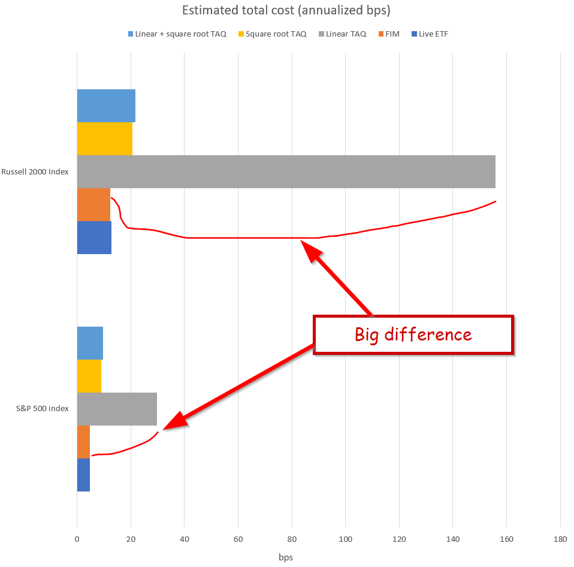

## Table of Contents

## What are transaction costs in the context of investing?

Transaction costs in investing are the fees and expenses you pay when you buy or sell investments like stocks, bonds, or mutual funds. These costs can include brokerage commissions, which are fees charged by brokers for executing trades, and other charges like bid-ask spreads, which is the difference between the highest price a buyer is willing to pay and the lowest price a seller is willing to accept. Every time you make a trade, these costs add up and can reduce the overall return on your investment.

It's important to be aware of transaction costs because they can significantly impact your investment returns over time. For example, if you are frequently buying and selling investments, the costs can accumulate quickly, eating into your profits. To minimize these costs, many investors choose to invest in low-cost index funds or ETFs, which often have lower transaction fees compared to actively managed funds. Understanding and managing transaction costs is a key part of developing a successful investment strategy.

## How do transaction costs impact the overall returns of a quantitative investment strategy?

Transaction costs can have a big effect on the overall returns of a quantitative investment strategy. These strategies often use computer programs to decide when to buy or sell investments, which can lead to a lot of trading. Every time a trade happens, there are costs like brokerage fees and the difference between buying and selling prices. These costs add up and can eat into the profits made from the investments. If the strategy is too active, the costs might be higher than the gains, which means the investor could end up losing money instead of making it.

To manage these costs, investors using quantitative strategies need to be smart about how often they trade. They might choose to trade less often or pick investments that have lower transaction costs. For example, trading in large, well-known stocks might have lower costs than trading in smaller, less-known stocks. By keeping transaction costs low, the overall returns of the investment strategy can be better, making it more successful in the long run.

## What are the different types of transaction costs that a quantitative investor might encounter?

A quantitative investor might encounter several types of transaction costs. The first type is brokerage commissions, which are fees that brokers charge for buying or selling investments. These fees can vary depending on the broker and the type of investment. Another type of transaction cost is the bid-ask spread, which is the difference between the highest price a buyer is willing to pay and the lowest price a seller is willing to accept. This spread can be small for popular stocks but larger for less popular ones.

There are also other costs like market impact costs, which happen when a large trade changes the price of the investment. If an investor buys a lot of a stock, the price might go up because of the demand, and they end up paying more than they expected. On the other hand, selling a lot of a stock can push the price down. Lastly, there can be fees for clearing and settling trades, which are the costs of making sure the trade goes through properly. All these costs can add up and affect the returns of a quantitative investment strategy.

## How can transaction costs be measured and quantified in a portfolio?

To measure and quantify transaction costs in a portfolio, you need to keep track of all the fees and expenses that come with buying and selling investments. This includes looking at brokerage commissions, which are the fees you pay to a broker for making trades. You also need to consider the bid-ask spread, which is the difference between the price buyers are willing to pay and the price sellers are asking for. Another thing to watch out for is market impact costs, which happen when your trades change the price of the investment. For example, if you buy a lot of a stock, the price might go up because of your demand, and you end up paying more than you planned.

Once you have all this information, you can add up these costs to see how much they are affecting your portfolio's returns. You can do this by looking at each trade and calculating the total costs for each one. Then, you can compare these costs to the gains or losses from your investments to understand their impact. By keeping an eye on these transaction costs, you can make better decisions about when and what to trade, helping to keep more of your investment returns in your pocket.

## What strategies can be used to minimize transaction costs in quantitative investing?

To minimize transaction costs in quantitative investing, one key strategy is to trade less often. Every time you buy or sell an investment, you have to pay fees and other costs. So, if you can hold onto your investments for a longer time, you won't have to pay these costs as often. Another way to cut down on costs is to choose investments that are popular and easy to trade, like big stocks. These usually have smaller bid-ask spreads and lower market impact costs compared to smaller, less popular stocks.

Another strategy is to use algorithms that are smart about when and how to trade. These algorithms can help you buy or sell at times when the costs will be lower. For example, they might spread out big trades over time to avoid pushing the price up or down too much. You can also look for brokers that charge lower fees or use trading platforms that offer discounts on commissions. By being careful about how and when you trade, you can keep more of your investment returns for yourself.

## How does the frequency of trading affect transaction costs in quantitative strategies?

The more often you trade in a quantitative strategy, the higher your transaction costs will be. Every time you buy or sell, you have to pay fees like brokerage commissions and the difference between the buying and selling price, called the bid-ask spread. If you're trading a lot, these costs can add up quickly and eat into your profits. It's like paying a toll every time you cross a bridge; the more times you cross, the more you have to pay.

To keep costs down, it's a good idea to trade less often. Holding onto your investments for a longer time means you won't have to pay these costs as much. Imagine if you only crossed that bridge once a month instead of every day; you'd save a lot on tolls. By being smart about when and how often you trade, you can keep more of your investment returns in your pocket.

## Can you explain the concept of slippage and its relationship to transaction costs?

Slippage is what happens when the price of an investment changes between the time you decide to buy or sell and the time the trade actually happens. Imagine you want to buy a stock at $10, but by the time your order goes through, the price has gone up to $10.05. That extra $0.05 is the slippage. It's a kind of cost that you have to pay because the market moves while you're trying to trade.

Slippage is closely related to transaction costs because it adds to the total amount you end up spending or losing when you trade. When you add up all the fees, like brokerage commissions and the difference between buying and selling prices, slippage is another cost you need to think about. The more often you trade, or the bigger your trades are, the more slippage you might have to deal with. So, keeping an eye on slippage can help you manage your overall transaction costs and keep more of your investment returns.

## How do market liquidity and transaction costs interact in quantitative investing?

Market [liquidity](/wiki/liquidity-risk-premium) is how easy it is to buy or sell an investment without changing its price too much. In quantitative investing, if an investment is very liquid, like a popular stock, it's easier to trade it without pushing the price up or down a lot. This means lower transaction costs because the difference between the price you want to buy at and the price you end up paying (called the bid-ask spread) is smaller. Also, trading a liquid investment means less slippage, which is when the price changes between the time you decide to trade and when the trade actually happens. So, choosing investments that are easy to trade can help keep your costs down.

On the other hand, if an investment is not very liquid, like a small or less-known stock, it can be harder to trade without affecting the price. This can lead to higher transaction costs because the bid-ask spread is bigger, and there might be more slippage. In quantitative investing, where you might be making a lot of trades, these higher costs can add up quickly and eat into your profits. So, it's important to think about how liquid an investment is when you're trying to manage your transaction costs and keep more of your returns.

## What role does technology play in managing transaction costs for quantitative investors?

Technology helps quantitative investors manage transaction costs by making trading faster and more efficient. Computers and algorithms can quickly find the best times to buy or sell, which can lower costs like the difference between buying and selling prices (bid-ask spread) and slippage, which is when the price changes between deciding to trade and the trade happening. By using technology, investors can also spread out big trades over time to avoid pushing the price up or down too much, which keeps market impact costs down.

Another way technology helps is by giving investors access to a lot of data and tools to analyze it. This means they can make smarter decisions about when and what to trade, which can help keep transaction costs low. For example, technology can help find the cheapest brokers or the best trading platforms, and it can also help keep track of all the fees and costs so investors can see how much they're spending and make changes to save money. By using technology wisely, quantitative investors can manage their transaction costs better and keep more of their investment returns.

## How do different asset classes vary in terms of transaction costs, and what implications does this have for quantitative strategies?

Different asset classes have different transaction costs, which can affect how much you pay to buy or sell them. Stocks, especially those that are popular and easy to trade, usually have lower transaction costs. The fees to buy or sell them are smaller, and the difference between the buying and selling price (called the bid-ask spread) is also smaller. On the other hand, bonds and some types of commodities can have higher transaction costs. They might be harder to trade, so the fees and the bid-ask spread can be bigger. Also, trading things like real estate or private equity can have even higher costs because these investments are not as easy to buy or sell quickly.

These differences in transaction costs can have big implications for quantitative strategies. If you're using a strategy that trades a lot, you'll want to pick asset classes with lower costs to keep more of your profits. For example, if your strategy involves trading stocks, you might focus on big, popular stocks to keep costs down. But if you're trading bonds or commodities, you need to be careful because the costs can add up quickly and eat into your returns. By understanding which asset classes have lower transaction costs, you can make smarter choices about what to trade and how often, helping your quantitative strategy be more successful.

## What advanced modeling techniques are used to predict and manage transaction costs in high-frequency trading?

In high-frequency trading, advanced modeling techniques are used to predict and manage transaction costs. One common method is using [machine learning](/wiki/machine-learning) algorithms to analyze huge amounts of data from past trades. These algorithms can find patterns and predict how much the costs might be for future trades. They look at things like how often people are trading, the size of the trades, and how easy it is to buy or sell the investment. By understanding these patterns, traders can make better choices about when and how to trade, which helps keep their costs down.

Another technique is called simulation modeling. Traders use computers to create models of the market and run different trading scenarios to see how much the costs would be. This helps them figure out the best ways to trade without spending too much on fees and other costs. For example, they might find out that spreading out big trades over time can lower the costs. By using these advanced techniques, high-frequency traders can manage their transaction costs better and make more money from their trades.

## How can transaction cost analysis be integrated into the development and evaluation of quantitative investment models?

Transaction cost analysis (TCA) can be integrated into the development and evaluation of quantitative investment models by including it as a key performance metric. When building a model, you can use TCA to see how much it would cost to buy and sell the investments the model suggests. This helps you make sure the model is not just good at [picking](/wiki/asset-class-picking) investments but also at keeping costs low. By including TCA, you can adjust the model to trade less often or choose investments that are cheaper to trade, which can make the model more successful overall.

In the evaluation phase, TCA is used to measure how well the model is doing in real life. You can compare the costs of the trades the model made to what you expected, and see if the model is helping you save money on transaction costs. If the costs are too high, you can go back and tweak the model to make it better. By using TCA throughout the development and evaluation process, you can make sure your quantitative investment model is not only smart about picking investments but also smart about managing the costs of trading them.

## What is the impact on algorithmic trading strategies?

Transaction costs are a pivotal [factor](/wiki/factor-investing) in determining the profitability of [algorithmic trading](/wiki/algorithmic-trading) strategies. These costs, although seemingly minor per trade, can accumulate rapidly, especially in high-frequency trading environments where numerous trades are executed within short timeframes. High transaction costs can erode potential gains, effectively turning profitable strategies into losing ones. The adverse impact is evident as costs fluctuate with market conditions, influencing both the frequency and [volume](/wiki/volume-trading-strategy) of trades executed.

An increase in transaction costs may necessitate adjustments in trading frequency. For instance, in a scenario where the cost per trade is high, traders might opt for strategies that prioritize fewer, more strategically timed trades rather than frequent transactions. This approach helps minimize the impact of cumulative costs on overall profitability.

Effective risk management within algorithmic trading mandates a thorough assessment of transaction costs. This involves not only accounting for explicit costs such as brokerage fees but also implicit costs like slippage and market impact. For meaningful risk management, the calculation of expected returns must subtract anticipated transaction costs, providing a realistic outlook on strategy performance. Mathematically, if $R_{\text{gross}}$ represents the gross return and $C$ denotes transaction costs, the net return $R_{\text{net}}$ is given by:

$$
R_{\text{net}} = R_{\text{gross}} - C
$$

In this framework, strategies must be developed and rigorously back-tested with transaction costs integrated into the model to remain viable in dynamic market conditions. Failing to incorporate these costs can lead to a disconnect between theoretical and actual performance. Algorithm developers can employ historical transaction cost data to test and refine strategies, ensuring resilience against variations in costs.

Python code can serve as a tool for simulating transaction cost scenarios within [backtesting](/wiki/backtesting) platforms. For example, consider the following Python snippet that adjusts the returns based on hypothetical transaction costs:

```python
def calculate_net_return(gross_returns, transaction_costs_per_trade, num_trades):
    total_transaction_costs = transaction_costs_per_trade * num_trades
    net_returns = gross_returns - total_transaction_costs
    return net_returns

# Example variables
gross_returns = 10000  # USD
transaction_costs_per_trade = 5  # USD
num_trades = 300

net_returns = calculate_net_return(gross_returns, transaction_costs_per_trade, num_trades)
print("Net Returns:", net_returns)
```

This code provides an example of how costs can be accounted for in a backtesting context, ensuring that strategies remain robust and aligned with real-world financial dynamics.

In summary, transaction costs impose tangible constraints on algorithmic trading strategies. A trader's ability to effectively manage these costs through strategic adjustments and thorough testing is crucial for sustainable profitability. Balancing the intricacies of trading execution with cost management enhances the adaptability and success of algorithmic strategies in fluctuating financial markets.

## References & Further Reading

[1]: Kissell, R. (2013). ["The Science of Algorithmic Trading and Portfolio Management,"](https://www.sciencedirect.com/book/9780124016897/the-science-of-algorithmic-trading-and-portfolio-management) Academic Press.

[2]: Stoll, H. R. (2000). ["Friction,"](https://onlinelibrary.wiley.com/doi/abs/10.1111/0022-1082.00259) Financial Analysts Journal, 55(4), 8-20.

[3]: Hasbrouck, J. (2009). ["Trading Costs and Returns for U.S. Equities: Estimating Effective Costs from Daily Data,"](https://www.jstor.org/stable/20488006) Review of Financial Studies, 22(3), 1029-1061.

[4]: Almgren, R., & Chriss, N. (2000). ["Optimal execution of portfolio transactions,"](https://smallake.kr/wp-content/uploads/2016/03/optliq.pdf) Journal of Risk, 3(2), 5-39.

[5]: Treleaven, P., Galas, M., & Lalchand, V. (2013). ["Algorithmic trading review,"](https://www.researchgate.net/publication/262239006_Algorithmic_Trading_Review) Communications of the ACM, 56(11), 76-85.