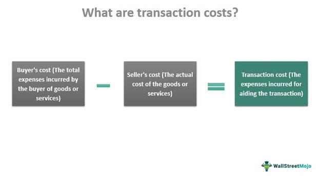

Algorithmic trading has fundamentally transformed the financial markets by leveraging sophisticated technology to execute trades with high speed and precision, thereby optimizing investment strategies. Central to the success of algorithmic trading is the careful management of transaction costs. These costs can include explicit fees, such as brokerage commissions and regulatory charges, as well as implicit expenses like slippage and market impact. Although each trade might incur a small cost individually, cumulatively, transaction costs can substantially erode overall returns, especially in high-frequency trading environments.

In quantitative investing, where efficiency and profitability are critical, understanding and effectively managing transaction costs is essential. The financial impact of these costs can alter the outcome of trading strategies; strategies that appear profitable on paper can become unprofitable in practice once transaction costs are factored in. This makes it imperative for traders to account for transaction costs when developing and optimizing their trading strategies to ensure they remain viable and profitable in real-world conditions. 



In this article, we will explore the various components of transaction costs, examining their influence on algorithmic trading and discussing approaches to minimize their impact. By effectively controlling these costs, traders can enhance the profitability of their strategies and increase their competitive edge in the financial markets.

## Table of Contents

## Understanding Transaction Costs

Transaction costs refer to the various expenses incurred during the buying or selling of financial instruments. These costs are a vital consideration for traders, as they can significantly influence the profitability of trading strategies. Transaction costs are typically categorized into explicit and implicit costs.

Explicit costs are direct charges that traders must pay to facilitate their trades. These include brokerage commissions, which are fees paid to brokers for executing trades on behalf of the trader. Additionally, regulatory charges, such as those imposed by exchanges or governing bodies, fall under this category. These fees are clear and quantifiable, making it easier for traders to account for them when assessing the total cost of their trading activities.

Implicit costs, however, are less transparent and can be more challenging to quantify. Slippage is a common form of implicit cost, occurring when there is a difference between the expected price of a trade and the actual price at which it is executed. This discrepancy can arise due to market [volatility](/wiki/volatility-trading-strategies) or delays in order execution. Another significant implicit cost is market impact, which refers to the effect a trader's order has on the market price. Large orders can move prices unfavorably, leading to increased costs for the trader.

High-frequency trading ([HFT](/wiki/high-frequency-trading-strategies)), characterized by executing a large number of trades within very short time frames, is particularly sensitive to transaction costs. The rapid accumulation of these costs can transform a potentially profitable trading strategy into an unprofitable one. Therefore, for traders engaged in HFT, minimizing transaction costs is crucial for maintaining profitability.

Proper management of transaction costs involves strategies to reduce both explicit and implicit expenses. This can include selecting brokers with competitive fee structures, optimizing order sizes to minimize market impact, and using algorithmic strategies to reduce slippage. By carefully managing these costs, traders can enhance the overall profitability of their trades, ensuring that their investment strategies remain viable.

## Key Factors Influencing Transaction Costs

Transaction costs are an inherent aspect of trading that can substantially influence the profitability of algorithmic strategies. Various factors determine these costs, each imposing distinct challenges and considerations for traders.

### Market Liquidity
Market [liquidity](/wiki/liquidity-risk-premium) is a crucial [factor](/wiki/factor-investing) influencing transaction costs. Highly liquid markets typically exhibit narrower bid-ask spreads and lower slippage, thereby reducing the costs associated with executing trades. In liquid markets, large volumes of financial instruments can be traded with minimal impact on prices, facilitating cost-effective transactions.

### Order Size
The size of the order is another determinant of transaction costs. Large orders may significantly affect market prices, resulting in increased market impact costs. When executing large orders, the demand-supply equilibrium can be disrupted, leading to price movements that inflate transaction costs. Traders often use techniques such as order splitting or algorithmic execution to mitigate these impacts.

### Trading Frequency
The frequency of trading is directly proportional to transaction costs. High-frequency trading strategies involve executing a large number of trades within short time spans, leading to a cumulative increase in transaction expenses. Although high-frequency trading is designed to exploit short-term inefficiencies, the associated costs can erode profitability unless managed effectively.

### Broker Selection
Selecting the right broker is vital for mitigating transaction costs. Brokers offer different fee structures, which include commission rates, spreads, and other charges. A comprehensive assessment of these costs is necessary to ensure that they align with the trader's strategy and [volume](/wiki/volume-trading-strategy). Negotiation of commission rates and accessing fee rebate programs are common practices to reduce expenses.

### Bid-Ask Spreads
The bid-ask spread, the difference between the highest price a buyer is willing to pay and the lowest price a seller is willing to accept, directly impacts transaction costs. In highly liquid markets, narrower spreads are common, lowering the implicit costs of trading. Traders often focus on such markets to minimize these costs and enhance net returns.

### Regulatory Fees
Regulatory fees also form a part of transaction costs and can vary by exchange and trading volume. Exchanges impose these fees to cover the costs associated with maintaining trading systems and regulatory compliance. An understanding of these fees and their assessment relative to trading volume is essential for effective cost management.

By recognizing and addressing these factors, traders can better strategize to reduce transaction costs, thereby optimizing the profitability of their [algorithmic trading](/wiki/algorithmic-trading) activities.

## The Impact on Algorithmic Trading Strategies

Transaction costs are a pivotal factor in determining the profitability of algorithmic trading strategies. These costs, although seemingly minor per trade, can accumulate rapidly, especially in high-frequency trading environments where numerous trades are executed within short timeframes. High transaction costs can erode potential gains, effectively turning profitable strategies into losing ones. The adverse impact is evident as costs fluctuate with market conditions, influencing both the frequency and volume of trades executed.

An increase in transaction costs may necessitate adjustments in trading frequency. For instance, in a scenario where the cost per trade is high, traders might opt for strategies that prioritize fewer, more strategically timed trades rather than frequent transactions. This approach helps minimize the impact of cumulative costs on overall profitability.

Effective risk management within algorithmic trading mandates a thorough assessment of transaction costs. This involves not only accounting for explicit costs such as brokerage fees but also implicit costs like slippage and market impact. For meaningful risk management, the calculation of expected returns must subtract anticipated transaction costs, providing a realistic outlook on strategy performance. Mathematically, if $R_{\text{gross}}$ represents the gross return and $C$ denotes transaction costs, the net return $R_{\text{net}}$ is given by:

$$
R_{\text{net}} = R_{\text{gross}} - C
$$

In this framework, strategies must be developed and rigorously back-tested with transaction costs integrated into the model to remain viable in dynamic market conditions. Failing to incorporate these costs can lead to a disconnect between theoretical and actual performance. Algorithm developers can employ historical transaction cost data to test and refine strategies, ensuring resilience against variations in costs.

Python code can serve as a tool for simulating transaction cost scenarios within [backtesting](/wiki/backtesting) platforms. For example, consider the following Python snippet that adjusts the returns based on hypothetical transaction costs:

```python
def calculate_net_return(gross_returns, transaction_costs_per_trade, num_trades):
    total_transaction_costs = transaction_costs_per_trade * num_trades
    net_returns = gross_returns - total_transaction_costs
    return net_returns

# Example variables
gross_returns = 10000  # USD
transaction_costs_per_trade = 5  # USD
num_trades = 300

net_returns = calculate_net_return(gross_returns, transaction_costs_per_trade, num_trades)
print("Net Returns:", net_returns)
```

This code provides an example of how costs can be accounted for in a backtesting context, ensuring that strategies remain robust and aligned with real-world financial dynamics.

In summary, transaction costs impose tangible constraints on algorithmic trading strategies. A trader's ability to effectively manage these costs through strategic adjustments and thorough testing is crucial for sustainable profitability. Balancing the intricacies of trading execution with cost management enhances the adaptability and success of algorithmic strategies in fluctuating financial markets.

## Strategies to Reduce Transaction Costs

To minimize transaction costs, traders should implement several core strategies aimed at optimizing trade execution and reducing expenses. Smart order routing algorithms are essential tools for achieving cost-effective executions. These algorithms dynamically assess market conditions, such as liquidity and price trends, to choose the most advantageous venues for order placement. By exploiting real-time data, smart routing can significantly diminish the costs associated with poor execution.

Trading highly liquid assets is another effective strategy to reduce transaction costs. Liquidity refers to the ease with which an asset can be bought or sold in the market without affecting its price. Highly liquid markets typically feature narrower bid-ask spreads, which directly lowers the cost of trading. Moreover, higher liquidity generally means less market impact from individual trades, preserving profitability.

Negotiating favorable commission rates with brokers and seeking fee rebate programs can further cut down on costs. Brokers offer varied commission structures, and by negotiating terms or volume-based discounts, traders can achieve significant savings. Some brokers also provide rebate programs for high-volume trading, offering a financial incentive to trades that meet certain criteria.

Advanced trading algorithms are indispensable for minimizing slippage and market impact costs. These algorithms intelligently break down large orders and execute them strategically over time or across different venues, thereby avoiding unfavorable price movements. However, caution is necessary. Overly complex algorithms may suffer from decreased performance due to overfitting or excessive computational requirements, which can inadvertently lead to increased costs rather than savings.

In summary, by using smart order routing, focusing on asset liquidity, negotiating with brokers, and employing advanced algorithms judiciously, traders can effectively reduce transaction costs and enhance the profitability of their trading strategies.

## Transaction Cost Analysis (TCA)

Transaction Cost Analysis (TCA) is an essential tool in the evaluation and management of transaction costs within algorithmic trading frameworks. By systematically measuring these costs, TCA offers valuable insights that can transform the efficiency and effectiveness of future trading strategies. 

At the core of TCA is the quantitative assessment of explicit and implicit transaction costs. Explicit costs include brokerage fees and regulatory charges, which are understandable variables in most trading platforms. In contrast, implicit costs, such as slippage and market impact, often require more intricate analysis to quantify and manage. TCA provides a comprehensive analysis to ensure that both explicit and implicit costs are accounted for adequately.

One critical outcome of TCA is its ability to highlight inefficiencies in trade execution. By comparing the expected cost of executing a trade against the realized cost, traders can pinpoint areas of improvement. This can lead to the refinement of order execution techniques, such as adjusting the size and timing of trades to align better with market conditions and reduce adverse price impacts.

Moreover, TCA empowers traders by offering data-driven insights that drive informed decision-making. By understanding which factors contribute most significantly to transaction costs, traders can adjust their strategies accordingly. For example, if analysis reveals that slippage is a major cost component in low-liquidity environments, a trader might choose to avoid executing large orders in such markets or employ advanced liquidity-seeking algorithms to minimize price impact.

Through ongoing evaluation, TCA helps traders assess the performance of their strategies over time, allowing for continuous adaptation in a dynamic market landscape. This adaptability can prove pivotal in maintaining profitability as market conditions evolve. By enhancing the precision of trade execution and lowering transaction costs, TCA ultimately contributes to more effective risk management and optimized trading strategies.

In conclusion, TCA serves as a critical mechanism for enhancing profitability in algorithmic trading by systematically analyzing and managing transaction costs. Its role in improving trade execution and influencing strategic decisions makes it a valuable component of any trader's toolkit.

## Conclusion

Transaction costs are integral components of the trading process that significantly influence profitability. These costs, encompassing explicit expenses such as fees and implicit ones like slippage, can accumulate rapidly, particularly in high-frequency trading scenarios, and erode potential gains. As algorithmic trading strategies heavily depend on swift execution and minuscule margins, effectively managing transaction costs is paramount to achieving financial success.

By optimizing these costs, traders can markedly enhance the profitability of their algorithmic strategies. One approach is leveraging platforms like PineConnector, which streamline trading processes and facilitate more cost-effective trade executions. Such platforms can offer advanced tools and analytics, enabling traders to implement and refine strategies that minimize unnecessary expenditures.

Traders must adopt a strategic approach to cost management, tailored to their specific trading styles and market conditions. This involves selecting appropriate brokers that offer competitive fee structures, which can drastically reduce transaction costs. Additionally, employing Transaction Cost Analysis (TCA) provides a systematic method to evaluate and refine strategies. TCA empowers traders to gain insights into the inefficiencies and optimize trade executions, ensuring that their algorithmic strategies can adapt to real-world dynamics.

By fostering a comprehensive understanding of these concepts, traders can design robust strategies that not only withstand the pressures of modern markets but also capitalize on opportunities with minimized cost barriers. This holistic approach to managing transaction costs is crucial for thriving in the high-stakes environment of algorithmic trading.

## References & Further Reading

[1]: Kissell, R. (2013). ["The Science of Algorithmic Trading and Portfolio Management,"](https://www.sciencedirect.com/book/9780124016897/the-science-of-algorithmic-trading-and-portfolio-management) Academic Press.

[2]: Stoll, H. R. (2000). ["Friction,"](https://onlinelibrary.wiley.com/doi/abs/10.1111/0022-1082.00259) Financial Analysts Journal, 55(4), 8-20.

[3]: Hasbrouck, J. (2009). ["Trading Costs and Returns for U.S. Equities: Estimating Effective Costs from Daily Data,"](https://www.jstor.org/stable/20488006) Review of Financial Studies, 22(3), 1029-1061.

[4]: Almgren, R., & Chriss, N. (2000). ["Optimal execution of portfolio transactions,"](https://smallake.kr/wp-content/uploads/2016/03/optliq.pdf) Journal of Risk, 3(2), 5-39.

[5]: Treleaven, P., Galas, M., & Lalchand, V. (2013). ["Algorithmic trading review,"](https://www.researchgate.net/publication/262239006_Algorithmic_Trading_Review) Communications of the ACM, 56(11), 76-85.