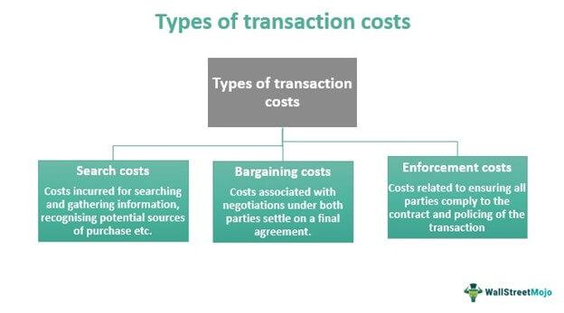

The financial markets have undergone a profound transformation with the emergence of algorithmic trading, a method where transactions are executed by computers at exceptional speeds and with high efficiency. This paradigm shift signifies a transition from traditional trading methods to a more technologically driven approach where success is often measured by the ability to respond rapidly to market changes. Within this new landscape, understanding the role of transaction costs and economic costs is essential for traders and investors aiming to maximize their returns.

Transaction costs refer to the expenses incurred during the buying and selling processes, including but not limited to, brokerage fees, spreads, and slippage. These costs can vary significantly depending on the asset class and trading strategy employed. While sometimes considered secondary, transaction costs can have a substantial impact on the net profitability of trades, particularly in high-frequency trading scenarios where numerous transactions occur in quick succession.

Economic costs, a broader concept, encompass both the direct financial outlays associated with trading and the opportunity costs—the potential gains forgone when choosing one investment over another. Recognizing these costs allows traders to assess the true cost of their trading activities, which is fundamental for making informed and strategic decisions that balance potential returns against associated risks.

The aim of this article is to explore the dynamics of financial transactions, highlight the impact of transaction costs, and examine the importance of economic costs in the context of algorithmic trading. By providing insights into these critical areas, we seek to enhance the understanding of trading strategies applied in today's fast-paced markets and offer guidance on improving profitability through effective cost management. Join us as we navigate the complexities of financial transactions in this age defined by algorithms and automated processes.

## Table of Contents

## Understanding Financial Transactions

Financial transactions are fundamental operations in financial markets, and they involve the exchange of assets between parties. These exchanges, which can range from straightforward retail trades to intricate derivative transactions, are the driving force behind market dynamics. They facilitate the transfer of capital and the allocation of resources, thus playing a crucial role in economic growth and stability.

The spectrum of financial transactions can be broad. Simple retail trades typically involve the buying and selling of stocks or bonds by individual investors or traders. On the other hand, complex derivative transactions may involve options, futures, and swaps, which are often used for hedging risks or speculating on future price movements. Each type of transaction carries unique characteristics and risks, necessitating a comprehensive understanding for effective participation in the markets.

Financial intermediaries, such as brokers and banks, are integral to the facilitation of these transactions. Brokers act as [agents](/wiki/agents) that execute buy and sell orders on behalf of their clients, while banks may offer more complex functions, including underwriting, lending, and providing platforms for electronic trading. These intermediaries provide [liquidity](/wiki/liquidity-risk-premium), enabling smoother and more efficient market operations.

Understanding the full cycle of financial transactions is essential for managing costs and optimizing trading strategies. The transaction cycle begins with the initiation of an order and ends with its settlement. Key stages include order placement, execution, and settlement, each carrying potential costs and risks. For instance, the time between execution and settlement can introduce counterparty risks if one party fails to deliver the promised asset or payment.

As financial markets continue to evolve, so too do the processes and definitions surrounding transactions. Technological advancements, such as electronic trading platforms and [algorithmic trading](/wiki/algorithmic-trading), have increased transaction speed and efficiency, while also introducing new complexities. This evolution necessitates continuous adaptation to remain competitive and effective in executing trades.

Enhanced understanding of these operations not only aids in cost management but also underpins the development of robust trading strategies. As transaction mechanisms become more sophisticated, staying informed about emerging trends and technologies in financial transactions is vital for traders and investors seeking to optimize their market activities.

## Decoding Transaction Costs

Transaction costs are essential considerations in the financial trading process, as they encompass various expenses incurred during the execution of transactions. These costs primarily include commissions, spreads, and slippage, each playing a distinct role in affecting the profitability of trades.

Commissions represent the fees paid to brokers for executing trades on behalf of investors or traders. These costs can vary significantly depending on the brokerage firm and the type of asset being traded. For instance, while traditional equity trades might involve fixed commission structures, derivatives or [forex](/wiki/forex-system) trades often feature variable commission rates.

Spreads refer to the difference between the bid and ask prices of an asset. A narrower spread indicates a more liquid market, which generally benefits traders by reducing transaction costs. Conversely, wider spreads elevate costs as traders pay more to enter or [exit](/wiki/exit-strategy) positions. The management of spread costs is crucial, particularly in markets with high-frequency trading where even small spreads can accumulate substantial expenses over time.

Slippage occurs when there is a difference between the expected price of a trade and the actual price at which it is executed. This discrepancy often arises in volatile markets where prices fluctuate swiftly. Effective strategies to mitigate slippage include trading in more liquid markets, executing trades during periods of lower [volatility](/wiki/volatility-trading-strategies), and utilizing advanced order types like limit orders that set predefined price levels.

The significance of transaction costs lies in their direct impact on the net returns of investments. High transaction costs erode returns and necessitate more substantial gains to achieve profitability. Consequently, investors and traders who focus on minimizing these costs can enhance their profitability. Strategies for cost reduction include selecting brokers with competitive fee structures, optimizing trade execution times, and leveraging technology to improve order efficiency.

Different asset classes incur varying transaction costs, underscoring the importance of prudent investment selection. For instance, trading equities might involve lower transaction costs compared to derivative instruments like options, which often require more complex trade executions and potentially higher fees. Evaluating these cost structures before entering markets enables traders to make informed decisions aligned with their investment objectives.

Awareness and proactive management of transaction costs are critical components of a long-term investment strategy. Regular analysis of these costs allows for the identification of inefficiencies and the optimization of trading practices. In addition, understanding cost dynamics facilitates more accurate valuation models, where the gross return ($R_g$) minus transaction costs ($C_t$) yields the net return ($R_n$):
$$

R_n = R_g - C_t 
$$

By prioritizing cost-efficiency, investors can enhance their portfolio performance and maintain a competitive edge in an ever-evolving financial landscape.

## Economic Costs in Trading

Economic costs in trading extend beyond direct financial expenditures to include opportunity costs linked to trading decisions. These costs offer a comprehensive perspective on the true cost of engaging in trading activities. Acknowledging economic costs allows traders to measure the genuine impact of their actions, fostering informed decision-making.

Opportunity costs represent the benefits forgone by selecting one trading strategy over another. For instance, choosing to invest capital in one asset class over another can lead to potential gains not realized in the neglected option. This concept is particularly significant when traders assess potential returns against the associated risks, striving to find a balance that maximizes profitability while minimizing unnecessary resource allocation.

In competitive trading environments, balancing economic costs with net gains is crucial for sustainability. Effective management of these costs ensures that operations remain viable and competitive, even as market conditions fluctuate. The goal is to optimize the risk-reward ratio to sustain long-term success.

Reducing economic costs not only boosts individual trader profitability but also contributes to overall market efficiency. When traders can allocate resources more judiciously, they drive better price discovery and liquidity, enhancing the market's ability to function smoothly. This enhanced efficiency benefits all market participants by narrowing spreads and lowering transaction costs indirectly.

In summary, an essential aspect of successful trading involves a deep understanding of both direct financial outlays and the subtler opportunity costs. By strategically managing these economic costs, traders can improve their decision-making processes, better allocate resources, and ultimately achieve superior net gains in the competitive landscape of financial markets.

## The Role of Algorithmic Trading

Algorithmic trading has revolutionized financial markets by utilizing technology to automate and optimize the execution of trades. At its core, algorithmic trading involves the use of sophisticated algorithms that scan markets for opportunities and execute trades at speeds unattainable by human traders. This technology allows for rapid decision-making, consistent execution, and the ability to process large volumes of transactions simultaneously.

Key to the success of algorithmic trading is its ability to minimize transaction costs compared to manual trading. While each trade incurs lower costs, the inherent [high frequency](/wiki/high-frequency-trading) of trades in algorithmic systems means that the cumulative transaction costs can become significant. This is especially true in high-frequency trading ([HFT](/wiki/high-frequency-trading-strategies)), where algorithms execute thousands of trades in fractions of a second. Thus, understanding and managing these costs are crucial for maintaining profitability.

Algorithmic trading systems must consider transaction costs within their strategy frameworks. Cost analysis becomes a central task as it affects the overall performance and profitability of trading systems. Implementing effective transaction cost analysis (TCA) can lead to better-informed decision-making, allowing traders to assess the trade-offs between speed, execution quality, and cost.

In practice, algorithmic trading strategies incorporate several techniques to control and reduce transaction costs. These may include optimizing order execution, timing trades to coincide with periods of high liquidity, and using advanced order types designed to minimize market impact. For instance, algorithms might be programmed to execute trades during times when bid-ask spreads are narrower, further reducing implicit costs associated with trading.

In conclusion, while algorithmic trading inherently reduces individual transaction costs compared to manual methods, its high trade frequency underscores the importance of meticulous cost management. Maintaining profitability requires ongoing assessment and integration of cost analysis into trading strategies. As algorithmic trading continues to evolve, the ability to effectively manage these costs will remain a pivotal component for traders seeking to maximize their competitive advantage in financial markets.

## Strategies for Reducing Transaction Costs

In the domain of algorithmic trading, managing transaction costs is a critical component of optimizing trading strategies and enhancing net returns. Several strategic approaches can effectively reduce these costs, ensuring traders maintain profitability in high-frequency environments.

Aggregation of orders and executing bulk trades can significantly lower transaction costs. By consolidating smaller trades into larger ones, traders can often negotiate better terms or lower fees, taking advantage of economies of scale. This method is particularly beneficial when dealing with brokers or exchanges that offer tiered pricing structures based on [volume](/wiki/volume-trading-strategy).

Selecting the right broker is essential for effective cost management. Brokers with favorable fee structures, such as low commission rates or discounts for high-volume trading, can substantially reduce the expenses incurred per transaction. Furthermore, understanding a broker's fee schedule, including hidden costs such as account maintenance or data fees, is crucial for making informed decisions.

Smart order routing is another powerful tool for minimizing transaction costs. By intelligently navigating through various liquidity pools, such as exchanges and dark pools, this strategy optimizes the order execution process, reducing slippage and spreads. Algorithms designed for smart order routing make real-time decisions based on market conditions, ensuring trades are executed at the best possible prices.

Regular transaction cost analysis (TCA) is vital for identifying areas of cost reduction and strategy optimization. TCA involves examining historical trade data to evaluate the efficiency of trade executions and the actual costs incurred. By assessing metrics such as price impact, timing, and execution venue, traders can pinpoint inefficiencies and adjust their strategies accordingly. This systematic review process ensures that trading approaches remain adaptable and cost-effective.

Moreover, by optimizing these strategies—aggregation, smart broker selection, smart order routing, and consistent TCA—traders can better manage costs and maximize net returns. Such optimization not only improves the profitability of algorithmic trading strategies but also enhances the robustness and competitiveness of trading operations in volatile markets.

## Conclusion

In the fast-paced world of algorithmic trading, understanding and managing transaction and economic costs is imperative. These costs, often overlooked, can significantly impact the success of trading strategies. For instance, even a minor increase in transaction costs can erode profits, especially in high-frequency trading (HFT), where the volume of trades is substantial. To mitigate these impacts, traders must employ comprehensive strategies that encompass meticulous cost analysis and reduction techniques. This includes the selection of efficient brokers with competitive fee structures, implementation of smart order routing, and regular transaction cost analysis (TCA).

As technology continues to evolve, ongoing education and adaptation are crucial for mastering financial transactions. This dynamic requires traders to continually update their knowledge and adapt to new tools and methodologies that can further reduce costs or enhance trading efficiencies. Leveraging advanced algorithms and [machine learning](/wiki/machine-learning) models can aid in refining these strategies, ensuring decisions are data-driven and informed by the latest market conditions.

Ultimately, the ability to control costs while optimizing strategies will define success in algorithmic trading. By maintaining a sharp focus on cost management, together with strategic investment in technology and education, traders can enhance their competitive edge and improve profitability. In this ever-evolving landscape, those who adapt and excel in managing these complexities will be best positioned to thrive.

## References & Further Reading

[1]: Hasbrouck, J. (2007). ["Empirical Market Microstructure: The Institutions, Economics, and Econometrics of Securities Trading."](https://academic.oup.com/book/52241) Oxford University Press.

[2]: Harris, L. (2003). ["Trading and Exchanges: Market Microstructure for Practitioners."](https://academic.oup.com/book/52292) Oxford University Press.

[3]: Aldridge, I. (2013). ["High-Frequency Trading: A Practical Guide to Algorithmic Strategies and Trading Systems."](https://www.amazon.com/High-Frequency-Trading-Practical-Algorithmic-Strategies/dp/1118343506) Wiley.

[4]: Kissell, R., & Glantz, M. (2003). ["Optimal Trading Strategies: Quantitative Approaches for Managing Market Impact and Trading Risk."](https://archive.org/details/optimaltradingst0000kiss) AMACOM.

[5]: De Prado, M. L. (2018). ["Advances in Financial Machine Learning."](https://www.amazon.com/Advances-Financial-Machine-Learning-Marcos/dp/1119482089) Wiley.