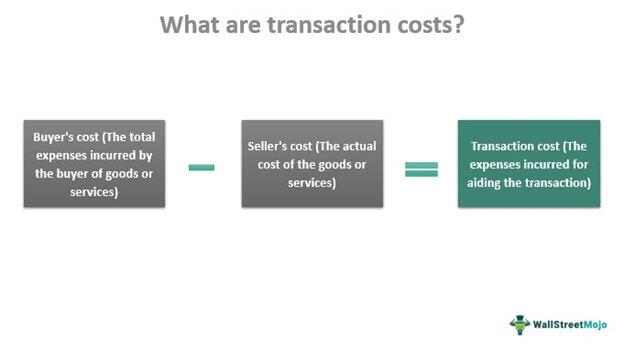

Algorithmic trading, often referred to as algo trading, has fundamentally transformed the landscape of financial markets. By leveraging complex algorithms and executing trades at super-fast speeds, traders can capitalize on opportunities that may otherwise be missed in traditional trading. This method relies on sophisticated mathematical models to analyze data at a scale and speed beyond human capabilities, thus enabling the quick identification and execution of profitable trades.

One crucial element that can significantly impact the profitability of algorithmic trading is transaction costs. Transaction costs are defined as any expenses incurred as a result of buying or selling financial instruments. These costs can encompass a variety of fees, including brokerage commissions, bid-ask spreads, and market impact costs. Despite often being overlooked, transaction costs can quickly add up and erode profits if not managed properly. For instance, even small percentages lost per trade can compound significantly when trading at high volumes or frequencies, common in algo trading strategies.



Understanding these costs is essential for traders aiming to maximize their profits in the competitive arena of algo trading. Properly accounting for transaction costs can mean the difference between a profitable strategy and a losing one. Models and strategies that do not incorporate these costs may overestimate expected returns, leading to misguided decision-making.

This article explores the concept of transaction costs in algorithmic trading. It focuses on their impact, key factors that influence these costs, and strategies to minimize them, ensuring traders are well-equipped to enhance net returns. By integrating a thorough consideration of transaction costs into the trading process, traders can better align their strategies with realistic profit expectations and maintain a competitive edge in the fast-paced world of algorithmic trading.

## Table of Contents

## Understanding Transaction Costs

Transaction costs in [algorithmic trading](/wiki/algorithmic-trading) refer to the various expenses incurred when executing trades. These costs can significantly impact the overall profitability of trading strategies, especially when a large number of transactions are involved. The primary components of transaction costs include brokerage commissions, market spreads, slippage, exchange fees, and regulatory charges. Understanding these elements is crucial for traders seeking to optimize their trading strategies and ensure profitability.

**1. Brokerage Commissions:**
Brokerage commissions are fees charged by brokers to execute trades on behalf of traders. These charges can vary based on the broker's pricing model, the asset class traded, and the [volume](/wiki/volume-trading-strategy) of trades. While some brokers offer a flat fee per trade, others may charge a percentage of the trade value. The choice of broker and the commission structure significantly influences the overall transaction cost.

**2. Market Spreads:**
Market spreads refer to the difference between the bid price (the highest price a buyer is willing to pay) and the ask price (the lowest price a seller is willing to accept) of a financial instrument. In highly liquid markets, spreads are typically narrow, minimizing transaction costs. Conversely, in less liquid markets, wider spreads can increase trading costs, affecting profit margins.

**3. Slippage:**
Slippage occurs when there is a difference between the expected price of a trade and the actual price at which it is executed. This can happen due to market [volatility](/wiki/volatility-trading-strategies) or delays in order execution. Slippage is particularly significant in high-frequency trading, where even slight discrepancies can lead to substantial cumulative costs.

**4. Exchange Fees:**
These are charges levied by exchanges for the execution of trades. The fees can differ based on the specific exchange and the volume of trading activity. For traders involved in high-frequency trading, exchange fees can contribute notably to the overall transaction costs, requiring careful consideration and planning.

**5. Regulatory Charges:**
Regulatory charges include fees imposed by financial regulatory bodies. These can be transaction taxes or levies aimed at maintaining market integrity. Although they may seem negligible on a per-trade basis, regulatory charges can accumulate over numerous transactions, thus impacting overall returns.

While each of these components might appear minor in isolation, their collective impact can be significant. For instance, consider a scenario where a trader executes 1,000 trades, with a brokerage commission of $1 per trade, a market spread of 0.1%, and an average slippage of 0.05%. The cumulative transaction cost can be calculated as follows in Python:

```python
# Parameters
number_of_trades = 1000
brokerage_commission = 1  # Per trade
average_trade_value = 1000  # Assumed trade value

# Calculating costs
total_brokerage = number_of_trades * brokerage_commission
market_spread_cost = number_of_trades * average_trade_value * 0.001  # 0.1% of trade value
slippage_cost = number_of_trades * average_trade_value * 0.0005  # 0.05% of trade value

# Total transaction cost
total_transaction_cost = total_brokerage + market_spread_cost + slippage_cost
total_transaction_cost
```

Effective management of transaction costs is essential to maintain the profitability of algorithmic trading strategies. By understanding and carefully monitoring these expenses, traders can develop strategies that minimize costs and enhance returns.

## Factors Influencing Transaction Costs

Several key factors influence transaction costs in algorithmic trading. These are market [liquidity](/wiki/liquidity-risk-premium), order size, trading frequency, broker selection, bid-ask spreads, and market impact costs. Understanding how each of these elements contributes to transaction costs can help traders optimize their strategies and enhance profitability.

Market liquidity is one of the foremost considerations. It refers to the ease with which an asset can be bought or sold in the market without affecting its price. Highly liquid markets typically have narrower spreads and less price slippage, leading to reduced transaction costs. Conversely, in illiquid markets, wider spreads and higher price volatility can result in increased transaction costs. For example, in a liquid market, the bid-ask spread might be just a few cents, whereas, in an illiquid market, this spread could widen significantly.

The size of an order is another critical [factor](/wiki/factor-investing). Large orders can have a substantial market impact, which refers to the change in asset price caused by the trade itself. Submitting a large buy order can drive the price up, increasing the cost of the remaining shares to be purchased. This phenomenon can erode potential profits. Traders often use methods like slicing large orders into smaller ones or using algorithms that disguise the order size to mitigate market impact.

Trading frequency is also crucial in determining transaction costs. High-frequency trading, characterized by a large number of trades executed in short timeframes, tends to incur higher cumulative transaction costs due to continuous exposure to market spreads and commissions. Even minor increases in these costs can have a significant impact on overall profitability. Therefore, it is vital for traders to balance the frequency of trades with potential cost efficiency.

Broker selection plays a pivotal role in the costs incurred during trading. Different brokers offer varying commission structures, rebates, and execution technologies that can influence transaction costs. Traders can save substantial amounts by negotiating lower fees with their brokers or opting for services that offer competitive rates and efficient execution mechanisms.

The bid-ask spread is another fundamental component of transaction costs. It represents the difference between the highest price a buyer is willing to pay and the lowest price a seller is willing to accept. Narrower spreads generally signify more cost-efficient trades. Traders can minimize this cost by timing their trades during periods of high market liquidity when spread sizes tend to decrease.

Finally, market impact costs arise when a trade alters the market price of an asset. The impact is more pronounced for large orders or in thinly traded markets, leading to unexpected increases in transaction costs. Employing advanced execution algorithms can help mitigate these costs by strategically placing trades to minimize price disruption.

Understanding these factors allows traders to tailor their strategies to minimize transaction costs, thus preserving capital and enhancing trading performance. By focusing on liquidity, managing order size, optimizing trading frequency, selecting the right broker, timing trades to take advantage of tighter spreads, and minimizing market impact, traders can significantly improve their net returns.

## The Impact on Algorithmic Trading Strategies

Transaction costs are critical to assessing the success of algorithmic trading strategies. These expenses, when underestimated or ignored, can erode the profitability of carefully designed trading strategies, often turning theoretically profitable systems into financially unviable ones. 

High transaction costs can severely impact the frequency and volume of trades. For high-frequency trading ([HFT](/wiki/high-frequency-trading-strategies)) algorithms, which capitalize on executing numerous trades within fractions of a second, even marginal increases in transaction expenses can significantly diminish overall returns. The sensitivity of HFT strategies to transaction costs is primarily due to their reliance on very thin profit margins per trade. As a result, HFT firms typically focus on minimizing these costs to ensure profitability.

Consider, for instance, a simple high-frequency trading scenario where a strategy executes 10,000 trades per day. If the average net profit per trade is $0.01, a $0.002 increase in transaction cost results in a 20% decrease in profitability. This illustrates how seemingly negligible costs can have substantial effects on cumulative outcomes.

Effective risk management in algorithmic trading necessitates a comprehensive understanding of transaction costs and their potential implications. Traders must integrate these costs into their risk management frameworks. Strategies should be developed to incorporate the impact of transaction costs on expected returns, incorporating these costs into the strategy optimization process. For instance, traders might employ advanced statistical models to estimate the potential impact of transaction costs under different market conditions. 

By simulating trading scenarios with varied transaction cost structures, traders can identify the conditions under which their strategies remain viable. Such simulations can provide insights into the robustness of trading strategies, helping traders to devise approaches that maintain profitability even when transaction costs fluctuate. This analytical perspective not only aids in strategic development but also enhances the trader's ability to adapt strategies in response to changing market dynamics.

Ultimately, the overarching aim is to integrate a sophisticated understanding of transaction costs into the strategy development cycle. By doing so, traders can ensure that they remain competitive in a rapidly evolving financial landscape, optimizing their strategies for sustained profitability despite the constraints imposed by transaction costs.

## Strategies to Reduce Transaction Costs

Reducing transaction costs is fundamental for algorithmic traders aimed at maximizing profitability. A practical approach is optimizing order execution through advanced technologies like smart order routing (SOR) algorithms. SOR systems analyze real-time data from multiple trading venues to determine the best execution strategy, ensuring orders are filled at optimal prices with minimized slippage. Combining SOR with trading in highly liquid assets can substantially decrease transaction costs due to narrower bid-ask spreads and lower price volatility.

Negotiation with brokers for reduced commission rates presents another effective strategy. Many brokers offer tiered pricing models or the opportunity to negotiate fees based on trading volume, which can lead to significant savings over time. Additionally, traders should explore fee rebate programs that provide financial incentives or return a portion of trading costs after reaching specific volume thresholds.

Minimizing slippage, the difference between expected and actual trade execution prices, is also crucial. One method involves implementing advanced algorithms that predict and adjust for potential market movements. These algorithms can adapt to varying market conditions, ensuring trades are executed at close to intended prices.

Finally, transaction costs can be managed by choosing the correct time frames for trading. Executing trades during periods of high market activity can take advantage of increased liquidity and reduced spreads, thus lowering costs. By combining these strategies, traders can refine their approach, leading to enhanced trading performance and profitability.

## The Role of Transaction Cost Analysis (TCA)

Transaction Cost Analysis (TCA) is a critical process for algorithmic traders seeking to manage and reduce their trading expenses effectively. TCA systematically evaluates all measurable costs associated with executing trades, helping identify inefficiencies and areas for cost improvement. By adopting TCA, traders gain a structured approach to dissecting their transaction costs.

One key benefit of TCA is its ability to refine algorithmic strategies. By examining cost data, traders can adjust their algorithms to optimize trade initiation, execution methods, and timing. For instance, analyzing market impact and slippage can reveal optimal trading windows or liquidity providers to target, thereby reducing implicit costs.

TCA also supports traders in making informed decisions to enhance trade execution. For example, understanding the breakdown of costs such as bid-ask spreads, commission fees, and slippage allows traders to anticipate and plan for these expenses. This foresight can lead traders to employ advanced trading tactics, such as executing trades in smaller batches to minimize market impact or utilizing smart order routing to secure better pricing.

Moreover, TCA offers insights into performance measurement by differentiating between expected and actual costs. Traders can leverage these insights to benchmark their execution quality against industry standards or historical performance, ensuring that their strategies remain competitive. 

Implementing TCA may involve using sophisticated software tools or custom algorithms to analyze tick-by-tick data. Python libraries such as `pandas` and `numpy` can be used to handle large datasets and perform statistical analyses, while libraries like `matplotlib` can visualize cost patterns over time. The following Python snippet demonstrates a basic approach to calculating and visualizing transaction costs using pandas:

```python
import pandas as pd
import matplotlib.pyplot as plt

# Sample transaction data
data = {
    'trade_id': [1, 2, 3],
    'execution_price': [100.5, 101.0, 99.8],
    'market_price': [100.0, 100.5, 100.0],
    'volume': [10, 15, 10]
}

# Create a DataFrame
df = pd.DataFrame(data)

# Calculate individual transaction cost per share
df['cost_per_share'] = df['execution_price'] - df['market_price']

# Calculate total transaction cost
df['total_cost'] = df['cost_per_share'] * df['volume']

# Plot the transaction costs
plt.bar(df['trade_id'], df['total_cost'])
plt.xlabel('Trade ID')
plt.ylabel('Total Transaction Cost')
plt.title('Analysis of Transaction Costs')
plt.show()
```

By analyzing the resulting data, traders can identify specific trades that incurred higher costs than anticipated and adjust their strategies accordingly.

In essence, Transaction Cost Analysis empowers traders with a detailed comprehension of their trading expenses and facilitates a data-driven approach to optimizing algorithmic trading strategies. By incorporating TCA, traders not only enhance cost efficiency but also improve the overall profitability of their trading operations.

## Conclusion

Transaction costs are an essential consideration in algorithmic trading, significantly impacting net returns and the viability of trading strategies. Ignoring these costs can lead to erroneous assessments of a strategy's profitability, making it imperative for traders to evaluate and incorporate them meticulously.

To optimize trading strategies, a comprehensive approach that integrates transaction costs as a fundamental aspect of the trading process is necessary. This involves selecting the right broker, who can offer competitive commission rates and efficient trade execution. The utilization of Transaction Cost Analysis (TCA) allows traders to assess the various expenses incurred during trade execution, helping them identify areas needing improvement. TCA aids in refining algorithms and adjusting trade tactics to enhance overall performance.

Efficient execution methods are equally crucial. Employing smart order routing to exploit liquidity opportunities and minimizing slippage are vital in reducing transaction costs. Techniques such as algorithmic execution improvements and strategic trade timing can make a significant difference in enhancing performance.

In today's highly competitive financial markets, where every basis point counts, the effective management of transaction costs is vital for sustained success in algorithmic trading. By meticulously considering transaction costs, traders can achieve a more precise and accurate evaluation of their trading strategies, ultimately leading to improved profitability and competitive advantage.

## References & Further Reading

[1]: Kissell, R. (2013). ["The Science of Algorithmic Trading and Portfolio Management."](https://www.sciencedirect.com/book/9780124016897/the-science-of-algorithmic-trading-and-portfolio-management) Academic Press.

[2]: Johnson, B., & Ouma, J. (2011). ["Market Microstructure: A Trader's Guide."](https://onlinelibrary.wiley.com/doi/10.1111/j.1756-2171.2011.00139.x) Wiley.

[3]: Harris, L. (2003). ["Trading and Exchanges: Market Microstructure for Practitioners."](https://www.amazon.com/Trading-Exchanges-Market-Microstructure-Practitioners/dp/0195144708) Oxford University Press.

[4]: Hasbrouck, J. (2007). ["Empirical Market Microstructure: The Institutions, Economics, and Econometrics of Securities Trading."](https://academic.oup.com/book/52241) Oxford University Press.

[5]: Kissell, R. (2014). ["Multi-Asset Risk Modeling: Techniques for a Global Economy in an Electronic and Algorithmic Trading Era."](https://www.sciencedirect.com/book/9780124016903/multi-asset-risk-modeling) Academic Press.