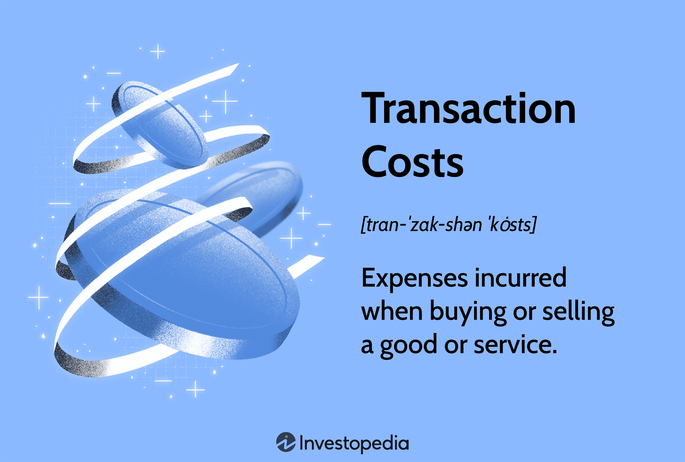

## Table of Contents

## What are transaction costs?

Transaction costs are the expenses that people or businesses have to pay when they buy or sell something. These costs can include things like fees, commissions, and the time and effort it takes to make the transaction happen. For example, when you buy a stock, you might have to pay a fee to the broker who helps you make the purchase. 

These costs can affect how much people want to buy or sell things. If the transaction costs are high, people might decide not to make the transaction because it's too expensive. On the other hand, if the transaction costs are low, people might be more willing to buy and sell. Understanding transaction costs is important for making good decisions about buying and selling things.

## What are the different types of transaction costs?

Transaction costs can be split into two main types: explicit costs and implicit costs. Explicit costs are the direct, out-of-pocket expenses you can easily see and measure. These include fees like brokerage commissions when you buy or sell stocks, bank fees for transferring money, and any taxes you have to pay on the transaction. For example, if you pay $10 to a broker to buy a stock, that $10 is an explicit cost.

Implicit costs are a bit trickier because they are not direct payments but still affect the total cost of a transaction. These costs include the time and effort you spend on making the transaction happen, like researching a product before buying it or waiting in line at a store. Another example of an implicit cost is the opportunity cost, which is what you give up by choosing one option over another. For instance, if you spend an hour researching a purchase, the implicit cost is the value of what you could have done with that hour instead.

Understanding both types of transaction costs is important because they can add up and affect your decisions. If the total transaction costs are too high, you might decide not to go through with the transaction. On the other hand, if the costs are low, you might be more willing to buy or sell. Keeping an eye on these costs can help you make smarter choices about when and how to make transactions.

## How do transaction costs affect economic transactions?

Transaction costs play a big role in how people and businesses make economic decisions. When these costs are high, people might decide not to buy or sell something because it becomes too expensive. For example, if you want to buy a used car and the fees to transfer the title are very high, you might choose not to buy it. High transaction costs can slow down the economy because fewer people are willing to make trades. This can lead to less buying and selling, which means less economic activity overall.

On the other hand, when transaction costs are low, people are more likely to make trades. Low costs make it easier and cheaper to buy and sell things, which can lead to more economic activity. For instance, if online shopping platforms have low fees, more people might shop online, boosting the economy. Lower transaction costs can encourage more people to participate in the market, leading to more efficient and active economic transactions. Understanding and managing transaction costs is important for both individuals and businesses to make the best economic choices.

## Can you provide examples of transaction costs in everyday life?

When you go to the grocery store, you might not think about transaction costs, but they're there. For example, if you use a credit card to pay, the store might charge you a small fee for using it. That's an explicit cost. Also, the time you spend driving to the store, finding a parking spot, and walking through the aisles to find what you need is an implicit cost. These costs add up and can affect how often you decide to go shopping.

Another everyday example is buying a ticket to a concert. When you buy the ticket online, you might have to pay a service fee, which is an explicit cost. If you decide to go to the box office instead, you'll spend time waiting in line, which is an implicit cost. Plus, if you choose to buy the ticket instead of doing something else with your money, like saving it or buying something else, that's an opportunity cost, another type of implicit cost. All these costs can influence whether you decide to go to the concert or not.

## How do transaction costs impact the efficiency of markets?

Transaction costs can make markets less efficient. When it costs a lot to buy or sell something, people might not want to trade as much. This means fewer people are buying and selling, which can slow down the market. For example, if it's expensive to trade stocks, fewer people will do it, and the stock market might not work as well as it could. High transaction costs can also make it harder for prices to reflect what things are really worth because fewer trades happen.

On the other hand, when transaction costs are low, markets can work better. If it's cheap and easy to buy and sell things, more people will do it. This can make the market more active and help prices show the true value of things more accurately. For instance, if it's easy and cheap to buy and sell houses, more people will do it, and the housing market will be more efficient. Lower transaction costs can help the economy by making it easier for people to trade and for markets to work smoothly.

## What is the role of transaction costs in the theory of the firm?

In the theory of the firm, transaction costs help explain why companies exist and how they are organized. Economist Ronald Coase argued that firms exist because they can lower the costs of making deals. Instead of always buying things from other companies, a firm can do things itself. For example, if it's cheaper for a company to make its own parts instead of buying them from another company, it will do that. This way, the company can save money and work more efficiently.

Transaction costs also affect how big a company gets and how it is structured inside. If the costs of dealing with other companies are high, a firm might grow bigger to do more things itself. But if the costs of managing a big company become too high, the firm might decide to stay smaller or split into smaller parts. So, transaction costs help decide if a company should grow, shrink, or stay the same size, and how it should be organized to work best.

## How have transaction costs influenced the development of financial instruments?

Transaction costs have played a big role in shaping financial instruments. When it's expensive to buy or sell things, people look for ways to make it cheaper. This has led to the creation of new financial tools that help lower these costs. For example, mutual funds were created to make it easier and cheaper for people to invest in a bunch of different stocks at once, instead of buying each one separately. This way, people can save on the fees they would have to pay if they bought each stock on their own.

Another way transaction costs have influenced financial instruments is through the development of electronic trading platforms. These platforms have made it much cheaper and faster to buy and sell things like stocks and bonds. Before, people had to call a broker and pay high fees to make a trade. Now, with online platforms, people can do it themselves for a lot less money. This has made the financial markets more accessible to more people and has helped make trading more efficient.

## What strategies can businesses use to minimize transaction costs?

Businesses can minimize transaction costs by using technology to make buying and selling easier and cheaper. For example, they can use online platforms to sell their products directly to customers without needing a middleman. This cuts down on fees and makes the process faster. Another way is to use automated systems for things like ordering supplies or managing payments. These systems can save time and reduce the need for people to do these tasks, which lowers the costs.

Another strategy is to build long-term relationships with suppliers and customers. When businesses work with the same people over time, they can negotiate better deals and lower the costs of making deals. For example, a company might agree to buy a lot of materials from one supplier at a lower price. This can save money on each transaction. Also, by understanding their customers better, businesses can make the buying process smoother and quicker, which reduces the time and effort spent on each sale.

## How do transaction costs vary across different industries?

Transaction costs can be very different depending on the industry. In the financial industry, like banking and stock trading, transaction costs can be high because of fees for buying and selling stocks, bonds, or other financial products. These costs can include broker fees, taxes, and the time spent researching investments. But, with the rise of online trading platforms, these costs have started to go down, making it easier and cheaper for people to trade.

In the retail industry, transaction costs might be lower because of things like online shopping. When people buy things online, they don't have to spend time going to a store, which saves them time and effort. But, there can still be costs like shipping fees or payment processing fees. In industries like real estate, transaction costs can be very high because of things like agent commissions, legal fees, and the time it takes to buy or sell a property. Each industry has its own set of costs that can affect how businesses and people make decisions.

## What is the relationship between transaction costs and information asymmetry?

Transaction costs and information asymmetry are closely linked. Information asymmetry happens when one person in a deal knows more than the other person. This can make transaction costs go up because the person with less information might need to spend more time and money to find out what they need to know. For example, if you want to buy a used car, you might need to pay for a mechanic to check it out because the seller knows more about the car's condition than you do. This extra cost is part of the transaction cost.

When there's a lot of information asymmetry, it can make people less willing to make deals because they're worried about getting a bad deal. This can slow down the market and make it less efficient. But, if businesses and people find ways to share information better, like through reviews or detailed product descriptions, it can lower transaction costs. This makes it easier and cheaper for people to buy and sell things, which can help the economy grow.

## How do technological advancements affect transaction costs?

Technological advancements have made a big difference in lowering transaction costs. Before, people had to go to a store or call a broker to buy things, which took a lot of time and money. Now, with the internet and smartphones, people can buy things online from anywhere. This saves time and cuts down on fees because there's no need for a middleman. For example, online banking lets people move money without going to a bank, which saves on fees and time.

Also, technology has made it easier to find information. Before, if you wanted to buy something, you might have to spend a lot of time researching it. Now, you can look up reviews and prices online in just a few minutes. This helps lower the costs of making a good decision. Plus, technology like blockchain and smart contracts can make transactions even cheaper and faster by cutting out the need for banks or lawyers in some deals. All these changes help make buying and selling easier and less expensive.

## What are the implications of transaction costs for economic policy and regulation?

Transaction costs have big effects on how governments make economic policies and rules. When transaction costs are high, it can slow down the economy because people and businesses might not want to buy or sell as much. This is why governments often try to make rules that help lower these costs. For example, they might set up rules that make it easier for people to start a business or buy and sell things online. By doing this, they hope to make the economy more active and help it grow.

Also, understanding transaction costs helps governments decide on taxes and fees. If a tax or fee makes it too expensive to do something, people might not do it at all. So, governments need to be careful about how much they charge. They might lower taxes on certain things to encourage more buying and selling, or they might set up programs to help people pay for the costs of doing business. This way, they can help make sure that the economy keeps moving and that people can do what they need to do without spending too much.

## References & Further Reading

[1]: Kissell, R. (2013). ["The Science of Algorithmic Trading and Portfolio Management."](https://www.sciencedirect.com/book/9780124016897/the-science-of-algorithmic-trading-and-portfolio-management) Academic Press.

[2]: Johnson, B., & Ouma, J. (2011). ["Market Microstructure: A Trader's Guide."](https://onlinelibrary.wiley.com/doi/10.1111/j.1756-2171.2011.00139.x) Wiley.

[3]: Harris, L. (2003). ["Trading and Exchanges: Market Microstructure for Practitioners."](https://www.amazon.com/Trading-Exchanges-Market-Microstructure-Practitioners/dp/0195144708) Oxford University Press.

[4]: Hasbrouck, J. (2007). ["Empirical Market Microstructure: The Institutions, Economics, and Econometrics of Securities Trading."](https://academic.oup.com/book/52241) Oxford University Press.

[5]: Kissell, R. (2014). ["Multi-Asset Risk Modeling: Techniques for a Global Economy in an Electronic and Algorithmic Trading Era."](https://www.sciencedirect.com/book/9780124016903/multi-asset-risk-modeling) Academic Press.