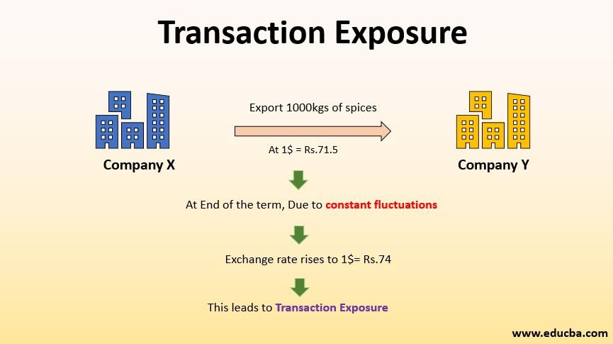

## Table of Contents

## What is transaction exposure in finance?

Transaction exposure in finance refers to the risk that a company faces due to changes in currency exchange rates between the time a transaction is agreed upon and when it is settled. For example, if a U.S. company agrees to buy goods from a European supplier with payment due in euros in three months, the company is exposed to the risk that the euro might strengthen against the dollar by the time payment is due. This could mean the company ends up paying more dollars than initially expected.

Managing transaction exposure is important for businesses that operate internationally. Companies can use various financial instruments like forward contracts, options, and swaps to hedge against this risk. By locking in exchange rates in advance, a company can protect itself from unfavorable currency movements and ensure more predictable financial outcomes. Understanding and managing transaction exposure helps businesses maintain stability in their international dealings.

## How does transaction exposure differ from economic and translation exposure?

Transaction exposure, economic exposure, and translation exposure are three types of foreign exchange risk that businesses face, but they affect a company in different ways. Transaction exposure happens when a business has to make or receive payments in a foreign currency. For example, if a company in the U.S. buys something from Europe and has to pay in euros, any change in the value of the dollar against the euro between the time the deal is made and when the payment is due can affect the cost. This is about the actual cash flows and can be managed with financial tools like forward contracts.

Economic exposure, on the other hand, looks at the long-term impact of currency changes on a company's overall value. It's not just about one transaction but how currency changes can affect the company's sales, costs, and competitiveness over time. For instance, if the dollar gets weaker, U.S. products might become cheaper abroad, which could be good for sales but might also increase the cost of importing materials. Economic exposure is harder to manage because it involves many factors and can't be easily hedged with financial instruments.

Translation exposure is about how currency changes affect the financial statements of a company that has operations in different countries. When a company has to convert the financial results of its foreign subsidiaries back into its home currency for reporting, changes in exchange rates can make the numbers look different. This doesn't directly affect cash flow but can impact how investors and analysts view the company's performance. Unlike transaction exposure, translation exposure is more about accounting and reporting and less about immediate financial impact.

## What are the main causes of transaction exposure?

Transaction exposure happens when a company agrees to a deal that involves paying or getting paid in a foreign currency. The main cause of this exposure is the time gap between when the deal is made and when the payment is actually done. During this time, the exchange rate between the two currencies can change. If the currency a company needs to pay in gets stronger, it will cost more in the company's home currency. If the currency a company is going to receive gets weaker, the company will get less money when it converts it back to its home currency.

Another cause of transaction exposure is when companies do not use financial tools to protect themselves from currency changes. If a company does not use things like forward contracts or options to lock in an exchange rate, it is fully exposed to any changes in the currency market. This can lead to big surprises in costs or revenues when the payment time comes. By understanding these causes, companies can take steps to manage their transaction exposure better.

## Can you explain how currency fluctuations impact transaction exposure?

Currency fluctuations can have a big impact on transaction exposure. When a company agrees to a deal that involves paying or getting paid in a foreign currency, any change in the exchange rate between the time the deal is made and when the payment happens can affect the company's costs or revenues. For example, if a U.S. company agrees to buy goods from Europe and has to pay in euros, and the euro gets stronger against the dollar by the time payment is due, the U.S. company will have to pay more dollars than it expected. This is because it takes more dollars to buy the same amount of euros.

On the other hand, if a U.S. company is going to receive payment in euros and the euro weakens against the dollar, the company will get fewer dollars when it converts the euros back to dollars. This means the company's revenue from that deal will be less than expected. These changes in currency values can make it hard for companies to predict their financial outcomes and can lead to unexpected costs or losses. That's why companies often use financial tools like forward contracts to lock in exchange rates and protect themselves from these currency fluctuations.

## What are some common strategies to manage transaction exposure?

One common way to manage transaction exposure is by using forward contracts. A forward contract lets a company lock in an exchange rate for a future date. This means the company knows exactly how much it will cost or how much it will get in its home currency, no matter what happens to the exchange rate. For example, if a U.S. company needs to pay in euros in three months, it can use a forward contract to fix the exchange rate now. This way, even if the euro gets stronger, the company won't have to pay more dollars.

Another strategy is to use options. Options give a company the right, but not the obligation, to exchange currency at a certain rate. This can be useful if a company wants to protect itself from bad changes in the exchange rate but still wants to benefit if the rate moves in its favor. For instance, if the exchange rate gets better, the company can choose not to use the option and exchange at the better rate. Options can be a bit more expensive than forward contracts, but they offer more flexibility.

Companies can also use natural hedging, which means they try to match their foreign currency revenues with their foreign currency costs. For example, if a U.S. company earns money in euros from sales in Europe, it can use those euros to pay for things it buys in Europe. This way, changes in the exchange rate won't affect the company as much because it's using the same currency for both [earning](/wiki/earning-announcement) and spending. Natural hedging can be a good way to manage transaction exposure without using financial tools.

## How can forward contracts be used to hedge transaction exposure?

Forward contracts are a great way to protect a company from changes in currency rates when it has to pay or get paid in a foreign currency. Imagine a U.S. company that needs to pay for goods in euros in three months. If the company uses a forward contract, it can agree with a bank now on the exchange rate it will use to buy euros in three months. This means no matter what happens to the exchange rate between the dollar and the euro, the company knows exactly how many dollars it will need to pay. This helps the company avoid surprises and plan its budget better.

Using forward contracts is like locking in a price for something you'll buy later. It's a simple and effective way to manage the risk of currency changes. By using a forward contract, a company can focus on its business without worrying about how much more or less it might have to pay because of currency fluctuations. This can be really helpful for companies that do a lot of business in different countries and need to manage their money carefully.

## What role do options play in managing transaction exposure?

Options are another tool companies can use to manage transaction exposure. They give a company the right, but not the obligation, to exchange currency at a certain rate in the future. This means if the exchange rate moves in a way that's bad for the company, it can use the option to protect itself. But if the rate moves in a good way, the company can choose not to use the option and take advantage of the better rate. This flexibility can be really helpful, especially when it's hard to predict what will happen with currency rates.

Using options can be a bit more expensive than using forward contracts, but the extra cost can be worth it for the peace of mind and flexibility they offer. For example, if a U.S. company needs to pay in euros in three months, it can buy an option to exchange dollars for euros at today's rate. If the euro gets stronger, the company can use the option and pay the same amount of dollars it planned. But if the euro gets weaker, the company can let the option expire and exchange at the better rate. This way, the company is protected from bad changes but can still benefit from good ones.

## How does a company assess its level of transaction exposure?

A company assesses its level of transaction exposure by looking at all the deals it has that involve paying or getting paid in a foreign currency. It adds up all the money it will need to pay in foreign currencies and all the money it will receive in foreign currencies. Then, it thinks about how much the exchange rates might change between now and when the payments happen. This helps the company figure out how much risk it faces from these currency changes.

To do this, the company might use special software or work with experts who can predict how exchange rates might move. They look at things like how long it will be before the payments are due, how much money is involved, and how stable or unstable the currencies are. By understanding these things, the company can decide if it needs to use tools like forward contracts or options to protect itself from bad changes in exchange rates.

## What are the potential financial impacts of not managing transaction exposure?

If a company doesn't manage its transaction exposure, it can face big financial problems. When a company agrees to pay or get paid in a foreign currency, the exchange rate can change before the payment happens. If the foreign currency gets stronger, the company might have to pay more money than it planned. If the foreign currency gets weaker, the company might get less money than it expected. This can mess up the company's budget and make it hard to plan for the future.

Not managing transaction exposure can also make a company's profits go up and down a lot. If the company has to pay more because of a bad exchange rate, its costs go up and its profits go down. If the company gets less money because of a bad exchange rate, its revenue goes down and its profits go down too. This can make it hard for the company to know how much money it will have and can make it less stable. That's why it's important for companies to use tools like forward contracts or options to protect themselves from these risks.

## Can you discuss a real-world example where transaction exposure significantly affected a company?

A good example of transaction exposure affecting a company is what happened to Airbus in the early 2000s. Airbus, a European airplane maker, sells its planes all over the world, often in U.S. dollars. But Airbus has to pay its workers and buy parts in euros. In 2003, the euro got a lot stronger against the dollar. This meant that when Airbus got paid in dollars, it got fewer euros when it changed the money back. Because of this, Airbus lost a lot of money. They had to change their prices and find new ways to manage their money to deal with the problem.

Another example is when the Japanese car company Toyota faced transaction exposure in the late 2000s. Toyota makes cars in Japan but sells them all over the world, often in U.S. dollars. In 2008, the dollar got a lot weaker against the yen. This meant that when Toyota got paid in dollars, it got fewer yen when it changed the money back. This hurt Toyota's profits a lot. To fix this, Toyota started making more cars in the U.S. so it could get paid in dollars and not have to change the money back to yen. This helped them manage their transaction exposure better.

## How do multinational corporations typically structure their approach to managing transaction exposure?

Multinational corporations often have special teams that focus on managing transaction exposure. These teams keep an eye on currency exchange rates and use different tools to protect the company from bad changes. They might use forward contracts to lock in exchange rates for future payments or options to have the flexibility to choose the best rate. The teams also work with other parts of the company to understand when payments are due and how much money is involved. This helps them make smart choices about how to manage the risk.

Sometimes, multinational corporations use natural hedging to manage transaction exposure. This means they try to match their foreign currency earnings with their foreign currency costs. For example, if a company earns money in euros from sales in Europe, it can use those euros to pay for things it buys in Europe. This way, changes in the exchange rate won't hurt the company as much. By using a mix of financial tools and smart planning, these companies can handle transaction exposure and keep their finances stable.

## What advanced financial instruments or techniques can be used to mitigate transaction exposure in complex scenarios?

In complex scenarios, multinational corporations might use currency swaps to manage transaction exposure. A currency swap is like a deal where two companies agree to exchange money in different currencies for a certain time. This can help a company that needs to pay in a foreign currency in the future. For example, if a U.S. company needs to pay in euros in six months, it can swap dollars for euros now and then swap back later. This way, the company knows exactly how much it will cost in dollars, no matter what happens to the exchange rate.

Another advanced technique is using exotic options, which are more complicated than regular options. Exotic options can be made to fit a company's specific needs. For example, a company might use a barrier option, which only works if the exchange rate hits a certain level. This can be useful if a company wants to protect itself from big changes in the exchange rate but doesn't want to pay for protection against small changes. By using these advanced tools, companies can manage transaction exposure in tricky situations and keep their finances stable.

## References & Further Reading

[1]: Shapiro, A.C., & Moles, P. (2014). ["International Financial Management."](https://archive.org/details/internationalfin0000shap) Wiley.

[2]: Eun, C.S., & Resnick, B.G. (2017). ["International Financial Management."](https://www.amazon.com/International-Financial-Management-Cheol-Eun/dp/0077861604) McGraw-Hill Education.

[3]: Hull, J.C. (2018). ["Options, Futures, and Other Derivatives."](https://www.semanticscholar.org/paper/Options%2C-Futures%2C-and-Other-Derivatives-Hull/89bdee500c8623864fc9eb7a471546aa713acc44) Pearson.

[4]: Madura, J. (2018). ["International Financial Management."](https://www.cengage.com/c/international-financial-management-14e-madura/9780357130544/?searchIsbn=9780357130544) Cengage Learning.

[5]: Ramaswamy, S., & Sleeman, J. (1996). ["Derivatives and International Portfolio Management."](https://archive.org/details/designmanagement0000rama) The Journal of Portfolio Management.