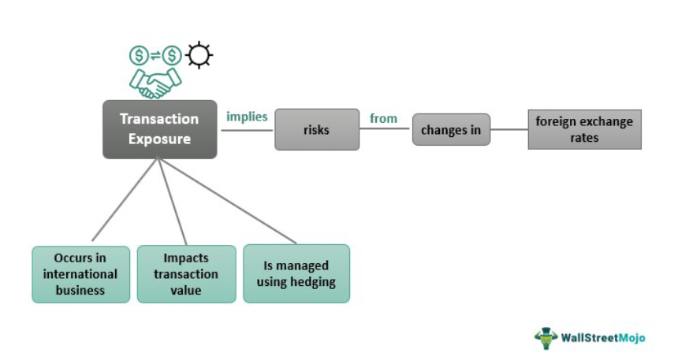

In the world of international finance, managing risks associated with currency exchange is crucial. Transaction exposure refers to the uncertainty that companies face due to fluctuating exchange rates, which can significantly impact financial transactions. These fluctuations can affect the value of cash flows, revenues, and costs related to international transactions, creating unpredictability for businesses engaged in global trade. The importance of understanding and addressing transaction exposure lies in its potential to unexpectedly alter a company's financial position, thereby impacting profitability and competitive standing.

This article explores the concept of transaction exposure, reviews various hedging strategies, and examines the role of algorithmic trading in managing these risks. Transaction exposure occurs when a company's cash flows are influenced by changes in foreign exchange rates between the time a financial deal is made and when it is settled. For businesses operating across borders, these fluctuations can transform expected gains into losses or vice-versa, affecting both short-term and long-term financial outcomes.



Safeguarding against potential financial losses requires a thorough grasp of risk management strategies, including the use of financial instruments and trading methodologies. By integrating effective hedging strategies, businesses can harness the power of algorithmic trading to mitigate risks and ensure financial stability. These approaches not only protect against adverse currency movements but also provide an opportunity to exploit favorable trends, thereby enhancing the financial resilience of enterprises operating in volatile global markets.

## Table of Contents

## Understanding Transaction Exposure

Transaction exposure refers to the risk that fluctuating currency exchange rates pose to financial transactions between the time an obligation is initiated and the time it is settled. Companies engaged in international trade are particularly vulnerable to this form of exposure, given the inherent volatility of foreign exchange rates. This volatility can impose significant capital risks if not effectively mitigated.

For instance, consider a company based in the United States that commits to buying goods priced in euros with payment scheduled three months later. If the euro appreciates against the dollar during this period, the company will face a higher cost when fulfilling its payment obligation, thus incurring a capital loss. The unpredictability of exchange rates stems from various factors, including economic indicators, geopolitical events, and market sentiments, which can result in unfavorable economic conditions for businesses.

Identifying the entities affected by transaction exposure is crucial. These primarily include businesses that either sell products to or purchase goods from foreign markets, where transactions occur in currencies other than their home currency. Such businesses face potential exchange rate losses and must strategically manage this risk to maintain financial stability.

Understanding the intricacies of transaction exposure is fundamental for developing effective risk management strategies. Businesses can utilize tools such as forward contracts, options, and swaps to hedge against currency risk, locking in exchange rates to avoid future losses. Furthermore, maintaining a keen awareness of the factors influencing currency markets and employing robust risk assessment frameworks can provide businesses with the necessary insights to protect their financial interests.

## Hedging Strategies for Managing Transaction Exposure

Hedging strategies serve as crucial financial tools for companies aiming to mitigate risks associated with transaction exposure due to fluctuating currency exchange rates. These strategies are diverse and can be tailored to suit the specific needs of a business, enabling them to safeguard against potential financial losses.

One prevalent hedging method involves the use of currency swaps and futures contracts. By locking in exchange rates for a predetermined period, these financial instruments help minimize the impact of unfavorable rate fluctuations. For instance, a business expecting to receive a foreign currency payment in the future can enter into a futures contract to lock in a current exchange rate, thus securing against adverse movements in the currency value. This approach is particularly useful when exchange rate movements could negatively impact cost structures or profit margins.

An alternative strategy is for companies to request that payments be made in their home currency. In doing so, the company effectively transfers the risk of currency exchange rate fluctuations to the client. This can be especially beneficial for businesses with significant market power or in transactions where the counterpart is willing to assume the exchange risk.

Asset-hedging offers another robust approach by allowing firms to offset currency risks through investments in other assets, effectively forming a synthetic hedge. For instance, a company with foreign currency exposure might invest in foreign-denominated bonds or equities, thus balancing potential losses from currency exposure with gains from asset appreciation.

By leveraging these strategies, businesses engaged in international trade can significantly reduce the financial uncertainties posed by transaction exposure. Moreover, adapting hedging techniques to fit the company's specific risk profile and trade dynamics is essential for optimizing the protection against currency risk.

## Algorithmic Trading and Its Role in Hedging

Algorithmic trading leverages sophisticated algorithms for executing trading decisions, thereby enhancing the ability to manage financial risks efficiently. These algorithms are adept at processing vast amounts of data to identify patterns and market inefficiencies, facilitating a proactive approach to risk management in trading scenarios.

An essential feature of [algorithmic trading](/wiki/algorithmic-trading) is its capacity to integrate hedging techniques. For instance, stop-loss orders allow traders to set predetermined [exit](/wiki/exit-strategy) points to limit losses, effectively safeguarding capital against adverse market movements. Similarly, the use of diversified portfolios helps in spreading risk across various assets, minimizing the [volatility](/wiki/volatility-trading-strategies) associated with any single investment. This diversification is particularly beneficial in scenarios where transaction exposure due to currency fluctuations might otherwise lead to substantial financial losses.

Automated trading platforms further amplify the benefits of algorithmic trading by enhancing adaptability to swiftly changing market conditions. These platforms can recalibrate trading strategies in real-time, responding dynamically to new market information and thus maintaining alignment with strategic hedging goals. Through such automation, businesses can continually adjust their hedging positions, ensuring optimal protection against transaction exposure.

By incorporating algorithmic trading within their hedging strategies, companies gain an automated and efficient mechanism for managing transaction exposure. This approach not only optimizes financial outcomes by securing favorable exchange rates but also preserves capital through meticulous risk management. The integration of algorithmic trading into these strategies thus represents a significant advancement in the ability to mitigate currency-related financial risks in global markets.

## Case Studies and Examples

Examining real-world examples highlights the effectiveness of hedging strategies in managing transaction exposure. Consider a U.S. company engaged in purchasing goods from Europe. In this scenario, the company faces potential financial risk due to currency exchange fluctuations, specifically if the euro appreciates against the dollar. This appreciation would result in increased expenses for the U.S. company, as it would require more dollars to purchase the same amount of goods denominated in euros.

To mitigate this risk, the company can employ futures contracts, which allow them to lock in an exchange rate at the time the contract is executed. By doing this, the company effectively secures a stable conversion rate for future transactions, thereby minimizing the impact of potential currency appreciation. For instance, if the company expects to purchase goods worth €100,000 in three months and the current exchange rate is 1.15 USD/EUR, it can enter into a futures contract at that rate. This ensures that even if the euro's value increases, the cost in dollars stays fixed, preserving the company's budget and reducing uncertainty.

Another illustrative example involves a multinational corporation that employs algorithmic trading to manage its international portfolio. As businesses engage globally, they encounter diversified currency exposures through cross-border transactions and investments. Algorithmic trading offers a strategic approach by automating trading decisions based on predefined risk management criteria and market conditions.

Through algorithmic trading, corporations can implement techniques such as stop-loss orders and maintain diversified portfolios. These techniques are designed to minimize volatility and preserve capital by dynamically adjusting investment positions in response to real-time market changes. For example, using Python, a company could utilize a trading algorithm to analyze historical data, predict currency trends, and execute trades to hedge against unfavorable exchange rate movements:

```python
import pandas as pd
from sklearn.linear_model import LinearRegression

# Load historical exchange rate data
data = pd.read_csv("exchange_rates.csv")

# Define features and target variable
X = data[['Interest Rate', 'GDP Growth', 'Inflation']]
y = data['USD/EUR']

# Train a linear regression model
model = LinearRegression()
model.fit(X, y)

# Predict future exchange rates
future_data = pd.DataFrame({'Interest Rate': [1.5], 'GDP Growth': [2.0], 'Inflation': [1.0]})
predicted_rate = model.predict(future_data)

# Decision making based on prediction
if predicted_rate[0] > 1.2:
    print("Hedge position to protect against appreciation")
else:
    print("No immediate hedging required")
```

These case studies illustrate how hedging strategies, complemented by algorithmic trading, can effectively manage financial risks associated with currency fluctuations in global markets. By leveraging both forward-looking financial instruments and advanced trading algorithms, businesses can enhance their risk management practices and ensure their financial stability amidst volatile exchange rates.

## Conclusion

Effective management of transaction exposure is essential for businesses operating in international markets. Hedging strategies, backed by algorithmic trading, provide robust solutions to mitigate risks associated with currency exchange rates. By implementing these strategies, companies can secure stable exchange rates, preserving capital and ensuring financial stability during volatile market conditions.

The integration of algorithmic trading within hedging strategies enhances the ability to manage risks dynamically. Algorithms can quickly analyze vast amounts of financial data, identify patterns, and adapt to market changes, allowing businesses to maintain a competitive edge. These algorithms execute trades rapidly and efficiently, ensuring optimal outcomes by minimizing the reaction time to market fluctuations.

Proactive risk management and technological integration are vital for navigating the complexities of global financial markets. Businesses that prioritize these elements can better handle unpredictability and protect themselves from adverse movements in exchange rates. This strategic foresight not only helps in safeguarding financial health but also in achieving more predictable and stable financial outcomes.

As global markets continue evolving, the adoption of innovative strategies like algorithmic trading will become increasingly important. The capability to automate and refine trading decisions enables businesses to stay ahead in terms of competitiveness while simultaneously mitigating risks. Ensuring financial resilience against currency fluctuations is critical, and effective hedging strategies, supported by cutting-edge technology, are key to this resilience.

## References & Further Reading

[1]: Shapiro, A.C., & Moles, P. (2014). ["International Financial Management."](https://archive.org/details/internationalfin0000shap) Wiley.

[2]: Eun, C.S., & Resnick, B.G. (2017). ["International Financial Management."](https://www.amazon.com/International-Financial-Management-Cheol-Eun/dp/0077861604) McGraw-Hill Education.

[3]: Hull, J.C. (2018). ["Options, Futures, and Other Derivatives."](https://www.semanticscholar.org/paper/Options%2C-Futures%2C-and-Other-Derivatives-Hull/89bdee500c8623864fc9eb7a471546aa713acc44) Pearson.

[4]: Madura, J. (2018). ["International Financial Management."](https://www.cengage.com/c/international-financial-management-14e-madura/9780357130544/?searchIsbn=9780357130544) Cengage Learning.

[5]: Ramaswamy, S., & Sleeman, J. (1996). ["Derivatives and International Portfolio Management."](https://archive.org/details/designmanagement0000rama) The Journal of Portfolio Management.