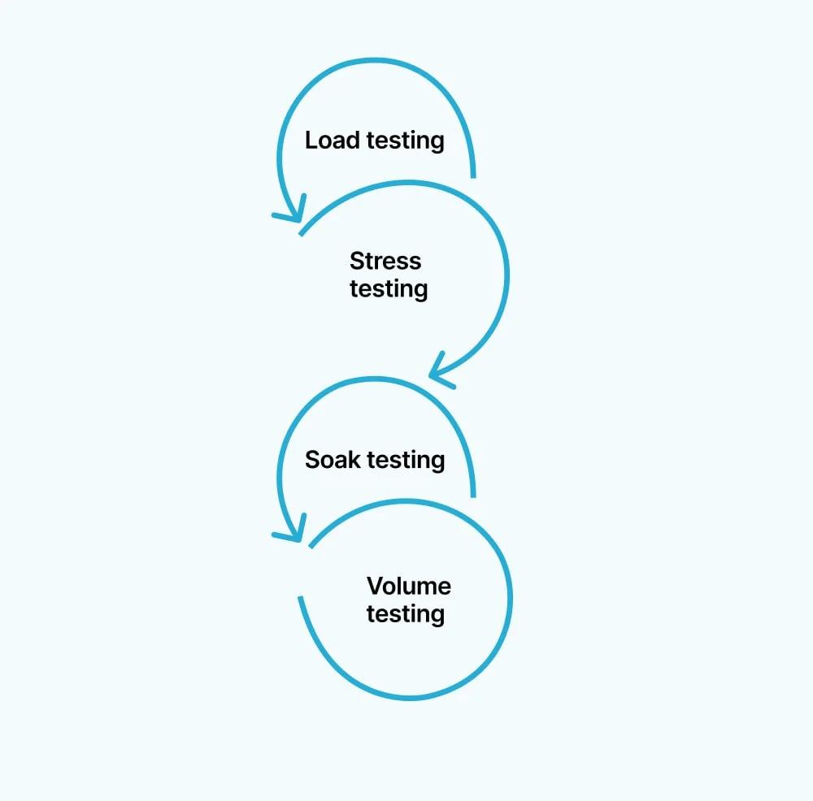

## Table of Contents

## What is transaction flow analysis?

Transaction flow analysis is a way to study how money or goods move from one place to another in a business or system. It helps people understand the path that transactions take, from the start to the end. By looking at this flow, businesses can see where things might be going wrong, like delays or bottlenecks, and fix them to make things work better.

This type of analysis is useful in many areas, like banking, where it can help track money movements to prevent fraud, or in supply chains, where it can show how products move from factories to stores. By understanding the flow, companies can make their processes smoother, save time, and cut costs. It's like drawing a map of the journey that transactions take, which helps in making smart decisions to improve the system.

## Why is transaction flow analysis important in business?

Transaction flow analysis is important in business because it helps companies see how money and goods move through their operations. By understanding this flow, businesses can spot problems like delays or mistakes that slow things down. For example, if a company sees that it takes too long for goods to move from the warehouse to the store, they can fix the issue to make the process faster. This not only saves time but also helps the business run more smoothly and efficiently.

Moreover, transaction flow analysis can help businesses save money. By looking at the flow, companies can find areas where they are spending too much or where they can cut costs. For instance, if a business notices that they are paying too much for shipping because of inefficient routes, they can change their approach to save money. This analysis also helps in planning for the future, as businesses can use the information to make better decisions about where to invest or how to grow. Overall, understanding transaction flow is key to making a business work better and be more profitable.

## What are the basic steps involved in conducting a transaction flow analysis?

To start a transaction flow analysis, you first need to gather all the information about the transactions. This means looking at records like invoices, receipts, and bank statements to see where money or goods are coming from and going to. You also need to talk to people in the business who handle these transactions, like the sales team or the warehouse staff, to understand their part in the process. Once you have all this information, you can start mapping out the flow. This means drawing a diagram or chart that shows the path of each transaction from start to finish.

After you have your map, the next step is to analyze it. Look for any places where the flow gets stuck or slowed down. These could be bottlenecks, like a step in the process that takes too long, or errors, like mistakes in recording transactions. Once you find these problems, you can think about ways to fix them. This might mean changing how things are done, like speeding up a slow step or training staff to avoid mistakes. By making these changes, you can make the transaction flow smoother and more efficient.

## How does transaction flow analysis differ from other types of financial analysis?

Transaction flow analysis is different from other types of financial analysis because it focuses on the path that money or goods take through a business. While other financial analyses, like profit and loss statements or balance sheets, look at the overall financial health of a company, transaction flow analysis zooms in on the specific steps of each transaction. It's like looking at a map of a journey instead of just knowing the start and end points. This helps businesses see where things might be going wrong, like delays or mistakes, and fix them to make the process smoother.

Another way transaction flow analysis differs is that it's more about the process than the numbers. For example, a cash flow analysis might tell you how much money is coming in and going out, but it won't show you the exact route that money takes. Transaction flow analysis, on the other hand, can show you every step, from when a customer places an order to when the payment is received and recorded. This detailed view helps businesses understand their operations better and make changes to improve efficiency and cut costs.

## What tools and software are commonly used for transaction flow analysis?

For transaction flow analysis, businesses often use special software that helps them see how money and goods move through their operations. One popular tool is business process management (BPM) software, like UiPath or Pega. These programs let you draw diagrams of your transaction flows, making it easy to spot where things might be going wrong. Another common tool is enterprise resource planning (ERP) systems, like SAP or Oracle, which track transactions across different parts of a business and can show you the whole journey of a transaction from start to finish.

There are also simpler tools that can help with transaction flow analysis. Spreadsheet software like Microsoft Excel or Google Sheets is often used because it's easy to use and many people already know how to work with it. You can set up tables and charts to track transactions and see where they go. For more detailed analysis, some businesses use data visualization tools like Tableau or Power BI. These tools can turn your transaction data into easy-to-understand graphs and charts, helping you see the flow of transactions at a glance and find any problems quickly.

## Can you explain the role of data visualization in transaction flow analysis?

Data visualization plays a big role in transaction flow analysis because it makes it easier to see and understand how money or goods move through a business. Instead of looking at long lists of numbers and records, you can use charts, graphs, and diagrams to see the whole journey of a transaction at a glance. This helps you spot any problems or bottlenecks quickly. For example, if you see a part of the flow that's all tangled up or takes a long time, you know that's an area where you need to make changes to speed things up.

Using data visualization tools like Tableau or Power BI can really help with this. These tools take all the data you have about transactions and turn it into pictures that are easy to understand. This way, everyone in the business, from the managers to the staff, can see what's going on and understand where improvements need to be made. It's like having a map that guides you to make your business run smoother and more efficiently.

## What are some common challenges faced when performing transaction flow analysis?

One common challenge when doing transaction flow analysis is getting all the right information. Sometimes, the data about transactions is spread out in different places, like in different computer systems or on paper records. This can make it hard to see the whole picture of how money or goods move through the business. Also, the data might not be correct or up to date, which can lead to wrong conclusions about where problems are happening.

Another challenge is understanding the complex steps in the transaction process. In big businesses, transactions can go through many different departments and people, making the flow hard to follow. It can be tough to figure out where things are getting stuck or where mistakes are happening. This is why it's important to talk to the people who work with these transactions every day, to get their insights on what's going on.

Lastly, making changes based on what you find can be difficult. Even if you spot a problem in the transaction flow, fixing it might mean changing how people work or using new technology. This can take time and money, and sometimes people might not want to change the way they do things. It's important to explain why the changes are needed and how they will help the business run better.

## How can transaction flow analysis help in detecting fraud?

Transaction flow analysis can help in detecting fraud by showing the path that money takes through a business. By looking at this path, you can see if there are any strange or unusual movements of money. For example, if money is going to places it shouldn't, like to unknown accounts or in amounts that don't make sense, it could be a sign of fraud. This analysis helps you spot these odd patterns that might be hard to see if you just look at numbers on a page.

Once you find these strange patterns, you can look into them more closely. You might need to check the records or talk to the people involved to see if there's a good reason for the unusual transactions. If there isn't, it could mean someone is trying to steal money or hide something. By using transaction flow analysis, businesses can catch these problems early and stop fraud before it causes too much damage.

## What advanced techniques can be applied to enhance transaction flow analysis?

One advanced technique to enhance transaction flow analysis is using [machine learning](/wiki/machine-learning). Machine learning can look at a lot of transaction data and find patterns that might be hard for people to see. It can learn what normal transactions look like and then spot any that are different or strange. This can help find fraud or other problems faster. For example, if a machine learning model sees that money is moving in a way that's not usual, it can alert the business to check it out. This makes the analysis more accurate and helps businesses react quickly to any issues.

Another technique is using real-time data analysis. Instead of looking at transactions after they happen, real-time analysis looks at them as they are happening. This means businesses can see problems right away and fix them before they get worse. For example, if a transaction is taking too long or going to the wrong place, the business can stop it and fix it right away. Real-time analysis can also help with making quick decisions, like changing how things are done to make the flow smoother. By using these advanced techniques, businesses can make their transaction flow analysis even better and keep their operations running smoothly.

## How does transaction flow analysis integrate with other business intelligence systems?

Transaction flow analysis works well with other business intelligence systems because it helps fill in the gaps that other systems might miss. For example, a business intelligence system might tell you how much money you made last month, but it won't show you the exact path that money took to get there. By using transaction flow analysis alongside these systems, you can see the whole journey of each transaction. This means you can understand not just the end results, but also how those results were achieved. This integration helps businesses make better decisions because they have a clearer picture of their operations.

When you combine transaction flow analysis with other business intelligence tools, like data visualization or reporting systems, you get a more complete view of your business. For instance, you can use data visualization to turn the flow of transactions into easy-to-understand charts and graphs. This makes it easier to spot problems and share the information with others in the company. Also, by feeding the results of transaction flow analysis into reporting systems, you can create detailed reports that show not just the financial outcomes, but also the processes that led to those outcomes. This helps everyone in the business understand what's happening and how to improve things.

## What are the best practices for maintaining data integrity in transaction flow analysis?

Keeping data correct and reliable is really important when you're doing transaction flow analysis. One good way to do this is by making sure everyone in the business follows the same rules for recording transactions. This means having clear instructions on how to enter data, and checking it often to make sure it's right. It's also a good idea to use systems that automatically check for mistakes, like if someone enters a number that's too big or too small. This helps catch errors before they cause problems.

Another important thing is to keep the data safe and secure. This means using strong passwords and making sure only the right people can see the data. It's also good to back up the data regularly, so if something goes wrong, you can still get it back. By keeping the data safe and correct, you can trust the results of your transaction flow analysis and make better decisions for your business.

## How can predictive analytics be used to improve the outcomes of transaction flow analysis?

Predictive analytics can help make transaction flow analysis better by looking at past data to guess what might happen next. It uses special math and computer programs to find patterns in how money or goods move through a business. By understanding these patterns, businesses can see where problems might come up before they happen. For example, if predictive analytics sees that a certain step in the transaction process often gets slow at certain times of the year, the business can get ready for it and fix it before it causes trouble.

Using predictive analytics with transaction flow analysis also helps businesses plan better for the future. They can use the guesses from predictive analytics to make smart choices about where to spend money or how to change their processes. This means they can make things run smoother and save money. By combining these two tools, businesses can not only fix problems as they happen but also stop them from happening in the first place, making everything work better.

## References & Further Reading

[1]: Lopez de Prado, M. (2018). ["Advances in Financial Machine Learning"](https://www.amazon.com/Advances-Financial-Machine-Learning-Marcos/dp/1119482089) Wiley.

[2]: Jansen, S. (2020). ["Machine Learning for Algorithmic Trading: Predictive models to extract signals from market and alternative data for systematic trading strategies with Python"](https://github.com/stefan-jansen/machine-learning-for-trading) Packt Publishing.

[3]: Chan, E. P. (2008). ["Quantitative Trading: How to Build Your Own Algorithmic Trading Business"](https://github.com/egorpe/EPChan-QuantitativeTrading/blob/master/example7_6.m) Wiley.

[4]: Aronson, D. R. (2006). ["Evidence-Based Technical Analysis: Applying the Scientific Method and Statistical Inference to Trading Signals"](https://www.amazon.com/Evidence-Based-Technical-Analysis-Scientific-Statistical/dp/0470008741) Wiley.

[5]: Hasbrouck, J. (2007). ["Empirical Market Microstructure: The Institutions, Economics, and Econometrics of Securities Trading"](https://academic.oup.com/book/52241) Oxford University Press.

[6]: Aldridge, I. (2013). ["High-Frequency Trading: A Practical Guide to Algorithmic Strategies and Trading Systems"](https://onlinelibrary.wiley.com/doi/pdf/10.1002/9781119203803.fmatter) Wiley.

[7]: Kissell, R. (2013). ["The Science of Algorithmic Trading and Portfolio Management"](https://www.sciencedirect.com/book/9780124016897/the-science-of-algorithmic-trading-and-portfolio-management) Academic Press.

[8]: Easley, D., López de Prado, M. M., & O'Hara, M. (2013). ["High-Frequency Trading: New Realities for Traders, Markets, and Regulators"](https://www.jstor.org/stable/41485533) Risk Books.