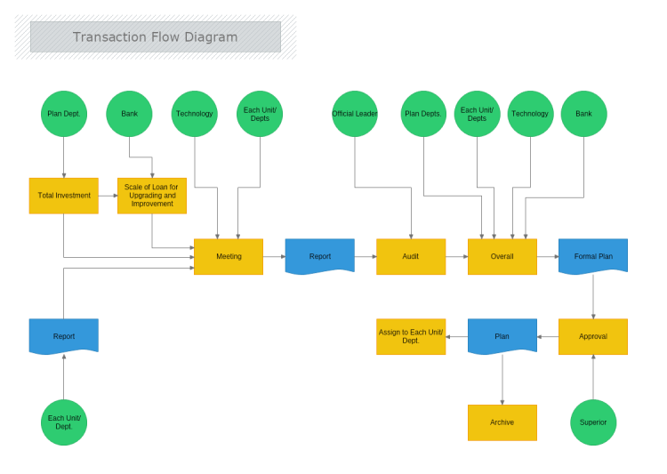

Algorithmic trading has significantly changed the landscape of financial markets by automating the execution of trades, thereby introducing efficiency and speed. As algorithmic processes become more sophisticated, the demand for robust analytical tools capable of dissecting transaction flows has intensified. Transaction flow analysis has thus emerged as an essential component for enhancing the efficiency and effectiveness of these trading systems.

Transaction flow analysis is pivotal in comprehending and improving algorithmic trading systems. It involves examining the movement and interaction of trade orders to understand market behaviors and price formation mechanisms better. This comprehensive analysis is crucial for developing efficient trading strategies, as it provides insights into market dynamics and identifies inefficiencies and opportunities within the trading environment.



This article aims to provide a detailed exploration of transaction flow analysis within the context of algorithmic trading. The focus will be on its core components, which include order routing, execution venues, order types, execution algorithms, and market microstructure. Understanding these elements is integral to executing trades with minimal market impact and maximizing returns.

Analytical techniques employed in transaction flow analysis, such as data collection, visualization tools, statistical methods, and machine learning applications, play a significant role in offering traders a competitive edge. By leveraging these techniques, traders can gain deeper insights, optimize their operations, and ensure regulatory compliance.

The article further includes future trends and case studies to demonstrate practical applications. The integration of artificial intelligence and machine learning, along with innovations like blockchain and quantum computing, is anticipated to shape the evolution of transaction flow analysis, providing traders with more sophisticated tools for precise insight generation.

In conclusion, transaction flow analysis is a foundational element in modern financial markets, providing critical insights into market dynamics and enhancing trading efficiency. As technology continues to advance, transaction flow analysis will evolve, enabling more strategic and informed trading decisions.

## Table of Contents

## The Importance of Transaction Flow Analysis in Algo Trading

Transaction flow analysis is a pivotal aspect of [algorithmic trading](/wiki/algorithmic-trading), furnishing traders with a significant competitive advantage. By comprehending the movement and interaction of orders, traders can fine-tune their strategies and optimize transaction execution. This understanding is crucial for developing trading strategies that are not only effective but also comply with complex financial regulations. Through the meticulous analysis of transaction flows, traders can gain insights into patterns and anomalies that may indicate potential fraudulent activities, thereby safeguarding trading operations.

In the fast-paced environment of real-time trading, the ability to continuously improve and adapt strategies is vital. Transaction flow analysis facilitates this by offering a clear view of market dynamics and the efficacy of current trading strategies. By integrating transaction flow analysis, traders can enhance operational efficiencies and optimize the execution of trades, leading to more informed and timely decision-making processes.

Moreover, transaction flow analysis plays a critical role in identifying inefficiencies within trading operations. By analyzing the granular details of each transaction, traders can pinpoint areas for improvement in their algorithms and order execution methods. This optimization process is essential not only for achieving better trade performance but also for ensuring that trading practices remain within regulatory boundaries, minimizing the risk of non-compliance penalties.

In summary, transaction flow analysis is essential in algorithmic trading, providing the insights necessary for developing robust trading strategies, ensuring regulatory compliance, detecting fraudulent activities, and optimizing decision-making processes in real-time trading environments.

## Core Components of Transaction Flow Analysis

Transaction flow analysis is pivotal in optimizing algorithmic trading, and it involves several core components that contribute to its effective implementation:

**Order Routing:** This involves directing trade orders to the most appropriate trading venues to ensure optimal execution. The routing process considers factors such as transaction cost, latency, liquidity, and the specific attributes of different execution venues. Advanced order routing systems leverage algorithms that dynamically assess these factors in real time, aiming to minimize costs and enhance execution quality. For instance, smart order routers are designed to split large orders into smaller parts, routing them to a mix of venues to achieve better pricing and reduce market impact.

**Execution Venues:** Various trading platforms serve as execution venues, each with distinct characteristics. Stock exchanges and dark pools are prominent examples. Stock exchanges like the New York Stock Exchange (NYSE) are public venues where trades are executed transparently, offering liquidity and price discovery. Dark pools, on the other hand, are private venues where orders are not displayed publicly, providing anonymity and potentially reduced market impact, especially for large trades. Understanding the pros and cons of these venues allows traders to select the optimal platform for their transaction needs.

**Order Types and Execution Algorithms:** A variety of order types and execution algorithms are available to execute trades efficiently. Common order types include market orders, limit orders, and stop orders, each serving different strategic objectives. Execution algorithms, such as Volume-Weighted Average Price (VWAP) and Time-Weighted Average Price (TWAP), are employed to optimize trade execution. These algorithms systematically manage order placement over time, considering factors like market conditions and trading volume to minimize impact and achieve desired trade outcomes.

**Market Microstructure:** Market microstructure analyzes the fine details of how trades are executed, focusing on elements like order book depth and bid-ask spreads. Order books display the buy and sell orders at different price levels, providing insights into market demand and supply. Analyzing the depth and changes in the order book enables traders to anticipate price movements and measure market impact. Understanding market microstructure aids in designing better trading strategies to navigate volatile environments effectively.

**Latency Analysis:** In high-frequency trading scenarios, where trades are executed within milliseconds, latency becomes a crucial factor. Latency analysis involves measuring the time delay between order placement and execution. Reducing latency is critical for maintaining competitive advantages, as even microsecond delays can lead to missed opportunities or adverse price movements. Techniques to minimize latency include optimizing network infrastructures, using co-location services to place trading servers near exchange data centers, and employing low-latency programming languages for algorithm implementation.

By understanding these core components, traders can enhance their algorithmic strategies, resulting in reduced costs, improved execution quality, and greater overall efficiency in the trading process.

## Analytical Techniques in Transaction Flow Analysis

Transaction flow analysis in algorithmic trading relies heavily on advanced analytical techniques to capture, interpret, and utilize the myriad of data generated during trading activities. A fundamental aspect of this analysis is data collection and preprocessing, which involves extracting pertinent information from order [books](/wiki/algo-trading-books) and market data feeds. This raw data encompasses price levels, trade volumes, and timestamps, which are crucial for any subsequent analysis. The preprocessing step ensures that the data is cleansed, normalized, and synchronized, allowing for accurate and meaningful analysis.

Visualization tools are integral to transaction flow analysis, providing traders and analysts with the means to comprehend complex data through illustrative visual representations. Heat maps and flow diagrams are particularly effective in tracing transaction paths and spotting patterns or anomalies that may indicate trading opportunities or risks. For instance, a heat map can highlight periods of intense trading activity, while a flow diagram can graphically depict the trajectory of orders through different market venues.

Statistical methods form the backbone of transaction flow analysis by quantifying relationships and trends within the data. Techniques such as descriptive [statistics](/wiki/bayesian-statistics) provide summaries of data characteristics, while regression analysis is employed to model and predict relationships between variables, such as the impact of certain order types on execution quality. The application of these methods facilitates the identification of trends, correlations, and anomalies within trading activities.

Incorporating [machine learning](/wiki/machine-learning) applications into transaction flow analysis represents a significant advancement, enabling the prediction of market trends and the detection of anomalies with greater precision. Machine learning models can be trained to recognize complex patterns within large datasets, offering predictive insights that traditional techniques may not capture. For example, algorithms can be developed to predict price movements based on historical transaction data, or to identify unusual trading patterns that may suggest market manipulation. 

Here is a sample Python code snippet using a simple machine learning model to predict future stock prices based on historical transaction data:

```python
import pandas as pd
from sklearn.model_selection import train_test_split
from sklearn.linear_model import LinearRegression
from sklearn.metrics import mean_squared_error

# Load historical transaction data
data = pd.read_csv('transaction_data.csv')
features = data[['price', 'volume', 'order_type']]  # Features
target = data['future_price']  # Target variable

# Split the data into training and testing sets
X_train, X_test, y_train, y_test = train_test_split(features, target, test_size=0.2, random_state=42)

# Train a linear regression model
model = LinearRegression()
model.fit(X_train, y_train)

# Predict future prices
predictions = model.predict(X_test)

# Evaluate the model
mse = mean_squared_error(y_test, predictions)
print(f'Mean Squared Error: {mse}')
```

In conclusion, analytical techniques in transaction flow analysis harness the power of data collection, visualization, statistical methods, and machine learning to enhance our understanding of market dynamics, enabling traders to make informed and strategic decisions.

## Case Studies and Practical Applications

Institutional trading has greatly benefited from transaction flow analysis, which enhances algorithmic strategies and execution performance. By monitoring the movement and interaction of large orders across various trading venues, institutions can refine their strategies for optimal execution. This involves analyzing the order routing process, assessing the performance of execution algorithms, and minimizing market impact. Such analysis aids in the identification of patterns that can lead to more effective order placement and timing, improving execution quality and reducing transaction costs.

For retail trading platforms, transaction flow analysis provides critical insights that improve decision-making processes. Retail platforms leverage this information to enhance the quality of execution offered to individual traders. By utilizing transaction flow data, these platforms can optimize their order matching engines and provide real-time insights to traders. Enhanced visualization tools, such as transaction heat maps, allow retail traders to better understand market dynamics and make more informed trading decisions.

In the context of regulatory compliance, transaction flow analysis serves a crucial role in generating comprehensive reports necessary for accurate regulatory submissions. Financial institutions and trading venues are required to maintain transparent records of trading activities. Transaction flow analysis facilitates the collection, organization, and presentation of these records. By employing data analytics and visualization techniques, organizations can prepare detailed compliance reports that fulfill regulatory requirements, thus ensuring the integrity and transparency of trading practices. 

Overall, transaction flow analysis proves essential across different trading environments. Its application not only bolsters strategy and execution for institutional traders but also enhances the trading experience for retail participants while ensuring adherence to regulatory standards.

## Future Trends in Transaction Flow Analysis

The evolution of transaction flow analysis in algorithmic trading is significantly influenced by emerging technologies. Prominent among these are [artificial intelligence](/wiki/ai-artificial-intelligence) (AI) and machine learning, which offer the potential to develop more sophisticated analysis tools. These technologies enable precise insights by processing large datasets, identifying patterns, and predicting market trends with higher accuracy. Machine learning models, particularly those utilizing [deep learning](/wiki/deep-learning) and [reinforcement learning](/wiki/reinforcement-learning), can analyze historical transaction data to improve the predictive accuracy of market movements and identify optimal trading strategies.

Blockchain and distributed ledger technology (DLT) present another promising trend. These technologies provide enhanced transparency and immutability for transaction records, which is crucial for auditing and compliance purposes. By recording every transaction on a decentralized ledger, blockchain technology can help ensure the integrity of market data and reduce the probability of fraudulent activities. This transparency can also be beneficial for regulatory reporting, providing a clear and irrefutable trail of transactions.

Quantum computing stands as a potential game-changer in transaction flow analysis by offering advancements in processing complex datasets at unprecedented speeds. Quantum algorithms, such as Shor's algorithm for factoring integers, could potentially decrypt transactions and analyze large volumes of transaction data exponentially faster than classical algorithms. This capability could revolutionize the identification of [arbitrage](/wiki/arbitrage) opportunities and the execution of high-frequency trading strategies by minimizing latency and improving decision-making speed.

Overall, these future trends demonstrate how technological advancements continue to shape transaction flow analysis, paving the way for more strategic and efficient trading practices. As these technologies mature, their integration into transaction flow analysis could redefine the competitive landscape of algorithmic trading.

## Conclusion

Transaction flow analysis is pivotal in contemporary financial markets, providing essential insights into market dynamics and enhancing trading efficiencies. The comprehensive evaluation of transaction flows enables traders to decode complex market structures and optimize their trading strategies. By employing advanced analytical techniques, such as statistical analysis and machine learning, traders can refine their strategy formulation and execution, leading to improved outcomes in automated trading environments. 

As technological advancements continue to progress, transaction flow analysis is set to expand further, facilitating more strategic and informed trading decisions. The integration of artificial intelligence and big data analytics will usher in a new era of precision in market predictions and anomaly detection. The continual evolution of these analytical tools promises to provide traders with unparalleled insights, driving the future of algorithmic trading towards increased accuracy and profitability.

## References & Further Reading

[1]: Lopez de Prado, M. (2018). ["Advances in Financial Machine Learning"](https://www.amazon.com/Advances-Financial-Machine-Learning-Marcos/dp/1119482089) Wiley.

[2]: Jansen, S. (2020). ["Machine Learning for Algorithmic Trading: Predictive models to extract signals from market and alternative data for systematic trading strategies with Python"](https://github.com/stefan-jansen/machine-learning-for-trading) Packt Publishing.

[3]: Chan, E. P. (2008). ["Quantitative Trading: How to Build Your Own Algorithmic Trading Business"](https://github.com/egorpe/EPChan-QuantitativeTrading/blob/master/example7_6.m) Wiley.

[4]: Aronson, D. R. (2006). ["Evidence-Based Technical Analysis: Applying the Scientific Method and Statistical Inference to Trading Signals"](https://www.amazon.com/Evidence-Based-Technical-Analysis-Scientific-Statistical/dp/0470008741) Wiley.

[5]: Hasbrouck, J. (2007). ["Empirical Market Microstructure: The Institutions, Economics, and Econometrics of Securities Trading"](https://academic.oup.com/book/52241) Oxford University Press.

[6]: Aldridge, I. (2013). ["High-Frequency Trading: A Practical Guide to Algorithmic Strategies and Trading Systems"](https://onlinelibrary.wiley.com/doi/pdf/10.1002/9781119203803.fmatter) Wiley.

[7]: Kissell, R. (2013). ["The Science of Algorithmic Trading and Portfolio Management"](https://www.sciencedirect.com/book/9780124016897/the-science-of-algorithmic-trading-and-portfolio-management) Academic Press.

[8]: Easley, D., López de Prado, M. M., & O'Hara, M. (2013). ["High-Frequency Trading: New Realities for Traders, Markets, and Regulators"](https://www.jstor.org/stable/41485533) Risk Books.