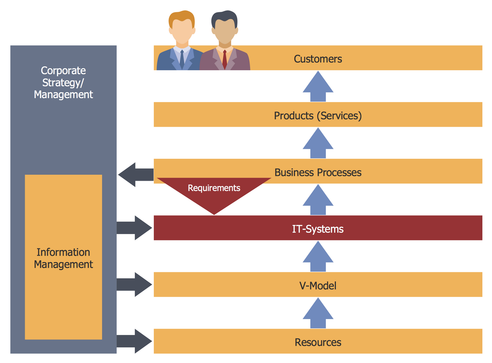

## Table of Contents

## What is transaction flow?

Transaction flow is the path that a transaction takes from start to finish. It includes all the steps and processes that happen when someone buys something or makes a payment. For example, when you buy a toy online, the transaction flow starts when you add the toy to your cart and ends when you get the toy at your home. It involves steps like choosing the toy, entering your payment details, the payment being processed, and the toy being shipped to you.

Understanding transaction flow is important for businesses because it helps them see where things might go wrong or where they can make things better. If a lot of people are leaving their website before they finish buying something, the business might need to make the buying process easier. By looking at the transaction flow, businesses can find problems and fix them, making sure customers have a good experience and come back to buy more things.

## Why is optimizing transaction flow important?

Optimizing transaction flow is important because it makes the buying process easier and faster for customers. When the steps from choosing a product to getting it are smooth, customers are happier and more likely to buy things again. If the process is too hard or takes too long, customers might get frustrated and leave without buying anything. By making the transaction flow better, businesses can keep more customers and make more sales.

Also, a good transaction flow can help businesses save money. When things run smoothly, there are fewer mistakes and less need for extra work to fix problems. This means businesses can spend less time and money on dealing with issues like wrong orders or payment problems. In the end, optimizing transaction flow helps businesses work better, save money, and make their customers happier.

## What are the basic components of a transaction flow?

The basic components of a transaction flow start with the customer choosing what they want to buy. This could be [picking](/wiki/asset-class-picking) a product from a website or a store. After choosing, the customer needs to enter their payment details, like using a credit card or a digital wallet. This step is important because it's how the business gets paid for the product.

Once the payment is made, the next part of the transaction flow is processing the payment. This means the business checks if the payment is okay and then tells the customer that the order is confirmed. After that, the product needs to be sent to the customer. This could mean shipping it from a warehouse or handing it to the customer in a store. The last part is the customer getting the product and being happy with it. If everything goes well, the customer might come back to buy more things in the future.

## How can bottlenecks in transaction flow be identified?

Bottlenecks in transaction flow can be found by looking at where things slow down or stop. Businesses can use tools like tracking software to see how long each step takes. If one part, like entering payment details, takes much longer than others, that might be a bottleneck. Also, businesses can ask customers for feedback. If a lot of people say they had trouble with a certain step, like waiting too long for their order to be confirmed, that's a sign of a bottleneck.

Once a bottleneck is spotted, businesses can look closer to find out why it's happening. Maybe the website is too slow, or the payment system is not working well. Sometimes, it could be that there are too many steps, making the process confusing for customers. By fixing these problems, like making the website faster or simplifying the steps, businesses can make the transaction flow smoother and keep customers happy.

## What are common strategies for improving transaction flow?

One common way to make transaction flow better is by making the buying process easier. This can mean having fewer steps for customers to go through or making the website easier to use. For example, if customers have to fill out a lot of forms to buy something, the business might want to cut down on the number of forms or make them simpler. Another way is to make sure the website works fast and doesn't slow down when a lot of people are using it. If the website is slow, customers might leave without buying anything.

Another strategy is to use technology to help with the transaction flow. This can include using better payment systems that work quickly and safely. For example, adding options like Apple Pay or Google Wallet can make it easier for customers to pay. Also, businesses can use software to keep track of orders and make sure they are sent out quickly. By using technology, businesses can make sure that the whole process from choosing a product to getting it is smooth and fast.

Lastly, getting feedback from customers is really helpful. Businesses can ask customers what they liked or didn't like about the buying process. If a lot of customers say they had trouble with a certain step, like waiting too long for their order to be confirmed, the business can work on fixing that part. By listening to customers and making changes based on what they say, businesses can make the transaction flow better and keep more customers happy.

## How does automation impact transaction flow optimization?

Automation helps make the buying process easier and faster. When businesses use machines or computer programs to do some of the work, it can speed up things like checking out or sending orders. For example, if a store uses a robot to pack and ship orders, it can do this job much faster than a person. This means customers get their stuff quicker, and they are happier. Also, automation can help make sure that the steps in the buying process are always the same, so there are fewer mistakes. If a computer program is used to process payments, it can do this quickly and correctly every time, which makes the whole process smoother.

Another way automation helps is by letting businesses see where things might be going wrong. Special software can keep track of how long each step takes and find places where the process is slow. If the software shows that a lot of people are leaving the website at the payment step, the business can work on fixing that part. Automation also helps businesses save time and money because they don't need as many people to do the work. This means they can spend more time making the buying process even better for customers.

## What role does data analysis play in optimizing transaction flow?

Data analysis helps businesses see where the buying process might be slow or hard for customers. By looking at the data, businesses can find out how long each step takes and where people might be leaving the website without buying anything. For example, if a lot of customers are leaving at the payment step, the data can show that this part needs to be made easier or faster. Businesses can then use this information to fix problems and make the buying process smoother.

Using data also helps businesses understand what customers like and don't like about the buying process. They can ask customers for feedback and use data analysis to see what most people are saying. If many customers say they had trouble with a certain step, like waiting too long for their order to be confirmed, the business can work on fixing that part. By listening to customers and using data to make changes, businesses can make sure the buying process is easy and fast, which keeps customers happy and coming back.

## How can real-time monitoring enhance transaction flow?

Real-time monitoring helps businesses see what's happening with the buying process as it happens. This means they can quickly spot if something is going wrong, like if the website is slow or if a lot of people are leaving without buying anything. By watching things in real time, businesses can fix problems right away, making sure customers don't get frustrated and leave.

Using real-time monitoring also helps businesses make the buying process better over time. They can see patterns and figure out what steps are taking too long or causing trouble. With this information, businesses can make changes to make the process smoother and faster. This keeps customers happy and makes them more likely to come back and buy more things.

## What are the advanced technologies used in transaction flow optimization?

Advanced technologies like [artificial intelligence](/wiki/ai-artificial-intelligence) (AI) and [machine learning](/wiki/machine-learning) help make the buying process better. AI can look at a lot of data quickly and find out where things might be going wrong. For example, it can see if a lot of people are leaving the website at the payment step and suggest ways to make that part easier. Machine learning can also learn from what customers do and make the buying process smoother over time. If it sees that people like using a certain payment method, it can make that option easier to find.

Another technology that helps is blockchain. Blockchain makes transactions safer and faster because it keeps a record of everything that happens. This means businesses can see exactly where a payment is and make sure it gets to the right place quickly. Also, using the Internet of Things (IoT) can help with the buying process. IoT devices, like smart sensors in a warehouse, can track where products are and make sure they get sent out fast. All these technologies work together to make the buying process easier and faster for customers.

## How do regulatory requirements affect transaction flow optimization strategies?

Regulatory requirements can change how businesses work on making the buying process better. These rules are there to make sure that buying things is safe and fair for everyone. For example, laws about keeping customer information safe mean that businesses have to use strong security when people enter their payment details. This can make the buying process a bit slower because the business has to check everything carefully. But, it's important because it keeps customers' information safe. Also, rules about how payments are done can affect how quickly a business can get paid. If the rules say that businesses have to wait a certain amount of time before they can use the money, this can slow down the whole buying process.

Even though these rules can make things a bit harder, businesses can still find ways to make the buying process better. They can use technology to help follow the rules while also making things faster. For example, using special software to check payments quickly and safely can help meet the rules without slowing things down too much. Also, businesses can talk to the people who make the rules and suggest ways to make them easier to follow. By working with the rules and using smart technology, businesses can still make the buying process smooth and fast for customers.

## What are the challenges faced in optimizing transaction flow in large-scale systems?

Optimizing transaction flow in large-scale systems can be tough because there are so many parts to keep track of. When a lot of people are buying things at the same time, the system can get slow or even stop working. This means businesses need to make sure their website can handle a lot of people without slowing down. Also, in big systems, there are many different steps and people involved, like payment processing and shipping. If one part doesn't work well, it can mess up the whole process. So, businesses need to make sure all these parts work together smoothly.

Another challenge is dealing with different rules and laws in different places. When a business sells things all over the world, they have to follow a lot of different rules about how to handle payments and keep customer information safe. This can make the buying process more complicated and slower. Plus, in big systems, it's hard to keep everything running smoothly all the time. There might be problems with the technology or mistakes made by people. Businesses need to use smart tools and keep a close eye on everything to find and fix problems quickly. By doing this, they can make the buying process better even in big, complicated systems.

## How can machine learning and AI be utilized to predict and improve transaction flow?

Machine learning and AI can help businesses see what might happen with the buying process before it even happens. They can look at a lot of information from past buys and see patterns. For example, if a lot of people leave the website at the payment step, AI can figure out why this is happening and suggest ways to fix it. It can also predict when the website might get busy, so the business can get ready and make sure everything runs smoothly. By using AI to look at what customers do, businesses can make the buying process easier and faster for everyone.

AI can also help make the buying process better over time. It can learn from what customers do and keep making small changes to make things smoother. For example, if AI sees that people like using a certain payment method, it can make that option easier to find. Also, AI can help with things like sending out orders. It can figure out the best way to pack and ship things so they get to customers quickly. By using AI to keep learning and improving, businesses can make sure the buying process is always getting better and customers stay happy.

## References & Further Reading

[1]: Sebastien Donadio, Sourav Ghosh, Jay A. Vora, & Shirit Kronzon. ["Foundations of High-Frequency Trading: Understanding the Process, Strategy, and Technology"](https://www.amazon.com/Foundations-High-Frequency-Trading-Understanding-Technology/dp/1484263848). Apress.

[2]: Marcos Lopez de Prado. ["Advances in Financial Machine Learning"](https://www.amazon.com/Advances-Financial-Machine-Learning-Marcos/dp/1119482089). Wiley.

[3]: Ernest P. Chan. ["Algorithmic Trading: Winning Strategies and Their Rationale"](https://www.amazon.com/Algorithmic-Trading-Winning-Strategies-Rationale/dp/1118460146). Wiley.

[4]: Stefan Jansen. ["Machine Learning for Algorithmic Trading: Predictive models to extract signals from market and alternative data for systematic trading strategies with Python, 2nd Edition."](https://github.com/stefan-jansen/machine-learning-for-trading). Packt Publishing.

[5]: ["Quantitative Trading: How to Build Your Own Algorithmic Trading Business"](https://www.amazon.com/Quantitative-Trading-Build-Algorithmic-Business/dp/1119800064) by Ernest P. Chan. Wiley.

[6]: Alex Kuznetsov & Roman Malyscheff. ["Automated Trading with R: Quantitative Research and Platform Development"](https://link.springer.com/book/10.1007/978-1-4842-2178-5). Wiley.