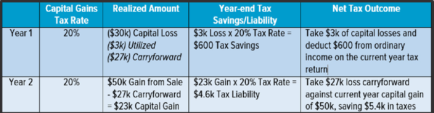

## Table of Contents

## What is a transaction outcome gain?

A transaction outcome gain is the positive result or benefit that someone gets from completing a transaction. This can happen in many situations, like buying something, selling something, or even just exchanging goods or services. When the outcome of the transaction is good for the person, we call it a gain. For example, if you buy a toy at a lower price than usual, the gain is the money you saved.

Gains from transactions can be measured in different ways. Sometimes, it's about the money saved or earned. Other times, it might be about getting something of higher value than what was given. For instance, if you trade an old phone for a new one and the new phone is worth more, that's a gain. Understanding these gains helps people make better decisions about when and how to make transactions.

## How does a transaction outcome gain differ from a regular transaction?

A regular transaction is just the act of buying, selling, or exchanging something. It's the basic process where one thing is traded for another, like when you buy a candy bar with money. The focus is on the exchange itself, not on what happens after. 

A transaction outcome gain, on the other hand, looks at what you get out of the transaction. It's not just about the exchange but about whether you end up better off because of it. For example, if you buy the candy bar on sale, the gain is the money you saved. So, while a regular transaction is about the trade, a transaction outcome gain is about the positive result or benefit you get from that trade.

## What are the common types of transaction outcome gains?

There are several common types of transaction outcome gains. One type is financial gain, where you save money or earn more money from the transaction. For example, if you buy something on sale, the money you save is your financial gain. Another example is when you sell something for more than you paid for it, the extra money you get is also a financial gain.

Another type of gain is value gain. This happens when you get something that's worth more than what you gave up. For instance, if you trade an old toy for a new one that's worth more, you have a value gain. Value gains can also happen when you buy something that turns out to be more useful or valuable to you than you expected.

Lastly, there's convenience gain. This is when a transaction makes your life easier or saves you time. For example, if you buy groceries online instead of going to the store, the time and effort you save is a convenience gain. Each of these types of gains shows how a transaction can benefit you in different ways.

## Can you explain the process of calculating a transaction outcome gain?

Calculating a transaction outcome gain involves looking at what you get from a transaction and comparing it to what you gave up. If you're looking at a financial gain, you simply subtract what you paid from what something is worth now or what you sold it for. For example, if you bought a toy for $10 and later sold it for $15, your financial gain is $15 - $10 = $5. This is how you figure out if you made money from the deal.

For value gain, you need to think about how much more valuable the thing you got is compared to what you gave up. This can be trickier because it's not always about money. If you traded an old phone for a new one, and the new phone is worth $200 more than your old phone, that's your value gain. Sometimes, you might need to guess or estimate the value if there's no clear price tag.

Convenience gain is a bit different. You can't always put a number on it, but you can think about how much time or effort you saved. If buying something online saved you an hour of shopping at the store, that hour is your convenience gain. Each type of gain helps you see if the transaction was worth it for you.

## What are the key factors that influence transaction outcome gains?

The key factors that influence transaction outcome gains are the price you pay, the value of what you get, and how convenient the transaction is. If you can buy something at a lower price than usual, you might get a bigger financial gain. The value of what you get also matters a lot. If you trade something old for something new and the new thing is worth a lot more, that's a big value gain. Convenience can also make a difference. If a transaction saves you time or effort, that's a convenience gain.

Another important [factor](/wiki/factor-investing) is knowing the market. If you know a lot about what things are worth, you can make better deals and get bigger gains. Timing can also play a role. Sometimes, buying or selling at the right time can lead to bigger gains. For example, buying things on sale or selling when demand is high can increase your financial gain. Understanding these factors helps you see how to get the most out of your transactions.

## How do transaction outcome gains impact financial statements?

Transaction outcome gains can have a big impact on financial statements. When you make a gain from a transaction, it usually shows up as extra money on your income statement. For example, if you sell something for more than you paid for it, the extra money you get is called a gain. This gain gets added to your total income, making your profit look bigger. If you save money by buying things on sale, that can also be seen as a gain, but it might not show up directly on the financial statements. Instead, it can help you spend less money overall, which can increase your profit.

These gains can also affect your balance sheet. If you get more money from selling something than you expected, your cash or bank account balance goes up. This makes your assets on the balance sheet bigger. If you trade something old for something new and the new thing is worth more, the value of your assets goes up too. Understanding how transaction outcome gains impact your financial statements helps you see how well you are doing with your money and can guide you in making better financial decisions.

## What are the tax implications of transaction outcome gains?

Transaction outcome gains can affect how much tax you have to pay. When you make money from selling something for more than you paid for it, that extra money is called a capital gain. In many places, you have to pay taxes on capital gains. The tax rate can be different depending on how long you owned the thing before you sold it. If you owned it for a short time, you might pay a higher tax rate than if you owned it for a long time.

Sometimes, the gains you make from transactions can also affect your income tax. If you're running a business, the money you make from selling things at a profit gets added to your total income. This can push you into a higher tax bracket, which means you pay more tax on your income. It's important to keep track of your gains and know the tax rules where you live so you can plan how to handle your taxes better.

## How can businesses maximize their transaction outcome gains?

Businesses can maximize their transaction outcome gains by understanding the market and making smart buying and selling decisions. They need to know what things are worth and when to buy or sell them. For example, if a business buys supplies when they are on sale, they can save money and increase their financial gain. They can also make more money by selling things when demand is high. Knowing the market helps businesses make the best deals and get the biggest gains from their transactions.

Another way businesses can maximize their transaction outcome gains is by focusing on value and convenience. If a business can trade or buy things that are worth more than what they give up, they can get a value gain. For example, trading old equipment for new, better equipment can be a good deal if the new equipment is worth more. Businesses can also look for ways to make transactions easier and faster for their customers. Offering online shopping or fast delivery can save time and effort, which is a convenience gain. By thinking about value and convenience, businesses can make their transactions more profitable and efficient.

## What are the risks associated with focusing on transaction outcome gains?

Focusing too much on transaction outcome gains can lead to risks. One big risk is that businesses might take bigger chances to try to make more money. They might buy things they don't need just because they are cheap, or they might sell things too quickly without thinking about the long-term effects. This can lead to problems like having too much stuff that doesn't sell or not having enough of what customers want.

Another risk is that businesses might forget about other important things. When they focus only on making gains from each deal, they might not think about keeping customers happy or building good relationships. Over time, this can hurt the business because customers might go somewhere else if they don't feel valued. Balancing the need for gains with other business goals is important to avoid these risks.

## How do regulatory environments affect transaction outcome gains?

Regulatory environments can change how much businesses can gain from their transactions. Rules and laws set by governments can limit what businesses can do. For example, there might be rules about how much a business can charge for something or what they have to tell customers before selling. These rules can make it harder for businesses to get big financial gains because they have to follow certain prices or give more information, which might scare customers away.

Also, regulations can affect how businesses trade with each other. There might be rules about taxes or how goods can move from one place to another. If a business has to pay more taxes or wait longer to get their goods, it can lower their value gain. Businesses need to understand these rules and plan their transactions carefully to still make good gains even with the regulations in place.

## What advanced strategies can be used to optimize transaction outcome gains?

Businesses can use smart strategies to get more out of their transactions. One way is to use data to make better decisions. By looking at numbers and patterns, businesses can see when things are cheap and when they can sell for more money. This helps them buy at the right time and sell when people want to buy. They can also use technology to make buying and selling easier for customers, like having a good website or fast delivery. This can help them get more convenience gains because customers will like doing business with them.

Another strategy is to think about the long term. Instead of just trying to make money from each deal, businesses can focus on building good relationships with customers and suppliers. This can lead to better deals over time because people trust them more. They can also look for new ways to make their products or services more valuable. For example, adding new features or making things easier to use can make customers want to buy more, leading to bigger value gains. By combining these strategies, businesses can do well in the short term and grow in the long term.

## Can you discuss case studies where transaction outcome gains significantly impacted a company's strategy?

One good example is how Amazon uses transaction outcome gains in its strategy. Amazon always tries to buy things at the lowest price and sell them when people want to buy them. They use a lot of data to know when prices are low and when they can sell for more money. This helps them make more money from each sale. Amazon also makes buying easy for customers with fast shipping and a good website. This convenience makes people want to shop at Amazon more, which leads to bigger gains for the company. By focusing on these gains, Amazon can offer low prices and still make a lot of money.

Another example is how Apple trades in old phones for new ones. When someone trades in an old iPhone for a new one, Apple can get a value gain if the new phone is worth more than the old one. Apple also makes money from selling the old phones to others or recycling them. This strategy helps Apple make money from each transaction and also keeps customers happy because they can easily get a new phone. By focusing on these gains, Apple can keep selling new products and stay ahead in the market.

## What are the gains in finance transactions and how can they be understood?

Gains in financial transactions are a critical measure of success for traders, as they represent the positive difference between the sale price of an asset and its original purchase price. These gains are essential for evaluating the profitability of trading strategies, especially within algorithmic systems where precision and efficiency are paramount. 

Financial gains can be broadly categorized into two main types: capital gains and unrealized gains. Capital gains refer to the profit earned from the sale of an asset when its sale price exceeds the original purchase price. These gains are realized once the asset is sold, and they contribute directly to the trader's bottom line. The formula to calculate capital gains is straightforward:

$$

\text{Capital Gain} = \text{Sale Price} - \text{Purchase Price} 
$$

By contrast, unrealized gains represent the increase in the value of an asset that is still held and not yet sold. These gains are "on paper" and do not contribute directly to immediate profitability but can significantly impact financial strategies and decision-making processes. They are computed similarly but are not recognized in financial statements until they are realized:

$$

\text{Unrealized Gain} = \text{Current Market Value} - \text{Purchase Price} 
$$

For traders employing [algorithmic trading](/wiki/algorithmic-trading) systems, understanding these forms of gains is paramount. Algorithmic trading relies on sophisticated calculations to maximize gains while considering market conditions, historical data, and potential future trends. Algorithms can assess unrealized gains to decide the optimal timing for selling an asset, thus converting unrealized gains into lucrative capital gains.

For example, consider a Python function to calculate both capital and unrealized gains for a portfolio of assets:

```python
def calculate_gains(portfolio):
    gains = {
        "capital_gains": [],
        "unrealized_gains": []
    }

    for asset in portfolio:
        purchase_price = asset["purchase_price"]
        sale_price = asset.get("sale_price", None)
        current_value = asset["current_value"]

        if sale_price:  # If the asset has been sold
            capital_gain = sale_price - purchase_price
            gains["capital_gains"].append(capital_gain)
        else:  # Calculate unrealized gain
            unrealized_gain = current_value - purchase_price
            gains["unrealized_gains"].append(unrealized_gain)

    return gains

portfolio = [
    {"name": "Stock A", "purchase_price": 100, "sale_price": 150, "current_value": 150},
    {"name": "Stock B", "purchase_price": 50, "current_value": 70},
]

result = calculate_gains(portfolio)
print("Capital Gains:", result["capital_gains"])
print("Unrealized Gains:", result["unrealized_gains"])
```

In this script, the calculation of gains for a portfolio helps traders make informed decisions, demonstrating the utility of understanding gains in optimizing trading outcomes. Accurately identifying and leveraging these gains within algorithmic systems enhances strategic decision-making and facilitates superior financial performance.

## How do financial metrics interplay in algo trading?

Algorithmic trading intricately weaves together various financial metrics such as gains, losses, revenue, and expenses to enhance trading profitability and manage risks. These metrics fundamentally drive decisions within trading algorithms, dictating when to enter and [exit](/wiki/exit-strategy) trades based on predefined criteria aimed at optimizing financial outcomes.

**Gains and Losses Impact**: Gains and losses serve as direct indicators of a trading algorithm's performance. A gain occurs when an asset's selling price exceeds its purchase price, contributing positively to the trading strategy's profitability. Conversely, a loss indicates underperformance, where the purchase price surpasses the selling price. The ability to accurately quantify these metrics allows algorithms to refine their strategies, ensuring that the potential for profit maximization is systematically prioritized. For example, capital gains, a type of gain, can be calculated using the formula:

$$
\text{Capital Gain} = \text{Selling Price} - \text{Purchase Price}
$$

**Revenue and Expenses Consideration**: Revenue in trading algorithms refers to the income generated from executed trades, while expenses encompass costs such as transaction fees and operational costs. Balancing these two elements is crucial for maintaining profitability. Algorithms are often designed to account for this balance, ensuring that the generated revenue sufficiently outweighs associated expenses to yield net positive returns.

**Integration of Financial Metrics**: The integration of these metrics within algorithmic systems is achieved through sophisticated financial models. These models assess historical data to predict future market movements, learning from past trading environments to enhance accuracy. By applying machine learning techniques, algorithms can adjust their strategies in real-time, effectively responding to emerging trends and minimizing losses.

For instance, Python offers robust libraries such as `pandas` and `numpy` for handling large sets of financial data. An example of how these libraries can be used to calculate moving averages, a key component in trend-following strategies, is as follows:

```python
import pandas as pd

# Sample data
data = {'Price': [100, 102, 105, 107, 110, 115]}
df = pd.DataFrame(data)

# Calculating a 3-day moving average
df['Moving Average'] = df['Price'].rolling(window=3).mean()
print(df)
```

**Risk Management through Metrics**: Effective risk management within algo trading systems relies heavily on the accurate calculation and interpretation of these financial metrics. Algorithms are often designed to include risk parameters, such as stop-loss and take-profit orders, to limit potential negative outcomes while maximizing positive trades. By carefully analyzing these metrics, trading systems can initiate transactions that align with predefined risk tolerance levels.

In conclusion, the interplay of financial metrics such as gains, losses, revenue, and expenses forms the foundation of algorithmic trading. By leveraging historical data and sophisticated financial models, trading algorithms are capable of executing efficient trade predictions and outcomes, thus ensuring sustainable financial performance. This dynamic integration not only enhances profitability but also aids in effective risk management, demonstrating the crucial role of these metrics within automated trading systems.

## References & Further Reading

[1]: Bergstra, J., Bardenet, R., Bengio, Y., & Kégl, B. (2011). ["Algorithms for Hyper-Parameter Optimization."](https://dl.acm.org/doi/10.5555/2986459.2986743) Advances in Neural Information Processing Systems 24.

[2]: ["Advances in Financial Machine Learning"](https://www.amazon.com/Advances-Financial-Machine-Learning-Marcos/dp/1119482089) by Marcos Lopez de Prado

[3]: ["Evidence-Based Technical Analysis: Applying the Scientific Method and Statistical Inference to Trading Signals"](https://www.amazon.com/Evidence-Based-Technical-Analysis-Scientific-Statistical/dp/0470008741) by David Aronson

[4]: ["Machine Learning for Algorithmic Trading"](https://github.com/stefan-jansen/machine-learning-for-trading) by Stefan Jansen

[5]: ["Quantitative Trading: How to Build Your Own Algorithmic Trading Business"](https://www.amazon.com/Quantitative-Trading-Build-Algorithmic-Business/dp/1119800064) by Ernest P. Chan