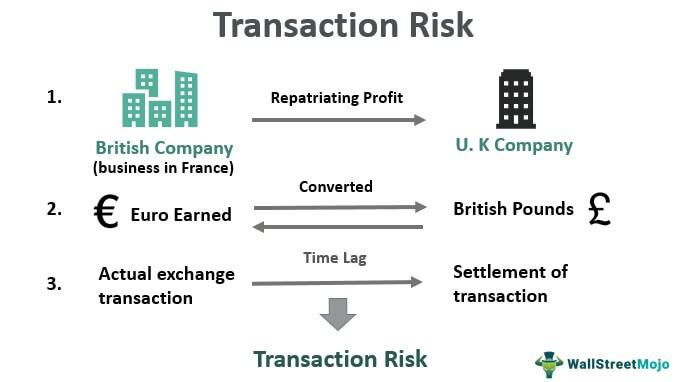

In the rapidly evolving world of finance, understanding risk and effective management strategies is crucial for success. As markets become more technologically driven, the practice of algorithmic trading has gained prominence. Algorithmic trading, often referred to as algo trading, involves using computer algorithms to execute and manage trading orders at speeds and frequencies impossible for human traders. While this offers numerous opportunities for profit and efficiency, it also presents unique challenges, particularly related to financial risks.

Financial risk in trading encompasses the uncertainties and potential for financial losses inherent in making investment decisions. With algorithmic trading, these risks are often amplified due to the speed and complexity involved. Algorithmic systems are designed to exploit minute market inefficiencies and massive data analytics. However, if not properly managed, these systems can exacerbate traditional financial risks, leading to significant losses.

This article explores the concept of financial risk within the context of algo trading, focusing on transaction risk and its management. Transaction risk is a prevalent form of financial risk, especially in global markets, arising from the adverse impact of exchange rate fluctuations during the period of a transaction. It is crucial for traders, especially those operating internationally, to understand transaction risk due to the inherent volatility in currency exchange rates.

The article will outline the inherent risks associated with algorithmic trading and emphasize the importance of developing robust strategies to mitigate these risks effectively. By understanding and preparing for these challenges, algo traders can enhance their trading strategies, maintain profitability, and ensure sustainable trading practices. The focus will be on identifying key risk management strategies that not only protect capital but also optimize trading outcomes amidst the fast-paced and intricate nature of modern financial markets.

## Table of Contents

## Understanding Financial Risk in Algo Trading

Financial risk in trading encompasses the volatility and uncertainties that can lead to potential financial losses. In algorithmic trading, these risks become more pronounced due to the complexity of algorithms and the high-speed execution they entail. Algorithmic trading systems leverage computational speed and sophisticated data analytics to execute trades at a velocity and scale beyond human capability. However, while these systems can efficiently exploit market opportunities, they can also magnify traditional financial risks if not properly managed.

Algorithmic trading operates through pre-defined rules derived from quantitative models. The success of these models heavily depends on accurate data and assumptions. Any inaccuracies or unforeseen market conditions could result in significant financial losses. For example, an algorithm optimized for specific market conditions may perpetuate losses if these conditions shift unexpectedly.

Furthermore, the speed and [volume](/wiki/volume-trading-strategy) of trades executed by algorithmic systems can contribute to market [volatility](/wiki/volatility-trading-strategies), exacerbating financial risk. High-frequency trading ([HFT](/wiki/high-frequency-trading-strategies)), a subset of [algorithmic trading](/wiki/algorithmic-trading), can lead to events like "flash crashes," where rapid, automated trading results in sudden and severe market downturns. The 2010 Flash Crash is a notable instance where HFT orders significantly impacted market stability, leading to the immediate need for enhanced risk controls [1].

Managing financial risk in algorithmic trading requires a comprehensive understanding of both the algorithms and the market environments they operate within. This includes continuous monitoring, testing, and adjustment of algorithms to ensure they perform optimally under varied market conditions. Advanced risk management tools, such as real-time data analytics and [machine learning](/wiki/machine-learning), play a crucial role in this adaptive process, allowing traders to preemptively address potential risks and optimize trading strategies accordingly.

---

**References:**

[1] Kirilenko, Andrei A., Albert S. Kyle, Mehrdad Samadi, and Tugkan Tuzun. "The Flash Crash: The Impact of High Frequency Trading on an Electronic Market." *Available at SSRN 1686004* (2014).

## What is Transaction Risk?

Transaction risk, a form of financial risk, arises from the potential adverse impact of exchange rate fluctuations during the period of a transaction. This risk is particularly significant for entities engaged in international trade or investments, where there is often a time lag between the initial commitment to a transaction and its final settlement. During this period, the exchange rates can fluctuate, potentially leading to financial losses.

For example, consider an entity based in the United States that finalizes a deal with a counterpart in Europe, agreeing to pay €1,000,000 at a future date. At the time of the agreement, the exchange rate might be 1 USD = 0.85 EUR, implying that the company expects to pay approximately $1,176,470 (1,000,000 / 0.85) when the transaction is settled. However, if by the settlement date the Euro depreciates, resulting in an exchange rate of 1 USD = 0.90 EUR, the company's payment would now amount to around $1,111,111 (1,000,000 / 0.90), which represents a gain for the company. Conversely, if the Euro appreciates to 1 USD = 0.80 EUR, the payment would increase to $1,250,000 (1,000,000 / 0.80), resulting in a significant unanticipated loss against the original budget.

Entities exposed to this type of risk often include multinational corporations, exporters, importers, and investors who engage in operational transactions across different currencies. The financial outcomes of such transactions depend critically on the exchange rate at the point of conversion, which is inherently unpredictable and influenced by myriad economic factors, including [interest rate](/wiki/interest-rate-trading-strategies) differentials, geopolitical events, and macroeconomic indicators.

Proper management of transaction risk is crucial to protecting the financial health and competitive position of organizations participating in international financial activities. It typically involves strategies such as hedging using derivatives like forwards or options, and careful monitoring of market conditions to anticipate and mitigate potential unfavourable shifts in currency values.

## Case Studies: Transaction Risk in Action

Consider a U.S. company that has entered into an agreement to settle a transaction in Euros. If the Euro depreciates against the U.S. Dollar by the time of settlement, the company could face a significant loss in revenue. This scenario exemplifies transaction risk, a prevalent issue in international business due to fluctuating exchange rates. For example, suppose a U.S. corporation agrees to purchase goods from a European vendor with a payment of €10 million, scheduled for three months hence. If the exchange rate initially stands at 1 Euro to 1.2 USD, the company expects to pay 12 million USD. However, if the Euro's value falls to 1 Euro to 1.1 USD by the settlement date, the company would only require 11 million USD to complete the payment, resulting in a financial gain.

Multinational corporations regularly encounter transaction risk, necessitating robust [forex](/wiki/forex-system) hedging techniques. Such techniques ensure predictability in financial operations by locking in exchange rates or allowing flexibility to take advantage of favorable movements. Among the most common hedging methods are forward contracts and options. Forward contracts enable a company to set a future exchange rate for a predetermined amount of foreign currency, thus eliminating uncertainty. For instance, if a U.S. company anticipates receiving €10 million in six months, it can use a forward contract to lock in the current exchange rate, thereby securing the future value of the transaction in USD terms.

Options, on the other hand, offer the right, but not the obligation, to exchange currency at a predetermined rate before a set expiration date. This flexibility allows firms to capitalize on favorable rate changes while limiting downside risks. For example, a call option provides the right to purchase Euros at a fixed exchange rate, ensuring that even if the Euro appreciates, the company can still obtain currency at the more favorable rate.

These case studies underscore the necessity for sophisticated risk management strategies to navigate transaction risk effectively in the global marketplace. By employing mechanisms like forward contracts and options, companies can shield themselves from adverse currency fluctuations and enhance financial stability.

## Risk Management Strategies in Algo Trading

In the domain of algorithmic trading, implementing effective risk management strategies is essential for safeguarding capital and enhancing trading outcomes. One of the foundational strategies is investment diversification, which entails spreading investments across various asset classes or instruments to reduce risk. This approach ensures that poor performance in one area does not significantly impact the overall portfolio. 

Another critical strategy in algorithmic trading is the use of stop-loss orders. These are predetermined price levels at which a trade is automatically exited to prevent further losses, effectively placing a cap on potential losses. By setting stop-loss orders, traders can maintain discipline and avoid emotional decision-making during volatile market conditions.

Position sizing is also a pivotal component of risk management in algorithmic trading. It involves determining the appropriate amount of capital to allocate to a particular trade based on the trader's risk tolerance, the market conditions, and the specific characteristics of the trade. Proper position sizing ensures that no single trade can disproportionately impact the overall portfolio, thereby controlling exposure.

Modern algorithmic trading systems have evolved to incorporate advanced technologies such as [artificial intelligence](/wiki/ai-artificial-intelligence) (AI) and machine learning. These technologies facilitate the dynamic adjustment of strategies based on predictive analytics. AI and machine learning models can analyze vast amounts of market data in real-time, identify patterns, and make data-driven decisions that adjust trading strategies as market conditions change. This adaptability is crucial in today's fast-paced trading environments, as it allows for proactive risk management.

For instance, an AI-based algorithm might use a machine learning model to predict the likelihood of a market downturn based on historical data patterns, adjust position sizes, or modify stop-loss levels accordingly. These predictive capabilities enhance the trader's ability to respond swiftly to market changes, improving overall trading performance and risk mitigation.

In summary, effective risk management in algorithmic trading revolves around key strategies such as diversification, stop-loss orders, and position sizing, complemented by the integration of AI and machine learning for dynamic strategy adjustments. These practices collectively contribute to protecting capital and optimizing trading outcomes in the ever-evolving financial markets.

## Hedging Techniques for Transaction Risk

Hedging is a critical practice for managing transaction risk, particularly amid the complexities of international finance and algorithmic trading. This risk mitigation strategy involves using financial derivatives to safeguard against potential negative shifts in currency exchange rates. Among the most frequently employed instruments are futures, forwards, and options, which serve to lock in exchange rates and minimize exposure to unfavorable currency fluctuations.

Futures contracts are standardized agreements traded on exchanges to buy or sell an asset at a predetermined price at a specified time in the future. These contracts provide [liquidity](/wiki/liquidity-risk-premium) and transparency but require margin accounts and are subject to daily settlement. On the other hand, forward contracts are customizable and negotiated over-the-counter, offering more flexibility in terms and settlement dates, albeit with reduced liquidity and higher counterparty risk.

Options contracts offer the right, but not the obligation, to exchange currencies at a specified rate before or on a certain date. This gives traders more flexibility while capping potential losses to the premium paid for the option. Options can be particularly useful in hedging scenarios where currency movements are uncertain but potentially volatile.

Effective hedging is contingent upon a robust understanding of current market conditions and strategic use of these financial instruments. Traders typically conduct thorough risk assessments and utilize sophisticated models to identify and quantify exposure. This involves forecasting currency movements using historical data and economic indicators and devising strategies that align with risk tolerance and financial goals.

For those employing algorithmic trading systems, integrating hedging strategies into algorithmic frameworks can enhance risk management. By leveraging computational power, algorithms can execute hedging strategies in real-time with precision, dynamically adapting to market changes and optimizing for risk-adjusted returns.

In conclusion, successful hedging of transaction risk is vital for traders looking to protect their investments from the inherent uncertainties of international currency markets. A well-executed hedging strategy can provide financial stability, preserving the value of cross-border transactions amidst market volatility.

## Algorithmic Architecture and Risk Mitigation

Algorithmic trading systems are intricate and require advanced risk management architectures to ensure stability and reliability. These architectures are designed to detect and respond to market anomalies through automated systems, driven by risk alerts and circuit breakers. Risk alerts play a crucial role in identifying unusual trading patterns and potential threats to an algorithm's integrity. They provide immediate notifications to traders, enabling them to make informed decisions quickly.

Circuit breakers are another vital component, acting as safeguards during extreme market conditions. They temporarily halt trading activities when predetermined thresholds are breached, thus preventing the system from executing trades that could lead to significant financial losses. This mechanism is particularly important in reducing the risk of cascading failures in volatile markets.

Real-time data monitoring is integral to effective risk management, offering continuous evaluation of market dynamics and trading system performance. This monitoring allows traders to capture and analyze massive streams of data instantaneously, offering insights into emerging risks and enabling proactive adjustments.

A crucial aspect of risk mitigation in algorithmic trading is continuous [backtesting](/wiki/backtesting). By simulating trades over historical market data, backtesting helps to assess the effectiveness and robustness of an algorithm. It identifies potential weaknesses and provides insights for refining strategies to better handle actual trading conditions. Performance evaluation complements backtesting by offering metrics and benchmarks that measure the success of trading algorithms in live environments. Together, these processes ensure algorithms are optimally tuned and resilient against financial risks.

## Conclusion: Navigating Risks in Algo Trading

Algorithmic trading requires a strategic approach to risk management that carefully balances the pursuit of returns with controlled risk exposure. An essential aspect of this process is understanding transaction risk, a significant threat due to the rapid pace and intricate nature of algorithmic trades. Managing these risks effectively can determine the success or failure of trading activities on a global scale.

Transaction risk emerges from potential unfavorable changes in exchange rates during the period between a trade's initiation and settlement. This makes it crucial for traders to implement hedging strategies tailored to protect their investments from such uncertainties. By using derivatives like futures, forwards, and options, traders can lock in prices and safeguarding their assets against adverse currency movements. These financial instruments, when applied strategically, help mitigate the impact of volatility, ensuring a more predictable outcome for traders.

Adoption of robust risk management practices is critical to achieving sustainable and profitable outcomes. For algorithmic traders, this involves incorporating advanced technologies, such as Artificial Intelligence (AI) and Machine Learning (ML), to refine predictive analytics and dynamic strategy adjustments. These systems not only enhance the accuracy and speed of trades but also improve the adaptability of risk strategies in response to evolving market conditions.

Moreover, continuous evaluation and refinement of algorithmic strategies through backtesting and performance analysis are vital. Ensuring that algorithms remain effective in managing risks involves persistent updates and optimizations aligned with market changes. Implementing risk alerts, circuit breakers, and real-time data monitoring further strengthens the defensive mechanisms against unforeseen market disturbances.

In summary, the path to success in algorithmic trading lies in embracing sophisticated risk management frameworks. By comprehensively understanding transaction risks and leveraging effective hedging tactics, traders can navigate the challenges of the financial markets with increased confidence. This strategic balance not only enhances profitability but also fosters long-term trading sustainability in the volatile world of finance.

## References & Further Reading

[1]: Kirilenko, Andrei A., Albert S. Kyle, Mehrdad Samadi, and Tugkan Tuzun. ["The Flash Crash: The Impact of High Frequency Trading on an Electronic Market."](https://www.jstor.org/stable/26652722) Available at SSRN 1686004 (2014).

[2]: Lopez de Prado, Marcos. ["Advances in Financial Machine Learning."](https://www.amazon.com/Advances-Financial-Machine-Learning-Marcos/dp/1119482089) Wiley, 2018.

[3]: Jansen, Stefan. ["Machine Learning for Algorithmic Trading."](https://github.com/stefan-jansen/machine-learning-for-trading) Packt Publishing, 2020.

[4]: Aronson, David. ["Evidence-Based Technical Analysis: Applying the Scientific Method and Statistical Inference to Trading Signals."](https://www.amazon.com/Evidence-Based-Technical-Analysis-Scientific-Statistical/dp/0470008741) Wiley, 2006.

[5]: Chan, Ernest P. ["Quantitative Trading: How to Build Your Own Algorithmic Trading Business."](https://github.com/ftvision/quant_trading_echan_book) Wiley, 2008.